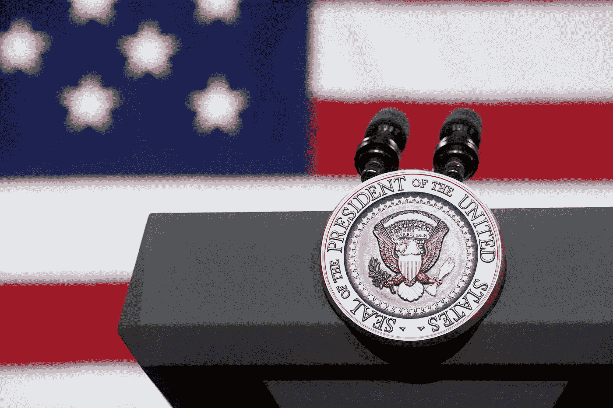
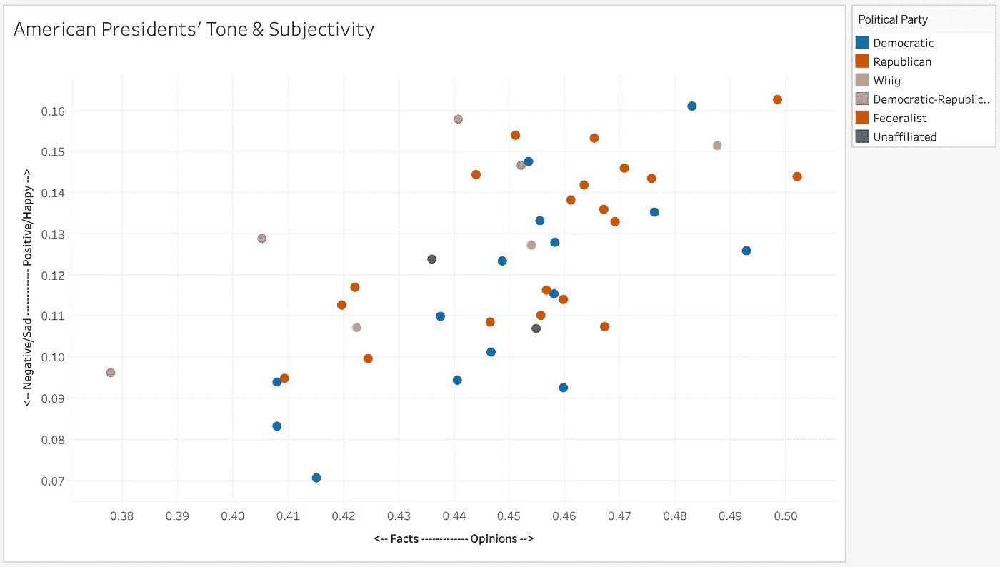
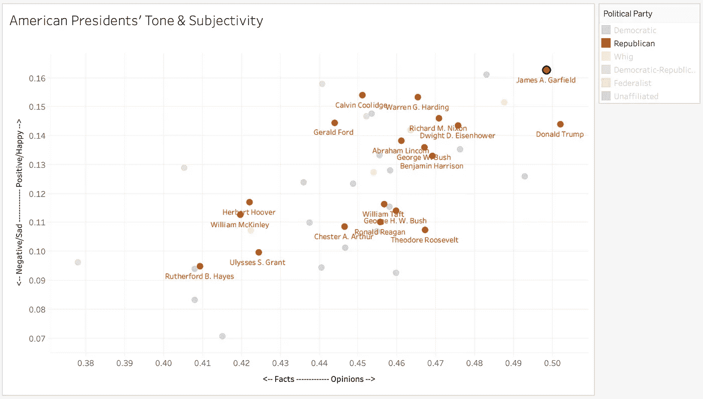
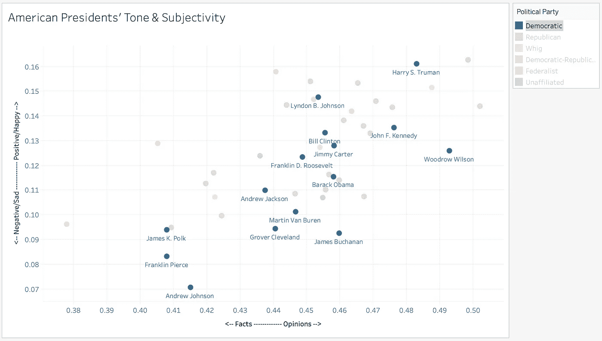
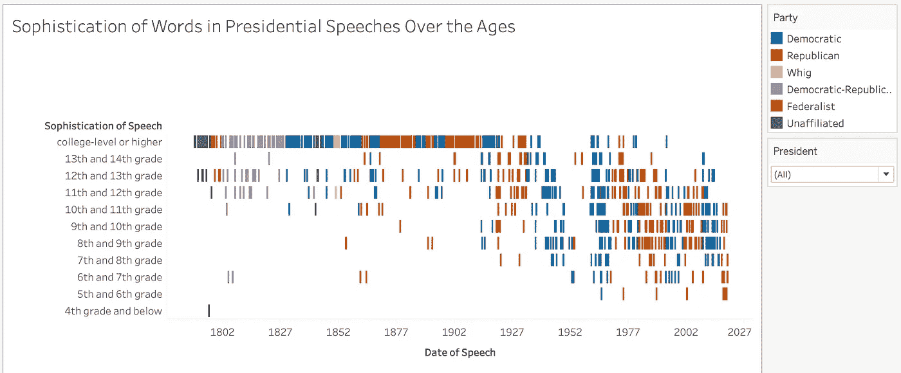
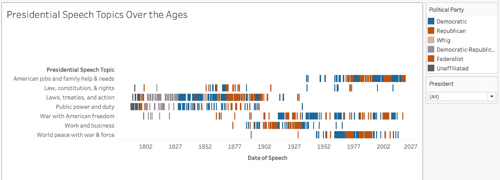
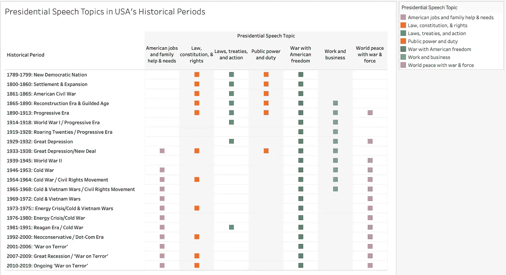

# 历代美国总统的声音

> 原文：<https://towardsdatascience.com/us-presidential-voices-over-the-ages-35678518f82b?source=collection_archive---------50----------------------->

## 使用自然语言处理和主题建模分析总统历史中词语的信息、情感和复杂性。

皮特·苏扎拍摄的白宫官方照片

> **“言语就是力量:言语是为了说服、转化和强迫。”—拉尔夫·瓦尔多·爱默生**

自美利坚合众国诞生以来，美国总统的演讲既反映了国家的现状，也呼吁改变总统认为国家应该走的方向。

总统演讲提供了国家领导人的想法和对国家发展方向的希望，以及他们打算如何利用自己的力量来推动这个方向。他们传递的信息将影响公众对信息的接受和采取行动的能力。

我使用自然语言处理和无监督学习的数据科学技术和工具，通过检查 990 多份总统演讲的情绪、演讲的复杂性和内容的重点，来更好地理解总统对演讲力量的使用。然后，我会按时间和政党寻找趋势、模式和其他见解。

从乔治·华盛顿 1789 年的第一次就职演说到吉米·卡特 1977 年的全国能源演讲，再到唐纳德·特朗普的 2019 年国情咨文，迄今为止(2020 年)每一位总统的演讲都在该项目*中进行了分析。

至此，以下是我的发现…

## **美国总统的感悟**

*使用的工具:*[*text blob*](https://textblob.readthedocs.io/en/dev/)*的极性和主观性*

语音情绪以两种方式测量:极性(即语气中更多的负面/悲伤到语气中更多的正面/快乐)和主观性(即更多的基于事实到更多的基于观点)。

以下是情绪分析结果，其中每个点代表不同的总统，每种颜色代表一个政党>

作者截图

正如你在图表中看到的，没有强烈的颜色聚类，这意味着总统的情绪似乎没有明显的党派区分——这似乎更像是个人的转变。

在这里你可以看到共和党总统的名字>

作者截图

这里你可以看到民主党总统的名字>

作者截图

从这些图表中，我们可以看到，例如，与其他美国总统相比，富兰克林·皮尔斯的语气平均更消极/悲伤，内容更真实，而唐纳德·川普的语气平均更积极/快乐，内容更固执己见。

请记住，极性和主观性并不能告诉我们总统在说什么；一位总统可能会说一些积极的话，但它可能会对人们产生负面影响。这种情绪分析只能告诉我们*总统是如何传递这些内容的，以及他们是否在用事实或观点来支持他们的声明。*

## **美国总统演讲的老练度**

*使用的工具:*[*textstat*](https://pypi.org/project/textstat/)*的成绩等级分析*

“演讲的复杂程度”是基于一个人需要达到什么样的等级水平才能阅读文本的衡量标准——这里指的是在听到演讲时完全理解它所需的等级水平。

下图显示了这些年来每篇演讲是如何按照理解它所需要的等级来评分的。颜色仍然代表政党>

作者截图

从图表中我们可以看到，在美国早期，总统们的演讲有更高的诡辩性，平均来说需要大学水平或更高的教育水平才能读懂。大约在 20 世纪 20 年代，演讲的复杂程度有下降的趋势，这种趋势一直持续到今天。一个潜在的原因可能是总统自己的词汇，也可能是一个更加精心策划的决定；20 世纪 20 年代是收音机在家庭中变得更加普及的时期——随着更多的人能够听到总统的演讲，总统们是否改变了他们的词汇，以更广泛地与听到他们的公众联系起来？这种分析不能明确地告诉我们，但这是一个有趣的探索领域。

还要注意的是，所有年级的政党都是混合的，这表明在政党言论的复杂性方面没有明显的差异。

## 美国总统演讲的话题

*使用的工具:使用* [*gensim 的 LDA 模型*](https://radimrehurek.com/gensim/models/ldamodel.html) 的无监督主题建模

现在让我们试着更好地理解总统演讲的内容。

使用潜在狄利克雷分配(LDA)主题建模，总统演讲的七个主题被确定为:

1.  美国工作和家庭帮助与需求
2.  法律、宪法和权利
3.  法律、条约和行动
4.  公共权力和职责
5.  与美国自由的战争
6.  工作与商业
7.  世界和平与战争和武力

在这些主题之间需要注意的是词语的定位和平衡，例如看“美国自由战争”和“战争与武力世界和平”，其中一个目标与其他目标缓冲，例如战争…拥有美国的自由。或者寻找世界和平…但也会有战争和武力。

以下是这些年来总统演讲中七个主题的趋势>

作者截图

同样，我们看不到政党之间在演讲主题上有很大的区别，相反，随着时间的推移，我们看到了更多的区别。在美国发展的最初几年，我们看到“法律、条约和行动”和“公共权力和义务”更为常见。近年来，我们看到“美国的工作和家庭帮助和需求”、“战争和武力的世界和平”和“美国自由的战争”更受总统们的欢迎。

让我们换一种方式来审视这些话题，通过按照美国不同的历史时期来看一个话题在美国历史的什么地方出现过。颜色代表每个政治演讲主题>

作者截图

从这个图表中我们可以看出，某些历史时期似乎是总统演讲主题的结束或开始。例如，在新政时期，我们第一次看到“美国工作和家庭”成为总统演讲的主要话题，此后我们继续看到它出现在几乎每个时代。

## 调查结果摘要

总之，这个项目的分析告诉我们:

*   情绪似乎因总统而异，不一定因党派而异。
*   **演讲中用词的“复杂性”多年来一直呈下降趋势。**
*   **演讲的主题随着时间的推移和政党的不同而变化。**
*   演讲的主题似乎与国情和公众关注的问题有关。
*   **历史时期可能是几代人演讲话题转变的催化剂。**

最后，我想再次强调，这一分析显示了一些趋势和模式，但同样重要的是向我们表明，从表面上看，不同总统和政党的讲话语气和定位可能有相似之处。考虑到这一点，我们都需要关注总统演讲的深层实质，以做出明智的投票和明智的支持。这可能不是一个新发现，但却是一个重要的提醒。

感谢您的阅读，希望您对这篇分析和见解感兴趣。如果您有任何意见、问题或只是想联系，请[通过 LinkedIn](https://www.linkedin.com/in/celinaplaza/) 联系我。

*关于这项工作的几点说明:*

*   请记住，派对会随着时间的推移而演变和改变——就像人一样。今天的民主党人并不一定拥有与 1850 年时相同的议程或价值观。因此，在进行政党层面的分析时，应该考虑到这一点。任何关于政党的见解都是一种概括，而不是一种硬性的结论。
*   我目前是 Metis 的一名数据科学学生，每天都在学习。这项工作是我最近在数据科学领域所受教育的应用，但我仍在该领域不断成长，因此随着技能的进步，我希望重新审视和更新我的发现。我欢迎任何关于未来迭代的建议。
*   我所有的图表都是在 Tableau 中制作的，并根据兴趣与过滤选项进行交互。本博客中显示的图表是那些 Tableau 图表的截图。

非常感谢 Joseph Lilleberg，他从弗吉尼亚大学米勒中心的 [*网站*](https://millercenter.org/the-presidency/presidential-speeches) *收集了所有总统演讲的文字记录，并把它们放在*[*【Kaggle.com】*](https://www.kaggle.com/littleotter/united-states-presidential-speeches)*的一个易于使用的 csv 文件中供公众使用。也感谢米勒中心使原始抄本可供公众查阅。*