# 美国事故数据分析

> 原文：<https://towardsdatascience.com/usa-accidents-data-analysis-d130843cde02?source=collection_archive---------7----------------------->

## 对 2016 年 2 月至 2019 年 3 月全国交通事故数据进行分析。

来源:https://unsplash.com/

## 介绍

> 近来交通事故变得非常普遍。T2 每年有近 125 万人死于交通事故，T4 平均每天有 3287 人死亡。此外，每年有 2000-5000 万人受伤或致残。道路交通事故是第九大死亡原因，占全球死亡总数的 2.2%。全球道路交通事故造成了 5180 亿美元的损失，单个国家的损失占其年度国内生产总值的 1-2%。
> 
> 在美国，每年有超过 37，000 人死于车祸，235 万人受伤或致残。美国每年因交通事故损失 2306 亿美元，平均每人 820 美元。交通事故是出国旅行的健康美国公民每年死亡的最大原因。
> 
> ([来源](https://www.asirt.org/safe-travel/road-safety-facts/))

考虑到交通事故的严重性，我决定分析事故数据以发现一些有用的东西。我在这里，分享我的成果。

## 数据

数据集取自 **Kaggle** 。你可以在这里 找到[**。
这是一个**全国范围的交通事故数据集**，涵盖了美国 **49 个州**。从 2016 年 2 月**到 2019 年 3 月**持续收集数据，使用几个数据提供商，包括两个提供流交通事件数据的 API。这些 API 广播由各种实体捕获的交通事件，例如美国和州交通部、执法机构、交通摄像机和道路网络中的交通传感器。**](https://www.kaggle.com/sobhanmoosavi/us-accidents)

数据集包含 **2，243，939(224 万)**行和 **49** 列(相当大的数据集)。需要注意的一点是，尽管数据集只包含三年的数据，但已经有 224 万起事故。

## 功能描述

如前所述，数据集包含 49 个要素，以下是对它们的描述。

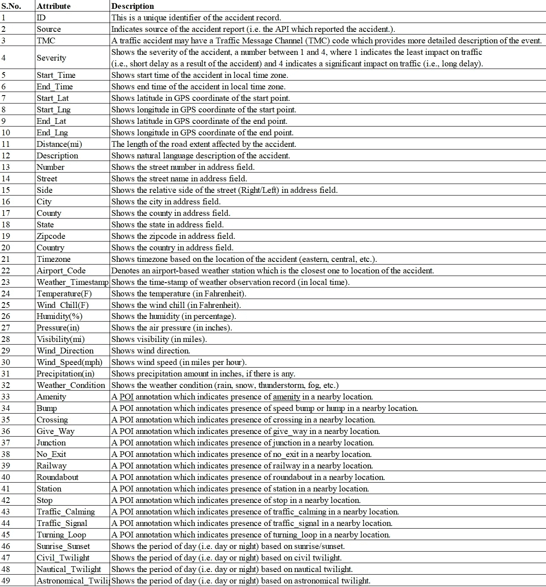

数据集的要素描述

## 方法

在进入分析部分之前，让我们看看数据集中存在的空值。

下图仅显示了那些具有空值的要素。

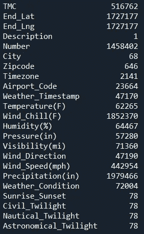

具有空值的要素

## 探索性数据分析

我将首先从消除不必要的功能开始。

特性 *Country* 只包含一个条目——USA，这是显而易见的，因为我们处理的是美国的数据集。因此，我将删除此功能。

特征 *Turning_Loop* 也包含一个值——False。这意味着在任何事故附近都没有转弯环路。因为这个特性只包含一个值，所以我也将删除它。

让我们来看看*源*的特性。它代表报告事故的 API。

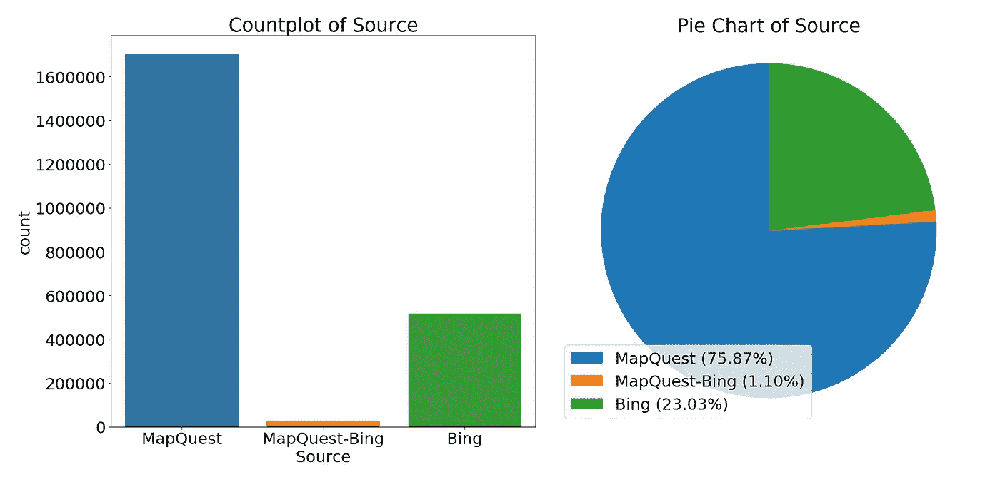

每个来源报告的事故数量

只有三个 API 来源报告了事故。可以看出，大多数事故(约 170 万起)是 MapQuest 报告的，其次是 Bing。

联邦法律正式规定美国有九个标准时区。整个 50 个州和哥伦比亚特区有六个主要时区。

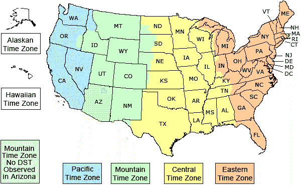

[来源](https://salesandrecruiting.blogspot.com/2017/06/us-staffing-process-complete-us-it.html)

在这六个重要时区中，我们看到(从下图中)数据集中只有四个时区。

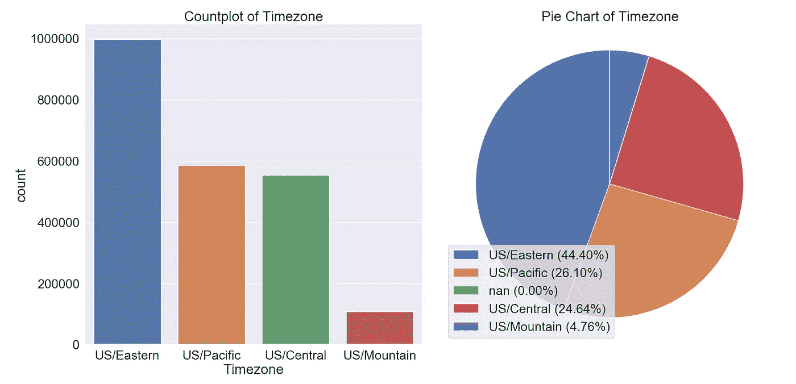

大多数事故发生在时区上:东部标准时间，然后是太平洋标准时间。

数据集由一个令人兴奋的特性组成: *TMC。* 在谷歌上快速搜索会得到以下信息:

**交通消息信道(TMC)** 是一种向机动车驾驶员传递交通和出行信息的技术。它使用 ALERT C 或 TPEG 协议被数字编码成 RDS 类型 8A 组，通过传统的 FM 无线电广播传送。它也可以通过数字音频广播或卫星广播传输。TMC 允许在不中断音频广播服务的情况下，以用户语言无声地传递适合再现或显示的动态信息。

现在，让我们绘制出与 *TMC* 特征相关的事故数量。

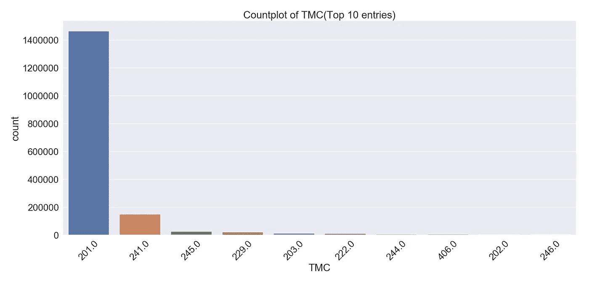

相对于 TMC 的事故数量

该图显示大多数事故的 TMC 为 201。你可以参考 [TMC 代码表](https://wiki.openstreetmap.org/wiki/TMC/Event_Code_List)来更好的理解。

最令人兴奋的特性是*的严重性。*代表事故的严重程度。

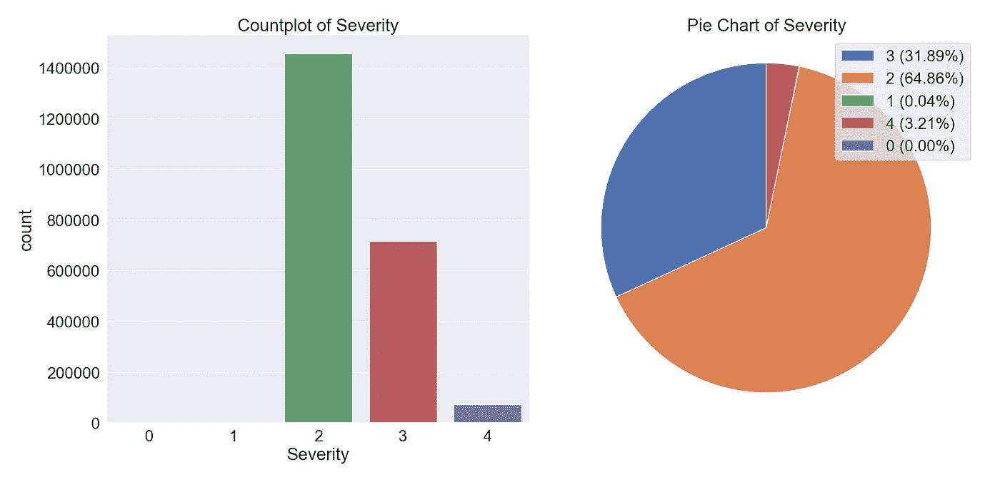

每种严重程度的事故数量

该图描述了大多数事故的严重程度等于 2(平均)，然后是 3(高于平均)，这是不幸的。几乎没有严重程度非常低(0 和 1)的事故。

让我们看看*开始时间*和*结束时间*的特性:

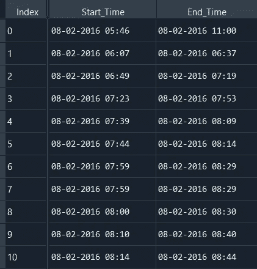

开始时间和结束时间特征

*开始时间*和*结束时间*特征描述了事故的开始和结束时间。为了更好地理解，我计算了每次事故的持续时间。

有趣的是，事故的持续时间从几分钟到几年不等。

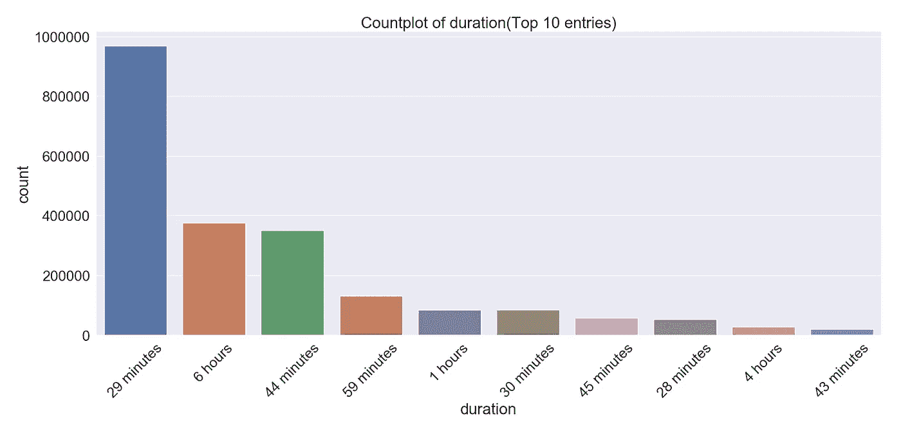

前 10 个值的事故数量与持续时间

上面的图没有下面的图重要，但是，我想检查最常见的持续时间。大约 950，000 起(43%)事故持续时间为 29 分钟，然后是 6 小时。

需要注意的一点是，数据集描述告诉我们 *Start_Time* 和 *End_Time* 代表事故的起止时间。尽管一些事故的持续时间(通过取*开始时间*和*结束时间*之差计算)以小时计，甚至以月和年计，但一次事故持续几天或几年并不明显。也许这两个特征也包括修复时间，没有太多可以得出的结论。

查看每起事故持续时间的一个更重要的方法是查看持续时间单位。

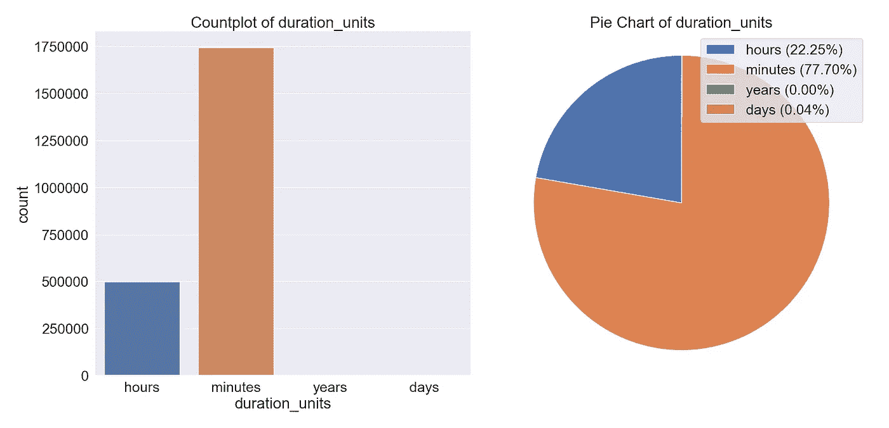

每个持续时间单位的事故数量

该图描述了大约 77%的事故持续时间为分钟，而大约 22%的事故持续时间为小时。只有 52 起事故持续了几年，975 起事故持续了几天。这意味着持续时间更长的事故在美国很少发生。此外，持续时间短的事故更加频繁。

现在，让我们来看看每种严重程度的事故随时间变化的趋势。

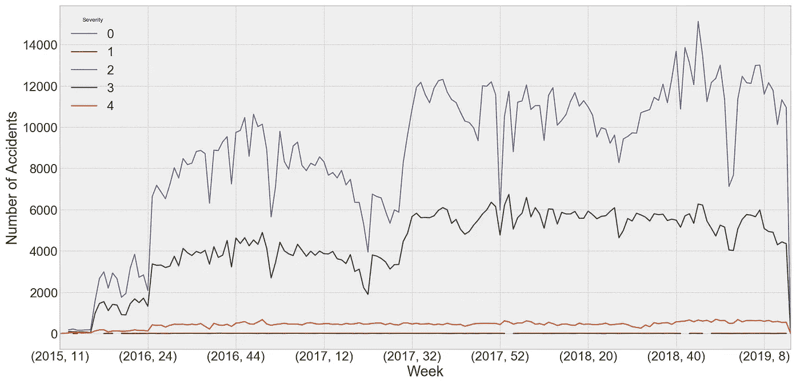

每种严重程度的事故数量与时间

可以观察到，随着时间的推移，每种严重程度的事故数量都在增加。这令人担忧，需要采取严肃的行动。即使 2017 年事故数量有所减少，但在第 12 周左右，事故数量在那之后有所增加。严重度= 2 的事故更频繁，增加最多，其次是严重度= 3 的事故。

*Start_Lat* 和 *Start_Lng* 功能非常有趣，因为它们可以绘制在地图上，以获得事故的准确位置。首先，我将绘制两者之间的散点图。

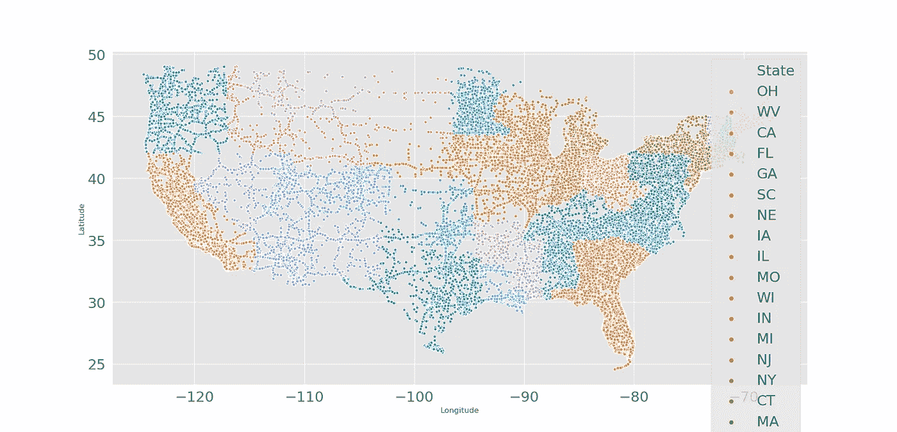

散点图看起来不错，但同时，令人担忧的是，几乎美国的每个角落都被覆盖，这意味着在过去几年中，事故发生在大量的地点。

为了得到一个清晰的概念，我用美国地图上数据集给定的每个严重程度的坐标标绘了事故地点。

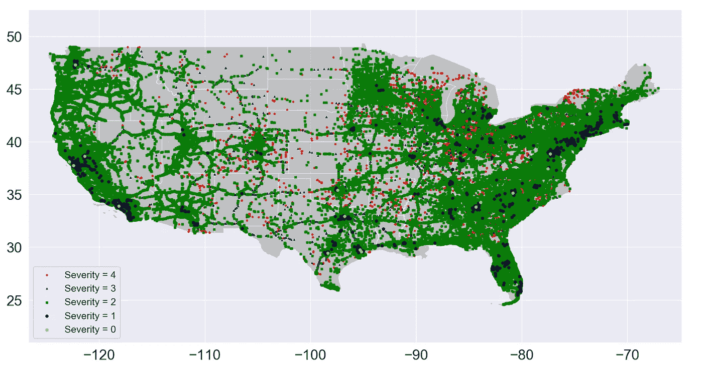

上面的情节看起来很乱！所以我们来分解一下。

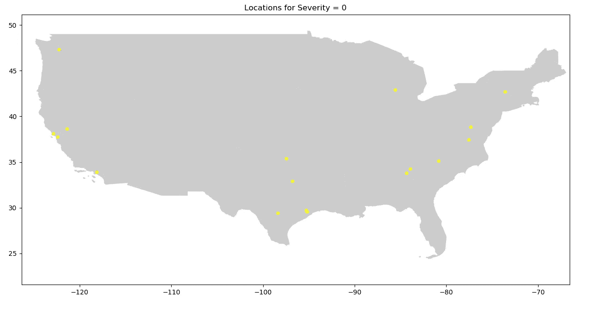

严重性= 0 的事故

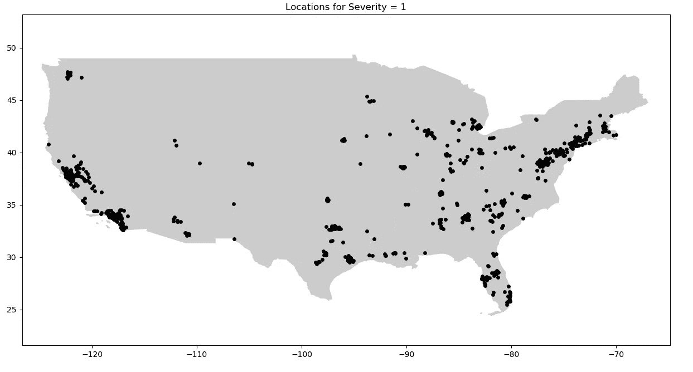

严重性= 1 的事故

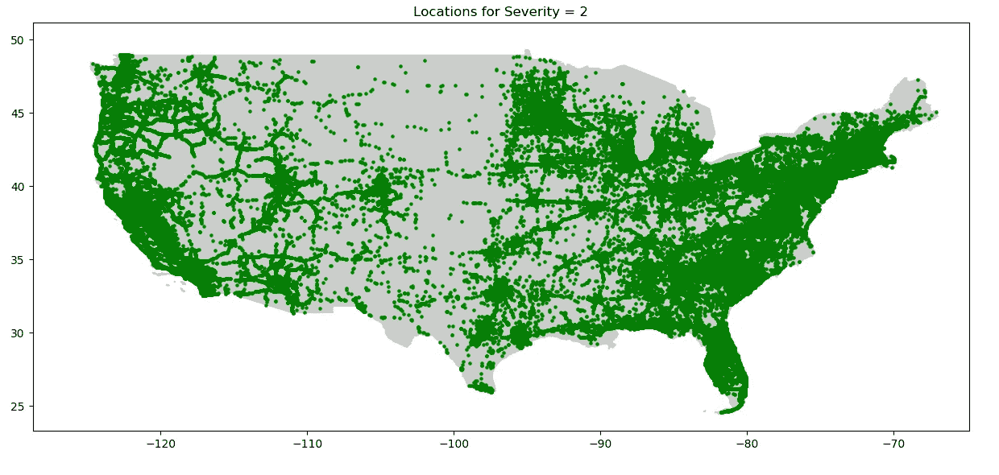

严重程度= 2 的事故位置

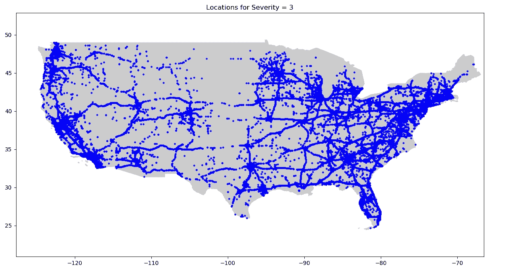

严重程度= 3 的事故位置

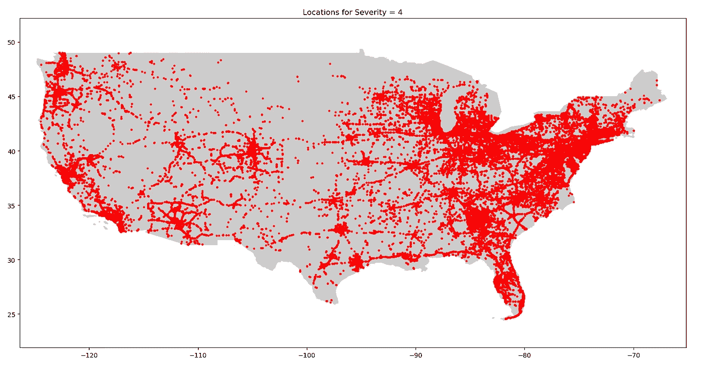

严重程度= 4 的事故位置

我已经分别标出了每个严重程度的位置。

从上面的图表中，我们可以得出结论，大多数事故发生在美国的东部和西部，这说明了大多数事故发生在时区:东部标准时间和太平洋标准时间。

现在，让我们看看*距离(mi)* 特性。此功能显示受事故影响的道路长度(以英里为单位)。

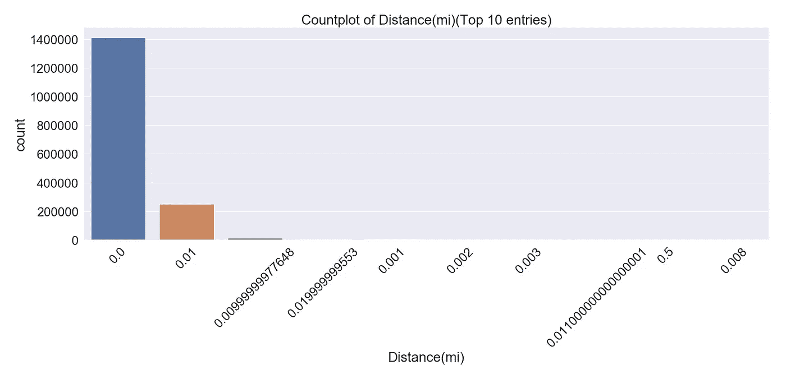

上面的情节描述了大多数事故对道路的影响很小。

现在让我们看看美国最容易发生事故的城市。

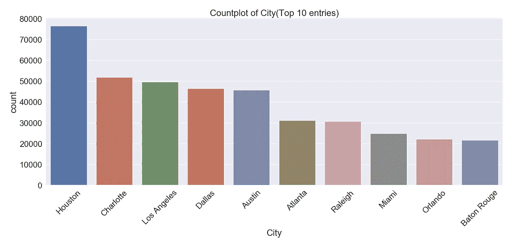

事故数量最多的 10 个城市

我们看到大多数事故发生在休斯顿，其次是夏洛特和洛杉矶。

让我们看看美国最容易发生事故的州

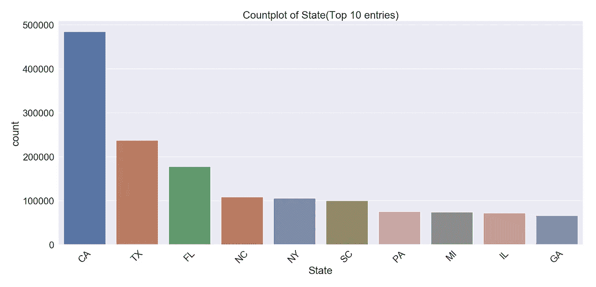

事故数量最多的 10 个州

这里给出了美国各州及其代码的列表。

该图显示，加利福尼亚州的事故数量最多，其次是德克萨斯州和佛罗里达州。有趣的是，加利福尼亚州的事故数量几乎是德克萨斯州事故数量的两倍。

我们可以看到，美国最容易发生事故的城市是德克萨斯州的休斯顿，其次是北卡罗来纳州的夏洛特和加利福尼亚州的洛杉矶。

让我们更深入一点，绘制出与邮政编码相关的事故数量。

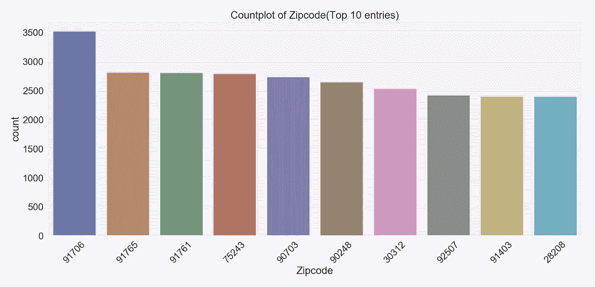

事故数量与邮政编码

可以看出，大多数事故发生在邮政编码为 91706 的地区，其次是 91765 和 91761。参考此[链接](https://worldpostalcode.com/united-states/)了解更多关于邮政编码的信息。

现在让我们看看*可见性(mi)* 特性。它以英里表示能见度。

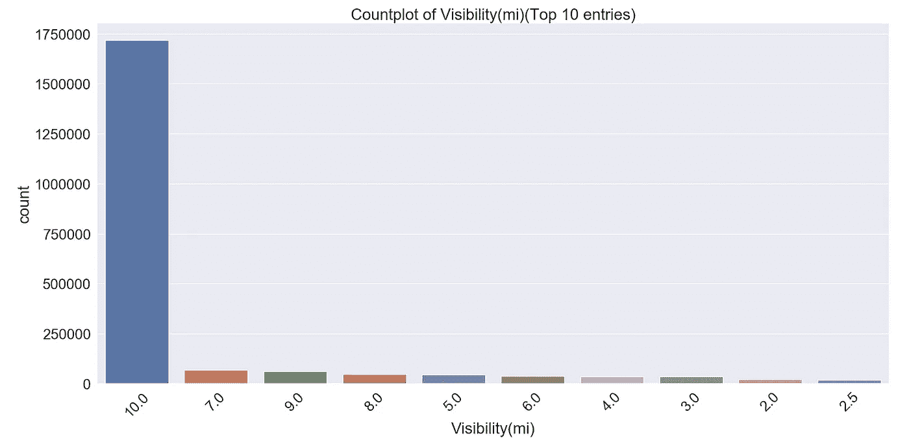

事故数量与能见度(mi)

该图显示，大多数事故发生在能见度高的时候，这意味着能见度不是发生事故时的一个重要问题。这是显而易见的，因为低能见度不是唯一的因素。

现在让我们看看事故发生时的天气情况。

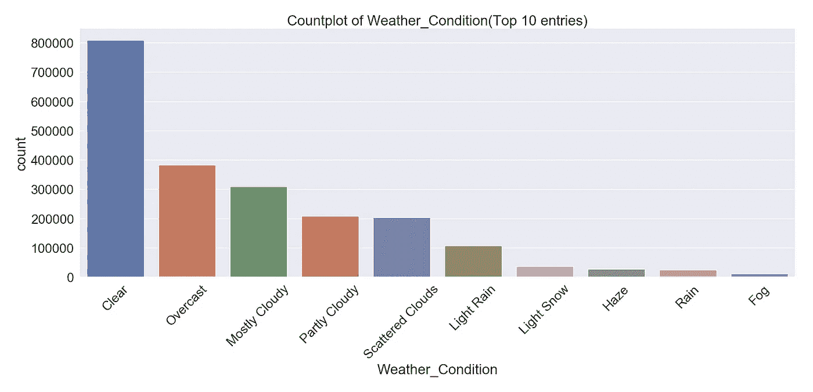

事故数量与天气状况

该图描述了大多数事故的天气状况是晴朗的，随后是阴天，大部分是多云。与晴天不同，阴天和大部分时间多云是事故的合理因素，这意味着天气条件也不发挥重要作用。

让我们看看*便利设施*功能。该特征指示附近位置的便利设施的存在。

事故数量与舒适度

我们看到，几乎所有(98.84%)事故都没有无障碍设施，这很不幸。

现在我们来看看凹凸特征。该特征表明附近位置存在减速带或减速带。

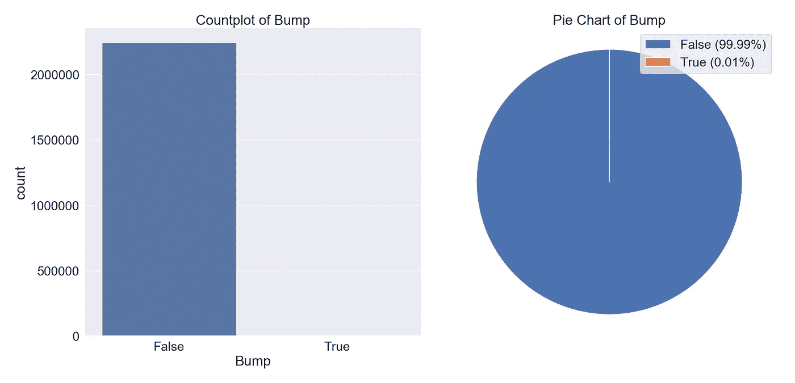

事故数量与颠簸

我们看到 99.99%的事故都不是因为减速带。

这样，我们就结束了这个分析。

## 结论

对取自 Kaggle 的美国事故数据集进行了分析，并在上文讨论了结果。

我们发现了很多令人兴奋的事情，比如我们知道了美国哪个城市或州发生了最多的事故，我们甚至在地图上绘制了结果，还考虑了事故的严重程度。

希望你能了解一些东西，并喜欢这篇文章！！