# 对计数数据使用负二项式

> 原文：<https://towardsdatascience.com/use-a-negative-binomial-for-count-data-c68c062de203?source=collection_archive---------13----------------------->

由 [Djim Loic](https://unsplash.com/@loic?utm_source=medium&utm_medium=referral) 在 [Unsplash](https://unsplash.com?utm_source=medium&utm_medium=referral) 上拍摄的照片

## 提高你的统计游戏

负二项分布是一种离散概率分布，您的计数数据工具包中应该有这种分布。例如，您可能有关于某人在购买前访问的页面数量的数据，或者与每个客户服务代表相关的投诉或升级数量的数据。给定这些数据，您可能希望对过程进行建模，然后查看一些协变量是否会影响参数。在许多情况下，你可能会发现负二项分布非常适合。

在这篇文章中，我们将介绍分布，并计算其概率质量函数(PMF)。我们将通过使用二项式定理来涵盖它的基本属性(均值和方差)。这与通常的治疗方法形成对比，通常的治疗方法要么只是给你一个公式，要么使用更复杂的工具来得出结果。最后，我们将转而关注分布的解释。

# 负二项分布

假设你要掷一枚有偏向的硬币，硬币有正面朝上的概率 *p* ，我们称之为“成功”此外，你将继续抛硬币，直到在 *r* 成功。设 *k* 为沿途*失败*的次数(所以 *k+r* 抛硬币总共发生了多少次)。

在我们的例子中，我们可以想象:

*   用户可能会浏览您的网站。在每一页上，他们有 1%的概率看到他们想买的东西。我们想象当他们把物品放入购物篮时，他们准备结账。k 是他们会浏览但不会购买的页面数量。当然，我们将希望拟合模型以找到 *r* 和 *p* 的真实值，以及它们是否/如何在用户之间变化。
*   客户服务代表通常会收到投诉。接到投诉后，有概率 *p* 被训斥。然后，在被责骂几次之后，他们会因为行为的改变而停止抱怨。 *k* 是他们在改变行为之前没有被训斥的投诉次数。

你是否真的认为这是真的，一如既往，取决于你之前的信念和模型与数据的吻合程度。还要注意，失败的次数与事件的次数密切相关(k 对 k 加 r)。

使用一些组合学来写下概率质量函数是相对简单的。第 *r* 次成功发生在第(k+r)次抛硬币上的概率是:

1.  第一次*k+r–1*翻转成功*r–1*的概率，次
2.  第( *k+r)-* 次翻转成功的概率。

在第一次 k+r–1 次翻转中，有(k+r–1)次选择 *k* 次*(r–1)*次成功和*次 k* 次失败。(将 k A 和(r–1)B 排列成一行的方式的数量)。每一个都有相同的发生概率。这给了 PMF:

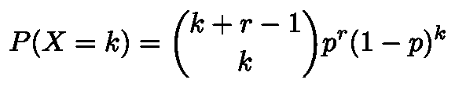

希望你记得一些关于组合和排列的基本事实。如果没有，这里有一个简单的事实回顾，你可以说服自己来帮助你。假设有 3 个 A 和 2 个 B，你想把它们排列成一个类似“AAABB”或“ABABA”的字符串。这样做的方法有 5 个*选择* 2(总共有 5 个东西和 2 个 B)这与 5 个选择 3(有 3 个 A)相同。为了看到这一点，假设每个字母实际上是一个不同的符号(所以这 5 个符号是 A1、A2、A3、B1、B2)。然后还有 5 个！=120 种排列不同符号的方式。但是有 3 个！=6 种在不改变 A 的位置的情况下重新排列 A1 A2 A3 的方法，以及 2！=2 种排列 B 的方法。所以总数是 5！/2!3!= 10.

诀窍是，二项式也适用于负数或者非整数。例如，如果我们扩展上面的内容，我们可以给分子中的每个 *k* 项添加一个减号:

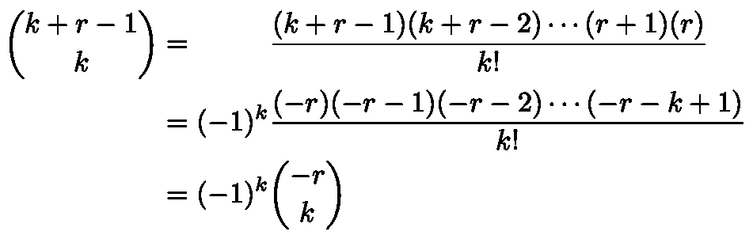

负二项分布作为实际的负二项分布

因此得名“负二项式”

需要记住的另一个技巧是，我们可以用非整数来定义二项式。利用γ函数([γ函数](https://en.wikipedia.org/wiki/Gamma_function))满足的事实，对于正整数 *n* ，

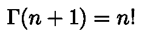

Gamma 函数扩展了阶乘

我们可以将二项式系数写成如下形式

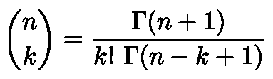

n 不是整数的二项式系数

这使我们能够允许，在负二项分布中，参数 *r* 不必是整数。这将是有用的，因为当我们评估我们的模型时，我们通常没有办法将 *r* 约束为整数。因此， *r* 的非整数值不会有问题。(然而，我们将要求 r 为正数)。我们将回到如何解释非整数值的 *r* 。

# 负二项分布的性质

我们想计算期望和方差。作为热身，让我们检查负二项分布实际上是一个概率分布。为了方便起见，让*q = 1–p*。

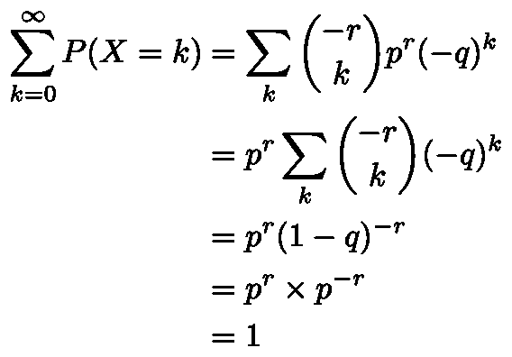

负二项分布实际上是一种概率分布

关键点是第三行，这里我们使用了[二项式定理](https://en.wikipedia.org/wiki/Binomial_theorem)(是的，它适用于负指数)。

现在让我们来计算期望值:

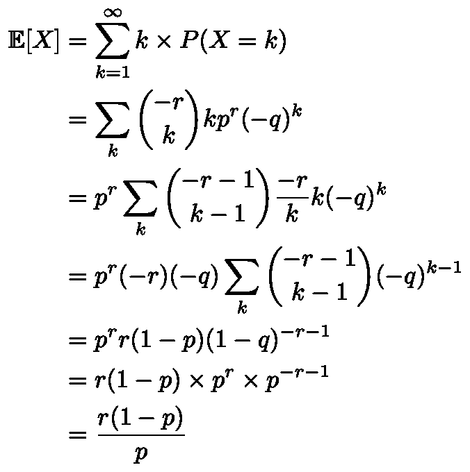

负二项分布的期望值

为了得到第三行，我们使用了恒等式

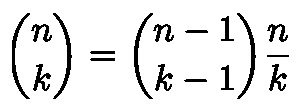

我们再次使用二项式定理得到倒数第三条线。

**警告**:这与你在[维基百科](https://en.wikipedia.org/wiki/Negative_binomial_distribution#Relation_to_the_binomial_theorem)上看到的相反。这是你将从[Wolfram](https://mathworld.wolfram.com/NegativeBinomialDistribution.html)(Mathematica 的制造者)中找到的。这是因为维基百科考虑的是失败之前成功的次数，而我们计算的是成功之前的失败次数。一般来说，有各种类似的方法来参数化/解释分布，所以当在不同的地方查看公式时，要小心你的一切都是直的。

接下来，我们可以分两步计算方差。首先，我们重复上面的技巧，这次使用两次恒等式得到第三行。我们再次使用二项式定理来计算总和，并获得倒数第三行。

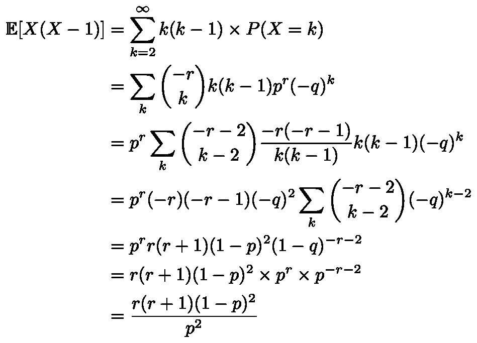

现在我们可以计算:

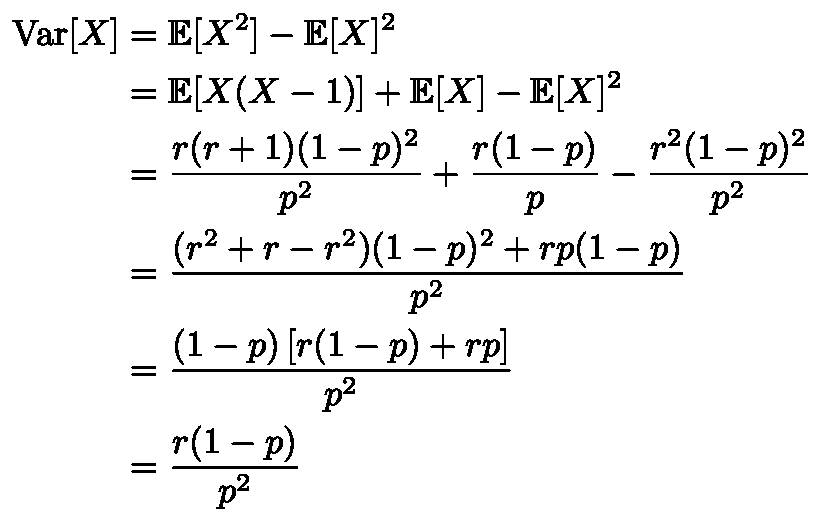

负二项分布的方差

同样，这与维基百科上的内容相反。

# 负二项分布的解释

我们已经介绍了负二项分布的“定义解释”:它是成功发生之前的失败次数，每一步成功的概率是 p。但是也有一些其他的方法来看这个分布，这可能是有启发性的，也有助于解释 *r* 不是整数的情况。

## 过分散泊松分布

[泊松分布](https://en.wikipedia.org/wiki/Poisson_distribution)是一个非常简单的计数数据模型，它假设事件以一定的速率随机发生。然后，它对给定时间间隔内将发生多少事件的分布进行建模。在我们的例子中，它会说:

*   客户服务代表不断收到投诉。计数的变化只是由随机变化决定的。(比较他们的行为最终改变的模型)。同样，在对此进行建模时，我们可以基于外生协变量对代表之间的比率差异进行建模。

泊松分布的一个大问题是方差等于均值。这可能不符合我们的数据。假设我们用均值λ和停止参数 *r* 来参数化负二项分布。那么我们有

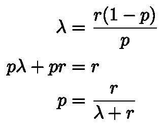

负二项分布的重新参数化

我们的概率质量函数变成了

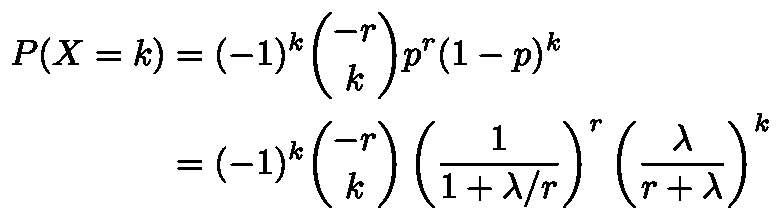

均值λ参数化的负二项分布的概率质量函数

现在让我们考虑如果我们把极限取为 r →∞保持λ不变会发生什么。(这意味着成功的概率也趋向于 1，按照 p=r/[λ+r]定义的方式)。在这个极限中，二项式接近(–r)的 k 的幂除以 k！并且 r + λ接近 r。

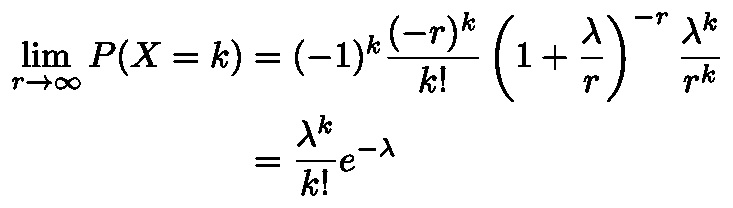

均值λ固定的大 r 的负二项式的极限

在最后一行，r 的 k 次方相消，我们使用了指数的定义。结果是我们恢复了泊松分布。

因此，我们可以将负二项分布解释为泊松分布的推广。如果分布实际上是泊松分布，我们将会看到一个大的 *r* 和 *p* 接近 1。这是有意义的，因为当 *p* 接近 1 时，方差接近平均值。当 *p* 小于 1 时，方差高于同均值的泊松分布，所以我们可以看到负二项分布通过增加方差来推广泊松。

## 泊松分布的混合

负二项分布也是泊松随机变量的混合。例如，假设我们的客户服务代表每个人都以给定的比率收到投诉(他们从不改变他们的行为)，但是这个比率在代表之间是不同的。如果这个比率是根据伽马分布随机分布的，我们得到一个负的二项分布。

这背后的直觉如下。我们最初说负二项分布是当我们掷硬币时，在成功之前失败的次数。相反，用两个泊松过程代替抛硬币。流程一(“成功”流程)的比率为 *p* ，流程二,“失败”流程的比率为(1-p)。这意味着，我们不是把负二项分布看作是数硬币，而是认为有独立的过程独立地产生“成功”和“失败”,我们只是在一定数量的成功之前数多少次失败。

伽玛分布是泊松过程等待时间的分布。设 T 为“成功”过程中成功的等待时间。t 是伽玛分布。那么失败次数的平均值为(1–p)T，并且服从泊松分布。

# 结论

最后几点值得指出。首先，没有一种解析方法可以将负二项分布拟合到数据中。相反，使用最大似然估计和数值估计。在 Python 中，您可以使用`[statsmodels](https://www.statsmodels.org/devel/generated/statsmodels.discrete.discrete_model.NegativeBinomial.html)`包来完成这项工作。

此外，还可以进行负二项式回归，模拟协变量的影响。我们将在以后的文章中讨论这个问题。