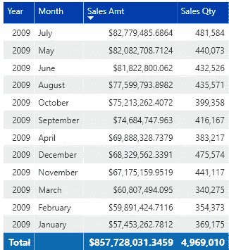
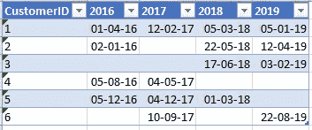
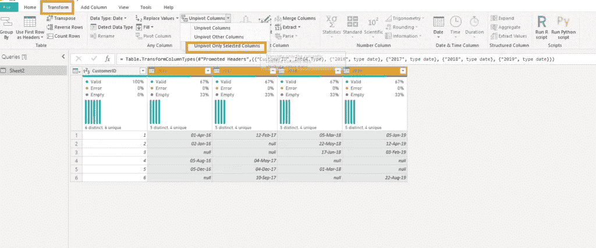
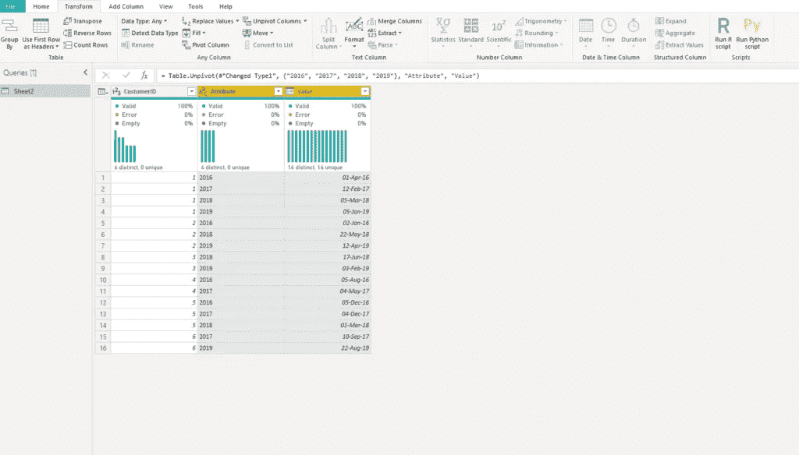
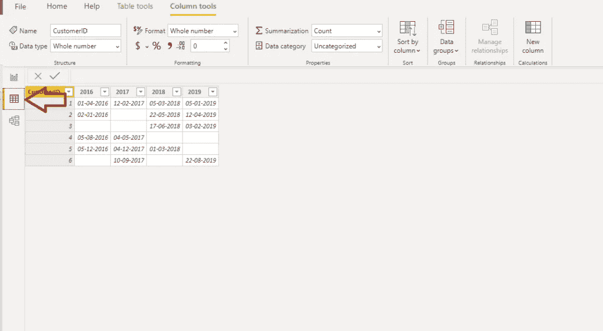
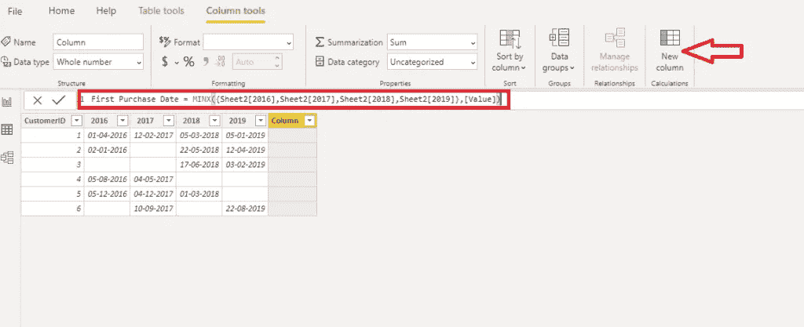
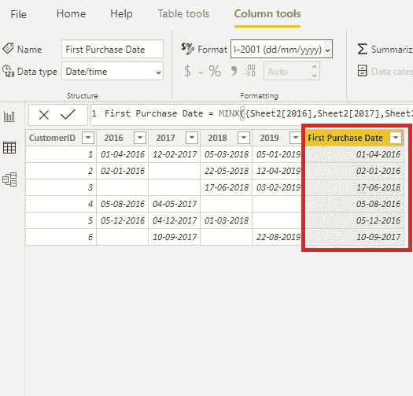

# 在 Power BI 中对行使用聚合函数

> 原文：<https://towardsdatascience.com/use-aggregate-functions-on-rows-in-power-bi-904724a54374?source=collection_archive---------24----------------------->

## 在列上使用聚合函数是好的，但是在行上使用同样的方法是——太棒了！所有这一切只需要一行 DAX 代码！


约书亚·科尔曼在 Unsplash 上拍摄的照片

聚合函数是 Power BI 中的主要构件之一。无论是在测量中显式使用，还是由 Power BI 隐式定义，没有一个 Power BI 报告不使用某种聚合函数。

## 什么是聚合函数？

聚合意味着组合数据中的值，执行一些数学运算。可以是总和、平均值、最大值、最小值、计数、不同计数、平均值、标准偏差等。

但是，对聚合函数的深入观察不在本文的范围之内。在这里，我想演示如何以一种非常规的方式使用聚合函数，因为我相信它在一些特定的场景中是有用的。

## 聚合函数的默认行为

默认情况下，对列计算聚合。让我们看看下面的基本例子:



这是 SUM 聚合函数的一个典型例子。数字在年和月的级别上进行聚合，最后，我们可以在表中看到各个值的总和。

我们还可以执行 AVERAGE 来查找平均值，MIN 或 MAX 来查找最小值和最大值，等等。非常简单，可能大多数使用过 Power BI 或 Excel 的人都已经知道了。

## 行上的聚合—无需取消透视！

但是，如果我们想在行上而不是在列上执行聚合呢？有可能做到吗？如果是，如何实现？

让我们立即前往动力 BI 进行检查。我有一个 Excel 文件作为数据源，还有一个虚拟表，其中包含关于客户的数据以及他在一年内第一次购买的日期:



如您所见，有些客户每年都会购买一次产品，有些有缺口，有些是在以后几年购买的，等等。

现在，我想检索客户进行购买的最早日期，以便稍后可以基于该日期执行分析(例如，分析有多少客户在 2017 年 2 月进行了首次购买)。

我知道，你们大多数人可能会选择 Power Query 转换和 Unpivoting years 列，就像这样:



您会看到一个漂亮的新表格，所有日期都按客户分组:



但是，需要一个额外的工作负载来构建一个单独的列，该列将保存每个客户的最早日期(或最小日期)的数据，因此我们稍后可以使用该列进行过滤，甚至构建与[日期维度](http://However, an additional workload is necessary to build a separate column which will hold data about the earliest date (or MIN date) for every single customer, so we can later use this column for filtering purposes, or even for building a relationship to a date dimension.  What if I tell you that you can do this with a single line of code and without any additional transformations?  First, I will close Power Query editor and go straight to Power BI Data view:)的关系。

**如果我告诉你，你只用一行代码就可以做到这一点，不需要任何额外的转换，那会怎么样？**

首先，我将关闭电源查询编辑器，直接进入电源 BI 数据视图:



您会看到该表看起来与 Excel 中的一模一样。现在，我选择创建一个新列，当出现提示时，输入以下 DAX 代码:

```
First Purchase Date = MINX({Sheet2[2016],Sheet2[2017],Sheet2[2018],Sheet2[2019]},[Value])
```



让我们暂时停在这里，解释一下我们在做什么。因此，我们希望从每一行中提取最小日期。我们可以通过使用多个嵌套的 IF 语句和 MIN aggregate 函数来实现。因为 MIN function 只接受两个参数，所以我们会有多层嵌套的 IF 语句，这非常难看，几乎不可读。

***这里的神奇之处就在花括号里！*** 通过使用它们，我们告诉 DAX 我们希望它从花括号内的列表中创建一个表，并使用 [MINX](https://dax.guide/minx/) 迭代器聚合函数，我们简单地遍历这个表并从中提取最小值。

那是多么的酷和优雅！它非常有效，下面是结果栏:



您可以很容易地发现 DAX 返回了预期值，因此现在我们可以将该列用作图表中的轴，在其上创建常规的日期层次结构，或者如果愿意，我们甚至可以在数据模型中创建首次购买日期和日期维度之间的关系。

## 结论

力量 BI 和 DAX 都是满满的隐藏宝石。老实说，我不得不承认，您可能不会每天都面临这样的场景，但是在某些特定的情况下，知道您可以以一种非常简单而强大的方式在行级别上执行聚合函数是很好的——使用一行代码！

[成为会员，阅读 Medium 上的每一个故事！](https://datamozart.medium.com/membership)

订阅[此处](http://eepurl.com/gOH8iP)获取更多有见地的数据文章！