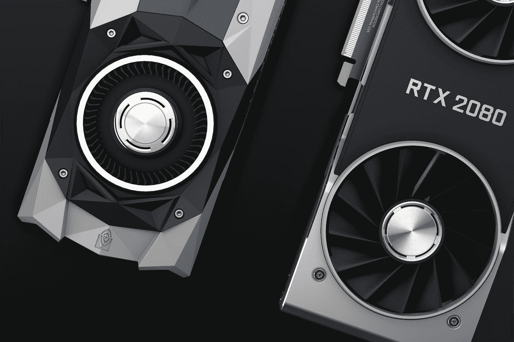
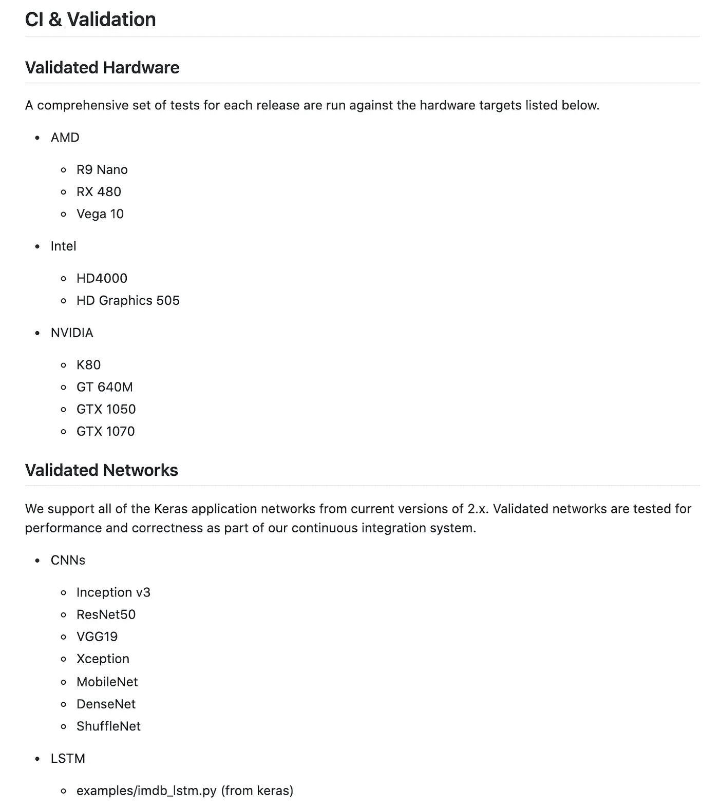
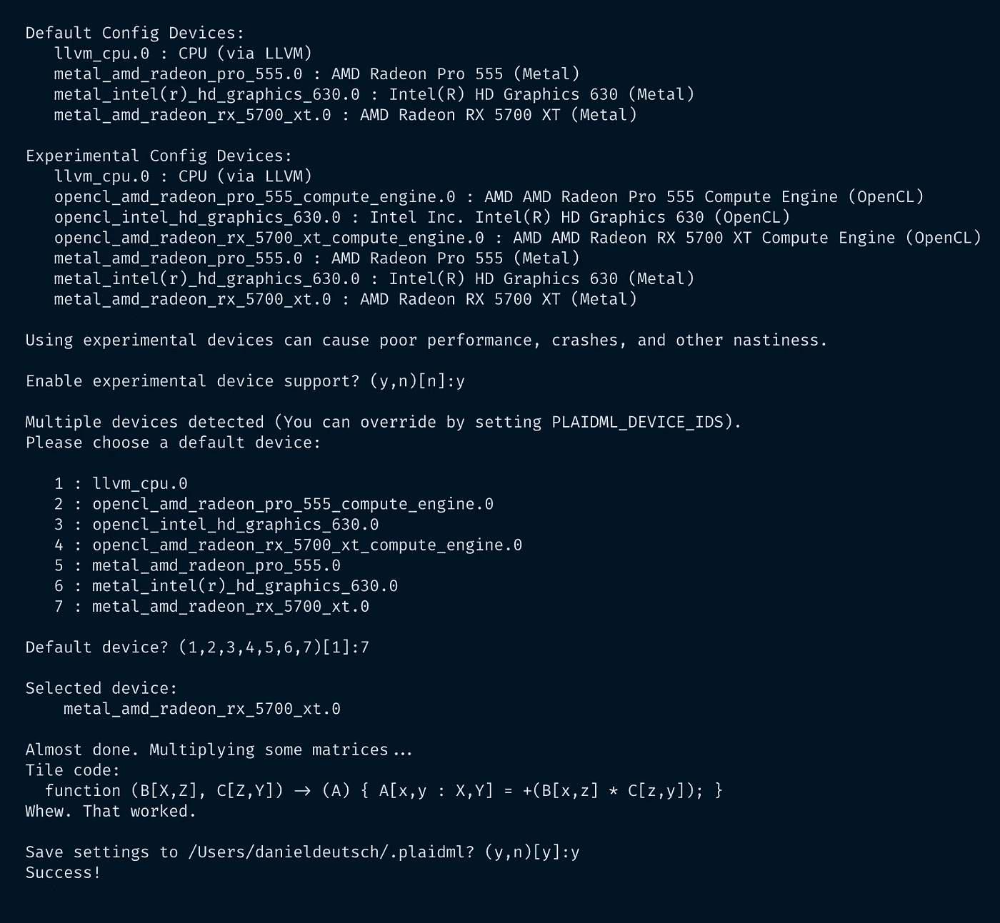
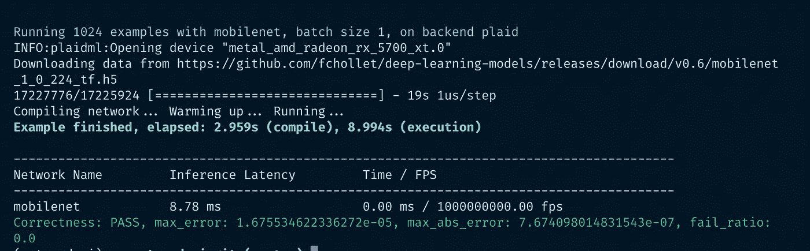
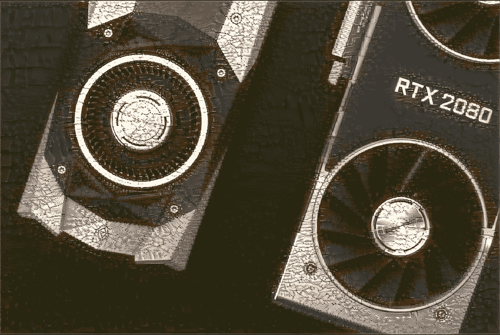

# 在你的 Mac 上使用 AMD GPU 来加速 Keras 中的深度学习

> 原文：<https://towardsdatascience.com/use-an-amd-gpu-for-your-mac-to-accelerate-deeplearning-in-keras-c1ef773b2e33?source=collection_archive---------14----------------------->



*照片*[https://unsplash.com/photos/aVeKubCF-48](https://unsplash.com/photos/aVeKubCF-48)

# Mac + AMD 镭龙 RX5700 XT + Keras

如今，每个机器学习工程师都会希望使用 GPU 来加速他的深度学习计算。我碰巧从一个朋友那里得到了一个 AMD 镭龙 GPU。不幸的是，我看到 AMD 和 Nvidia GPUs 之间有很大的差异，而只有后者在深度学习库中得到了很大的支持，如 Tensorflow。我看到了一些文章，并让我的 mac+amd GPU 设置工作。🚀

这可以看作是对其他文章的理解(见“附加阅读”)和我这边在实现过程中的一些附加解决方案。

# 放弃

我与本文中使用的任何服务都没有关联。

我不认为自己是专家。如果你觉得我错过了重要的步骤或者忽略了什么，可以考虑在评论区指出来或者联系我。

我总是乐于听取建设性的意见以及如何改进。

**本文写于 2020 年 3 月 10 日。**

我无法监控我的所有文章。当你阅读这篇文章时，提示很可能已经过时，过程已经改变。

如果你需要更多关于某些部分的信息，请在评论中指出来。

# 目录

*   [问题—答案](https://github.com/Createdd/Writing/blob/master/2020/articles/amdGpuOnMac.md#the-problem---the-answer)
*   [先决条件](https://github.com/Createdd/Writing/blob/master/2020/articles/amdGpuOnMac.md#pre-requisits)
*   [我的设置](https://github.com/Createdd/Writing/blob/master/2020/articles/amdGpuOnMac.md#my-setup)
*   [将外部 GPU 连接到 Mac](https://github.com/Createdd/Writing/blob/master/2020/articles/amdGpuOnMac.md#connect-external-gpu-to-mac)
*   [实际实施](https://github.com/Createdd/Writing/blob/master/2020/articles/amdGpuOnMac.md#actual-implementation)
*   [补充阅读及常见问题](https://github.com/Createdd/Writing/blob/master/2020/articles/amdGpuOnMac.md#additional-reading-and-common-problems)
*   [关于](https://github.com/Createdd/Writing/blob/master/2020/articles/amdGpuOnMac.md#about)

# 问题——答案

用于 Keras 计算的核心 Tensorflow 支持通过 CUDA 使用 Nvidia 显卡进行本地 GPU 加速。不幸的是，AMD 还没有这样的产品。

这个问题的答案是 PlaidML，这是一个 python 库和张量编译器，它允许我们加速矢量计算。

> PlaidML 是一个先进的便携式张量编译器，用于在笔记本电脑、嵌入式设备或其他设备上实现深度学习，在这些设备上，可用的计算硬件没有得到很好的支持，或者可用的软件堆栈包含令人不快的许可证限制。
> 
> *PlaidML 位于通用机器学习框架之下，使用户能够访问 PlaidML 支持的任何硬件。PlaidML 支持 Keras、ONNX 和 nGraph。*
> 
> *作为 nGraph 编译器堆栈中的一个组件，PlaidML 进一步扩展了专门的深度学习硬件(特别是 GPU)的功能，并使访问或利用子图级优化变得更加容易和快速，否则这些优化将受到设备计算限制的限制。*
> 
> *作为 Keras 下的组件，PlaidML 可以通过定制或自动生成的 Tile 代码来加速训练工作量。它在 GPU 上工作得特别好，并且它不需要在 Nvidia 硬件上使用 CUDA/cuDNN，同时实现可比的性能。*

*来源*[*https://github.com/plaidml/plaidml*](https://github.com/plaidml/plaidml)

截至撰写本文时，以下硬件和网络已经过验证:



*来源公文*[*https://github.com/plaidml/plaidml/tree/plaidml-v1*](https://github.com/plaidml/plaidml/tree/plaidml-v1)

由于 PlaidML 有助于 Keras 模型上的张量计算，它不会加速使用 Numpy 的独立张量计算。这可以通过使用 OpenCL 来完成，这将不在本文中讨论。查看“额外阅读”部分了解更多信息。

# 先决条件

如果你想继续下去，你应该

*   苹果操作系统
*   外部 AMD GPU
*   [Keras](https://keras.io/) ，作为深度学习库

# 我的设置

# 马科斯·卡特琳娜

```
System Version: macOS 10.15.6 (19G2021)
Kernel Version: Darwin 19.6.0
Boot Volume: Macintosh HD
Boot Mode: Normal
Secure Virtual Memory: Enabled
System Integrity Protection: Enabled
```

# 外部 GPU

运行

```
system_profiler SPDisplaysDataType
```

会给你图形/显示输出。

它显示了我的外部 GPU:

```
Radeon RX 5700 XT: Chipset Model: Radeon RX 5700 XT
      Type: External GPU
      Bus: PCIe
      PCIe Lane Width: x4
      VRAM (Total): 8 GB
      Vendor: AMD (0x1002)
      Device ID: 0x731f
      Revision ID: 0x00c1
      ROM Revision: 113-D1990103-O09
      Automatic Graphics Switching: Supported
      gMux Version: 4.0.29 [3.2.8]
      Metal: Supported, feature set macOS GPUFamily2 v1
      GPU is Removable: Yes
```

# 库版本

```
keras=2.2.4=pypi_0
keras-applications=1.0.8=py_1
keras-preprocessing=1.1.0=py_0plaidbench=0.7.0=pypi_0
plaidml=0.7.0=pypi_0
plaidml-keras=0.7.0=pypi_0
```

# 将外部 GPU 连接到 Mac

# 安装软件包

```
pip install pyopencl plaidml-keras plaidbench
```

# plaidml-设置

```
plaidml-setup
```



plaidml-setup 的设置步骤

# plaidbench keras mobilenet

```
plaidbench keras mobilenet
```



运行 plaidbench 的结果

这表明 GPU 设置应该是可行的。现在让我们进入实际的实现。

# 实际实施

为了让它工作，你需要将它添加到笔记本/文件中:

```
import plaidml.keras
import os
plaidml.keras.install_backend()
os.environ["KERAS_BACKEND"] = "plaidml.keras.backend"
```

还有其他关于如何添加后端的建议。然而，它只在这个顺序下对我有效。首先安装后端，然后设置环境。(其他建议见“附加阅读”)

之后，做

```
from keras import backend as K
K
```

应该会给你这样的东西:

```
<module 'plaidml.keras.backend' from '/Users/XXXX/opt/anaconda3/envs/XXX/lib/python3.7/site-packages/plaidml/keras/backend.py'>
```

如果你不确定是否真的使用了 GPU，有几个命令可用，比如`K._get_available_gpus()`。但它们对我不起作用。如果你得到的是类似上面的后端消息，它应该可以工作。你会在计算过程中看到无论如何，如果你的 GPU 正在运行或你的 Mac)

# 添加深度学习代码

为了测试它，你可以从他们的文档中使用基本的 Keras 示例代码:[https://github.com/keras-team/keras/tree/master/examples](https://github.com/keras-team/keras/tree/master/examples)

例如[神经类型转移](https://github.com/keras-team/keras/blob/master/examples/neural_style_transfer.py)。

在我的标题中的基本图像上运行它(归功于 [Nana Dua](https://unsplash.com/photos/aVeKubCF-48) )并添加一些特殊的味道(归功于 [Arno Senoner](https://unsplash.com/photos/vcgamdrOup8) ，导致:


原创



风格转移

# 附加阅读和常见问题

*   [在您的 Mac 上使用外部图形处理器](https://support.apple.com/en-ug/HT208544)
*   [AMD 上的 GPU 加速，使用 PlaidML 进行训练和使用 Keras 模型](https://medium.com/@bamouh42/gpu-acceleration-on-amd-with-plaidml-for-training-and-using-keras-models-57a9fce883b9)
*   [MAC OS 上 GPU 加速的机器学习](/gpu-accelerated-machine-learning-on-macos-48d53ef1b545)
*   [在深度学习中使用 GPU 可以带来哪些好处](https://medium.com/@apundhir/gpu-for-deep-learning-7f4ef099b702)
*   [Stackoverflow 关于让 mac 与 GPU 一起工作](https://stackoverflow.com/questions/60016868/anyway-to-work-with-keras-in-mac-with-amd-gpu)

# 关于

丹尼尔是一名企业家、软件开发人员和律师。他曾在各种 IT 公司、税务咨询、管理咨询和奥地利法院工作。

他的知识和兴趣目前围绕着编程机器学习应用程序及其所有相关方面。从本质上说，他认为自己是复杂环境的问题解决者，这在他的各种项目中都有所体现。

如果您有想法、项目或问题，请不要犹豫与我们联系。


连接到:

*   [领英](https://www.linkedin.com/in/createdd)
*   [Github](https://github.com/Createdd)
*   [中型](https://medium.com/@createdd)
*   [推特](https://twitter.com/_createdd)
*   [Instagram](https://www.instagram.com/create.dd/)
*   [createdd.com](https://www.createdd.com/)


你可以在[https://www.buymeacoffee.com/createdd](https://www.buymeacoffee.com/createdd)上支持我