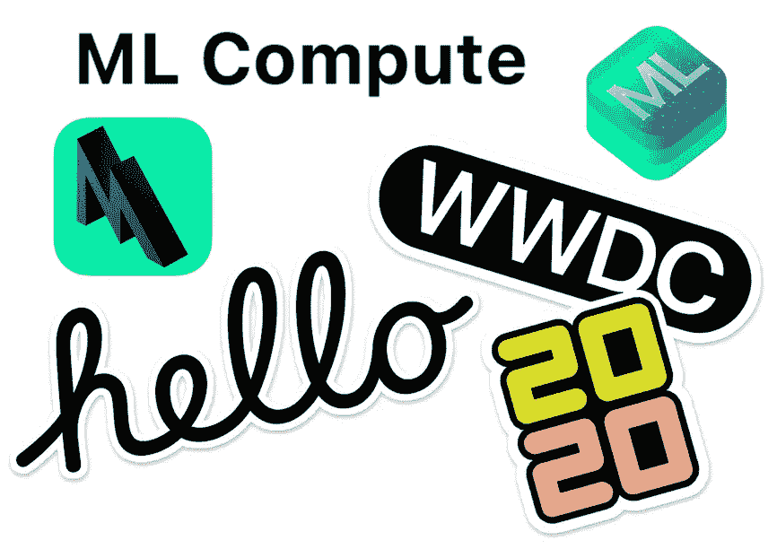
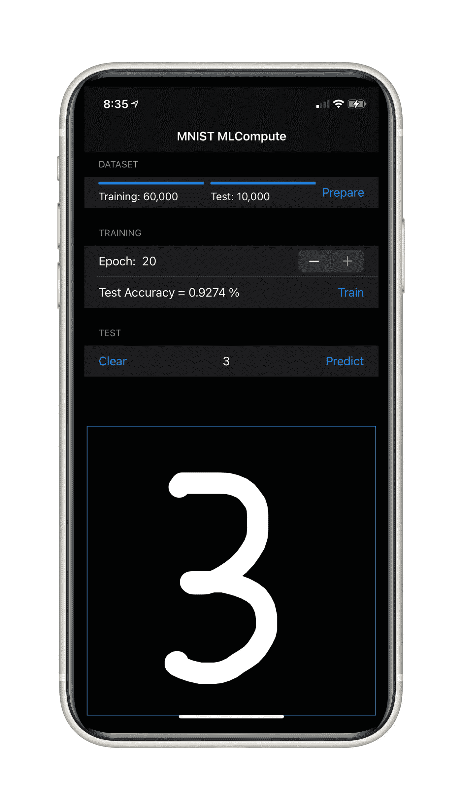

# 使用 Apple 新的 ML 计算框架来加速 iOS 和 macOS 上的 ML 训练和推理

> 原文：<https://towardsdatascience.com/use-apple-new-ml-compute-framework-to-accelerate-ml-training-and-inferencing-on-ios-and-macos-8b7b84f63031?source=collection_archive---------25----------------------->

## 破解新的苹果 ML 计算框架，加速跨 CPU 和 GPU 的神经网络训练

随着最近新一波操作系统版本(BigSur，iOS 14 等。)，苹果在最近的 WWDC 上宣布，它非常安静地引入了一个新的 ML 框架，以加速跨 CPU 或一个或多个可用 GPU 的神经网络训练。

ML Compute 并不完全是一个新的 ML 框架，而是一个新的 API，它利用了 CPU 的 Accelerate 框架提供的高性能 BNNS 原语和 GPU 的金属性能着色器。

在查看了文档并开始在 iOS/macOS 应用程序上使用它之后，我明白这并不是一个真正简单的高级框架，而是一些可能旨在加速现有第三方 ML 库的东西，如 ONNX 运行时或苹果平台上的 TensorFlow Lite 框架。

即使苹果的文档非常好，我也要说这些 API 对于在 iOS/macOS 上做通用 ML 来说并不是真正的开发者友好和快捷。例如，tensor API 非常粗糙，它需要处理 Swift 中的非托管指针。基本上，您自己负责管理传递给这些 API 的张量、节点和图形等对象的所有权和内存分配的生存期。

更一般地，ML Compute 根据定义并不为 TensorFlow 提供类似 Keras、PyTorch 或 Swift 的 ML APIs 来简化构建和训练 ML 模型，而是提供低级 API 来构建计算图和管理低级训练循环。

对于 iOS/macOS 上的通用 ML 编码，我建议继续使用 Core ML 和 CoreMLTools 这样的工具从其他框架(TensorFlow，PyTorch 等)导入模型。)或者，如果您想完全在设备上本地构建和/或训练模型，避免任何 Python 代码，最终可以尝试我开发的 SwiftCoreMLTools 库。

 [## JacopoMangiavacchi/SwiftCoreMLTools

### 用于在 Swift 中创建 CoreML 模型的 Swift 库。这个库公开了一个(基于函数生成器)…

github.com](https://github.com/JacopoMangiavacchi/SwiftCoreMLTools) 

无论如何，我个人的观点是，玩了这个之后，ML 计算可能会变得非常强大，甚至对于常规的 Swift ML 开发人员来说也是如此，例如，在此基础上增加一个 Swift Function Builder (DSL)高级 API，就像我为 SwiftCoreMLTools 开发的那个，以及一个高级 Tensor Swift API，有望与 Swift Numerics 多维数组集成。

为了快速测试这些 API 的能力，我决定开发并演示一个 PoC 应用程序，在 iOS 和 macOS 上使用 ML Compute 对 MNIST 数据集进行简单的浅层模型训练和推理。

# 演示 ML 计算游乐场

在进入这个 MNIST ML 计算应用的细节之前，请让我分享一个快速和肮脏的 Swift 操场，我最初用来熟悉 ML 计算张量和图形 API。

正如你在这里看到的，我还没有建立一个真正的 ML 模型，但我使用 ML 计算图来简单地运行一些基本的张量算术运算。

我认为先简单地熟悉一下这个会很有帮助。

# 准备 MNIST 数据集张量

现在，我们已经熟悉了用于构建张量和图形的 ML Compute API 的基础，让您开始了解如何构建第一个样本浅层模型来训练著名的 MNIST 数据集。

我们将首先高效地导入包含 MNIST 训练和测试数据集的 CSV 文件，然后看看如何在 ML Compute tensors 中进行转换。

如您所见，下面的代码并行读取，训练和数据集 CSV 文件，应用一些规范化，并转换 Swift Float 数组中的图像和标签。

这里有一个关于并发性和中央调度 API (GCD)的简短说明。为了快速并行处理一批数据，我在这里使用了方便的 dispatch queue . concurrent perform API 来轻松管理 Swift 中的并行 For-Loop。

# 效用函数

不幸的是，将 CSV 文件缓冲区读入 String 并使用 split()方法处理行实际上并不高效，因此我必须开发一种替代方法，使用更高效的 C 运行时 getline()函数逐行扫描 CSV 文件。

下面的其他函数将在稍后处理标签和损失函数成本时变得有用，以便使用损失函数所需的一种热编码技术来编码和解码标签(ML 计算不提供稀疏分类交叉熵)。

# 构建计算图

既然我们已经在 Swift Float 数组上加载了训练和测试图像和标签，我们终于可以开始构建 ML 计算图了，我们将分别使用它来训练和测试模型。

我们在此示例应用程序中特别使用的 ML 模型是一个非常简单的浅层神经网络，它有一个带有 relu 激活的密集层，后面是一个带有 softmax 激活的最终密集层，用于 MNIST 数据集的十位数类别。

正如你所看到的，ML 计算图是通过添加层节点和激活函数，向所有这些层和激活函数传递经典参数(如输入/输出张量的形状、权重/偏差初始矩阵等)而构建的。

这里需要注意的是，用于权重、偏差以及模型输入和输出的所有张量的形状。具体来说，你可以看到，当构建图形时，我们必须选择批量大小，我们稍后将用于训练和推理，根据批量大小创建所有这些张量形状。

# 构建训练图

现在我们有了一个 ML 计算图，我们可以构建一个 MLCTrainingGraph 来传递计算图和训练参数。

在这种情况下，我们将指定 softmax 交叉熵作为损失函数(ML Compute 不提供稀疏分类交叉熵), ADAM 作为具有标准默认参数的优化器。

# 训练图表

为了训练 MLCTrainingGraph，我们需要创建一个完整的训练循环，迭代所有批次的每个时期，只需将训练数据集中的样本总数除以上面用于创建张量和图形的批次大小。

具体来说，在批处理循环中，我们将从 Swift Float 数组获得图像切片和标签数据的 Swift 不安全缓冲区，我们将通过此数据切片的不安全指针构建 MLCTensorData，并最终将此张量数据传递给训练图执行方法，以最终使用批处理数据训练模型。

# 用验证数据测试图表

一旦该模型被训练了足够的时期，我们将验证该模型，建立一个类似的 MLCInferenceGraph 和饲料，一次一批，所有的测试数据。

在推理图执行闭包回调中，我们将通过简单地查看预测对应于测试标签的时间来计算模型的最终准确性。

# 完整的代码

和往常一样，这个故事的代码是完全开源的，可以在我的 GitHub 个人账户上获得:

 [## 雅格布曼加瓦奇/MNIST 计算机公司

### 通过在 GitHub 上创建帐户，为 JacopoMangiavacchi/MNIST-ComputeML 开发做出贡献。

github.com](https://github.com/JacopoMangiavacchi/MNIST-ComputeML) 

# 特别感谢

最后，我想在此感谢 Apple ML Compute 团队，他们非常迅速、非常详细地为我提供了关于新 ML Compute 框架的建议和见解。