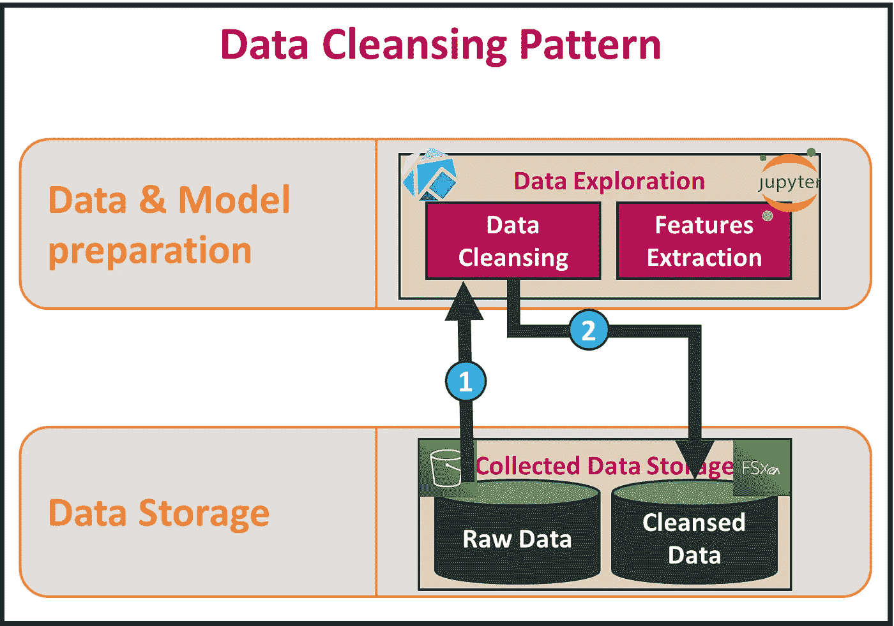
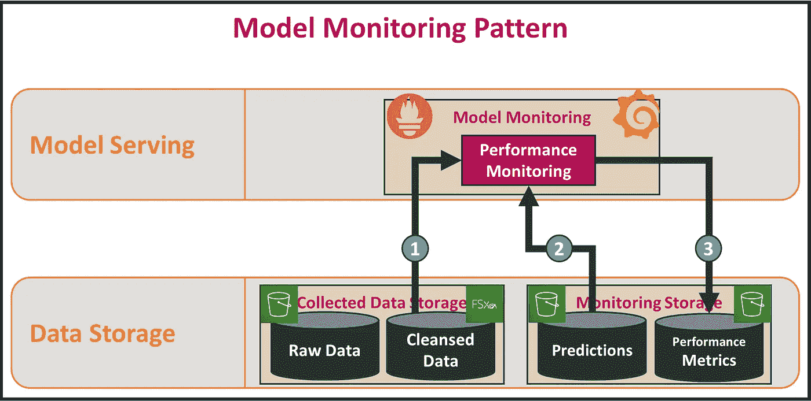

# 通过 SAP-C01 考试:用例层后，我在 AWS 上搭建了一个机器学习平台

> 原文：<https://towardsdatascience.com/use-cases-layer-of-the-machine-learning-platform-aff2cfec21c5?source=collection_archive---------50----------------------->

## “建筑是对真理的探索”——路易斯·康。问题是:什么真相？设计一个平台是一个不断寻求真理的过程。然而，如果“关于什么”没有很好地定义，这可能是一个无休止的过程。

约书亚·索蒂诺在 [Unsplash](https://unsplash.com?utm_source=medium&utm_medium=referral) 上拍摄的照片

这是我在 AWS 上构建机器学习平台之旅的第四章。这一章是基于我到目前为止在前面的部分中介绍的工作:[**ML 平台的高级概述**](https://medium.com/swlh/i-built-a-machine-learning-platform-on-aws-after-passing-sap-c01-exam-3705af76ca20) ， [**基础设施&软件层**](https://medium.com/@salah.rekik/i-built-a-machine-learning-platform-on-aws-after-passing-sap-c01-exam-infrastructure-and-software-320f9e36fb54) ，以及 [**框架层**](https://medium.com/@salah.rekik/i-built-a-machine-learning-platform-on-aws-after-passing-sap-c01-exam-framework-layer-4c38084c81a) 。

在这一部分，我将研究 AWS 上机器学习平台的第四层:用例层。

## 1 |那么，关于什么的真相？

当利益相关者选择一个新的用例时，最终目标是将这个用例放到机器学习平台上。实现这一目标受到解决三个谜题的限制:

*   用例背后的真相是什么？
*   用例所需的数据背后隐藏着哪些奥秘？
*   如何在机器学习平台上恰当地落地这个用例？

## 2 |用例背后的真相是什么？

即使机器学习是一个伟大的工具，它也不是大多数用例的正确答案。如果应用于错误的用例，它甚至可能是一种矫枉过正和预算浪费。这就是为什么，首先，业务分析师和数据科学家应该限定用例，并确保它有资格通过机器学习来解决。

> *“一个* *大部分用例简答:* ***不使用机器学习。*** *保持简单！”* 。

因此，如果用例可以通过传统算法和软件解决方案来解决，那么避免使用机器学习来解决它的复杂而危险的旅程是更明智的。

## 3|用例所需的数据背后隐藏着哪些奥秘？

现在假设我们的用例是一个真正的机器学习用例！还有两个重要步骤需要克服:

*   确定正确的数据源
*   将数据带到机器学习平台

## 3.1 |确定正确的数据源

传统上，具有深厚业务知识的人努力工作，以确定需要什么数据源，并试图编写一个清晰的用例规范，详细说明用例的棘手方面。

随着机器学习的出现，这个过程不再局限于拥有商业知识的人。数据科学家也应该融入这个过程，因为他们必须掌握那些棘手的方面，以努力产生一个强大的机器学习模型。

## 3.2 |将数据引入机器学习平台

提醒一下，[从一开始](https://medium.com/swlh/i-built-a-machine-learning-platform-on-aws-after-passing-sap-c01-exam-3705af76ca20)，我就假设我试图构建的 ML 平台是数据的消费者，并使用另一个数据平台功能来带来想要的数据。

数据平台和机器学习平台的分离，作者[作者](https://www.linkedin.com/in/salah-rekik)

尽管如此，机器学习团队主要负责研究围绕数据的敏感话题。这些主题包括:

*   **遵守一定的法规**:数据是一座金矿，但它的使用要服从一定的条件。例如，欧盟的数据应遵循一般数据保护法规(GDPR)。*“通用数据保护条例(EU) 2016/679 (GDPR)是欧盟法律中关于欧盟(EU)和欧洲经济区(EEA)数据保护和隐私的规定。它还解决了欧盟和欧洲经济区以外的个人数据传输问题。”* *。*要研究的其他法规可能是健康保险便携性和责任法案(HIPPA) 和支付卡行业数据安全标准(PCI-DSS) **⁴** 。
*   **数据敏感性**:为了遵守内容分发政策，一些数据属性应该匿名。例如，这适用于个人身份信息(PII)。
*   **数据收集属性:**在委派将数据带到数据平台的工作之前，必须回答几个问题:
    -应该以流模式收集哪些数据？哪些数据是以批处理方式收集的？
    -如何安排这些不同的数据收集流程？谁应该访问数据，谁不应该？

## 4 |如何在机器学习平台上恰当地落地这个用例？

几乎每个机器学习用例都可以通过七步通用工作流来解决:

1.  数据准备
2.  特征工程
3.  模特培训
4.  模型评估
5.  模型打包和部署
6.  模型服务
7.  模型监控

到目前为止构建的 ML 平台就是为了简化这些步骤的执行。准确地说，上一篇文章中提到的抽象层[，将是我们应用这些步骤的切入点。](https://medium.com/@salah.rekik/i-built-a-machine-learning-platform-on-aws-after-passing-sap-c01-exam-framework-layer-4c38084c81a)

提醒一下，这里是抽象层(框架层)的逻辑架构:

《机器学习框架的逻辑架构和实现》，作者[作者](https://www.linkedin.com/in/salah-rekik)

让我们讨论机器学习工作流的每一步，并看看在处理这些步骤时可能面临的一些挑战。

## 4.1 | **数据清理和准备**

从 S3，使用由 Kubeflow 产生和管理的 Jupyter 笔记本，原始数据被加载和研究。

数据清理模式，作者[作者](https://www.linkedin.com/in/salah-rekik)

在此阶段，数据可能会发生很多变化。例如:

*   **平衡数据**:在某些情况下，数据是不平衡的。例如，当处理像将电子邮件分类为垃圾邮件和非垃圾邮件这样的用例时，与真实的电子邮件相比，我们可能有不显著数量的垃圾邮件。
    存在多种技术来平衡数据，如**过采样**、**欠采样**和 **SMOTE** 。
*   **标注更多数据:**在监督学习中，有时标注样本的数量刚好不足以训练一个模型。在这种情况下，可以标记更多的数据。
    **亚马逊机械土耳其人**可以用来完成这个任务。它是*“一种网络服务，提供按需的、可扩展的人类劳动力来完成人类可以比计算机做得更好的工作，例如识别照片中的物体。”* ***⁵*** 。
*   **数据扩充:**当我们没有足够的数据来正确训练机器学习模型时，数据扩充也可能是一种解决方案。这是一种用于**从现有示例**中生成更多标记数据的技术。例如，当用于图像时，可以通过**翻转**该图像，在该图像上应用一些**滤镜**，或者**剪切该图像的一些部分**以引入损失，从一个图像生成新图像。

结果数据存储在清理后的数据存储中。

## 4.2 | **特色工程**

这是最具挑战性的步骤之一。识别特征需要大量的头脑风暴和想象力。优步特色的例子:*“餐厅在过去一小时内的平均用餐准备时间。”，* ' *餐厅最近七天的平均备餐时间*。 ***⁶***

特色工程模式，作者[作者](https://www.linkedin.com/in/salah-rekik)

如[前一篇文章](https://medium.com/@salah.rekik/i-built-a-machine-learning-platform-on-aws-after-passing-sap-c01-exam-framework-layer-4c38084c81a) **、**中所述，可以计算两种类型的特征:

*   **在线功能**:基于流数据计算，应该以非常低的延迟进行访问。这些特性存储在 DynamoDB 中。存储特征定义意味着存储其属性:**特征名称、特征类型(数值、分类)、特征的最小值和最大值等。**
    为了计算在线特征，ML 平台使用数据平台的**流处理**能力。换句话说，就两个平台之间的集成协议而言，这将是在数据平台上运行的作业。
*   **离线特性**:基于历史数据计算，无低延迟访问限制。这些特征将被存储在 S3。与在线特征一样，离线特征通过数据平台的**批处理**功能进行计算。

离线功能商店必须定期与在线功能商店同步，以*“确保相同的数据和批处理管道用于培训和服务”**。*

## *4.3 | **模型训练***

*训练阶段的第一步包括将数据分成三组:**训练组**用于训练模型，**验证组**用于超参数优化，以及**测试组**用于评估模型的性能。*

**

*模特培训模式，作者[作者](https://www.linkedin.com/in/salah-rekik)*

*清理后的数据和特征一起被输入到数据和模型准备层的模型训练功能中。然后将几个模型应用于数据，旨在筛选出一个性能模型。*

*如[基础架构层文章](https://medium.com/@salah.rekik/i-built-a-machine-learning-platform-on-aws-after-passing-sap-c01-exam-infrastructure-and-software-320f9e36fb54)中所述，FSx for Luster 用作存储来托管从 S3 复制的培训数据。有了这种存储，训练阶段被加速，因为工作节点可以具有比直接从 S3 访问数据好得多的数据访问性能。*

*该模式的最后一步是将训练好的模型连同其**版本化元数据**一起存储在训练好的模型存储的版本化存储库中。模型的元数据可以是**模型的名称和版本、用于构建模型的数据版本、模型使用的特性、模型的输出格式等等。***

## *4.4 | **模型评估***

*使用 Katib 和验证集，在选定的 ML 模型上测试不同的超参数组合，以最终选择性能最佳的组合。*

*然后使用测试集来测试 ML 模型，以评估其性能。*

*最后，生成的模型与其元数据一起存储在训练好的模型库中。*

**

*模式评价模式，作者[作者](https://www.linkedin.com/in/salah-rekik)*

## *4.5 | **模型打包和部署***

*两个步骤组成了这个模式:**模型打包**和**模型部署**。每一步都有自己的规范。*

**

*模型操作模式，由[作者](https://www.linkedin.com/in/salah-rekik)*

*首先，经过**训练的模型**应该与**特征提取器**和**样本数据集**打包在一起，这将有助于在部署后验证模型。*

*不过需要注意一件棘手的事情:如果 ML 模型是实时服务的，那么模型的代码必须**高效**以遵守 SLA。有时，应该用 C++或 Java 之类的编译语言而不是 python 来重新实现。*

*其次，生成的包是存储在弹性容器注册表(ECR)中的 docker 映像。*

*最后，模型被部署为 docker 容器。可以考虑不同的部署策略:*

*   ***单一部署**:已经部署的模型被新的模型简单替换。同一时间只部署一个型号。
    这种策略是有风险的，因为:
    -在现有型号的更换过程中会造成一定的停机时间。
    -新的模型版本可能包含一些错误，回滚策略应该准备好执行。*
*   ***蓝/绿部署**:这种技术保持了模型的两个版本:一个新版本(绿色)和另一个已经运行的版本(蓝色)。然后，根据新型号的性能，流量逐渐转移到新版本。
    通过这种策略，停机时间被最小化，并且可以进行一些 A/B 测试。*
*   ***多臂土匪**:通过这种“聪明”的方法，交通逐渐被引导到最佳模式。*

## *4.6 |型号**上菜***

*为模型服务的两种可能模式:*

*   ***实时服务**:当模型在线部署时，它以 REST API 的形式向最终用户公开。Seldon Core 与 Kubeflow 及其 Ambassador API 网关很好地集成在一起，以管理入口流量和 API 端点展示。
    上菜模式如下:
    **1。**如前所述，在线功能商店必须定期与离线功能商店同步，以确保*“相同的数据用于训练和服务”****【⁶】*****2*。*** 用户使用 API 端点将其上下文化的数据发送到模型:除了核心数据之外，请求中还可以包含一些重要的可追溯性信息，如**发送时间、发送者的 IP 地址等**。
    **3。**特征提取器处理接收到的数据，并使用**模型的元数据**来识别正确的特征。
    **4。**然后构建特征向量并提供给模型。
    **5。**在最后一步中，预测被发送回用户以及预测存储。这个预测存储对于监控模型的性能是必不可少的。*

**

*实时发球模式，作者[作者](https://www.linkedin.com/in/salah-rekik)*

*   ***批量服务**:如[上一篇文章](https://medium.com/@salah.rekik/i-built-a-machine-learning-platform-on-aws-after-passing-sap-c01-exam-framework-layer-4c38084c81a)中所解释的，当 ML 模型应用于**大输入量**时，如用户选择的歌曲的一周历史，这种服务模式用于推荐下一周的正确歌曲。
    图案如下:
    **1。就像实时上菜一样，离线和在线是同步的。
    **2。**对于批量服务，从 S3 存储器中提取特征，因为对于快速访问没有限制。
    **3。**最后，该模型的预测并不直接发送给用户，而是转到另一个存储器以备将来使用。***

**

*批量上菜模式，由[作者](https://www.linkedin.com/in/salah-rekik)*

## *4.7 |型号**监控***

*由于人类行为是不可预测的，ML 模型的性能容易退化。这就是为什么在生产中部署 ML 模型时应该考虑监控模式。*

*数据变化不是性能下降的唯一原因，其他原因可能是一些工作节点或某项服务不可用，这可能导致不遵守 SLA。*

**

*模式监控模式，由[作者](https://www.linkedin.com/in/salah-rekik)*

*为了监控模型，应该连续计算一些指标，并将其注入到性能指标存储中。*

*常见的做法是:*

*   *从预测存储中获取数据，并将其视为未标记的数据*
*   *为这些数据构建正确的预测:例如，可以从用户那里恢复正确的标签，或者使用 Amazon Mechanical Turk*
*   *运行作业以将模型预测与这些标注进行比较。*

*Prometheus 和 Grafana 也可以分别用于收集和可视化这些指标。这两种解决方案都与 Seldon Core 很好地集成在一起。*

## ***结论***

*在这篇文章中，我试图解释如何在机器学习平台上实现一个用例。*

*我首先讨论了当涉众选择一个新的用例时所面临的挑战，比如研究用例的真实性质，以及识别解决用例所需的数据源。*

*然后，以 [**框架层**](https://medium.com/@salah.rekik/i-built-a-machine-learning-platform-on-aws-after-passing-sap-c01-exam-framework-layer-4c38084c81a) 为基础，我研究了机器学习模型生命周期中使用的不同模式，并给出了一些已知的最佳实践。*

*我相信在 AWS 上构建机器学习平台的过程中遇到的很多话题应该会更加详细。一个例子是深入到 [API 网关层](/api-gateway-for-a-machine-learning-platform-d66bdfe07192)来有效地服务于实时模型。这将是我即将发表的文章的主题。*

*如果您有任何问题，请通过 [LinkedIn](https://www.linkedin.com/in/salah-rekik) 联系我。*

*[1][https://freeandopenmachinehlearning . readthedocs . io/en/latest/ml-business-use . html](https://freeandopenmachinelearning.readthedocs.io/en/latest/ml-business-use.html)*

*[2][https://en . Wikipedia . org/wiki/General _ Data _ Protection _ Regulation](https://en.wikipedia.org/wiki/General_Data_Protection_Regulation)*

*【3】[https://en . Wikipedia . org/wiki/Health _ Insurance _ Portability _ and _ account ability _ Act](https://en.wikipedia.org/wiki/Health_Insurance_Portability_and_Accountability_Act)*

*[4][https://en . Wikipedia . org/wiki/Payment _ Card _ Industry _ Data _ Security _ Standard](https://en.wikipedia.org/wiki/Payment_Card_Industry_Data_Security_Standard)*

*[https://docs.aws.amazon.com/mturk/index.html](https://docs.aws.amazon.com/mturk/index.html)*

*[6][https://eng . Uber . com/米开朗基罗-机器学习-平台/](https://eng.uber.com/michelangelo-machine-learning-platform/)*