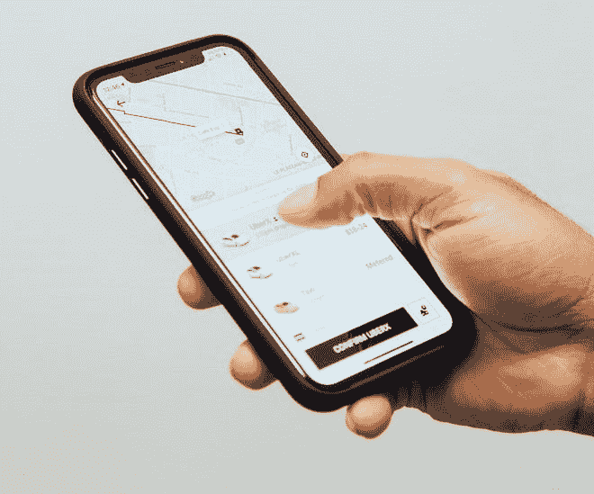
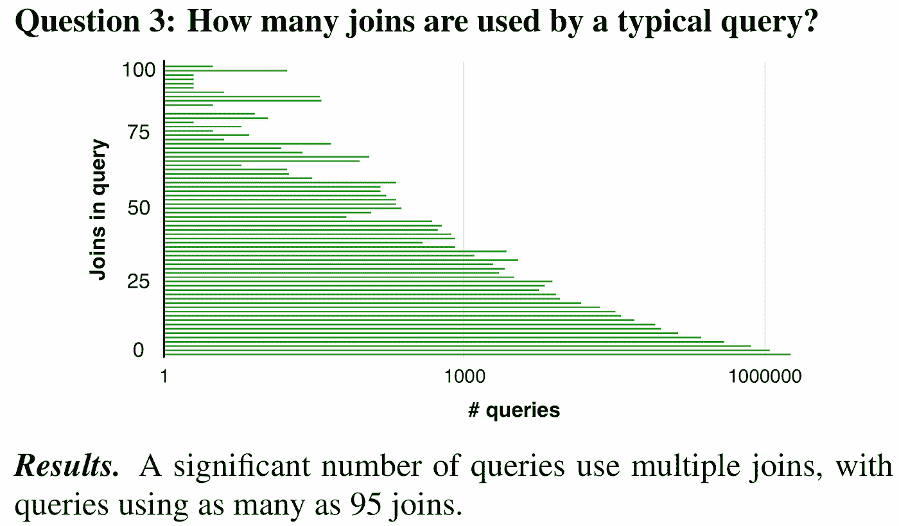
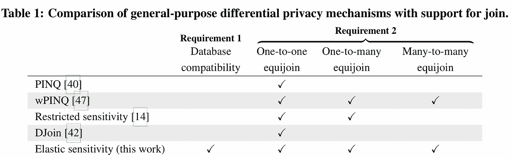
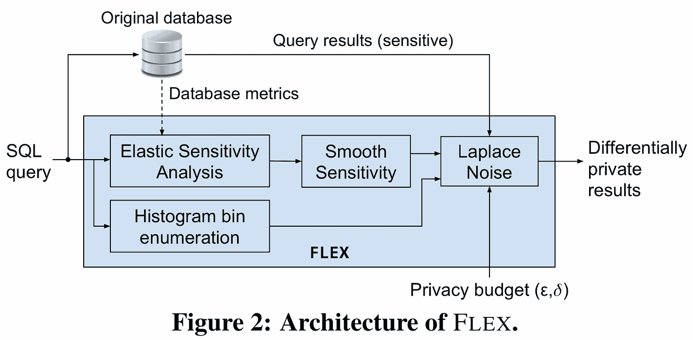
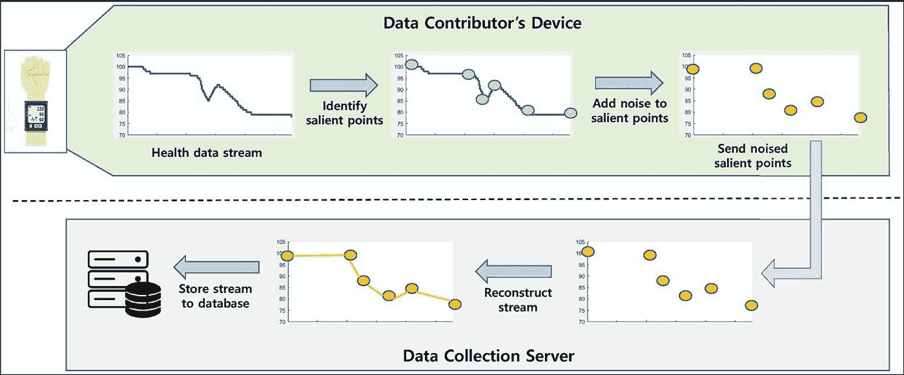
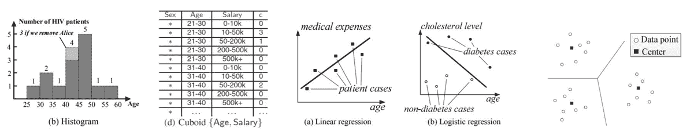
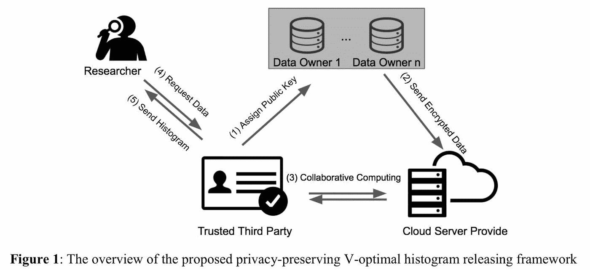
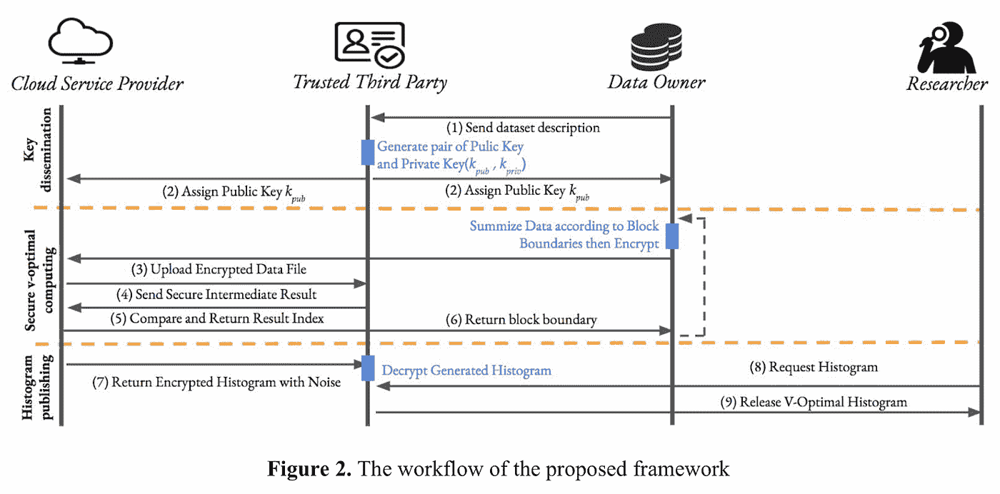
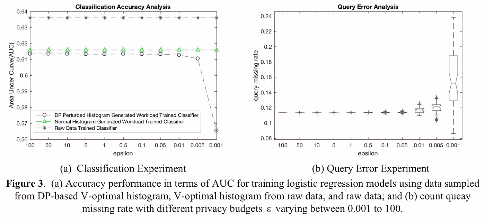
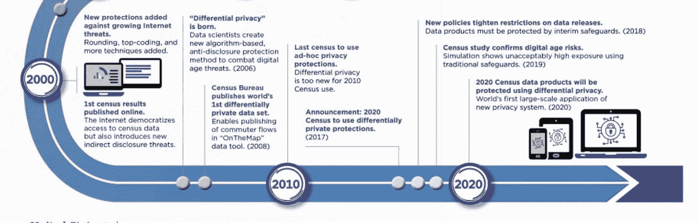

# 差异隐私的使用案例

> 原文：<https://towardsdatascience.com/use-cases-of-differential-privacy-8164518f9622?source=collection_archive---------38----------------------->

## 新兴技术的创新应用笔记

查尔斯·德鲁维奥在 [Unsplash](https://unsplash.com/) 上拍摄的照片

在这篇博文中，我们将简要介绍差分隐私(DP)的几个用例，从生物医学数据集分析到地理定位。

如果你有兴趣在深入其他用例之前学习差分隐私的基础知识，请查看我的博客文章 [*差分隐私的高级介绍*](/a-high-level-introduction-to-differential-privacy-edd20e6adc3b) 。

本文中的注释是为 SG OpenMined Explorers 研究小组创建的—有关与本文相关的幻灯片，请参见 [*差分隐私和联合学习的用例*](https://docs.google.com/presentation/d/15Mzb0mGKrBSDULTuha-TXHp-rdHppLi8MQGTuiwfKlU/edit?usp=sharing) 。

让我们从基因组学的差分隐私应用开始！

## 基因组学

机器学习对于基因组学应用具有重要的意义，例如对于精确医疗(即，针对患者的临床/遗传特征定制的治疗)和从不同人群收集的数据中检测细粒度的见解。

鉴于大量基因组数据集的快速创建为这些应用的统计分析和机器学习研究提供了燃料，这种应用的主要隐私风险之一是使用辅助信息的链接攻击。链接攻击涉及利用公共数据库中的信息与敏感数据集重叠的场景(通常是匿名/去标识的，以审查数据集)。我们稍后将讨论去标识化和 k 匿名化。

有许多说明链接攻击的例子，例如在去标识的医院记录和选民注册数据库上部署的链接攻击，其结果是成功地找到了马萨诸塞州州长的患者档案。

此外，考虑下面的引用:

> “已经证明，即使是粗略水平的信息，如次要等位基因频率(MAF)也可以揭示给定个体是否是研究队列的一部分，从而潜在地揭示个体的敏感临床表型。”

从基因歧视的角度来看，这是令人担忧的，因为个人可能会因为基因突变而受到不同的对待。

这个问题的现有解决方案包括:

*   去标识化，包括从数据中删除唯一的标识符，如姓名、电话号码，甚至车辆标识符。这种方法的缺点是您可能会丢失对分析有用的有意义的信息。
*   k-匿名化，涉及从发布的数据中删除信息，直到一个数据记录与至少(k1)个其他记录属于同一等价类。这种方法的缺点是它没有提供正式的隐私保证，容易受到链接攻击以及其他攻击。

与差异隐私相关的优势:

*   防范链接攻击
*   启用两种类型的设置:

1.  交互式设置，您可以在其中查询非公共数据库——答案被注入噪音或仅发布汇总统计数据

2.非交互式设置，其中公共数据被注入了噪声

这种应用与差压相关的缺点:

*   平衡隐私与效用(即考虑结果的准确性)。
*   DP 方法只允许预设查询，例如:“返回 p 值”、“返回前 K 个 SNP 的位置”

## 优步用户数据

在讨论用例之前，让我们快速定义不同类型的查询敏感度。

Sensitivity⁹:的定义

*   *查询的敏感度:*当数据库发生变化时，金额查询的结果也会发生变化。
*   *全局敏感度:*任意两个相邻数据库中查询结果的最大差异。
*   *本地敏感度:*真实数据库和它的任何邻居的查询结果之间的最大差异。局部敏感度通常比全局敏感度低得多，因为它是单个真实数据库的属性，而不是所有可能数据库的集合。考虑局部敏感性时，平滑函数非常重要。

许多差分隐私机制基于全局敏感性，并不推广到连接(因为它们可以乘以输入记录)。

使用局部灵敏度的技术通常提供更大的效用，但是在计算上是不可行的。

## 用例

对于这个用例，让我们考虑 Uber 的一个示例应用程序——确定 users⁹.的平均行程距离较小的城市可能有较少的旅行，因此个人旅行可能会影响分析，这有助于解决差异隐私问题。

根据上一节的注释，考虑局部敏感性是有价值的，因为基于全局敏感性的 DP 机制不能推广到连接。下面的图片来自论文“面向 SQL Queries"⁹的实用差分隐私”显示了大量查询利用连接，这激发了对利用本地敏感性的方法的需求。

**旁注:**我强烈推荐阅读论文《SQL Queries"⁹的实用差分隐私》(参考资料中的链接),以获得类似的查询分析和弹性敏感度的详细定义。

图片来自“面向 SQL Queries"⁹的实用差分隐私”，第 2 页

作者提出弹性敏感度作为一种平衡局部敏感度的方法。这种方法的目的是“使用关于真实数据库中连接键频率的预计算指标，对查询中每个连接的影响进行建模”。请参见下表，了解弹性敏感度与其他 DP 机制之间的比较——我们看到弹性敏感度支持不同类型的等价联接，即“以两种关系中某一列的值相等为条件的联接”

图片来自“面向 SQL Queries"⁹的实用差分隐私”，第 4 页

作者展示了 FLEX，一个利用弹性敏感度的系统，如下图所示。以下是白皮书中描述的优势:

*   提供(ε，δ)-差分隐私，不需要与数据库交互。
*   只需要查询的静态分析和查询结果的后处理。
*   扩展到大数据，同时产生最小的性能开销。

图片来自“面向 SQL Queries"⁹的实用差分隐私”，第 9 页

## 医疗+物联网:心率监测

现在让我们转向一个涉及可穿戴技术和物联网的医疗保健应用。这里的用例是通过智能手表等设备收集固定间隔测量的健康数据流(例如，收集营业时间内每分钟测量的心率)。

在相应论文中描述的系统管道中，使用本地差分隐私来扰乱数据，其中数据贡献者添加了噪声。按照下面显示的管道，用户的智能手表识别数据流中的显著点，然后用噪声干扰它们，随后将有噪声的数据发送到服务器进行重建和存储。

照片摘自“保护隐私的个人健康数据流汇总”，第 5 页

## 生物医学数据集分析

对于下一个用例，我们将考虑使用不同的隐私保证来处理生物医学应用的大数据。DAMSEN⁴是一种系统，它支持针对众多数据分析任务的不同隐私保证，并利用有效的查询优化引擎来实现高准确性和低隐私成本。

如下图所示，DAMSEN⁴为数据分析任务(如直方图、长方体、机器学习算法(如线性和逻辑回归，可能推广到神经网络)和聚类任务)提供了不同的隐私保护。

注意:在与查询相关的数据分析任务的上下文中，直方图并不代表数据分布的传统可视化。直方图是一种特殊类型的查询，涉及将数据点分类到桶中。您可以将此类查询视为类似于 Pandas 的 groupby()函数，但功能更多。长方体是一项涉及多个汇总数据集和表格的分析任务——详细示例请参见 paper⁴大学。

照片摘自“Damson 演示:大 Data"⁴分析的不同隐私”，第 2–4 页

**潜在项目想法:**确保可视化的不同隐私保证。我找到的关于这个主题的两个资源是[“个人数据的隐私感知可视化”](https://users.cs.duke.edu/~hexi88/privacy-aware_visualization/index.html)和[“可视化有差异的私人数据的挑战”](https://people.cs.umass.edu/~miklau/assets/pubs/viz/zhang16challenges.pdf)。

有趣的是，DAMSEN 采用了压缩机制，这有助于将动力定位所需的噪音量降至最低:

> CM 首先对数据进行编码，而不是在原始数据中添加噪声，就像在压缩感知中一样；然后，CM 将噪声添加到编码数据中，像在压缩感知中一样解码结果，并将其发布。因为转换后的数据是高度压缩的，它们需要更少的噪声来实现差分隐私。”⁵

减少噪音量很重要，因为我们希望确保被 DP 机制干扰的查询结果仍然尽可能准确。

## 分析电子健康记录

对于这个用例，我们考虑具有同态加密⁰.的 DP 扰动直方图论文《⁰》中提出的整个系统如下图所示:

照片摘自《通过混合方法传播保护隐私的生物医学数据》，⁰，第 3 页

我们可以看到，该系统涉及研究人员、可信第三方和云服务提供商等实体，每个实体在框架中都有自己特定的角色。

下图描述了提议框架的概念。我们可以看到用于密钥分发和安全直方图生成的同态加密组件所需的框架部分。根据该框架的 DP 部分，系统将加密的拉普拉斯噪声添加到直方图的每个箱的计数中，其中直方图计算的灵敏度为 1。

照片摘自《通过混合方法传播保护隐私的生物医学数据》，⁰，第 4 页

如前所述，直方图是一种查询，其结果可用于训练模型。

如下图所示，作者发现，虽然在原始数据集上训练的分类器实现了最高的性能，但作者在基于 DP 扰动 V 最优直方图采样的数据集上训练的分类器的性能类似于在基于无噪声 V 最优直方图采样的数据集上训练的分类器。当隐私预算减少到小于 0.1 时，这一发现出现例外，这导致大量噪声添加到数据中，AUC 下降，查询遗漏率增加。

照片摘自“通过混合方法保护隐私的生物医学数据传播”，⁰，第 7 页

因此，作者的一个结论是，隐私预算需要谨慎选择。他们还解释说，他们的安全模型可以防止所讨论的实体之间的信息交换出现各种泄漏——有关更多详细信息，请参见本文。

## 地理定位

微软的 PrivTree⁶系统利用不同的隐私来掩盖个人在地理位置数据库中的位置。该方法包括将地图分割成子区域，然后对每个子区域应用位置扰动，如下图所示。他们的系统，给定原始数据和一些其他参数(要使用的拉普拉斯噪声的尺度，用于决定是否应该发生节点分裂的阈值，等等)。)，可以实现差分私有算法，并为几乎任何种类的位置数据输出噪声数据。

照片取自“隐私树项目:模糊你的“在哪里”privacy"⁶外景

## 美国人口调查局

一个有趣的用例是美国人口普查局决定将差分隐私作为隐私 strategy⁸.的一部分根据下图，他们打算在 2020 年通过“新隐私 system"⁷的全球首次大规模应用”来采用差别隐私。

照片片段摘自“Protections"⁷人口普查隐私史”

## DP 研究挑战

让我们考虑一些我们在这篇博文中讨论的用例中常见的研究挑战(借用 DAMSEN⁵的话):

*   "我们怎样才能最小化增加的噪音/最大化分析结果的效用？"
*   “隐私预算是由数据所有者选择的参数，用于控制攻击者从发布的数据集中推断敏感信息的难度。每次分析都会消耗一些“隐私预算”。如何才能让预算尽可能长久？”
*   **向读者提问:**还有其他研究挑战需要考虑吗？

**差分隐私引用**

1.  [机器学习和基因组学:精准医疗与患者隐私](https://royalsocietypublishing.org/doi/full/10.1098/rsta.2017.0350?url_ver=Z39.88-2003&rfr_id=ori%3Arid%3Acrossref.org&rfr_dat=cr_pub++0pubmed&) [↩](https://blog.openmined.org/use-cases-of-differential-privacy/#a1)
2.  [旨在增强基因组数据共享隐私的新兴技术](https://genomebiology.biomedcentral.com/articles/10.1186/s13059-019-1741-0) [↩](https://blog.openmined.org/use-cases-of-differential-privacy/#a2)
3.  [隐私保护的个人健康数据流聚合](https://journals.plos.org/plosone/article?id=10.1371/journal.pone.0207639) [↩](https://blog.openmined.org/use-cases-of-differential-privacy/#a3)
4.  [damson 演示:用于大数据分析的差分隐私](http://differentialprivacy.weebly.com/uploads/9/8/6/2/9862052/pid2574139.pdf) [↩](https://blog.openmined.org/use-cases-of-differential-privacy/#a4)
5.  [压缩机制](https://differentialprivacy.weebly.com/compressive-mechanism.html)↩
6.  [项目隐私树:模糊你的位置隐私](https://www.microsoft.com/en-us/research/blog/project-privtree-blurring-location-privacy/) [↩](https://blog.openmined.org/use-cases-of-differential-privacy/#a6)
7.  [人口普查隐私保护的历史](https://www.census.gov/library/visualizations/2019/comm/history-privacy-protection.html) [↩](https://blog.openmined.org/use-cases-of-differential-privacy/#a7)
8.  [保护美国统计数据的机密性:在人口普查局采用现代的避免披露方法](https://www.census.gov/newsroom/blogs/research-matters/2018/08/protecting_the_confi.html) [↩](https://blog.openmined.org/use-cases-of-differential-privacy/#a8)
9.  [面向 SQL 查询的实用差分隐私](https://arxiv.org/pdf/1706.09479.pdf) [↩](https://blog.openmined.org/use-cases-of-differential-privacy/#a9)
10.  [通过混合方法进行隐私保护的生物医学数据传播](https://www.ncbi.nlm.nih.gov/pmc/articles/PMC6371369/pdf/2977168.pdf) [↩](https://blog.openmined.org/use-cases-of-differential-privacy/#a10)
11.  [在 SQL](http://www.silota.com/docs/recipes/sql-histogram-summary-frequency-distribution.html) [↩](https://blog.openmined.org/use-cases-of-differential-privacy/#a11) 中制作直方图频率分布
12.  [“个人数据的隐私感知可视化”](https://users.cs.duke.edu/~hexi88/privacy-aware_visualization/index.html) [↩](https://blog.openmined.org/use-cases-of-differential-privacy/#a12)
13.  [“可视化差异私有数据的挑战”](https://people.cs.umass.edu/~miklau/assets/pubs/viz/zhang16challenges.pdf) [↩](https://blog.openmined.org/use-cases-of-differential-privacy/#a13)

其他资源:[差分隐私:使用大数据的技术说明](https://link.springer.com/content/pdf/10.1186/s40537-018-0124-9.pdf)

**差分隐私代码库**

*   [优步 SQL 差分隐私](https://github.com/uber-archive/sql-differential-privacy)
*   [TensorFlow —差分隐私](https://blog.tensorflow.org/2019/03/introducing-tensorflow-privacy-learning.html?m=1)
*   [谷歌的 C++差分隐私库](https://github.com/google/differential-privacy)
*   [公开差分隐私](https://blog.openmined.org/making-algorithms-private/)

感谢您的阅读！敬请关注未来关于联合学习用例的博文！:)

*原载于 2020 年 4 月 30 日 https://blog.openmined.org***。**