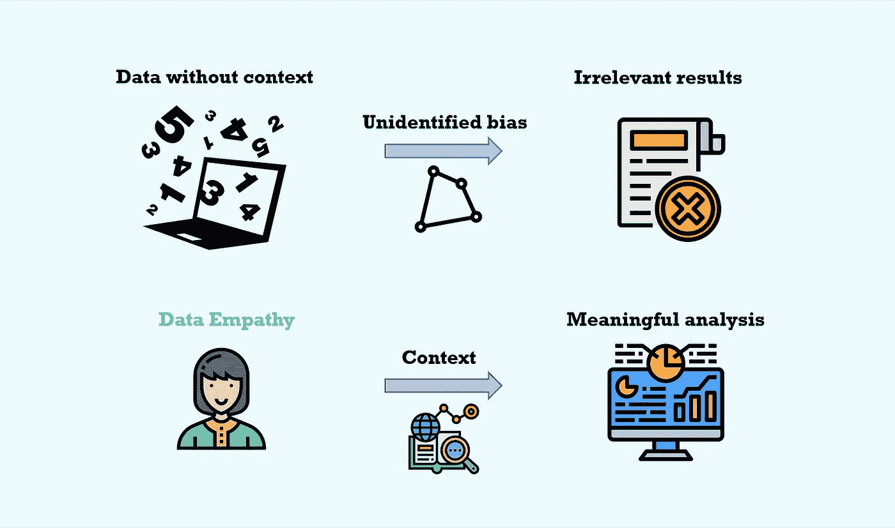

# 利用数据共情成为更好的数据科学家

> 原文：<https://towardsdatascience.com/use-data-empathy-to-become-a-better-data-scientist-295b0abaecd8?source=collection_archive---------18----------------------->

数据共情如何帮助您获得有意义的见解，并让您从优秀的数据科学家转变为伟大的数据科学家。来源:茱莉亚·尼库尔斯基，图标来自[弗里皮克](https://www.flaticon.com/de/autoren/freepik)、 [itim2101](https://www.flaticon.com/de/autoren/itim2101) ，以及[www.flaticon.com](https://www.flaticon.com)的[桉树](https://www.flaticon.com/de/autoren/eucalyp)。

## [办公时间](https://towardsdatascience.com/tagged/office-hours)

## 数据的上下文关系到数据项目的成功

英斯顿·丘吉尔曾经说过:“我只相信我篡改过的统计数据”。虽然这可能是一个极端的说法，但总体思路是正确的。数据可以有意或无意地以某种方式呈现，以支持不反映现实或潜在数据的论点。

[CRISP-DM 模型](https://en.wikipedia.org/wiki/Cross-industry_standard_process_for_data_mining)的第二步是[数据理解](https://www.dummies.com/programming/big-data/phase-2-of-the-crisp-dm-process-model-data-understanding/)。这一步需要收集、描述和探索数据，以及识别数据质量问题。这种理解数据的大致轮廓是有用的。但是它没有提到一个重要的维度:数据共情。

对数据科学家工作的描述通常集中在硬技能和技术领域。这符合数据科学的[维恩图。数据科学家受其领域专业知识的指导。在统计和机器学习模型以及编程工具的帮助下，他们从数据中提取知识。但是经常被忽视的**软技能——例如**](https://www.kdnuggets.com/2016/10/battle-data-science-venn-diagrams.html) [**沟通技能**](https://www.dataquest.io/blog/data-science-communication-presentation/)**[**怀疑态度**](/soft-skills-for-data-science-fee73ae4821a) **，尤其是** [**同理心**](https://www.computerweekly.com/blog/Data-Matters/Why-empathy-is-key-for-Data-Science-initiatives)**——在实现成功的数据科学项目和成为更优秀的数据科学家中发挥着至关重要的作用。****

****

**由 [Diego PH](https://unsplash.com/@jdiegoph?utm_source=unsplash&utm_medium=referral&utm_content=creditCopyText) 在 [Unsplash](https://unsplash.com/s/photos/pastel?utm_source=unsplash&utm_medium=referral&utm_content=creditCopyText) 上拍摄的照片。**

# **定义数据共情**

**[术语*移情*](https://www.merriam-webster.com/dictionary/empathy) 是指**

> **“理解、意识到、敏感地感受和体验他人过去或现在的感情、思想和经验的行为，而没有以客观明确的方式充分交流这些感情、思想和经验。”**

**移情和数据科学之间的逻辑联系是[最终用户或利益相关者](/the-most-important-skill-a-data-scientist-should-possess-d0700de3e5fa)。通过同理心了解他们的需求和愿望将指导您的数据分析。这将使您能够创建更好、更有用的数据科学产品。**然而，数据共情重在理解数据。它考虑了人类在数据收集过程中引入的主观性，并确定了偏差。****

****

**乔希·卡拉布雷斯在 [Unsplash](https://unsplash.com?utm_source=medium&utm_medium=referral) 上的照片。**

**根据 [Faghmous 和 Kumar (2014)](https://www.liebertpub.com/doi/full/10.1089/big.2014.0026) ，**数据移情意味着理解一个数据集的故事**。数据是如何收集的，为什么要收集？根据数据的目的和收集过程，可以确定哪些偏差？元数据可以部分回答这些问题，元数据是与数据相关的结构化描述性信息。但是正如[brnni Mann 和 Wintzer (2018)](https://onlinelibrary.wiley.com/doi/abs/10.1002/wcc.559?casa_token=JiNyRefa6fkAAAAA%3AALXJFhsPAqLkEJr9HvK7JVx1Dt6DN6CZI1C3c4roaPst5OH-4ZLjrg-j_KM0zO7KolN3B9Ye77vDpIE) 指出的，数据共情走得更远。它描述了一个反思、解释和定性的过程:**

*   ****反思:**我们应该思考任何可能影响数据收集过程的关于世界的无意识信念。这涉及到[“人工智能中的偏见”——叙述](https://www.technologyreview.com/2019/02/04/137602/this-is-how-ai-bias-really-happensand-why-its-so-hard-to-fix/)。一个常见的例子是主要包含白人面孔的图像分类器数据集。该数据集不代表群体的多样性。任何使用这些数据构建的模型都将表现不佳。**
*   **解释性:我们需要考虑数据的背景。谁获取了数据，为什么，何时，如何获取的？以与疾病症状相关的数据为例。根据至少三种不同的情况，报告的症状可能会有所不同。(1)你说出你能想到的所有症状，而不需要医生提出任何引导性问题(潜在的[回忆偏差](https://www.ncbi.nlm.nih.gov/pmc/articles/PMC4862344/#:~:text=of%20confirmation%20bias.-,Self%2Dreporting%20bias,questions%20without%20his%2Fher%20interference.&text=Bias%20can%20arise%20from%20social,sampling%20approach%2C%20or%20selective%20recall.))。(2)医生问你是否嗅觉丧失或喉咙痛(潜在的[确认偏差](https://en.wikipedia.org/wiki/Confirmation_bias))。(3)医生在没有问你任何问题的情况下对你进行检查并报告症状(潜在的[观察偏差](https://en.wikipedia.org/wiki/Observer_bias))。理解这些细微差别并揭示数据集中的这些偏差对于进一步的分析和见解的形成至关重要。**
*   ****定性:**我们必须解决可能影响数据质量和收集流程的社会规范和价值观。尤其是自我报告的数据会受到社会规范的影响。[社会期望偏差](https://en.wikipedia.org/wiki/Social_desirability_bias)描述的是个体回答问题的方式符合社会规范和期望。**

**根据 [Tanweer 等人(2016)](https://cscw2016hcds.files.wordpress.com/2015/10/tanweer_hcds2016.pdf) 的说法，理解“……围绕数据的价值、意图和期望”是数据移情的关键。**

****

**[Niti K.](https://unsplash.com/@inhalexhale?utm_source=medium&utm_medium=referral) 在 [Unsplash](https://unsplash.com?utm_source=medium&utm_medium=referral) 上拍照。**

# **数据共情的重要性**

**数据共情之所以重要，有几个原因。**

*   **首先，如果不应用数据移情，数据中的偏差可能仍然未被发现。这样会导致模型有偏差，结果无用。这在 Kaggle 比赛中可能无关紧要，因为你的主要目标是达到高精度。但是现实世界的项目有现实世界的含义。如果你在[的招聘决策中使用有偏见的数据和模型，后果将是可怕的。](https://www.technologyreview.com/2019/02/04/137602/this-is-how-ai-bias-really-happensand-why-its-so-hard-to-fix/)**
*   ****第二，数据集的目的和背景可以指导你的数据分析过程。**发现的偏差将决定您数据探索和准备步骤的重点。它会影响你对特性选择和工程的决定。甚至可以选择某些机器学习模型而不是其他模型来更好地控制偏差。**
*   ****第三，了解数据的背景可以带来新的数据收集流程和数据科学项目。**一旦您确定了数据收集过程中的问题，请思考如何创建更好的数据集。你如何解释固有的偏见？假设你在你公司的历史招聘数据中发现了性别偏见。贵公司使用的其他数据是否存在类似的偏见或背景？你如何改善数据？利用这个机会来发现和描述这种偏见，以及如何在你的下一个项目中抵消它。**

****

**照片由[昆廷·拉加奇](https://unsplash.com/@quentinlagache?utm_source=unsplash&utm_medium=referral&utm_content=creditCopyText)在 [Unsplash](https://unsplash.com/s/photos/pastel?utm_source=unsplash&utm_medium=referral&utm_content=creditCopyText) 上拍摄。**

# **这对您的数据科学成功意味着什么**

**不要低估 CRISP-DM 模型第 2 步的重要性。如果你希望你的最终模型有用，数据理解，包括收集数据的步骤和理解周围的环境，是关键。虽然技术技能让你成为一名优秀的数据科学家，但考虑数据的社会维度会让你成为一名优秀的数据科学家。**因此，要成为更好的数据科学家，请在您的项目中使用数据移情。不要只看数据集的数字，而要看上下文。****

# **结论**

**数据共情是理解数据的背景、价值和意图的过程。在您的数据科学流程中使用数据移情可以让您识别偏见。它有助于指导您的数据分析过程，并为您指出可以在下一个项目中回答的新问题。虽然我们喜欢相信数据在客观上是对的或错的，或真的或假的，但现实却更加微妙。在数据收集、数据探索和数据解释步骤中引入了人的主观性。作为一名数据科学家，你的工作就是承认这一点，并在你的分析中说明这一点。只有这样，你的模型和结果才是重要的。只有这样，你才能成为更好的数据科学家。**

**你想在媒体上阅读更多高质量的故事吗？考虑注册一个支持我和其他媒体作者的会员。**

** [## 通过我的推荐链接加入 Medium-Julia Nikulski

### 作为一个媒体会员，你的会员费的一部分会给你阅读的作家，你可以完全接触到每一个故事…

medium.com](https://medium.com/@julia.nikulski/membership)** 

**如果你想马上应用数据移情，但你目前没有项目想法，请查看我的文章**如何开发新的独特的数据科学项目想法**。**

** [## 开发独特数据科学项目创意的 5 个步骤

### 帮助您识别值得一试的新颖独特的数据项目的指南

towardsdatascience.com](/5-steps-to-develop-unique-data-science-project-ideas-6c2b3a0014b)**