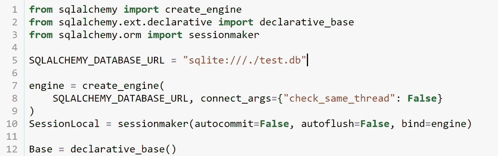
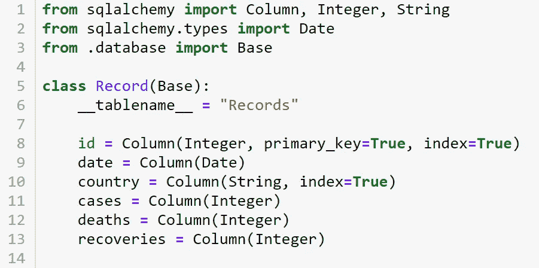
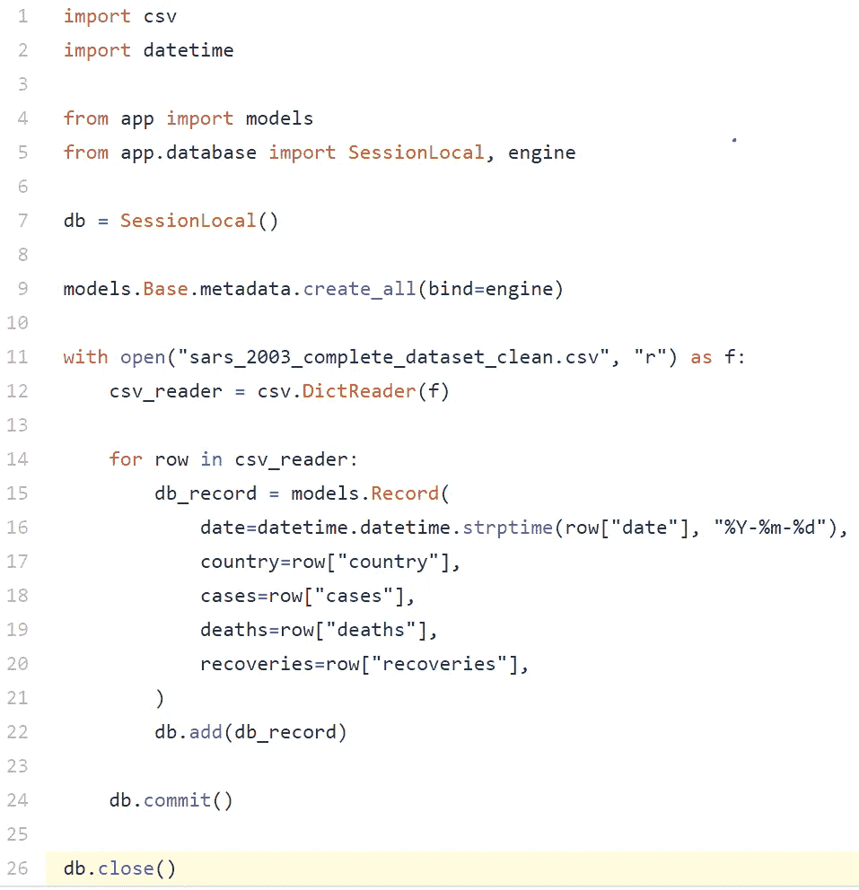
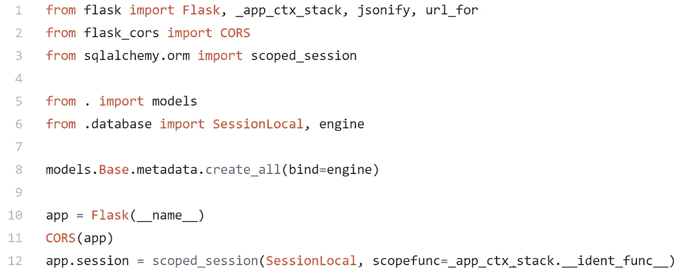

# 用 Flask 和 SQLalchemy，不要用 Flask-SQLAlchemy！

> 原文：<https://towardsdatascience.com/use-flask-and-sqlalchemy-not-flask-sqlalchemy-5a64fafe22a4?source=collection_archive---------0----------------------->

## 避免 Flask 应用程序中的 Flask-SQLAlchemy

作者: [Edward Krueger](https://www.linkedin.com/in/edkrueger/) 数据科学家兼讲师和 [Douglas Franklin](https://www.linkedin.com/in/douglas-franklin-1a3a2aa3/) 助教兼技术作家。

*在这篇文章中，我们将介绍如何使用带有 SQLAlchemy 的烧瓶，以及避免烧瓶 SQLAlchemy 的一些原因。此外，我们将展示拥有独立于应用程序的 SQLAlchemy 模型和数据库连接的好处。*


Tobias Fischer 在 [Unsplash](https://unsplash.com/s/photos/database?utm_source=unsplash&utm_medium=referral&utm_content=creditCopyText) 上拍摄的照片

## SQLAlchemy 是什么？

SQLAlchemy 是一个 Python SQL 工具包和对象关系映射器(ORM ),允许应用程序开发人员使用 SQL 进行平滑和容错的事务数据库操作。ORM 将 Python 类转换成关系数据库的表，并自动将 Pythonic SQLAlchemy 表达式语言转换成 SQL 语句。这种转换允许开发人员使用 Python 语法编写 SQL 查询。SQLAlchemy 还抽象数据库连接，并自动提供连接维护。这些特性使 SQLAlchemy 成为装载和查询数据库的绝佳包。

## **什么是烧瓶？**

Flask 是一个微框架，允许你用 Python 构建 web 应用。对于初学者来说，Flask 很容易上手，因为启动和运行一个简单的应用程序几乎没有样板代码。

例如，下面是一个有效的“你好，世界！”Flask web 应用程序:

```
**from flask import Flask****app = Flask(__name__)****@app.route('/')
def hello_world():
    return "Hello, World!"****if __name__ == '__main__':
    app.run()**
```

## **什么是 Flask-SQLAlchemy？**

Flask-SQLAlchemy 是 Flask 的扩展，旨在通过提供缺省值和助手来完成常见任务，从而简化 SQLAlchemy 与 Flask 的使用。最受欢迎的助手之一是处理整个应用程序的数据库连接。但是，使用 base SQLAlchemy 可以确保数据库连接会话在整个应用程序中可用，而不需要 Flask-SQLAlchemy。

Flask-SQLAlchemy 的目的是处理连接的返回，以防止工作线程出现问题。当应用程序用户从一条路线切换到另一条路线时，就会出现这些问题。以下是 Flask 应用程序中出现线程问题时出现的常见错误。

```
**sqlite3.ProgrammingError: SQLite objects created in a thread can only be used in that same thread. The object was created in thread id 12345 and this is thread id 54321.**
```

这通常是由于会话或数据库连接对于应用程序的一部分不可用。这个错误实际上会破坏您的应用程序，必须解决它才能继续开发。

## 烧瓶-SQLAlchemy 弱点

我们选择避免 Flask-SQLALchemy 默认行为来防止这种错误，而是使用 SQLALchemy 特性来处理这些问题。这是因为 Flask-SQLALchemy 与 SQLALchemy 相比有劣势。

其中之一是 Flask-SQLAlchemy 有自己 API。这增加了复杂性，因为 ORM 查询和模型的不同方法与 SQLAlchemy API 是分开的。

另一个缺点是 Flask-SQLAlchemy 使得在 Flask 上下文之外使用数据库变得困难。这是因为，使用 Flask-SQLAlchemy，数据库连接、模型和 app 都位于 app.py 文件中。由于模型在应用程序文件中，我们与应用程序之外的数据库进行交互的能力有限。这使得在应用程序之外加载数据变得困难。此外，这使得很难在 Flask 上下文之外检索数据。

如果使用正确，Flask 和 SQLAlchemy 可以很好地配合使用。所以，你不用把 Flask 和 SQLAlchemy 杂交成 Flask-SQLalchemy！

# 使用 SQLAlchemy，而不是 Flask-SQLAlchemy！

## 一次定义数据库和模型

理想情况下，您应该只需要定义一次数据库模型！使用单独的 database.py 和 models.py 文件，我们可以一次性为其表建立数据库连接和类，然后在需要时调用它们。使用 Flask-SQLAlchemy 进行组件分离要困难得多，因为您必须使用应用程序本身来创建数据库。

下面是一个使用 SQLAlchemy 定义数据库连接的文件。



示例 database.py 文件

注意，我们将上面 database.py 文件中的‘Base’类导入到下面的 models.py 文件中，以使用`declarative_base()`。



示例 **models.py** 文件

该文件为数据库中的表“Records”创建模型或模式。

使用 SQLAlcehmy 的`declarative_base()`允许您为应用程序使用的每个表编写一个模型。然后，在 Python 中，在应用程序之外和数据库中使用该模型。

## 在应用程序外部加载数据

拥有这些独立的 Python 文件很好，因为您可以使用相同的模型在应用程序之外查询或加载数据。此外，每个模型和数据库连接都有一个版本，这简化了开发。

这些模型和数据库连接可用于在数据管道、报告生成或任何其他需要的地方引用相同的模型或数据库。

单单是加载脚本就是使用 SQLAlchemy 的一个很好的理由。该功能允许使用单独的 Python 文件加载数据库，而不是使用应用程序加载数据。

下面是一个示例 Python 文件，它从 CSV 读取数据，并将数据插入到数据库中。



load.py 脚本示例

请注意，我们导入了模型、我们的自定义会话 SessionLocal 和我们在其他 Python 文件中定义的引擎。

这个单独的 load.py 文件允许我们在不运行应用程序的情况下将数据插入数据库。

## 声明性库和元数据

`**declarative_base()**`基类包含一个`**MetaData**`对象，其中收集了新定义的`**Table**`对象。当我们调用行`**models.Base.metadata.create_all()**`来创建我们所有的表时，这个元数据对象被访问。

## 作用域会话和本地会话:处理线程问题

SQLAlchemy 包括一个助手对象，帮助建立用户定义的`**Session**`范围。通过`**scoped_session**`函数，SQLAlchemy 可以处理工作线程问题。

sessionmaker 是一个工厂，用于通过从引擎的连接池中请求连接并将连接附加到新的会话对象来初始化新的会话对象。

初始化新的会话对象也称为“检出”连接。数据库存储这些连接/过程的列表。因此，当您开始一个新的会话时，您也在数据库中启动了一个新的进程。

scoped_session 是所有这些创建的会话对象的注册表，其中注册表的键/标识是某种形式的线程安全 id。

我们在上面的 database.py 文件中定义了 SessionLocal，方法是调用会话工厂 sessionmaker，并向其传递一些参数。


来自 database.py 的会话本地

` scopefunc '是传递给 scoped_session 的可选参数，用作标识 getter 函数，返回用于查找或注册新会话的密钥。正在添加` _app_ctx_stack。__ident_func__ `是两个函数之一:

1.  如果安装了 greenlet，它会使用`getcurrent` ( `from greenlet import getcurrent`)
2.  否则，它使用`get_ident` ( `from threading import get_ident`)，返回线程 id。

默认情况下 scopefunc 是`get_ident`。因此，对于简单的应用程序，您只需:

```
db_session = scoped_session(sessionmaker(autocommit=False, autoflush=False, bind=engine))
```

这个新的 **SessionLocal** 允许应用程序的不同部分调用一个全局`scoped_session`，这样所有的应用程序路由都可以共享同一个会话，而不用显式地将会话传递给路由。我们在注册表中建立的 SessionLocal 将一直保留，直到我们通过调用`scoped_session.remove()`明确地告诉我们的注册表处理它:

这里我们可以看到对 scoped_session 的调用，其中我们的自定义会话 SessionLocal 作为参数传递。



app.py 文件通过调用 scoped_session 来定义 app.session

此外，作用域会话使我们能够访问 query_property。因此，如果您的样式由 flask_sqlalchemy 使用，您可以将它与 sqlalchemy 一起使用:

```
Base = declarative_base()
Base.query = db_session.query_property()
```

## 结束交易

方法`db_session.close()`只结束本地会话对象的事务，但不结束与数据库的连接，也不自动将连接返回到池。

通过添加 db_session.remove()，我们可以确保连接被正确关闭。

db_session.remove()方法首先运行`app.db_session.close()`，然后将连接返回到连接池。因此，我们在本地和远程数据库终止了该进程。如果数据库没有关闭这些连接，则存在可以达到的最大连接数。数据库最终会终止像过时连接这样的空闲进程；然而，这可能需要几个小时才会发生。SQLAlchemy 有一些池选项来防止这种情况，但是最好在不再需要连接时删除它们！

## 结论

正如我们所看到的，SQLAlchmy 有工具来处理开发人员求助于 Flask-SQLAlchemy 来避免的错误。通过正确实现 sessionmaker 和 scoped_session，您的 Flask 应用程序应该不会有任何线程问题，这些问题会在通过您的路由连接到数据库时出现。

因此，在处理线程和数据库会话时，使用 Flask 和 SQLAlchemy，而不是 Flask-SQLAlchemy！

*特别感谢 Seth Kaufman 帮助编写我们的 Flask 应用程序，请务必查看* [*GitHub*](https://github.com/edkrueger/sars-flask) *上的资源库。*