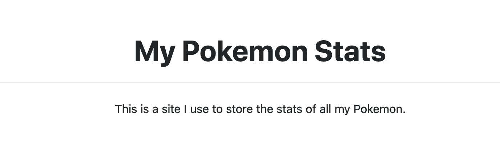
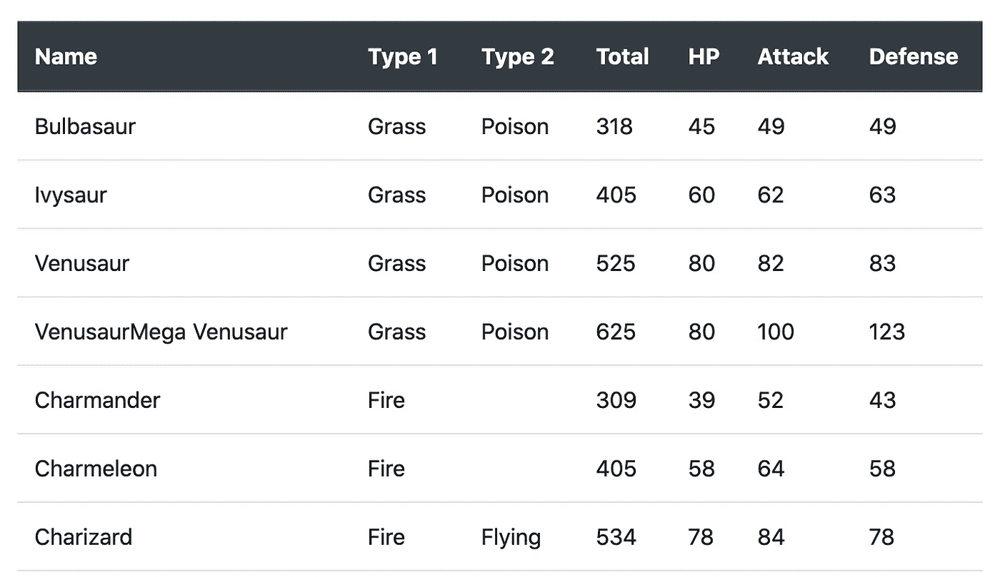
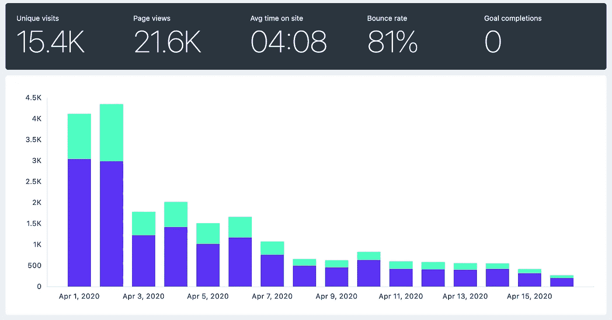

# 使用谷歌工作表，S3 和 Python 快速建立一个网站

> 原文：<https://towardsdatascience.com/use-google-sheets-s3-and-python-to-build-a-website-quickly-8e4501dab02e?source=collection_archive---------8----------------------->

## 非 web 开发人员生存指南


在 [Unsplash](https://unsplash.com/) 上 [barnimages](https://unsplash.com/@barnimages) 拍摄的照片

在我们开始之前，先介绍一些背景知识:

几天前，我在寻找因新冠肺炎而免费或打折的课程。我想其他人可能也在这样做，所以我决定收集一些资源并在网上发布。

我开始用 Google Sheet 编辑课程，并计划在获得足够的资源后分享它。然而，有件事困扰着我。在手机上打开页面很糟糕，大多数人用手机浏览互联网。我以为我能做得更好。

问题是我在网站开发方面没有什么经验。此外，我不想花费超过几个小时来开发和发布网站。所以我决定快速建造一些东西。

以下是我为快速建立网站而设定的要求，以及我为满足这些要求而采取的方法:

**要求**

1.  该网站应该加载速度快，在手机上看起来很好(或者至少比谷歌表更好)
2.  我需要能够快速、轻松地添加或删除资源。请记住，我可能希望在未来从客户端添加更多的交互性。
3.  尽可能多地使用 Python(尽可能少地使用 HTML/CSS/JS)
4.  我应该只需要几个小时就可以开发和发布
5.  维护成本应该*非常非常*接近零😛

**接近**

1.  用于引导程序(仅 CSS，不包括 JS 组件)
2.  使用 Google Sheets 管理内容。我使用 Google Sheets API 以编程方式将内容放入站点。如果需要，可以很容易地从 Google Sheet 创建一个 web API。
3.  使用 Jinja2 从基本的 HTML/CSS 模板生成网站
4.  在 AWS S3 bucket + Cloudfront 上托管站点(用于 SSL 证书)。用 53 号公路买下了域名
5.  我对 AWS 服务的使用属于免费层。我不认为这种情况会很快改变。到目前为止，我只在网站上投资了 15€

几个小时后，我发射了[stayhomeandlearn.org](https://stayhomeandlearn.org/)。

本文的其余部分是关于如何使用 Google Sheets、AWS 和 Python 构建静态站点的教程。

对于本教程，**我们将建立一个从 Google Sheets 读取数据的脚本，使用预定义的模板生成一个静态站点，并将其部署到 S3 存储桶。**这篇文章是为那些对 web 开发知之甚少，但想快速上手的程序员准备的。

教程中有五个部分:需求，回顾代码和 Jinja 模板，使用 Google Sheets API，构建和部署你的站点。

# 要求

这些你需要自己设置或检查。为此，我添加了一些链接。

*   [Python > = 3.7](https://www.python.org/downloads/)
*   [谷歌账户](https://myaccount.google.com/)
*   [谷歌云平台(GCP)账户](https://cloud.google.com/)
*   [亚马逊 AWS 账户](https://aws.amazon.com/free/)
*   [AWS CLI](https://docs.aws.amazon.com/cli/latest/userguide/install-cliv2.html) (如果你有 Mac 的话可以[使用 brew](https://formulae.brew.sh/formula/awscli))
*   [在 AWS CLI 中配置的配置文件](https://docs.aws.amazon.com/cli/latest/userguide/cli-chap-configure.html#cli-quick-configuration)
*   一点 [HTML](https://developer.mozilla.org/en-US/docs/Learn/HTML/Introduction_to_HTML/Getting_started) 和 [CSS](https://developer.mozilla.org/en-US/docs/Learn/CSS/First_steps/Getting_started)

# 代码和 Jinja 模板

首先，创建一个名为`my_pokemon_stats`的目录，并从那里打开一个终端。然后，创建一个虚拟环境并安装所需的软件包，如下所示:

接下来，在那里下载并保存这两个文件:[template.html](https://gist.github.com/dylanjcastillo/61018bf4474d388e2936a84368d40d07)和 [site_builder.py](https://gist.github.com/dylanjcastillo/fbbdcb83694c2334714866340442ce18) 。这些是生成站点的构建块。

`template.html`是我们将用于构建网站的 Jinja 模板。这是一个类似 HTML 的文件，您可以在其中添加将用 Python 处理的逻辑，并生成最终的站点。该文件如下所示:

```
<!doctype html>
<html lang="en">
<head>
    <meta charset="UTF-8">
    <meta name="viewport"
          content="width=device-width, user-scalable=no, initial-scale=1.0, maximum-scale=1.0, minimum-scale=1.0">
    <meta http-equiv="X-UA-Compatible" content="ie=edge">
    <link href="[https://stackpath.bootstrapcdn.com/bootstrap/4.4.1/css/bootstrap.min.css](https://stackpath.bootstrapcdn.com/bootstrap/4.4.1/css/bootstrap.min.css)" rel="stylesheet"
          integrity="sha384-Vkoo8x4CGsO3+Hhxv8T/Q5PaXtkKtu6ug5TOeNV6gBiFeWPGFN9MuhOf23Q9Ifjh" crossorigin="anonymous">
    <title>My Pokemon Stats</title>
</head>
<body><header id="header">
    <div class="container text-center">
        <h1 class="pt-5 pb-1 font-weight-bold">
            My Pokemon Stats
        </h1>
        <hr>
        <p class="pt-2">
            This is a site I use to store the stats of all my Pokemon.
        </p>
    </div>
</header><section id="pokemon_table">
    <div class="container py-4">
        <div class="table-responsive">
            <table class="table table-hover">
                <thead class="thead-dark">
                <tr>
                    <th scope="col">Name</th>
                    <th scope="col">Type 1</th>
                    <th scope="col">Type 2</th>
                    <th scope="col">Total</th>
                    <th scope="col">HP</th>
                    <th scope="col">Attack</th>
                    <th scope="col">Defense</th>
                </tr>
                </thead>
                <tbody>
                
                <tr>
                    <td>{{ row["Name"] }}</td>
                    <td>{{ row["Type 1"] }}</td>
                    <td>{{ row["Type 2"] }}</td>
                    <td>{{ row["Total"] }}</td>
                    <td>{{ row["HP"] }}</td>
                    <td>{{ row["Attack"] }}</td>
                    <td>{{ row["Defense"] }}</td>
                </tr>
                
                </tbody>
            </table>
        </div>
    </div>
</section>
</body>
</html>
```

让我们来分解一下:

*   您可以放心地忽略`<head>`标签中的大部分内容。这是你将在大多数页面中看到的标准 HTML5 代码。然而，我们将仔细研究两个有趣的标签:`<link>`和`<title>`。
*   在这种情况下，`<link>`标签用于导入[引导](https://getbootstrap.com/)组件库。我们将使用它来为页面的不同部分定义简单的样式，并毫不费力地使它看起来很好。`<title>`定义页面的标题(你在浏览器标签中看到的)，它对 SEO 和社交媒体分享很有用。
*   接下来，在`<body>`标签中有一个`<header>`部分。这是我们定义将出现在页面上的文本的地方。它将看起来像下面的图像。我使用了 Bootstrap 的标准样式来居中文本，并添加了一些填充。



*   最后，我们有了`<section id="pokemon_table">`。`<div>`和`<table>`标签为构建表格提供了一些基本的样式。接下来，我们在`<thead>`标签中定义表格的标题。标签里面是 Jinja 施展魔法的地方
*   ``是一个循环，遍历口袋妖怪的每一行数据。在每个`<td>{{ row["..."] }}</td>`中，我们从字段中获取每一行的信息(例如名称、类型 1、类型 2)。这会生成如下所示的内容:



接下来，我们有了`site_builder.py`文件。这个脚本从 Google Sheets 下载口袋妖怪的数据，处理数据和`template.html`文件，然后将结果文件上传到 S3 桶。

```
import csv

import boto3
import gspread
import jinja2
from oauth2client.service_account import ServiceAccountCredentials

AWS_PROFILE = "INSERT-AWS-PROFILE-HERE"
BUCKET = "INSERT-BUCKET-NAME-HERE"
WORKBOOK = "INSERT-WORKBOOK-NAME-HERE"

def download_data():
    """Download data using the Google Sheets API"""
    scope = [
        "https://spreadsheets.google.com/feeds",
        "https://www.googleapis.com/auth/drive",
    ]
    credentials = ServiceAccountCredentials.from_json_keyfile_name(
        "credentials.json", scope
    )
    client = gspread.authorize(credentials)

    worksheet = client.open(WORKBOOK).get_worksheet(0)
    sheet_values = worksheet.get_all_values()

    print(f"Downloading: {worksheet.title}")
    with open("my_pokemon_stats.csv", "w") as f:
        writer = csv.writer(f)
        writer.writerows(sheet_values)

def generate_site():
    """Generate site in local directory"""
    print("Process data and build site")

    template_loader = jinja2.FileSystemLoader(searchpath="./")
    template_env = jinja2.Environment(loader=template_loader)
    template = template_env.get_template("template.html")

    with open("my_pokemon_stats.csv") as csv_file:
        csv_reader = csv.DictReader(csv_file)
        data = [row for row in csv_reader]

    output = template.render(data=data)

    with open("index.html", "w") as f:
        f.write(output)

def deploy_site():
    """Deploy site S3 bucket"""
    print("Upload data to S3")
    session = boto3.Session(profile_name=AWS_PROFILE)
    s3 = session.resource("s3")
    s3.Bucket(BUCKET).upload_file(
        Filename="index.html", Key="index.html", ExtraArgs={"ContentType": "text/html"}
    )

if __name__ == "__main__":
    download_data()
    generate_site()
    deploy_site()
```

代码由三个功能构成:`download_sheets`、`generate_site`和`deploy_site`。我们将在接下来的小节中详细介绍如何访问 AWS 和 Google Sheets API。

# 使用 Google Sheets API

按照以下步骤使用 Google Sheets API 下载口袋妖怪的数据:

1.  在谷歌工作表中创建一个工作簿(你可以复制我的:[我的口袋妖怪统计](https://docs.google.com/spreadsheets/d/1Q6Gbe1bNoMo12hjtWwEFEaQzxyRKOuYsCfZ9AHLmhy0/edit?usp=sharing))
2.  进入[谷歌 API 控制台](https://console.developers.google.com/)
3.  创建一个名为 *MyPokemonStats* 的新项目。
4.  点击*启用 API 和服务*。搜索并启用 Google Sheets API。
5.  回到[Google API 控制台](https://console.developers.google.com/)并再次点击*启用 API 和服务*。现在搜索并启用 Google Drive API。
6.  点击*创建凭证。* 下 4 题选择:**Google Drive API*， *Web 服务器(如 node.js，Tomcat)* ，*应用数据，*和*不，我不使用它们。**
7.  *点击*我需要什么凭证？*为服务账户选择一个名称(例如 get-data)授予其一个*项目*角色*编辑*。为*键类型*选择 *JSON* 选项*
8.  *将会打开一个对话框。保存 JSON 文件，复制到`my_pokemon_stats`目录，重命名为`credentials.json`。*
9.  *打开`credentials.json`文件。找到一个名为`client_email`的键，复制它的值(例如 get-data@iam....).在 Google Sheets 中返回到您的工作簿，点击右上角的*共享*按钮，将客户电子邮件粘贴到*人员*字段，赋予其编辑权限。点击发送。*
10.  *转到`site_builder.py`脚本，将`WORKBOOK`变量设置为您在第一步中给工作簿起的名字。*

# *设置 S3 时段和与 AWS 相关的配置*

*现在，让我们创建 S3 桶，并配置我们的代码以编程方式访问 AWS:*

1.  *前往[亚马逊 S3 控制台](https://console.aws.amazon.com/s3)*
2.  *创建 S3 存储桶*
3.  *一旦进入桶中，点击*属性*，然后点击*静态网站托管**
4.  *选择选项*使用此桶托管网站**
5.  *在*索引文件*和*错误文件*下放置`index.html`*
6.  *保存来自*端点*的 URL。您将使用该 URL 连接到您的站点。*
7.  *转到*权限*并点击*编辑**
8.  *清除*阻止所有公共访问*，选择*保存*，并确认。当您更改此项时，互联网上的任何人都可以访问此存储桶的内容。当你发布一个网站时，这就是你想要的，但是，不要把任何私人的东西放在那里！*
9.  *现在转到 *Bucket Policy* ，替换下面策略中的 Bucket 名称，粘贴到那里，点击 Save。*

```
*{
  "Version":"2012-10-17",
  "Statement":[{
 "Sid":"PublicReadGetObject",
        "Effect":"Allow",
   "Principal": "*",
      "Action":["s3:GetObject"],
      "Resource":["arn:aws:s3:::BUCKET-NAME-HERE/*"
      ]
    }
  ]
}*
```

*10.转到`site_builder.py`脚本。将变量`AWS_PROFILE`变量设置为用于访问 AWS 的配置文件名称(在 UNIX 系统中，它应该是`~/.aws/credentials`中的一个配置文件)。*

# *构建和部署您的站点*

*最后，您应该能够从项目的根文件夹中运行`python site_builder.py`来生成站点。这将从谷歌工作表下载数据，使用 Jinja 处理`template.html`文件，并将网站上传到 S3 桶。*

*如果您想要检查站点，请转到端点 URL(上一节中的步骤 6)。*

# *结束语*

*这种方法绝不是完美的，但会帮助你快速出货。我用这个策略建造了[stayhomeandlearn.org](https://stayhomeandlearn.org/)，效果很好。从 4 月 1 日到 4 月 16 日，这个网站有超过 15000 的访问者，这超过了我最乐观的预期。*

**

*这个网站正在慢慢走向死亡。然而，**这个过程教会了我关注运输而不是浪费时间寻找完美的工具有多重要**。我很快建立了网站，人们喜欢它，第一天之后，它的流量已经超过了我迄今为止做过的任何一个附带项目。完美是好的敌人，这是真的。*

*在我的例子中，出于样式和部署的目的，我必须向脚本添加更多的功能。有兴趣的可以看看我的 [GitHub 资源库](https://github.com/dylanjcastillo/stayhomeandlearn.org)里的代码。*

*最后，现在你可以做几件事来让你的网站更有趣:*

*   *[获得自己的域名和 SSL 证书](https://victoria.dev/blog/hosting-your-static-site-with-aws-s3-route-53-and-cloudfront/)*
*   *[使用 Google Sheets 向您的网站添加联系表单](https://dev.to/milanmaharjan/build-a-custom-contact-form-for-your-static-website-1665)*
*   *[让它更好看！](https://startbootstrap.com/assets/img/icons/apple-touch-icon.png)*

**本文原载于* [*我的博客*](https://dylancastillo.co/build-a-site-quickly-using-google-sheets-python-and-aws/) *。**

# *参考*

*[1] G. Bauges，[谷歌电子表格和 Python](https://www.twilio.com/blog/2017/02/an-easy-way-to-read-and-write-to-a-google-spreadsheet-in-python.html) (2017)*

*[2] V. Drake，H .[用 AWS S3、Route 53 和 CloudFront](https://victoria.dev/blog/hosting-your-static-site-with-aws-s3-route-53-and-cloudfront/) 固定你的静态站点(2017)*

*[3] A .巴拉达斯，[口袋妖怪统计](https://www.kaggle.com/abcsds/pokemon) (2016)*