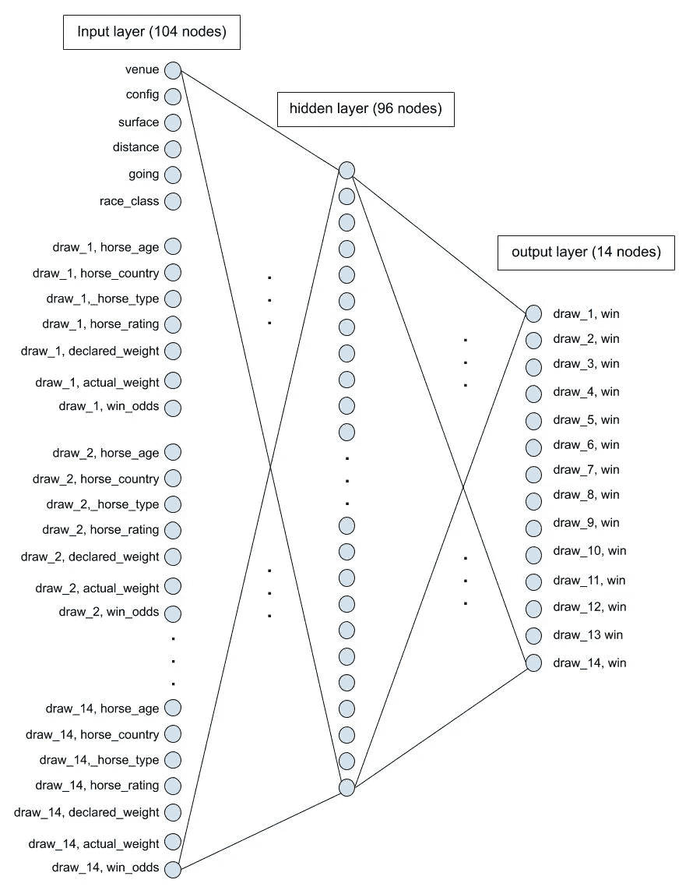
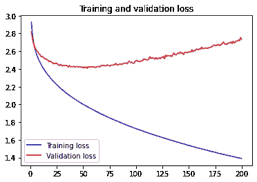

# 用机器学习预测赛马

> 原文：<https://towardsdatascience.com/use-machine-learning-to-predict-horse-racing-4f1111fb6ced?source=collection_archive---------3----------------------->

## 将机器学习知识应用于现实世界分类问题的指南

# **背景**

我是 HKU 大学计算机科学硕士的非全日制学生。在上学期的考试之后，我在想将机器学习应用到真实世界的数据集上会很有趣也很酷。

我很快就找到了机器学习的好网站， [Kaggle](http://kaggle.com) 。Kaggle 为数据科学学生和专业人士提供了许多有趣的数据集。我搜索“香港”，因为我想找到一个与我密切/相关的数据集，我得到了[香港](https://www.kaggle.com/gdaley/hkracing)赛马的数据集。非常感谢[格雷厄姆·戴利](https://www.kaggle.com/gdaley)在 Kaggle 上发布数据集。

我非常兴奋能够从事我的第一个真实世界机器学习项目。我觉得赛马是可以预测的，是典型的分类问题。


Julia Joppien 在 [Unsplash](https://unsplash.com?utm_source=medium&utm_medium=referral) 上拍摄的照片

# 摘要

在这篇文章中，我将与你分享如何做数据预处理，神经网络模型的建立和训练。我们准备用熊猫、tensorflow、numpy、sklearn 等常见的机器学习包。最后，我也会分享一些我在这个项目之后走出来的思考。

# **数据预处理**

数据集包含两个 csv 文件:races.csv 和 runs.csv。这两个表通过列“race_id”相关联。我们将需要连接这两个表，以便为训练生成有意义的数据。

## **处理 races.csv 文件**

用于处理 races.csv 文件的代码

*   第 1-6 行:导入我们将用于项目的包。
*   第 8–9 行:使用 pandas 读取 csv 文件。然后，选择我认为重要的 6 个栏目。
*   第 11–13 行:数据集包含 NaN 是很常见的，这意味着某些字段丢失了。在这里，让我们只是放弃他们。
*   第 15–23 行:一些列是字符串。但是，神经网络模型只处理数字，所以我们需要对它们进行编码。字符串列有不同的类型:名义列和序数列。我们对列“venue”使用 LabelEncoder，而对列“config”和“going”使用 OrdinalEncoder。

到目前为止，我们对来自 races.csv 的数据很满意。

## **处理 runs.csv 文件**

用于处理 runs.csv 文件的代码

runs.csv 文件包含每场比赛的马匹数据，通过 race_id 与 races.csv 相关联。通常，每场比赛有 14 匹或更少的马一起比赛。该代码与我们对 races.csv 文件所做的非常相似，所以我不打算逐行解释。需要注意的一点是，在上面的第 10–13 行，我们需要删除一些有噪声的数据，原因在代码行内注释中有解释。处理后的数据帧头如下图所示。

您可能认为我们已经完成了 runs.csv 文件，但事实并非如此，因为我们需要考虑如何将数据输入神经网络。基本上，我们需要 races.csv 中的一行加上 runs.csv 中属于同一种族的所有行，并将它们放在一起作为神经网络的一个样本输入。下面的代码将对 runs dataframe 进行整形，以便相同种族的行将形成一行。

*   第 1–5 行:我们定义了一个小函数 her 来对列进行排序。
*   第 7 行:magic pivot 方法对 runs.csv 数据进行了整形，使相同种族的行成为一行。列的排序如下[(马龄，1)，(马龄，2)，(马龄，3) … ]。但是，我希望列像[(horse_age，1)，(horse_country，1)，(horse_type，1)……(horse _ age，2)，(horse_country，2)，(horse_type，2)……]，这样我们将按顺序拥有 horse-1-features，horse-2-features，horse-3-features。我花了很长时间才弄明白该用哪个熊猫 API 来做这件事。不得不提的是，我们需要避免使用循环来争取更好的计算效率。
*   第 8–10 行:使用第 1–5 行中定义的函数对列进行排序。除了对马的特性进行分组之外，它还将“结果”列放在最后。因此最右边的列将是[……(结果，11)，(结果，12)，(结果，13)，(结果，14)]。将它们放在最后，因为它们是输出，而不是特征输入。
*   第 12–14 行:正如行内注释所解释的，我们的神经网络需要 14 匹马的数据作为输入。在这里，我们简单地用 0 填充虚拟马特征。

## **准备训练和测试数据集**

你看，数据预处理的工作量很大。幸运的是，我们快到了。现在，让我们做最后一点，为神经网络准备好数据。

*   第 1 行:通过“race_id”连接我们上面准备的两个数据帧。
*   第 2 行:选择除最后 14 列之外的所有列作为输入 **X** 。
*   第 3-4 行:应用特征缩放技术，标准化，这使得培训更容易。否则，网络很难学习特征“申报体重”(1100 sth)和特征“马龄”(大约 3-5)的参数。
*   第 6 行:将列“结果”转换为输出 **y** 。这是一个二元分类。因此，如果这匹马得了第一名，我们就放 **1** ，否则就放 **0** 。
*   第 8–9 行:简单地打印出输入和输出的形状来看看。我们可以看到，我们有 6348 个比赛，每个比赛有 104 个特征和 14 个输出。

```
(6348, 104)
(6348, 14)
```

*   第 11–12 行:使用 sklearn 提供的一个方便的 util 方法来分割数据以训练和测试(验证)集合。

# **建立神经网络模型**

首先，我想向你展示神经网络的架构如下。这是项目的核心。到目前为止，我们所做的所有数据预处理都是为了输入神经网络。



图片由作者提供:赛马的神经网络

*   输入层:104 个节点，从 races.csv 文件中取 6，从 runs.csv 文件中取 7x14。
*   隐藏层:只有 96 个节点。我认为这对于我们的项目来说已经足够了，因为这个分类的功能并不复杂。
*   输出层:14 个节点，每个节点表示一匹马是否赢得了比赛。

代码如下所示，非常简单，这要感谢 keras。请注意度量。我选择 precision， [𝑝𝑟𝑒𝑐𝑖𝑠𝑖𝑜𝑛 = 𝑇𝑃/(𝑇𝑃+𝐹𝑃)](https://developers.google.com/machine-learning/crash-course/classification/precision-and-recall) 作为评估参数，因为赌赢是我们的兴趣所在。

模型细节打印如下。可训练参数是 11，438，这是神经网络的能力。这意味着网络将学习和调整这些参数中的每一个，以便找到一个函数 y = f(X)来拟合我们的数据。

# **训练网络，策划表演**

*   第 1–4 行:在输入数据用于训练之前，进一步扭曲数据。
*   第 6–8 行:培训本身。在训练过程中，控制台会打印进度。
*   第 10–26 行:绘制性能图，图表如下所示。


作者图片:精确绘图



作者图片:损失的策划

该网络足够强大，可以很好地适应训练数据集。然而，有很大的过度拟合。我们在验证数据集上可以达到的最佳性能大约是精度=0.3，这发生在纪元 60~80 左右。Precision=0.3 意味着我们可以在 10 个赢注中正确获得 3 个。这个性能没有我预期的高。原因可能是大多数比赛都是障碍赛，这意味着跑步者携带不同的重量来平衡他们赢得比赛的机会，参见参考文献 [Racing 101](https://entertainment.hkjc.com/entertainment/common/images/learn-racing/racing-academy/pdf/Racing_101_202005_Eng_final.pdf) 。

# **一些想法**

*   在数据分析之前，应该学习领域知识。我的教训是，我不理解赛马术语，如“win_odds”和“actual_weight ”,所以我不知道哪些列是有用的功能。在研究了[指南](https://special.hkjc.com/racing/info/en/betting/guide.asp)之后，事情变得清晰多了。
*   在编写代码之前做更多数据分析。找到数据集后，我很快开始编码。你可以看到[我的另一个笔记本](https://www.kaggle.com/cullensun/deep-learning-model-for-horse-racing)，其中我犯了一个大错误，我把一行 runs.csv 文件当成了一个样本。一匹马能否赢得一场比赛是相对于同场比赛的其他马而言的，所以我们要把一场比赛的 14 匹马的数据放在一起作为一个样本。
*   我听人说过，数据预处理通常比建模和训练花费更多的时间。我发现这个项目确实如此。Pandas 有数百个强大的 API 供您操作数据帧，要想选择正确的 API 快速完成工作，需要花时间熟悉它们。
*   做这个项目真的可以学到很多东西。这比课程作业要多得多。

# **总结**

在这篇文章中，我与您分享了如何在 Kaggle 的真实世界数据集上端到端地应用机器学习技能。我的完整笔记本可以在这里找到。非常感谢您的阅读，并欢迎您的评论。