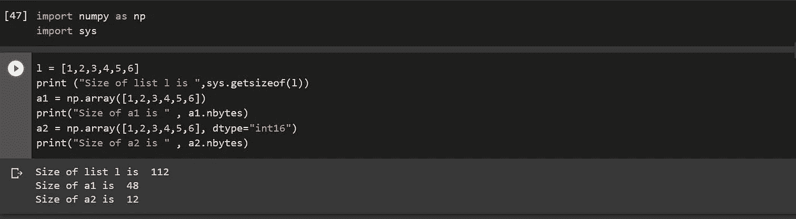
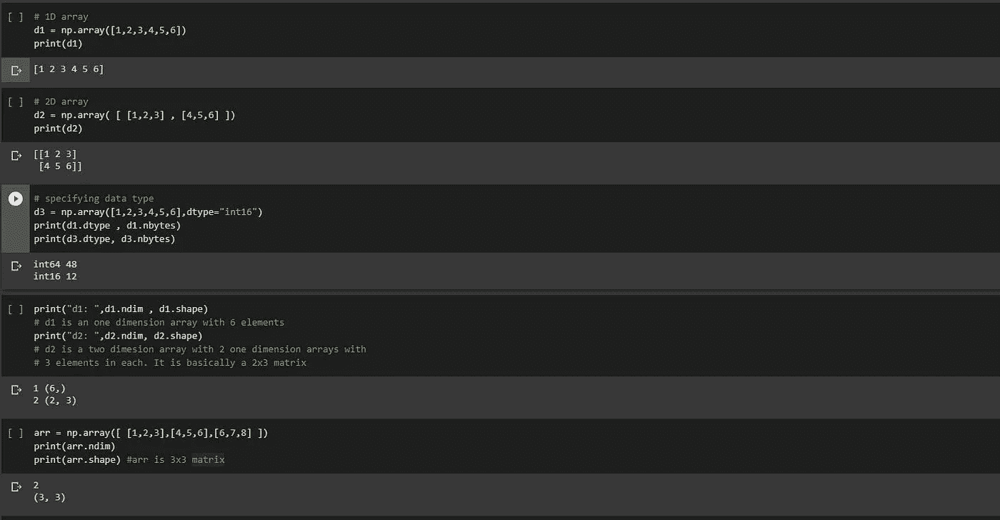
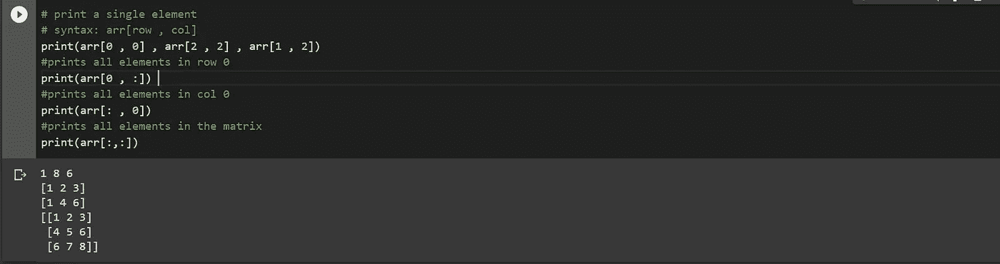
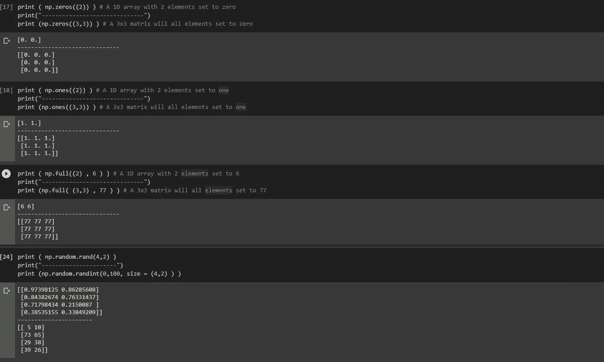
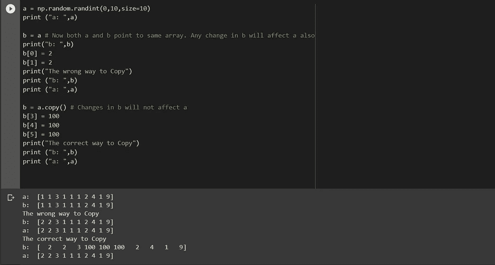
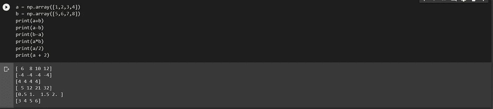
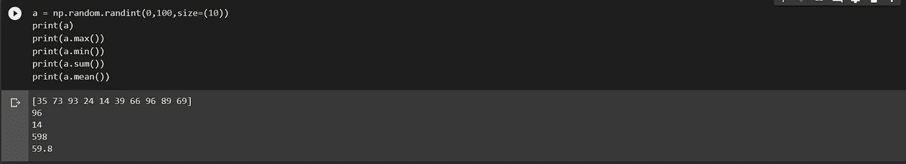
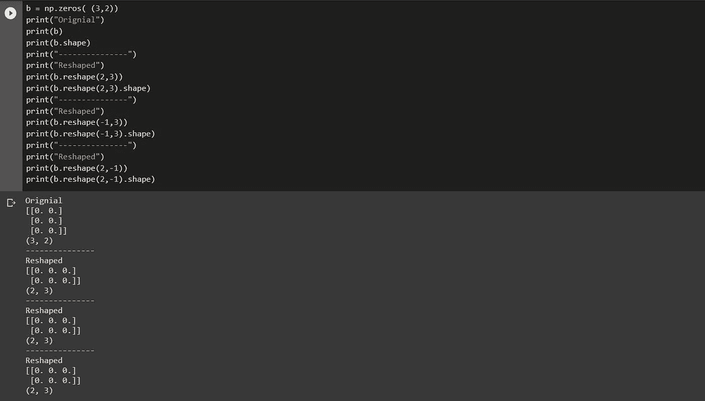
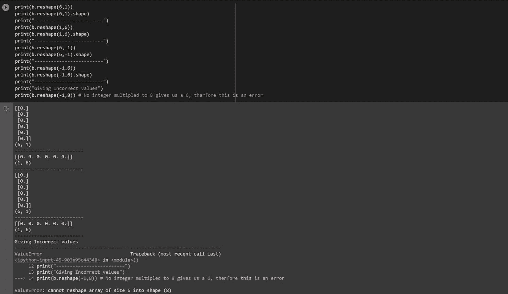

# 2020 年使用 Numpy 进行统计和算术运算

> 原文：<https://towardsdatascience.com/use-numpy-for-statistics-and-arithmetic-operations-in-2020-2e157b784df4?source=collection_archive---------53----------------------->

## 用于数据科学和机器学习的大多数数据都存储为数据帧或数字数组。在本文中，我们将讨论 Numpy


照片由[米卡·鲍梅斯特](https://unsplash.com/@mbaumi?utm_source=unsplash&utm_medium=referral&utm_content=creditCopyText)在 [Unsplash](https://unsplash.com/s/photos/data?utm_source=unsplash&utm_medium=referral&utm_content=creditCopyText) 上拍摄

# NumPy 为什么

NumPy 是 Python 为科学计算提供的库。机器学习和数据分析需要存储大量的数据，而更多的时候，NumPy 是用来存储数据的。下面列出了它的一些好处

*   与列表相比，Numpy 使用更少的空间来存储数据。您可以指定数组数据类型，以减少数组消耗的内存。
*   它比列表更快。
*   它给了你执行算术计算的能力，比如两个数组的元素相加，两个数组的元素相乘等等。您还可以使用 EDA(探索性数据分析)函数，如 min、max、avg 等。

```
l = [1,2,3,4,5,6]print ("Size of list is ",sys.getsizeof(l))a1 = np.array([1,2,3,4,5,6])print("Size of a is " , a1.nbytes)a2 = np.array([1,2,3,4,5,6], dtype="int16")print("Size of a is " , a2.nbytes)**------------------ OUTPUT OF THE CODE-------------------------------**
Size of list is  112 
Size of a is  48 
Size of a is  12
```



作者显示内存差异的代码截图

如您所见，与 Numpy 数组相比，list 使用了两倍多的内存。

# 怎么了

要安装 Numpy，请键入以下命令

```
pip install numpy
```

要导入 NumPy 库，您需要键入以下代码。

```
import numpy as np
```

as np 是不必要的。它允许您在调用函数时使用“np”而不是“numpy”或作为别名。

# 创建数组

您可以使用 NumPy 创建多维数组。

```
# 1D arrayd1 = np.array([1,2,3,4,5,6])print(d1)# 2D arrayd2 = np.array( [ [1,2,3] , [4,5,6] ])print(d2)**------------------ OUTPUT OF THE CODE-------------------------------**[1 2 3 4 5 6][[1 2 3]  [4 5 6]]
```

语法是

```
variable = np.array( [ elements/array of elements ])
```

您可以通过添加来指定数据类型

```
dtype = “int16”dtype= “ int32 “
```

# 形状和尺寸

`.ndim`返回你的数组的维度，`.shape`返回一个长度为`.ndim`的元组，其中包含每个‘行’的长度。

```
arr = np.array([ [1,2,3],[4,5,6],[6,7,8] ])print(arr.ndim)print(arr.shape) #arr is 3x3 matrix**------------------ OUTPUT OF THE CODE-------------------------------**
2 
(3, 3)
```

变量 **arr** 是一个二维数组，每个数组有 9 个元素。它有三个一维数组，每个数组有 3 个元素。它基本上是一个 3x3 的矩阵。



作者显示 Numpy 数组中的维度的代码截图

# 访问元素

访问 NumPy 数组中的特定元素就像访问列表中的元素一样。**返回的元组的长度数。形状**或**返回的值。ndim** 是访问多维数组中单个元素所需的索引数。

```
# print a single element# syntax: arr[row , col]print(arr[0 , 0] , arr[2 , 2] , arr[1 , 2])#prints all elements in row 0print(arr[0 , :])#prints all elements in col 0print(arr[: , 0])#prints all elements in the matrixprint(arr[:,:])**------------------ OUTPUT OF THE CODE-------------------------------**1 8 6[1 2 3][1 4 6][[1 2 3]  [4 5 6]  [6 7 8]]
```



作者展示如何访问元素的代码截图

# 初始化数组

1.  **全为零的多维数组**

```
print ( np.zeros((2)) ) # A 1D array with 2 elements set to zeroprint("------------------------------")print (np.zeros((3,3)) ) # A 3x3 matrix will all elements set to 
                         # zero**------------------ OUTPUT OF THE CODE-------------------------------**[0\. 0.]
 ------------------------------ 
[[0\. 0\. 0.]  [0\. 0\. 0.]  [0\. 0\. 0.]]
```

> 注意语法，**。零( (尺寸))**

**2。全 1 多维数组**

```
print ( np.ones((2)) ) # A 1D array with 2 elements set to oneprint("------------------------------")print (np.ones((3,3)) ) # A 3x3 matrix will all elements set to one**------------------ OUTPUT OF THE CODE-------------------------------**[1\. 1.]------------------------------[[1\. 1\. 1.]  [1\. 1\. 1.]  [1\. 1\. 1.]]
```

> 注意语法，**。个( (尺寸))**

**3。每个元素等于一个数字的多维数组**

```
print ( np.full((2) , 6 ) ) # A 1D array with 2 elements set to 6print("------------------------------")print (np.full((3,3),77)) #A 3x3 matrix will all elements set to 77**------------------ OUTPUT OF THE CODE-------------------------------**[6 6] 
------------------------------ 
[[77 77 77]  [77 77 77]  [77 77 77]]
```

> **注意语法。全( (维)，数)**

**4。具有随机小数/整数的多维数组**

```
print ( np.random.rand(4,2) )print("----------------------")print (np.random.randint(0,100, size = (4,2) ) )**------------------ OUTPUT OF THE CODE-------------------------------**[[0.97398125 0.86285608]  [0.84382674 0.76331437]  [0.71798434 0.2150087 ]  [0.38535155 0.33849209]]
 ---------------------- 
[[ 5 10]  [73 65]  [29 38]  [39 26]]
```

> 注意语法， **.random.rand( ( dimension)，number )**
> 
> 注意语法， **.random.randint( min，max，size = ( dimension ) )**



作者展示如何初始化 Numpy 数组的代码截图

**5。单位矩阵**

```
np.identity(3)**------------------ OUTPUT OF THE CODE-------------------------------**array([[1., 0., 0.],[0., 1., 0.],[0., 0., 1.]])
```

由于它是一个大小为 N×N 的矩阵，所以只需要给出一个值。

# 当心抄袭

复制 NumPy 数组有正确的方法和错误的方法。显然，你必须使用正确的方法。



作者代码截图

始终使用**。copy()** 方法复制一个数组。简单地设置 **b = a** 将使 **b** 和 **a** 指向同一个数组。因此， **b** 中的所有变化也会反映在 **a** 中，而这通常是不可取的。

# 基本算术

你可以在两个或多个数组上执行基本的算术运算，如加法、乘法等。

> 您必须确保数组的维度和形状相同

该操作将一个元素一个元素地执行。如果我们对数组 a 和数组 b 使用加法运算，a 的第一个元素将被加到 b 的第一个元素上，a 的第二个元素将被加到 b 的第二个元素上，依此类推。如果我们在数组 a 和数组 b 上使用减法运算，b 的第一个元素将从 a 的第一个元素中减去，数组 b 的第二个元素将从数组 b 的第二个元素中减去，依此类推。

我们也可以用标量对数组进行算术运算。该操作将按元素方式执行。

```
a = np.array([1,2,3,4])b = np.array([5,6,7,8])print(a+b)print(a-b)print(b-a)print(a*b)print(a/2)print(a + 2)**------------------ OUTPUT OF THE CODE-------------------------------**[ 6  8 10 12] 
[-4 -4 -4 -4] 
[4 4 4 4] 
[ 5 12 21 32] 
[0.5 1\.  1.5 2\. ] 
[3 4 5 6]
```



作者展示算术函数的代码截图

# 统计函数

NumPy 还允许我们执行用于 EDA 的各种统计功能，如最小值、最大值、总和、平均值等

```
a = np.random.randint(0,100,size=(10))print(a)print(a.max())print(a.min())print(a.sum())print(a.mean())**------------------ OUTPUT OF THE CODE-------------------------------**[35 73 93 24 14 39 66 96 89 69]961459859.8
```



作者代码截图

# 使再成形

NumPy 允许我们改变数组的形状。我们可以把 2×3 的阵列改成 3×2 的阵列。我们在执行整形操作时必须非常小心，因为它经常变得令人困惑。

> 健全性检查:整形时，整形数组中元素的乘积。形状元组必须等于原始数组的乘积。形状元组。也就是说，原始阵列和重新成形的阵列中的元素数量必须相同。

您还可以将 reshape 中的一个元素指定为-1，python 将为您计算未知维度。只能将其中一个元素指定为-1，如果将多个元素设置为-1，将会出现错误。在将数组传递给各种函数时，我们经常需要对数组进行整形。这可能看起来令人困惑，但阅读下面的解释，事情就会清楚了。

```
b = np.zeros( (3,2))print("Orignial")print(b)print(b.shape)print("---------------")print("Reshaped")print(b.reshape(2,3))print(b.reshape(2,3).shape)print("---------------")print("Reshaped")print(b.reshape(-1,3))print(b.reshape(-1,3).shape)print("Reshaped")print(b.reshape(2,-1))print(b.reshape(2,-1).shape)**------------------ OUTPUT OF THE CODE-------------------------------**Orignial[[0\. 0.]  [0\. 0.]  [0\. 0.]](3, 2)
---------------

Reshaped[[0\. 0\. 0.]  [0\. 0\. 0.]] 
(2, 3)---------------Reshaped

[[0\. 0\. 0.]  [0\. 0\. 0.]](2, 3)---------------Reshaped[[0\. 0\. 0.]  [0\. 0\. 0.]](2, 3)
```



作者代码截图

首先，我们创建了一个 2 维数组或 3 行 2 列的矩阵，所有元素都设置为 0。接下来，我们尝试将这个数组转换成 2 行 3 列的数组，因此我们使用。整形(2，3)。注意，两种情况下的乘积都是 6。

接下来，我们传递值(-1，3)。我们告诉 NumPy 我们需要 3 列，并要求它计算行数。乘积一定还是 6，所以 NumPy 用 2 代替-1，我们得到一个 2×3 的矩阵。

在最后一种情况下，我们传递值(2，-1)。我们告诉 NumPy 我们想要 2 行，并要求它计算列。乘积一定还是 6，所以 NumPy 用 4 代替-1，我们得到 2×3 矩阵。

下面是我们的原始数组的一些更多的整形。



作者代码截图

b . shape(-1，8)给出一个错误，因为整数乘以 8 不会产生 6。永远记得在整形前做健全检查。

# 结论

我希望我已经帮助你理解了 NumPy 的基础知识。NumPy 库中还有更多可用的函数，所有这些函数都只需谷歌搜索一下。

我最近用 WordPress 创建了一个博客，如果你能看看的话，我会很高兴的😃

 [## Python 项目教程-使用这些 Python 项目教程改进您的简历/作品集。

### 使用 Streamlit 共享部署您的机器学习 Web 应用程序在我以前的文章中，我谈到过构建一个…

realpythonproject.com](https://realpythonproject.com/) 

在 LinkedIn 上与我联系

[](https://www.linkedin.com/in/rahulbanerjee2699/) [## Rahul baner JEE——产品工程实习生——EY | LinkedIn

### 查看 Rahul Banerjee 在世界上最大的职业社区 LinkedIn 上的个人资料。拉胡尔有 4 个工作列在他们的…

www.linkedin.com](https://www.linkedin.com/in/rahulbanerjee2699/) 

在 Twitter 上与我联系