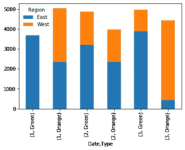

# 使用 Python 来自动化您的 Excel 工作！

> 原文：<https://towardsdatascience.com/use-python-to-automate-your-excel-work-c16b6e5ab58e?source=collection_archive---------12----------------------->

## 自动化那些讨厌的 Excel 报表！

[卡洛斯·穆扎](https://unsplash.com/@kmuza?utm_source=medium&utm_medium=referral)在 [Unsplash](https://unsplash.com?utm_source=medium&utm_medium=referral) 上的照片

在这篇文章中，你将学习如何自动化一些常见的、乏味的 Excel 任务。

很有可能，你无法逃避 Excel(而且你不完全逃避可能是好的！).学习如何使使用应用程序更容易，以及如何自动化重复的任务，是一项重要的技能！

在接下来的几分钟里，您将学习如何组合来自多个工作表的数据，基于这些数据创建汇总统计数据，以及创建有用的可视化效果。**几行代码就搞定了！**

让我们从导入熊猫库开始。如果你不熟悉这个图书馆，可以看看我在 YouTube 上的[熊猫介绍系列](https://www.youtube.com/playlist?list=PLYt6YwKmonu0x8oI_tLT_vaOFzRU64ptK)！

我已经为本教程创建了一个文件，其中包括三个工作表，涵盖了三个不同月份的数据。你可以在这里下载文件，或者使用 URL 将文件直接导入熊猫数据框架。

在第一段代码中，您已经导入了 Pandas 库(并给它分配了别名`pd`)。然后，您将 Excel 文件分配给一个 Excel file 对象。最后，您打印出了文件中所有工作表的名称，但是使用了`.sheet_names`属性。

现在您已经知道文件中包含哪些工作表，让我们实际创建所有数据的数据框架。

使用这种方法而不是列出工作表名称的最大好处是，随着月份被添加到文件中，列表不需要修改！

让我们首先创建一个 dataframe 对象，并添加额外的数据文件。

在上面的代码中，首先创建了一个空的 dataframe 对象。然后使用 for 循环遍历 Excel 工作簿中的每个工作表，生成一个包含数据的临时 dataframe(跳过前三行)，并将每一项追加到 dataframe `df`。最后，您使用`.head()`方法打印了前五个记录。

或者，如果您想将数据组合在一行中，您可以编写以下代码，该代码使用熊猫`.concat()`函数:

# 分析您的数据

现在你已经合并了数据，让我们对此进行一些分析。

假设，您被要求查看不同月份按类型和地区划分的每笔销售的总价值。

我们可以使用 Pandas `.pivot_table()`函数来实现这一点，我在这个 YouTube 视频中已经详细介绍过了:

让我们创建一个熊猫数据透视表:

上面，您已经创建了一个包含两个索引(月份和类型)的数据透视表。月份是使用熊猫生成的。`dt`访问器，以整数形式返回月份，其中 1 等于一月。这些柱子是由区域组成的。

# 可视化您的数据

最后，让我们创建一些数据的可视化。

也许您想要创建一个图表，用堆叠的柱形图来显示数据。

让我们使用 Pandas 中的 matplotlib 集成来生成这个图表:

这会生成下图:

资料来源:Nik Piepenbreier

# 结论

在这篇文章中，您学习了如何从多个 Excel 工作表中的数据创建一个熊猫数据框架。您学习了如何快速分析数据并创建数据的可视化。

查看我的其他帖子或者在 [YouTube](https://www.youtube.com/channel/UCm7fT9_IdCDbeBXjAwL9IIg?view_as=subscriber) 上订阅我的常用技巧！