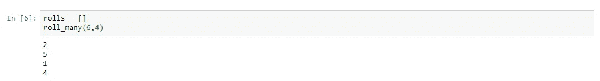
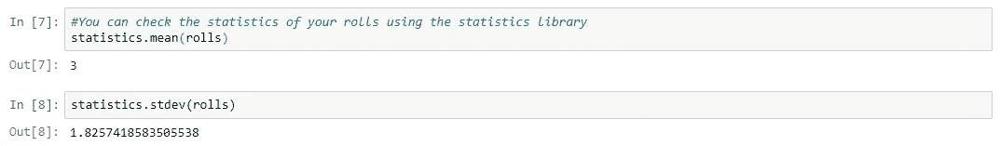
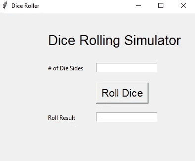
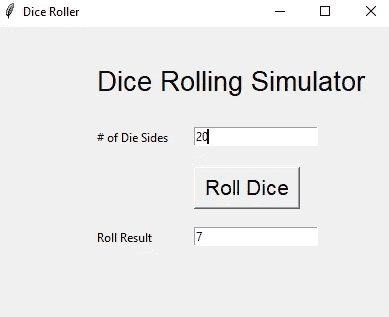

# 使用 Python 构建掷骰子应用程序

> 原文：<https://towardsdatascience.com/use-python-to-build-a-dice-roller-app-2408e66bf009?source=collection_archive---------11----------------------->

## 一个简单的逐步指南，以建立一个骰子滚动模拟器


我最近申请了一份数据科学的工作，提交申请的要求之一是将代码复制并粘贴到一个小窗口中…整个过程似乎有些贬低，但我还是完成了。

提示要求我使用我想要的任何编码语言构建一个简单的骰子滚动器。因为 Python 是我学习最多的地方，所以我很自然地选择了它。我用的 IDE 是 Jupyter 笔记本。我做了一个更好的图形用户界面(GUI ),这样你就可以选择骰子的边数和你想掷的骰子数，因为我喜欢挑战自己。

这是一个有趣而简单的小项目，所以我决定分享我是如何做的。

# **创建功能**

对于项目的这一部分，我导入了 2 个库:statistics 和 randint(来自 random)。这个项目不需要统计库，但是我认为使用这个库来收集你决定做的任何滚动的统计数据是很好的。

```
from random import randint
import statistics
```

现在我们准备创建我们的掷骰子函数。对于这个函数，需要两个输入:n 和 x。

n 是你掷骰子的边数。
x 是你掷骰子的数目。

```
# Define the dice rolling function using two inputs.
rolls = []
def roll_many(n, x):
    for i in range(x):
        roll = randint(1,n)
        rolls.append(roll)
        print(roll)
```

就是这样！很简单。现在你可以使用这个函数来获得骰子点数。

```
# This cell will simulate rolling 2 six-sided dice.
rolls = []
roll_many(6,2)
```

以下是运行它时应该显示的内容示例:



如前所述，您可以使用统计库来收集您掷骰子的统计数据。

```
statistics.mean(rolls)
```

下面是一个如何使用统计库来获取掷骰子统计数据的示例:



# 为函数创建 GUI

我从未尝试过让我的 Python 代码在 GUI 中工作，所以这部分对我来说是新的。在 Google 上搜索了一下之后，我决定使用 tkinter 库来完成这个项目的这一部分。

```
from tkinter import *
```

因为这部分对我来说比较新，所以为了简单起见，我决定不掷出多个骰子，而只掷出一个骰子。

对于初学者来说，接下来的代码片段可能有点复杂。这里我定义了一个窗口类。在课堂上，我定义了将出现在窗口中的不同东西:一个键入骰子边数的区域，一个滚动骰子的按钮，以及所有使用文本向用户指定这些区域的标签。

```
class MyWindow:
    def __init__(self, win):
        self.lbl1=Label(win, text='# of Die Sides')
        self.lbl2=Label(win, text='Roll Result')
        self.lbl3=Label(win, text='Dice Rolling Simulator', font=("Helvetica", 20))
        self.t1=Entry()
        self.t2=Entry()
        self.btn1 = Button(win, text='Roll Dice')
        self.lbl1.place(x=100, y=100)
        self.t1.place(x=200, y=100)
        self.b1=Button(win, text='Roll Dice', font=("Helvetica", 16), command=self.roll)
        self.b1.place(x=200, y=140)
        self.b1.config(height=1, width=8)
        self.lbl2.place(x=100, y=200)
        self.t2.place(x=200, y=200)
        self.lbl3.place(x=100, y=35)
```

接下来，我为按钮定义 roll 函数。这里的 roll 函数与我们上面看到的非常相似，但是还有一些额外的行，以便 GUI 可以使用这个函数。

```
def roll(self):
        self.t2.delete(0, 'end')
        n=int(self.t1.get())
        result=randint(1,n)
        self.t2.insert(END, str(result))
```

最后，我使用 tkinter 定义了窗口，我给窗口添加了一个标题(显示在顶部的窗口的名称标题)以及窗口在屏幕上显示的尺寸和位置。window.mainloop()是一个事件监听循环，因此我们的应用程序可以随时响应新的输入。

```
window=Tk()
mywin=MyWindow(window)
window.title('Dice Roller')
window.geometry("400x300+10+10")
window.mainloop()
```

总的来说，该代码片段如下所示:

```
from tkinter import *
class MyWindow:
    def __init__(self, win):
        self.lbl1=Label(win, text='# of Die Sides')
        self.lbl2=Label(win, text='Roll Result')
        self.lbl3=Label(win, text='Dice Rolling Simulator', font=("Helvetica", 20))
        self.t1=Entry()
        self.t2=Entry()
        self.btn1 = Button(win, text='Roll Dice')
        self.lbl1.place(x=100, y=100)
        self.t1.place(x=200, y=100)
        self.b1=Button(win, text='Roll Dice', font=("Helvetica", 16), command=self.roll)
        self.b1.place(x=200, y=140)
        self.b1.config(height=1, width=8)
        self.lbl2.place(x=100, y=200)
        self.t2.place(x=200, y=200)
        self.lbl3.place(x=100, y=35)
    def roll(self):
        self.t2.delete(0, 'end')
        n=int(self.t1.get())
        result=randint(1,n)
        self.t2.insert(END, str(result))window=Tk()
mywin=MyWindow(window)
window.title('Dice Roller')
window.geometry("400x300+10+10")
window.mainloop()
```

并且，在运行代码之后…



瞧啊。让我们为骰子点数输入 20，看看我们会得到什么:



幸运数字七！这不是什么花哨的东西，但它是一个工作的骰子滚动模拟器。

如果您在编写代码时遇到问题，或者只是想复制并粘贴代码，以便拥有掷骰子模拟器，以下是 GitHub 资源库链接:

[](https://github.com/jkundycki/RollDice) [## jkundycki/RollDice

### 此时您不能执行该操作。您已使用另一个标签页或窗口登录。您已在另一个选项卡中注销，或者…

github.com](https://github.com/jkundycki/RollDice) 

祝你好运，感谢你的阅读！