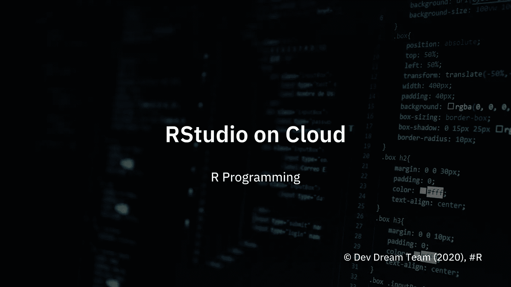
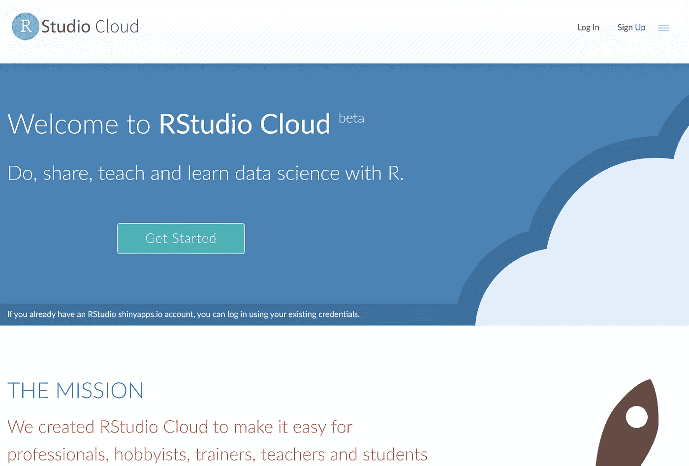
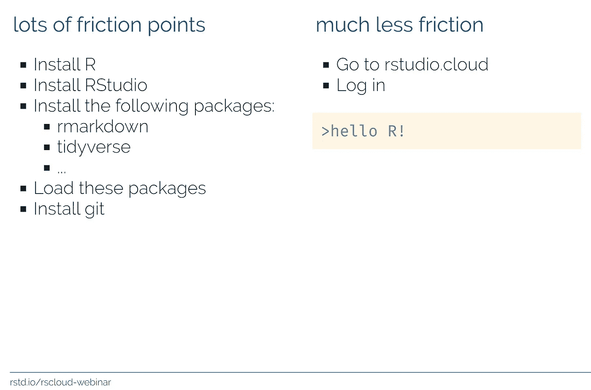
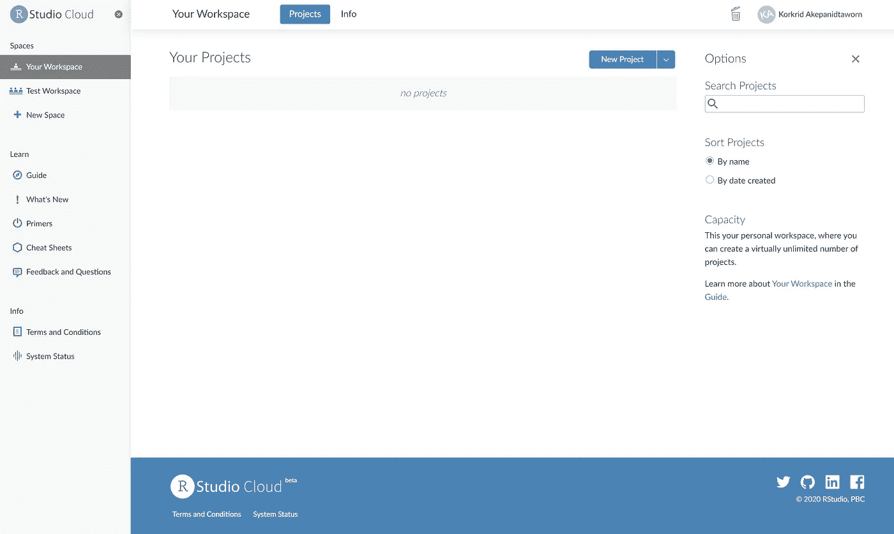
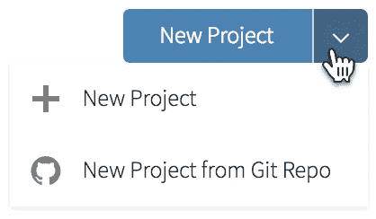
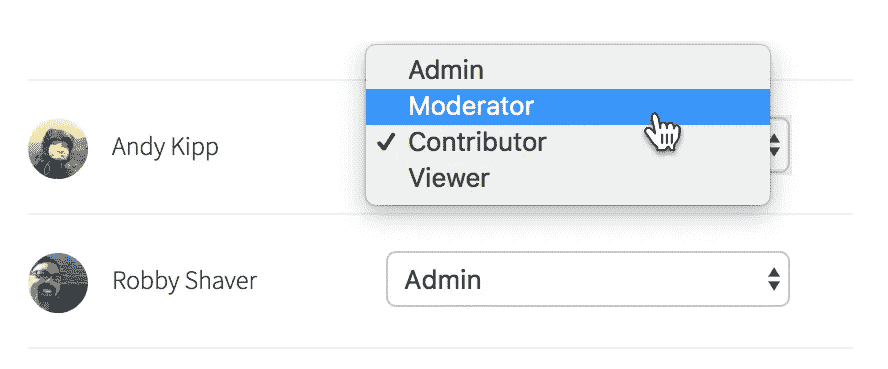
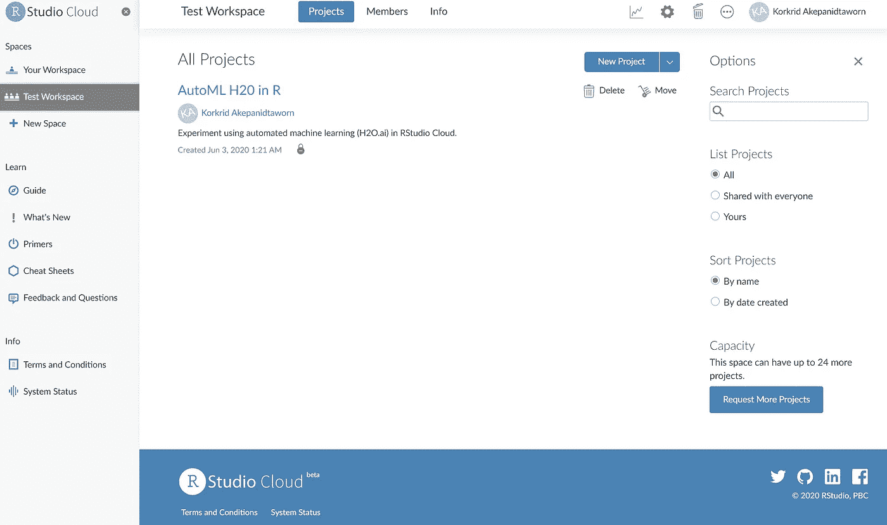
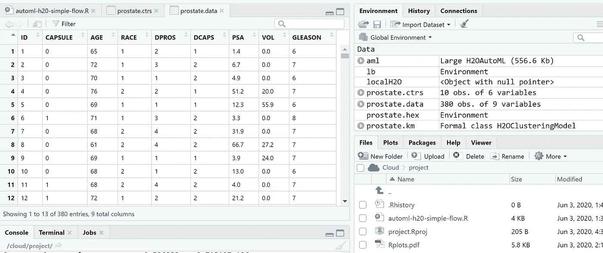
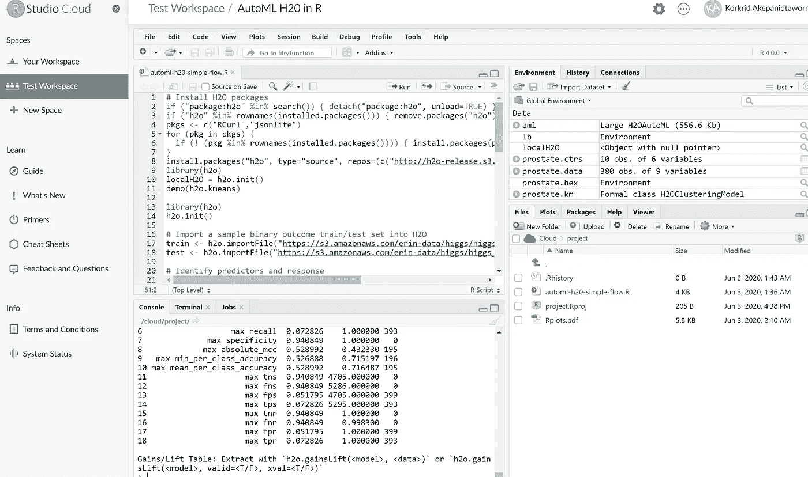

# 直接在浏览器上使用“RStudio Cloud”上的 R 编程

> 原文：<https://towardsdatascience.com/use-r-programming-on-rstudio-cloud-directly-on-browser-af19b9042751?source=collection_archive---------45----------------------->

## 在无需安装软件和配置的情况下，使用 R on Cloud 进行、共享、教授和学习数据科学

## 序幕

云计算的新时代开始了……我发现了 [RStudio Cloud](https://rstudio.cloud/) (在我撰写本文时，它正处于测试版),适合专业人士、业余爱好者、培训师、教师和学生使用 R 来进行、分享、教授和学习数据科学。对于那些不知道的人来说， **RStudio** 是一个成熟的 R 编程 IDE 。这是您将用作桌面版本的确切视图，旨在解决一些棘手问题，例如:

*   安装 R
*   安装 RStudio
*   安装软件包和依赖项
*   加载包
*   运行并重新加载代码

现在，有了新的云体验，我可以简单地登录并从浏览器运行代码。多么可笑的简单！

RStudio Cloud 现已发布测试版。来源:[https://rstudio.cloud/](https://rstudio.cloud/)

[RStudio 云网络研讨会，来源:Mine etinkaya-Rundel](https://mine-cetinkaya-rundel.github.io/rstudio-cloud-webinar/rstudio-cloud.html#4)(第 4 页)

## 登录选项

*   通过您的用户名和密码登录
*   通过谷歌登录
*   通过 GitHub 登录。

如果凭据有效，您将看到以下登录页面:

## RStudio 云术语通俗易懂

*   **项目** —封装你的 R 代码、包和数据文件。只需在“项目”区域点击“新建项目”按钮。您的新项目将在 RStudio IDE 中打开。

*   **工作区** —获得一个名为您的工作区的个人工作区，在其中创建项目。
*   **私人空间** —仅与私人空间的特定成员协作。
*   **成员** —管理其成员资格。

*   **项目访问**—对空间的所有成员可见，还是对项目创建者保密？

我继续创建一个新项目，并给项目命名为“AutoML H2O.ai in R”。在我这边效果惊人。我根本不用安装 R 或者 RStudio。导航窗格与在我的本地计算机上使用 RStudio 的体验相同。

## 考虑和限制

*   每个项目分配 1GB 的内存。每个帐户分配一个私人空间，最多 10 个成员和 25 个项目。如果您达到这些空间限制之一，您可以向 RStudio 云团队提交增加容量的请求，他们会尽最大努力满足您的需求。如果你用的是专业的`shinyapps.io`账号，就不会遇到这些空间限制。
*   如果连接不好，项目可能会停滞。您可以随时重新启动项目。
*   您不必重新运行代码。如果您不小心关闭了视图，您总是可以返回到它并继续下一行代码。
*   工作区和项目之间的包安装不同步。因此，如果某个包是未知的，您仍然需要为不同的项目安装它。

## 附加材料

1.  [RStudio 云网络研讨会，来源:Mine etinkaya-Rundel](https://mine-cetinkaya-rundel.github.io/rstudio-cloud-webinar/rstudio-cloud.html#4)
2.  [如何将 RStudio 云与 Github 连接](https://bren.zendesk.com/hc/en-us/articles/360015826731-How-to-connect-RStudio-Cloud-with-Github)

**免责声明**:以下内容未经我的雇主正式认可。本文表达的观点和意见仅代表作者的观点和意见，不一定反映当前或以前的雇主、组织、委员会、其他团体或个人的官方政策或立场。本文中进行的分析是基于有限日期的开源信息。分析中所做的假设并不反映任何前任或现任雇主的立场。