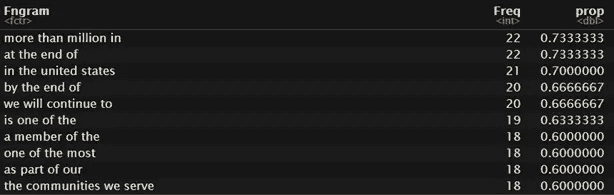
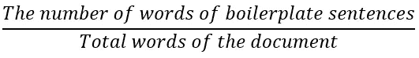
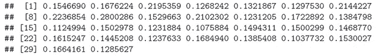

# 使用 R 计算用于会计分析的样板文件

> 原文：<https://towardsdatascience.com/use-r-to-calculate-boilerplate-for-accounting-analysis-f4a5b64e9b0d?source=collection_archive---------54----------------------->

## 研究

## 用 30 家电信公司 CSR 计算样本的实证。

图片来自 [Pixabay](https://pixabay.com/?utm_source=link-attribution&utm_medium=referral&utm_campaign=image&utm_content=1052010) 的 Dariusz Sankowski

# 什么是样板文件，为什么要去除它？

在文本分析中，*样板词*是可以从句子中删除而不会显著改变其原始含义的词的组合，例如“超过百万 In”或“在…的末尾”根据 Mark Lang 和 Lorien Stice-Lawrence 的说法，*样板文件*已经成为监管机构和标准制定者发现的年度报告中一个特别有问题的属性，他们的分析表明，随着*样板文件*的减少，年度报告披露(来自 15，000 多家公司)得到了改善。研究的详细内容可在[这里](https://www.sciencedirect.com/science/article/abs/pii/S0165410115000658)找到。

**样板文件*影响年度披露质量的原因之一是*样板文件*可能为隐藏信息提供机会，降低整体信息含量(*** [**Hoogervorst，2013**](https://www.ifrs.org/news-and-events/2013/06/iasb-chairs-speech-breaking-the-boilerplate/) **)。**

# 数据

我用 30 份企业社会责任报告作为数据来演示如何计算*样板*。都是来自通信行业的公司，比如 AT & T，Sprint Corporation 之类的。都是用英文和 pdf 格式写的。

# 展示区(代码)

在我的计算演示中，我将遵循 Mark Lang 对样板的定义:报告中包含至少一个“样板”短语(4 个单词的短语，或四边形)的句子的单词百分比。

## 第一步——标记每个文档的所有句子

在这一步中，我们使用了“tm”包和“tokenizers”包。为了生成正确的四边形并减少计算量，我们在这一步中删除了数字。由于所有的原始文档都是 pdf，“tokenize_sentences”功能可以充分识别不规则的段落换行符，并将文本拆分成句子。

作者代码

## 第二步——将四边形放入一个列表中

在这一步中，我生成了四边形，并将所有的四边形放在一个列表中以供进一步分析，因为 Mark Lang 的方法要求在所有文档级别中查找常见的 4 个单词的短语。

作者代码

## 第三步—获得频率在 30%和 75%之间的四边形

在此步骤中，我手动设置阈值，只有出现在整个文档语料库的 30%和 75% 之间的 ***中的四边形将用于计算。我之所以要设上限，在马克·朗的论文里有解释。但一般来说，四联图有时包含无害的短语或监管披露，这将传达信息内容。样板文件的目的是发现文档是多么没有信息，所以我必须从计算中排除最流行的四边形。***

作者代码

部分输出如下所示:

图 1–四边形

## 第四步——计算每个句子的字数和四角形

当我最初开始这项任务时，我在这一步遇到了很多麻烦，因为如果我把这一部分搞砸了，最终的输出将会很糟糕。一个句子可能根本没有四边形，也可能同时有多个四边形。一句话的字数很容易翻倍或翻倍。为了解决这个问题，我设置了一个临时变量来标记句子，以避免多次计数。

作者代码

## 最后一步——计算样板文件

让我们回顾一下样板文件的定义:

图 2 —样板方程

在我标记了所有的样板句子之后，我生成了每个文档的长度:

作者代码

最终计算的代码:

作者代码

最终输出如下所示:

图 3 —最终输出

# 最后

计算样本有助于更好地理解会计文本分析中一组报表的信息含量。做计算时，你必须小心重复计算样板句。

我有意避免使用“lapply ”,并在代码中使用了许多“for 循环”。它可以有效地帮助构建和组织用于调试目的的代码。此外，多个任务需要多次将输出分配给环境变量。由于 R 一直在提升“for loops”的性能，“for loops”的速度也没有以前那么差了。

## 这项工作可以列举如下:

《情感:一个文本分析包》。软件影响，100456 (2022)。【https://doi.org/10.1016/J.SIMPA.2022.100456 

供大家参考，在这里可以找到所有的 R 代码[。](https://github.com/jinhangjiang/Boilerplate)

python 版本可在此处找到:

 [## 更多情感:文本分析包

### 帮助研究人员计算样本、冗余、特异性、相对流行率的函数集合…

towardsdatascience.com](/morethansentiments-a-python-library-for-text-quantification-e57ff9d51cd5) 

***请随时与我联系***[***LinkedIn***](https://www.linkedin.com/in/jinhangjiang/)***。***