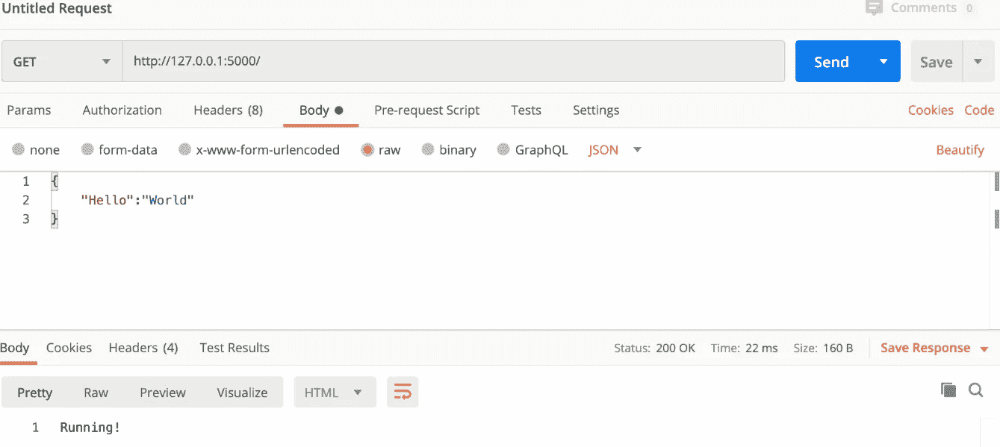
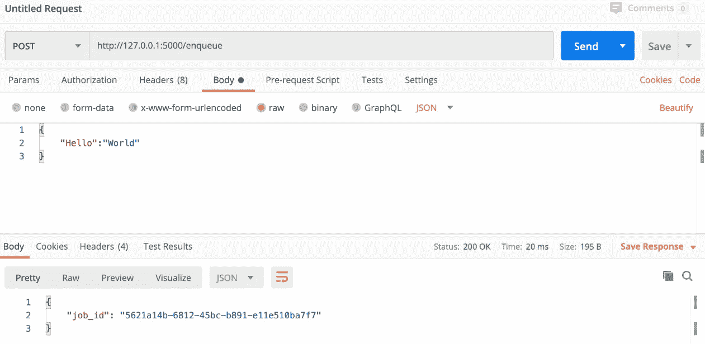
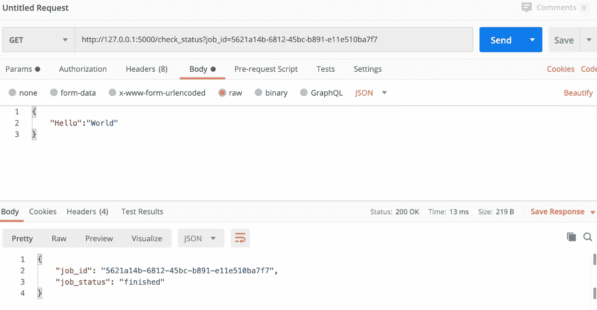
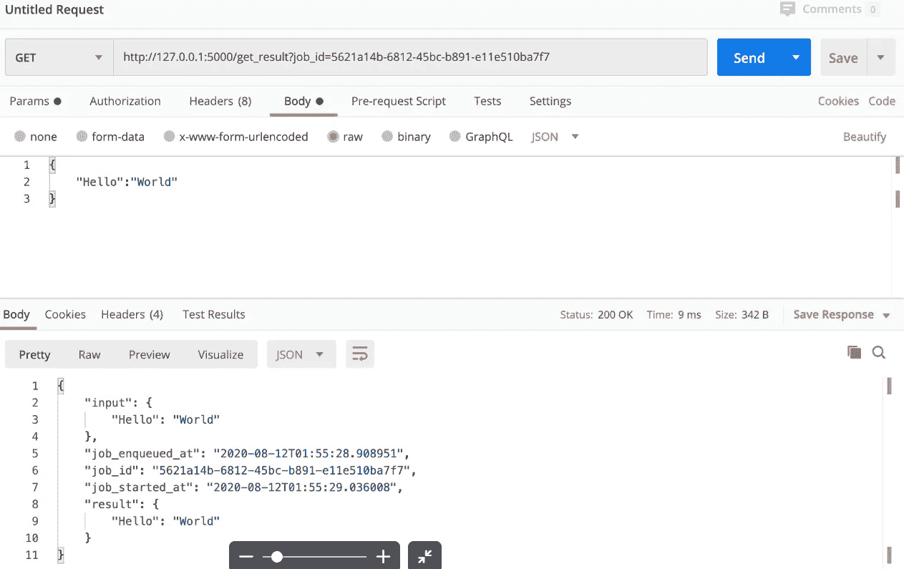

# 在 Flask 应用程序中为异步任务使用 Redis 队列

> 原文：<https://towardsdatascience.com/use-redis-queue-for-asynchronous-tasks-in-a-flask-app-d39f2a8c2667?source=collection_archive---------7----------------------->

## 使用 Redis 和 Redis 队列处理长请求，防止应用程序编程超时

*By:内容由* [*爱德华·克鲁格*](https://www.linkedin.com/in/edkrueger/)*[*乔希·法默*](https://www.linkedin.com/in/yesandfarmer/)*[*道格拉斯·富兰克林*](https://www.linkedin.com/in/douglas-franklin-1a3a2aa3/) *。***

****

**伊恩·巴塔格利亚在 Unsplash 上拍摄的照片**

**当构建执行耗时、复杂或资源密集型任务的应用程序时，等待这些任务在前端应用程序中完成可能会令人沮丧。此外，前端的复杂任务可能会超时。Redis Queue 通过将更复杂的任务推给工作进程进行处理来解决这个问题。**

**将 Redis 与 Redis Queue 一起使用允许您将那些复杂的任务输入到一个队列中，因此 Redis worker 在应用程序的 HTTP 服务器之外执行这些任务。**

**在本文中，我们将构建一个应用程序，它使用 Redis 队列对作业进行排队，对这些作业执行一个函数，并返回函数的结果。**

**这里是这个项目的代码到 Github 库的链接。**

## **Redis 是什么？**

**Redis 是一个开源的内存数据库、缓存和消息代理。Redis 处理的消息本质上是 JSONs。Redis 非常适合在临时数据库中快速方便地处理特定的数据类型，并提供非常快速的查询访问和传递。**

**对我们来说，Redis 提供了两个好处。首先，它将复杂的任务推到另一个空间进行处理。第二，通过将任务分成独立的功能，即主应用程序和队列，开发人员可以更容易地处理复杂的操作。**

**对于这个应用程序，我们将使用 Redis 来保存 JSON 消息队列。Redis 可以是一个独立的数据库，可由许多计算机或系统访问。在我们的示例中，我们将使用它作为本地内存存储来支持我们的应用程序。**

## **什么是 Redis 队列？**

**Redis Queue 是一个 python 库，用于后台处理的作业排队。由于许多托管服务在长 HTTP 请求时会超时，所以最好设计 API 来尽快关闭请求。Redis Queue 允许我们通过将任务推送到一个队列，然后再推送到一个工作器进行处理来实现这一点。**

**将 Redis 与 Redis Queue 结合使用，可以请求用户输入，向用户返回验证响应，并在后台对流程进行排队。所有这些都不需要前端用户等待这些过程完成。过程可以是任何东西，从机器学习模型到复制图像到复杂的模拟。**

**任何比您希望在应用程序前端完成的时间更长的事情都属于 Redis 队列。**

## **模块化应用程序结构**

**我们将介绍如何使用 Docker 运行 Redis 数据库并初始化 Redis 队列工作器。worker 将允许我们处理应用程序队列中的作业。**

**我们将在接下来的小节中更详细地讨论这些文件。**

**我们将讨论我们的应用程序的以下组成文件: **main.py** 、 **functions.py** 和 **redis_resc.py** 。**

**有两种方法可以启动 docker 容器。在本文中，我们将一步一步地介绍标准流程。然而，可以使用 docker-compose 创建 docker 容器，我们将在另一篇文章中介绍。**

## **安装 Docker 和 Redis**

**码头服务是一种集装箱服务。这意味着 Docker 在一个容器中运行代码，该容器中有应用程序从一个系统可靠地运行到另一个系统所需的依赖关系。它确保我们的应用程序从开发到测试再到生产始终如一地运行。**

**跟随[链接到 Docker 文档](https://docs.docker.com/engine/install/)获取全面的安装指南，帮助您为您的操作系统选择正确的 Docker 版本。**

**一旦在系统上安装了 Docker，您将需要安装 Redis。**

**对于 Mac 用户来说，home-brew 命令 `brew install redis` 将起作用。Windows 需要从 Github 下载[。有了 Linux，可以直接从](https://github.com/dmajkic/redis/downloads) [Redis](http://redis.io/) 下载最新的 tarball。**

## **自述文件概述**

**要运行我们的应用程序，我们必须理解[自述文件](https://github.com/edkrueger/rq-flask-sqlalchemy-template)中的说明。**

**我们将使用 Pipenv 创建一个虚拟环境并安装适当的包。用命令`pipenv install -- dev`安装这个程序的包。添加`--dev` 标志安装开发包和生产需求。在进入下一步之前，使用命令 pipenv shell 激活环境。**

**我们必须启动三个服务才能让应用程序正常运行:Redis 数据库、Redis 队列工作器和 Flask 应用程序。其中两个服务将在我们用来安装虚拟环境和进入 shell 的同一个终端中开始。**

**首先，运行命令:**

```
**docker pull redis**
```

**这将从 Docker Hub 中提取 Redis 映像。**

**然后，运行命令:**

```
**docker run -d -p 6379:6379 redis**
```

**这个命令有几个用途。首先，它初始化 docker 容器。`-d`标志在后台运行 Redis 容器，为下一步释放终端。`-p`标志向主机发布容器的一个或多个端口。最后，`6379:6379`将 docker 容器中的端口 6379 绑定到本地主机上的端口 6379。如果不绑定端口，当 docker 容器中的本地机器和进程试图相互通信时，就会遇到问题。**

**运行我们的应用程序之前的最后一步是启动 Redis 队列工作器。因为我们是在分离模式下运行 Redis 映像，所以我们可以在同一个终端中执行这个步骤。**

**用命令`rq worker`启动 Redis 工作器。只有在安装了 Redis 队列包的情况下，`rq`命令才可用于终端，我们用 Pipenv install 安装了依赖项，用 pipenv shell 进入环境。运行`rq`命令将允许 Redis 队列开始监听进入队列的作业，并开始处理这些作业。**

## **初始化烧瓶应用程序**

**我们现在准备初始化 flask 应用程序。在开发服务器上，这是通过以下命令完成的:**

```
**export FLASK_APP=app.main:app && flask run — reload**
```

**命令`gunicorn app.main:app`将在生产服务器上运行这个。Gunicorn 需要 Unix 平台才能运行。因此，如果您使用的是 macOS 或基于 Linux 的系统，这个命令可以工作，但不适用于 windows。**

**现在服务正在运行，让我们转到应用程序文件。**

# **烧瓶应用程序组件**

## **redis_resc.py**

**这个文件设置 Redis 连接和 Redis 队列。**

**redis_resc.py**

**变量`redis_conn`定义了这个连接的连接参数，`redis_queue`使用队列方法。Queue 方法初始化队列，可以给定任何名称。常见的命名模式有“低”、“中”和“高”通过为队列方法提供无参数，我们指示它使用默认队列。除了名称之外，我们只是将连接字符串传递给 Redis 存储。**

## **函数. py**

**py 是我们定义在 Redis 队列中使用的函数的地方。**

**做什么由你决定。它可以是您希望对传递给员工的数据做的任何事情。这可以是任何事情，从机器学习到图像处理，再到使用信息处理连接数据库中的查询。你想让后端做的任何事情都可以放在这个函数中，这样前端就不会等待了。**

**对于我们的例子，这个函数有两个目的。首先，创建 job 变量来检索当前正在处理的作业。我们使用`time.sleep(10)`来演示作业处理过程中不同的作业状态代码。我们将在本文后面更详细地讨论作业状态代码。最后，我们返回一个 JSON，其中包含关于作业和作业处理结果的信息。**

## **Main.py**

**[Main.py](https://github.com/edkrueger/rq-flask-template/blob/master/app/main.py) 是驱动应用程序的主要 flask app。关于设置 flask 应用程序的更多细节在这篇中型文章中概述[。](/use-flask-and-sqlalchemy-not-flask-sqlalchemy-5a64fafe22a4)**

**[](/use-flask-and-sqlalchemy-not-flask-sqlalchemy-5a64fafe22a4) [## 用 Flask 和 SQLalchemy，不要用 Flask-SQLAlchemy！

### 避免 Flask 应用程序中的 Flask-SQLAlchemy

towardsdatascience.com](/use-flask-and-sqlalchemy-not-flask-sqlalchemy-5a64fafe22a4) 

第一个路由函数`resource_not_found`被设计用来处理由于对应用程序的不正确请求而导致的任何 404 错误。定义为`home`的路线功能是导航到回家路线时运行的默认路线。当您对`[http://127.0.0.1:8000](http://127.0.0.1:8000)`或本地主机 URL 执行 GET 请求时，这个路由就会运行。这条路线旨在让你知道 flask 应用程序正在运行。

我们可以用 Postman 测试一下，如下图所示。



本地主机地址邮递员测试

其余的路由，特别是 Redis 队列，将在下面详细介绍。

## /排队

`/enqueue`路由创建任务，并将任务放入队列。Redis Queue 接受诸如键值对之类的东西，因此您可以使用字典创建 post 请求，例如:

```
{“hello”: “world”}
```

向`/enqueue`路由提交一个 JSON post 请求将告诉应用程序将 JSON 排队到 **function.py** 文件中的函数 `some_long_function`进行处理。



/排队路由邮递员测试

`/enqueue`路由一旦完成就返回创建的任务的`job_id`。请注意`job_id`，因为我们将使用它作为应用程序剩余路由的 URL 字符串的一部分。

## /check _ 状态

这个路由采用`job_id`并检查它在 Redis 队列中的状态。这条路线的完整网址是`http://127.0.0.1:8000?job_id=JobID`。其中`JobID`是在`/enqueue`路线创建作业时生成的`job_id`。



/check_status 路由邮递员测试

`/check_status` route 将返回一个 JSON，其中包含 URL 中传递的`job_id`和使用 rq.job 的`get_status`方法的作业状态。如果您在十秒钟计时器之前发出 get 请求，则状态将显示为“队列”`some_long_function`完成后，状态将返回“完成”

## /get _ 结果

一旦任务被`/check_status route`显示为‘完成’，`get_result`将返回已处理任务的结果。结果由您在`some_long_function`中的设置决定。该 URL 遵循与`/check_status`相同的结构，因此它是:

```
[http://127.0.0.1:8000?get_result=JobID](http://127.0.0.1:8000?get_result=JobID)
```



/get_resut 路由邮递员测试

我们的`some_long_function`返回关于作业的数据，如上图所示。

## 结论

在本文中，我们学习了一些关于使用 Redis Queue 构建任务队列的知识，以及如何在 docker 容器中利用 Redis 数据库。我们讲述了如何构建一个应用程序，使耗时的任务排队变得简单，而不会占用或影响我们的前端性能。

[](https://github.com/edkrueger/rq-flask-template) [## edkrueger/rq-烧瓶-模板

### 运行 pipenv install — dev 来安装 env。运行 pipenv 运行预提交安装来初始化 git 挂钩。运行 pipenv…

github.com](https://github.com/edkrueger/rq-flask-template) 

这里是这个项目的代码到 Github 库的链接。自己测试一下，尝试排队几个 JSON 任务并查看结果！**