# 用强化学习训练一只永远不会死的小鸟

> 原文：<https://towardsdatascience.com/use-reinforcement-learning-to-train-a-flappy-bird-never-to-die-35b9625aaecc?source=collection_archive---------20----------------------->

## 故障排除和性能调整直到完美的故事

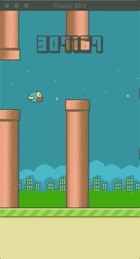

拍打鸟

最近，我开始学习强化学习算法，flappy bird 是一个用于强化学习的流行游戏，特别适合初学者玩。

[Sarvagya Vaish](http://sarvagyavaish.github.io/FlappyBirdRL/) 在他的[帖子](http://sarvagyavaish.github.io/FlappyBirdRL/)中详细解释了 Q-learning 理论和游戏如何运作。他用 javascript 实现了他的想法。我更喜欢在 python 中查找参考代码。感谢 [Cihan Ceyhan](https://github.com/chncyhn/flappybird-qlearning-bot) 提供了一个很好的 python 示例。

通过仔细划分状态空间，[慈汉 Ceyhan](https://github.com/chncyhn/flappybird-qlearning-bot) 的 AI 智能体(flappy bird)可以飞过 5000 分。

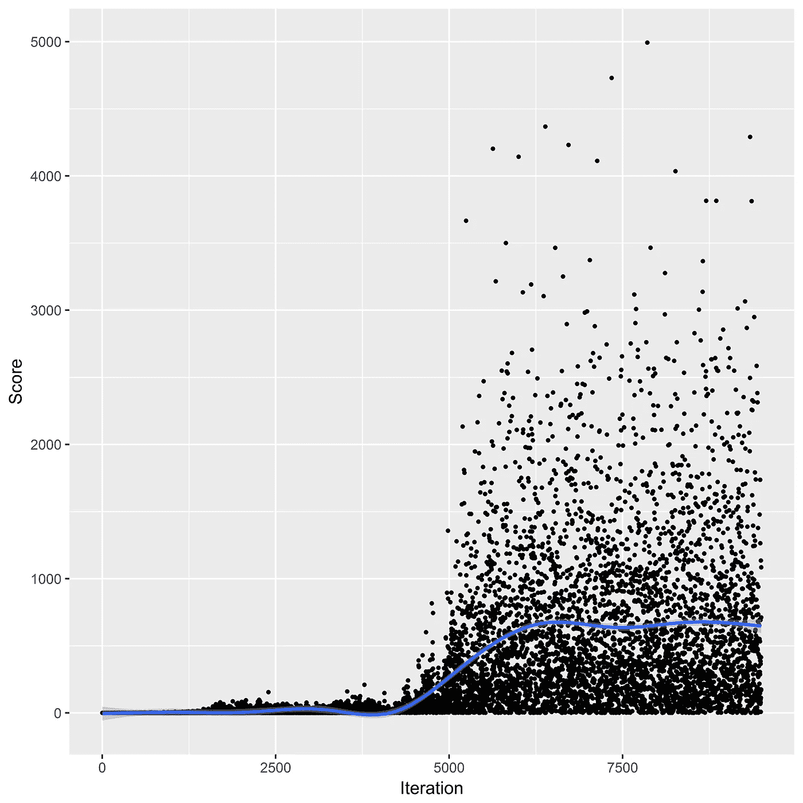

[来源:使用强化学习的 Flappy Bird Bot](https://github.com/chncyhn/flappybird-qlearning-bot)

然而，正如你所看到的，小鸟不可能在每场比赛中都达到高分，它可能会在任何分数崩溃。不够稳定。

**有没有可能在任何游戏中训练一只永远不死的鸟？**

# 状态矢量空间

在 Sarvagya 的帖子中，他定义了三个维度来代表一种状态:

*   **X** —到下一根管道的水平距离
*   **Y** —到下一根管道的垂直距离
*   **V**——鸟的当前速度

在[慈汉杰伊汉](https://github.com/chncyhn/flappybird-qlearning-bot)的代码中，如果鸟进入隧道超过 30 个像素(管道宽度=52px)，鸟会将眼睛移到下一个管道。但是，这可能会导致 Q 表的冲突结果。对于相同的 X，Y，V(到下一个管道)，如果鸟的当前位置靠近当前管道的边缘部分(红色)，鸟可能会坠毁在当时对鸟透明的隧道中。

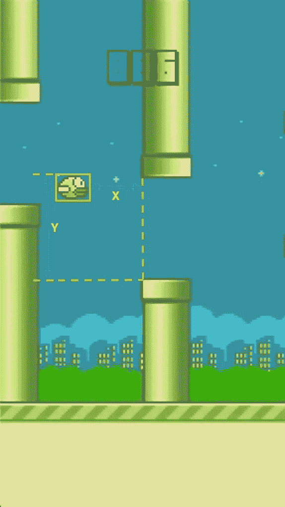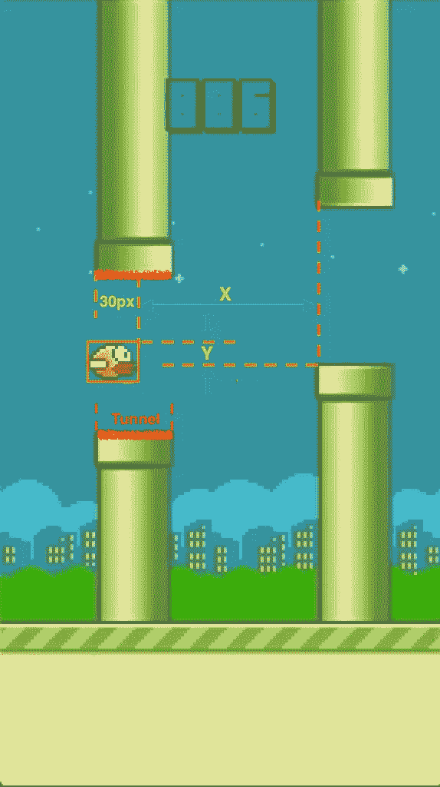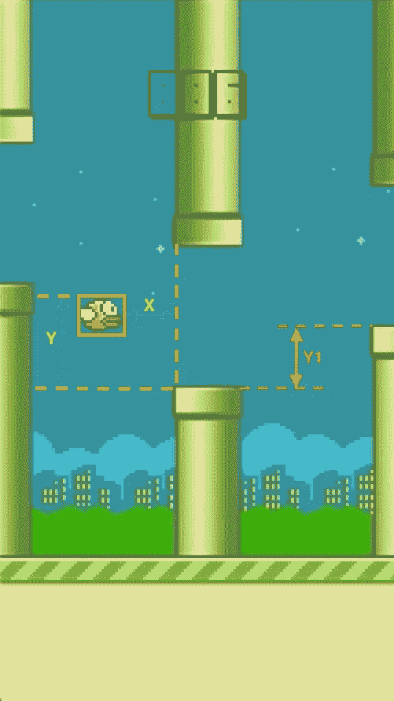

**左**:原始状态空间，**中**:隧道里的鸟是盲的，**右**:状态空间中引入的新维度

我在状态中添加了第四维:

*   `**Y1**` -相邻两个管道之间的垂直距离，它有助于鸟根据两个连续管道的高度差提前采取行动。该值仅在鸟进入隧道部分时使用。它可以减少状态空间。

此外，鸟仍然可以感知当前管道，直到隧道中 50 像素长。之后，这只鸟几乎飞出了隧道。刚刚通过的管道不能再冲击鸟了。是时候关注下一个管道了。

# Q-learning 的奖励

通过以上改进，小鸟可以轻松飞到 10000 分。但是，它仍然不稳定，在达到 10000 分之前有许多失败。

按照[萨瓦吉亚](https://github.com/SarvagyaVaish)的解释，机器人每走一步获得活着的 **+1 奖励**，如果死亡则获得 **-1000 奖励**。它在大多数情况下都能很好地工作。

让我们看看下面的场景。下一个管道比前一个有巨大的落差，游戏中两个管道之间的最大垂直落差是 142px。考虑到小鸟在第一张图中所示的位置，如果小鸟正在下落，想要顺利通过这两条管道，可能需要走*路线 1* 或*路线 2* ，但两者都无法顺利通过下一条管道。如果垂直差没有达到最大落差，它在大多数情况下都是可行的。参考中图。

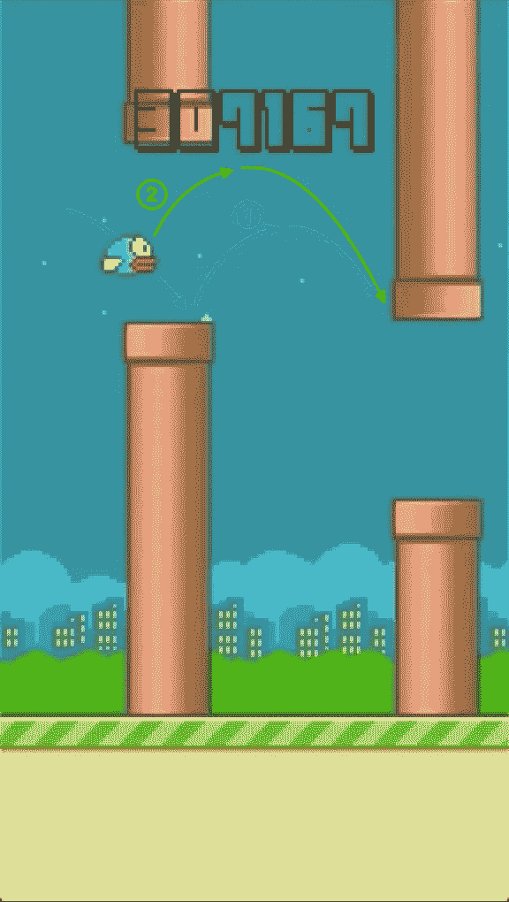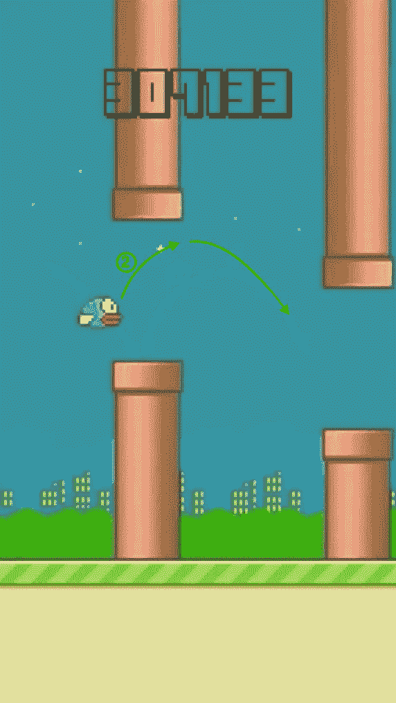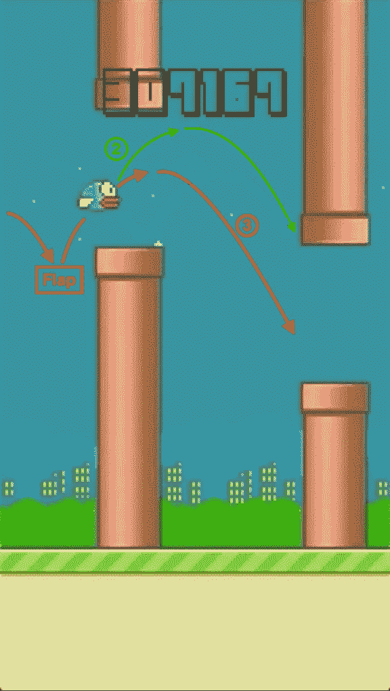

**左:**下一个管道中的巨大落差，**中:**正常情况，容易通过，**右:**最坏情况下的正确轨迹

我们训练鸟几百万次，鸟积累了那个位置的大量正值。最坏的情况是一个相当低发生率的事件，即使有一次导致崩溃的情况，它只有负 1000 奖励。剩余值仍然是一个很大的正值，或者小鸟可以很容易地从成功的训练中获得另外 1000 奖励。所以小鸟一旦遇到类似的情况就会再次坠毁。

它迫使鸟着眼于长期生存，远离任何导致死亡的行为。不管这只鸟过去成功跑了多少次，它都会在死亡时得到-1000 奖励的惩罚。

**经过这次改进，大大增加了稳定性。**

# 从死亡中恢复游戏

很少有机会遇到最坏的情况。换句话说，这只鸟在这些情况下没有足够的训练。它可能会遇到一次，但下一次，它不会遇到类似的场景。可能要过很久才会再次发生。

不太适合训练。我实时记录了鸟类旅程的最后 50 步，`**the game can resume from the last 50 steps before the crash**`。在短时间内遍历所有可能的状态很有帮助。

我们以之前的案例为例。鸟在进入隧道时处于下落状态，无论走*路线 1* 或*路线 2* 或任何其他路线，它仍可能撞在下一根管道上。游戏从这一点重新开始，它可能会尝试其他动作并死亡。重新开始游戏，直到小鸟发现它应该处于上升状态才能进入这种情况。那么它可以经历任何情况，包括最坏的情况。

# 内存问题

在`Bot`类中，它保存了每个动作的状态信息，一旦鸟死了，这些信息将用于更新 Q-table。

当 bird 达到几百万次时，它会消耗大量内存。也减缓了训练速度。

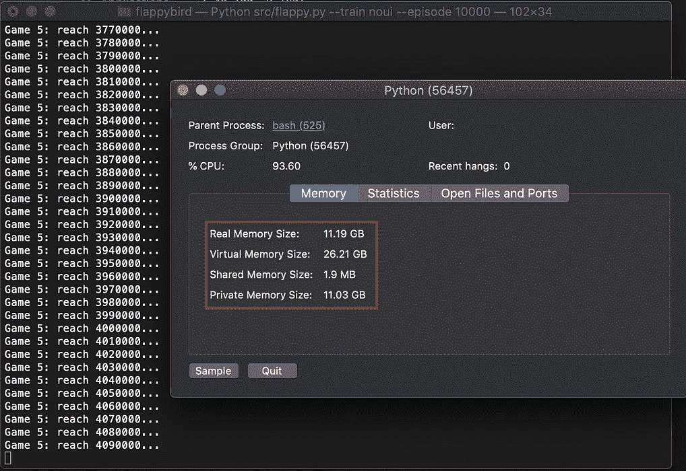

更改前后的内存消耗

每 500 万步，相当于大约 139，000 个分数，我更新 Q 表，然后减少数组列表。我仍然留有 100 万步的缓冲，以避免在 600 万步后鸟坠毁时对鸟的冲击。

每 500 万步更新一次 Q 表

更改后最大内存消耗在 1GB 左右，比之前少了很多。

# q 表初始化

在最初的解决方案中，它需要一个单独的步骤来初始化 q 表，并且它还包括许多鸟从未经历过的状态。

在我的解决方案中，只有当鸟经历一个新的状态时，状态才被初始化。所以 Q-table 只包含鸟曾经经历过的状态。它不需要单独的步骤来初始化 Q 表。

要从头开始新的培训，只需删除`data/`文件夹下的`qvalues.json`文件。

# 确认

经过长时间的训练(10 多个小时)，我进行了验证测试，最高分为 10 分，第 2 集。一旦小鸟得分达到 10 米，游戏将重新开始。这项测试表明，训练有素的代理人可以飞行很长时间，没有任何坠毁。即使在没有 UI 的情况下训练，我的 Mac 也需要将近 2 个小时才能达到 1000 万分。这次测试我只跑了两集。

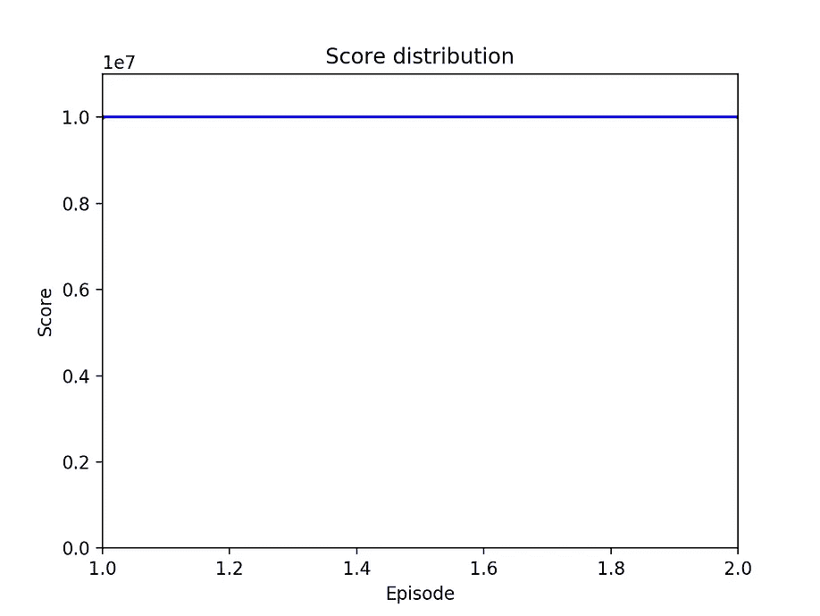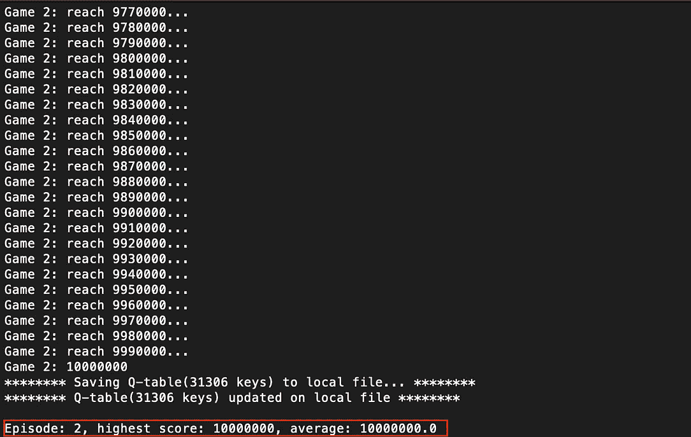

总训练集:2，最高分:1000 万

从起点到第一个管道，鸟将毫无障碍地飞行很长一段距离，第一个管道之前的状态不会与接下来的训练相同，接下来的测试表明受过训练的代理完美地处理了旅程的开始。设置最高分=10，集=100，000，代理通过了测试，没有任何失败。

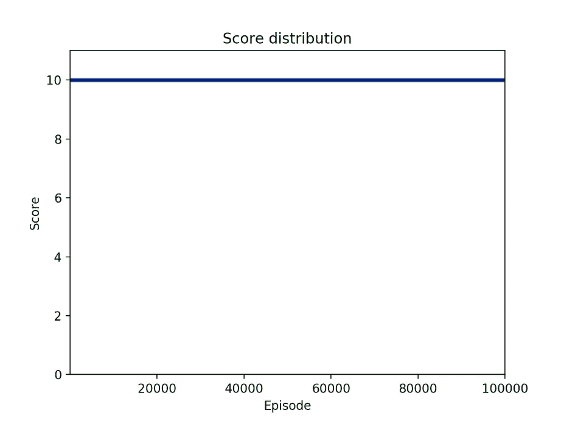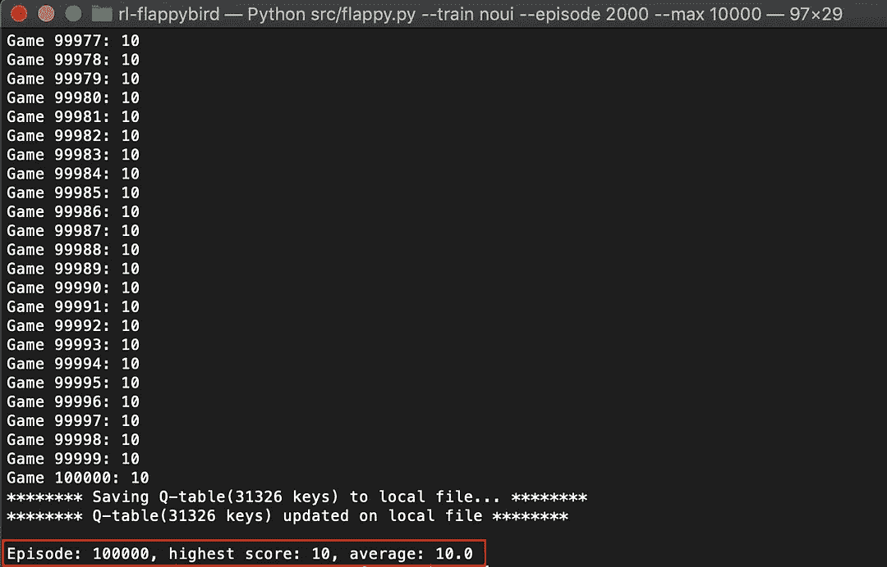

总训练集:100，000，最高分:10

第三个测试演示了任何游戏的稳定性和再现性。在这个测试中，最高分=10，000，插曲=2，000，经过训练的代理也没有任何失败地通过了。

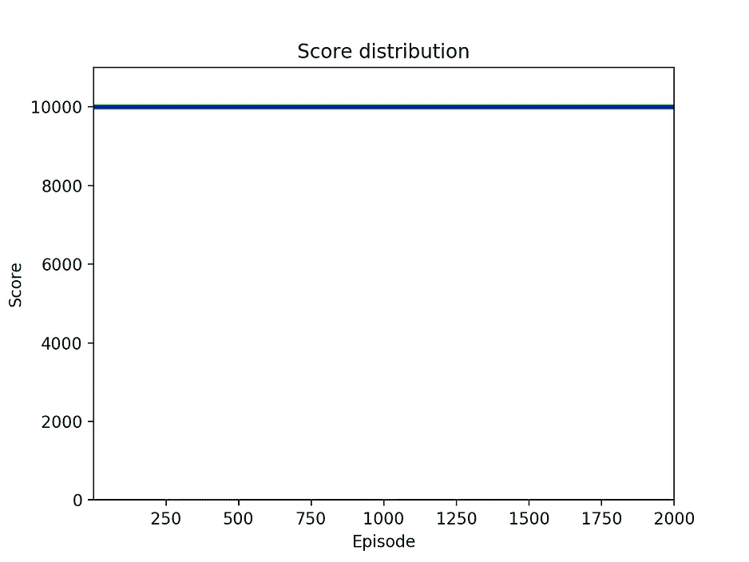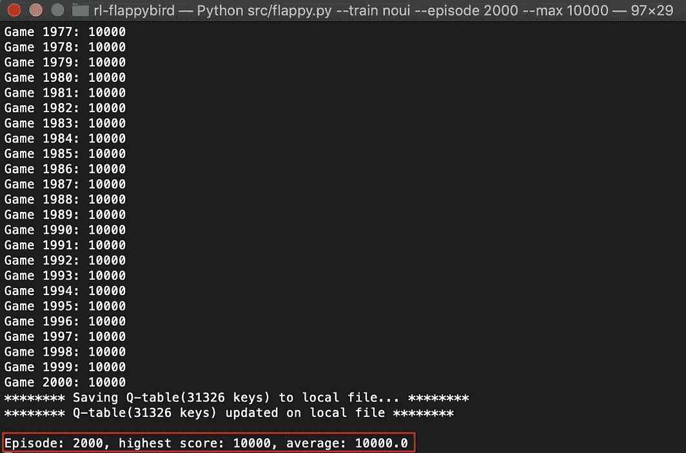

总训练集:2000，最高分:10000

出于好奇，我做了最后的测试，看看这只鸟能飞多少分。我只给一集设置了 Max Score=50，000，000。

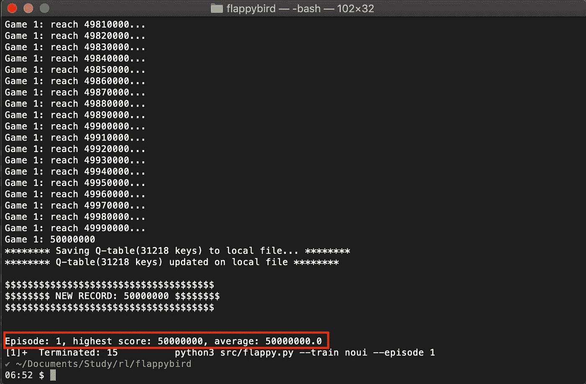

小鸟达到了 50 米的成绩！！

# 结论

现在我们可以说受过训练的特工(flappy bird)永远不会死。

# 密码

在 github 中:https://github . com/kykin 78/rl-flappybird

# 参照(References)

[http://sarvayavaish . github . io/flappybirdrl/](http://sarvagyavaish.github.io/FlappyBirdRL/)
[https://github . com/CHN cyhn/flappybird-qle learning-bot](https://github.com/chncyhn/flappybird-qlearning-bot)
[https://github . com/soura HV/flappybird](https://github.com/sourabhv/FlapPyBird)