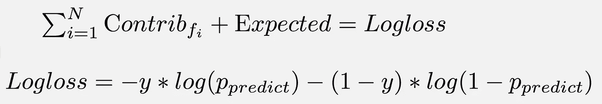
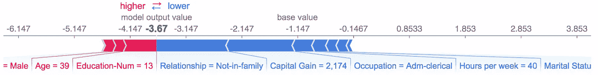
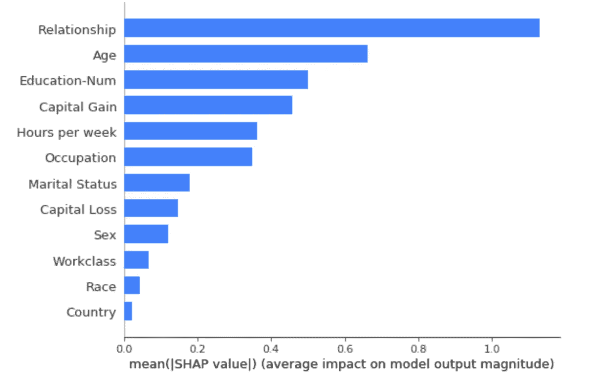
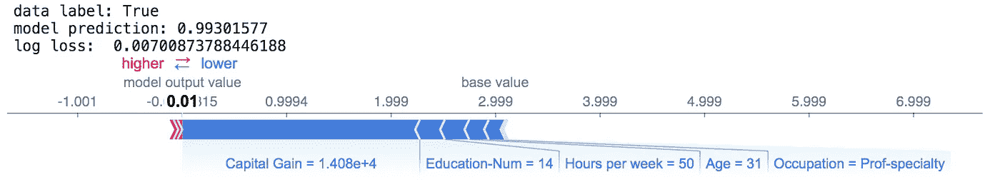
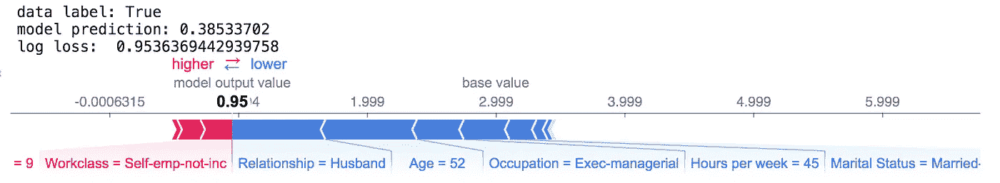
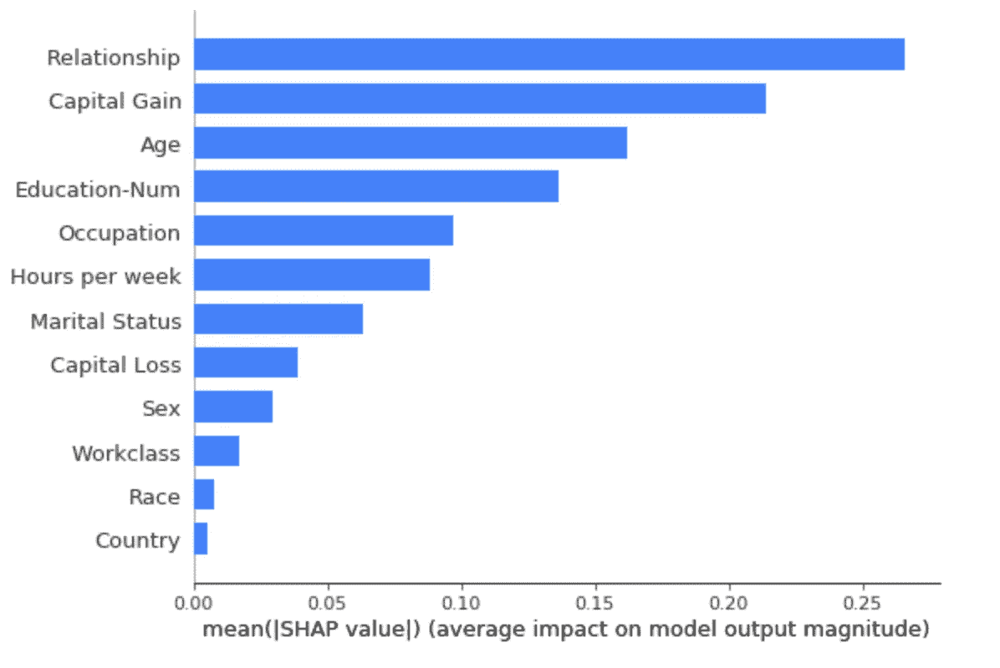
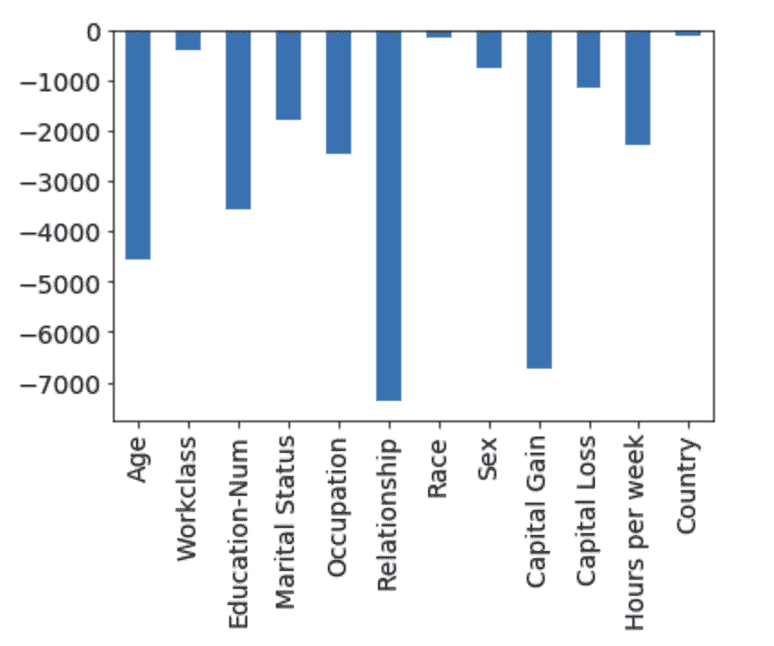
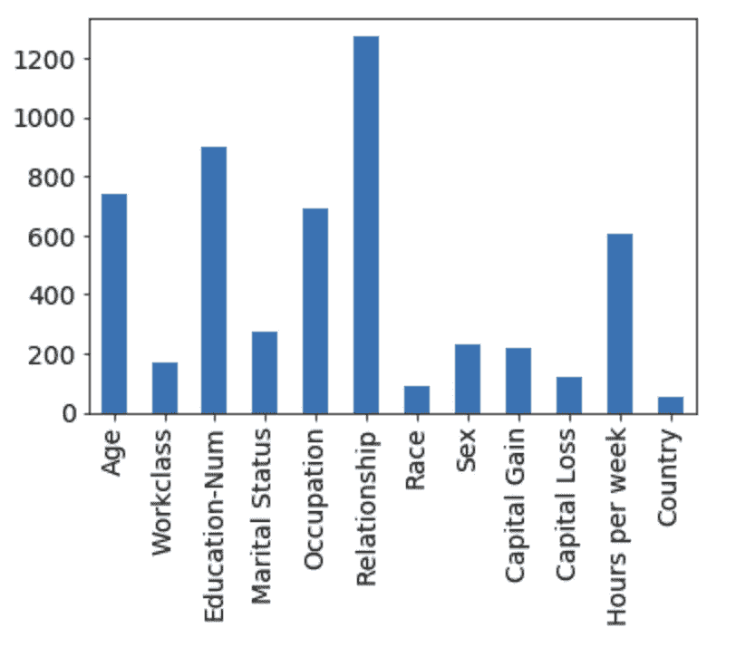
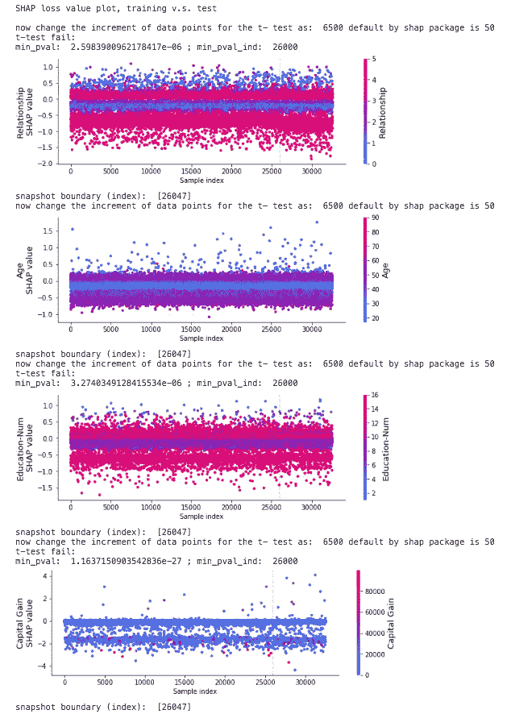
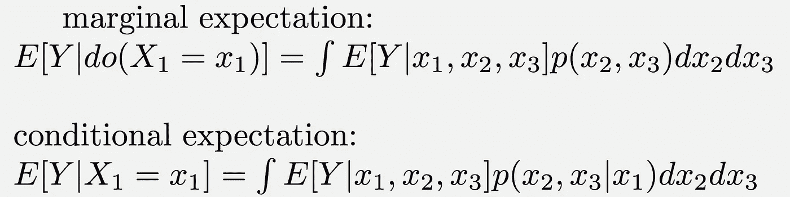

# 使用 SHAP 损耗值来调试/监控您的模型

> 原文：<https://towardsdatascience.com/use-shap-loss-values-to-debug-monitor-your-model-83f7808af40f?source=collection_archive---------32----------------------->

## 你应该如何理解和使用 SHAP 损失值

近年来，负责任的人工智能一直是一个非常热门的话题。问责制和可解释性现在成为机器学习模型的必要组成部分，特别是当模型做出将影响人们生活的决策时，例如医疗诊断和金融服务。这是机器学习的一个非常大的主题，许多正在进行的工作都致力于各个方面。您可以查看关于这个主题的更多资源[1]。在这篇文章中，我将重点介绍[SHAP](https://github.com/slundberg/shap)(SHapley Additive explaining)，这是最受欢迎的可解释性包之一，因为它的通用性(局部/全局可解释性；模型特定/不可知)和来自博弈论的坚实理论基础。您可以找到许多帖子和教程来了解 SHAP 如何帮助您了解您的 ML 模型如何工作，即您的每个要素如何对模型预测做出贡献。然而，在这篇文章中，我将谈论许多人可能不太熟悉的 SHAP 损失值。我将通过一个例子来介绍一些关键概念。我也分享一下我的一些想法。

首先，你可能想要检查由 SHAP 软件包提供的[例子](https://github.com/slundberg/shap/blob/master/notebooks/tree_explainer/Explaining%20the%20Loss%20of%20a%20Model.ipynb)。有两个重要的注意事项:

*   shap loss 值将向您显示每个要素如何影响 logloss 值与预期值的比值。注意，在这篇文章中，当我说损失值时，它指的是 logloss，因为我们将研究分类问题)



就像预测的 SHAP 值一样，SHAP 损失值表示每个要素对对数损失的影响。预期值是依赖于标签的基线值。当数据实例为真时，通过将所有实例的标签设置为真来计算预期值(当数据实例为假时，设置为假)

*   你应该使用“介入”方法来计算 SHAP 损失值

本质上，这意味着在整合缺失的特性时，应该使用边际分布而不是条件分布。实现边缘分布的方法是用来自背景数据集中的值来分配缺少的特征。

使用“介入式”(即边缘分布)或“tree_path_dependent”(即条件分布)是一个重要的细微差别(参见 SHAP 包中的 [docstring](https://github.com/slundberg/shap/blob/fc30c661339e89e0132f5f89e5385e3681090e1f/shap/explainers/tree.py#L39) )，值得进一步讨论。但我不想一开始就让你困惑。你只需要知道，在通常的做法中，TreeShap 计算 Shap 值的速度非常快，因为它利用了来自模型的树结构的条件分布，但条件分布的使用会引入因果关系的问题[2]。

# 训练 XGBoost 分类器

这篇文章中的例子是从 SHAP 包中的[教程例子](https://github.com/slundberg/shap/blob/master/notebooks/tree_explainer/Census%20income%20classification%20with%20XGBoost.ipynb)修改而来的，你可以在这里找到完整的代码和笔记本[。我首先训练了一个 XGBoost 分类器。数据集](https://github.com/Chancylin/shap_loss)使用 12 个特征来预测一个人的年收入是否超过 5 万英镑。

```
['Age', 'Workclass', 'Education-Num', 'Marital Status', 'Occupation', 'Relationship', 'Race', 'Sex', 'Capital Gain', 'Capital Loss', 'Hours per week', 'Country']
```

您可以使用 SHAP 软件包来计算 shap 值。力图将为您提供局部可解释性，以了解这些特性如何对感兴趣的实例的**模型预测**有所贡献(图 1)。汇总图将给出全局可解释性(图 2)。你可以查看 Jupyter 笔记本的第一部分。没有什么新的，只是 SHAP 的常见用法，所以我将把细节留给你，并跳转到第 2 部分， **shap 值的模型损失**。



图一。力图显示了每个特征如何将模型输出从基础值推至模型输出。请注意，输出是在对数优势比空间中。



图二。SHAP 摘要图给出了全局可解释性。量值大的要素意味着它对预测有更重要的影响。

# 解释模型的对数损失

现在对模型损失的贡献更感兴趣，所以我们需要计算 shap 损失值。在某种意义上，这类似于残差分析。代码片段如下。请注意，您需要

*   提供背景数据，因为我们使用“介入”方法。并且计算成本可能是昂贵的。所以你要提供一个合理大小的背景数据(这里我用 100)。
*   现在 model_output 是“log_loss”。

```
# subsample to provide the background data (stratified by the target variable)X_subsample = subsample_data(X, y)explainer_bg_100 = shap.TreeExplainer(model, X_subsample, 
                                feature_perturbation="interventional", 
                                      model_output="log_loss")shap_values_logloss_all = explainer_bg_100.shap_values(X, y)
```

**力图**

现在，数据实例的预测图具有与图 2 类似的解释，但是是根据测井曲线损失而不是预测。图 3 给出了成功的预测(基础事实为真，预测为真)，而图 4 给出了错误的预测(基础事实为真，预测为假)。您可以看到蓝色的要素如何试图减少基本值的对数损失，而红色的要素会增加对数损失。值得注意的是，模型损失的基础值(期望值)取决于标签(对/错)，因此它是一个函数而不是一个数字。期望值的计算是通过首先将所有数据标签设置为真(或假)，然后计算平均日志损失，对此您可以在笔记本上查看更多详细信息。我不知道这样计算基值是否有特别的原因，但毕竟基值只是作为一个参考值，所以我认为这应该没有太大关系。



图 3。对于数据实例，地面真值为真，模式预测为真。



图 4。对于数据实例，地面真值为真，模式预测为假。

**概要图**

类似地，我们有模型对数损失的汇总图(图 5)。这将告诉您特征如何影响模型对数损失(计算基于绝对平均值)。贡献较大的功能意味着它对模型损失的贡献很大，可能会增加某些数据实例的对数损失或减少其他数据实例的对数损失。因此，这里的摘要图应该显示与图 2 中 shap 值的顶部特征的一致性。但是我们可以看到排名顺序有点不同。虽然“关系”仍然是最重要的，但“年龄”、“教育程度”、“资本收益”、“每周工作时间”、“职业”的顺序不同。并且图 5 中的“资本收益”比图 2 中的“资本收益”具有相对较大的贡献。这表明“资本收益”在减少测井损失中起着重要作用，而相对而言，与“关系”相比，模型进行预测可能并不那么重要。值得注意的是，应谨慎解释图 5 中的摘要图，因为图 5 中的条形图是基于绝对平均值计算的，这意味着在对某个特征的重要性进行排序时，会考虑降低对数损失和增加对数损失的影响。简单地说，大量的(绝对)贡献不一定意味着一个特性是“好”的特性。



图 5。类似于图 2，但基于模型对数损失。

当然，您可以使用散点图而不是柱状图来查看详细的分布，以便更深入地进行模型调试(例如，提高模型性能)。我研究的另一种方法是将形状损失值分解为负分量(图 6)和正分量(图 7)。就模型调试而言，您希望获得更大的负值，并减少所有功能的正值，因为您希望所有功能都减少最终的模型 logloss。



图 6。每个要素的所有负形状损失值的总和。



图 7。每个要素的所有正形状损失值的总和。

## 监控图

现在我们到了最有趣的部分:使用 shap 损失值来监控您的模型。模型漂移和数据漂移是现实世界中的问题，您的模型会退化并导致不可靠/不准确的预测。但这些通常都是悄无声息地发生的，很难找出根本原因。在 SHAP 作者最近的一篇论文[3]中，他们使用 shap 损失值来监控模型的健康状况。这个想法很吸引人，我希望在这方面做更多的探索。请注意， [API](https://github.com/slundberg/shap/blob/master/shap/plots/monitoring.py) 是可用的，但似乎正在开发中。

首先，我们需要计算训练数据和测试数据的形状损失值。在监控环境中，您需要计算来自不同时间快照的数据集的 shap 丢失值。您可能还记得，我们在本节开始时已经这样做了。但是请注意，我们使用从整个数据集采样的背景数据。出于监控的基本原理，通过使用来自训练数据集和测试数据集的背景数据，分别计算训练数据集和测试数据集的 shap 损失值更有意义。代码片段如下:

```
# shap loss values for training data
X_train_subsample = subsample_data(X=X_train, y=y_train)explainer_train_bg_100 = shap.TreeExplainer(model, X_train_subsample, 
                                            feature_perturbation="interventional", model_output="log_loss")shap_values_logloss_train = explainer_train_bg_100.shap_values(X_train, y_train)# shap loss values for test data
X_test_subsample = subsample_data(X=X_test, y=y_test)explainer_test_bg_100 = shap.TreeExplainer(model, X_test_subsample, 
                                           feature_perturbation="interventional", model_output="log_loss")shap_values_logloss_test = explainer_test_bg_100.shap_values(X_test, y_test)
```

顶部特征的监控图如图 8 所示。首先，所有数据实例将按索引排序。这里我们假设指数表示时间的演变(沿着轴从左到右)。在这个玩具示例中，我们没有来自不同时间快照的数据，因此我们简单地将训练数据视为当前数据，将测试数据视为我们想要监控的未来数据。

根据 SHAP 帕克凯奇目前的实施情况，理解这些监测地块有几个要点。为了查看 shap 损失值是否具有时间一致性，将重复进行 t 检验来比较两个数据样本。当前的实现使用 50 个数据点的增量来分割数据。这意味着，第一个 t 检验将比较数据[0: 50]和数据[50:]；第二个将比较数据[0: 100]和数据[100:]，依此类推。如果 p 值小于 0.05/n_features，t 检验将失败。换句话说，它使用 95%的置信度，并应用了 Bonferroni 校正。如果 t 检验失败，将绘制一条垂直虚线来指示位置。有点令人惊讶的是，我们看到监控图显示了[“关系”、“教育数量”、“资本收益”]的 shap 损失值的不一致性，当我们输入测试数据的时间快照时就会发生这种情况(图 8)。


图 8。监控顶部特征的图。训练数据集和测试数据集被连接以模拟来自不同时间快照的数据。请注意，测试数据从索引 26047 开始。

我不太清楚使用 50 个数据点增量的原因。而在这个例子中，由于我们知道[0:26048]是训练数据，[-6513:]是测试数据。我将增量修改为 6500，看看它是否会给出不同的结果。但是当比较测试数据时，监测图仍然显示相同的不一致性(即，t-测试的失败)(图 9)。



图 9。监控顶部特征的图。类似于图 8，但是现在我们使用 6500 个数据点的增量。目的是将测试数据与训练数据的最后一个“时间段”直接进行比较。

最后，我觉得直接对训练数据和测试数据进行 t 检验是个不错的主意。这再次验证了训练数据集和测试数据集之间的形状损失值不一致的结论。

```
# t-test for top features (assume equal variance)
t-test for feature:  Relationship , p value:  2.9102249320497517e-06
t-test for feature:  Age , p value:  0.22246187841821208
t-test for feature:  Education-Num , p value:  4.169244713493427e-06
t-test for feature:  Capital Gain , p value:  1.0471308847541212e-27# t-test for top features (unequal variance, i.e., Welch’s t-test,)
t-test for feature:  Relationship , p value:  1.427849321056383e-05
t-test for feature:  Age , p value:  0.2367209506867293
t-test for feature:  Education-Num , p value:  3.3161498092593535e-06
t-test for feature:  Capital Gain , p value:  1.697971581168647e-24
```

训练数据和测试数据之间的 shap 损失值的不一致实际上是非常意外的，并且可能是麻烦的。请记住，我们只是从整个数据集使用训练/测试分割，因此有很好的理由相信训练数据集和测试数据集在数据分布或 shap 损失值贡献方面应该是一致的。无论如何，这只是一个简单的实验，需要进行更多的调查才能得出确切的结论。但我认为，SHAP 软件包表明监控功能只是初步的，可能有一些原因，例如:

*   在我看来，使用 50 个数据点的增量是任意的；
*   t-test 看起来非常敏感，可能会发出许多错误警报。

另一个有趣的讨论点是背景数据的使用。注意，对于监测图，使用不同的背景数据(来自训练数据集/测试数据集的子样本)计算训练数据集和测试数据集的 shap 损失值。由于计算 shap 损失值的“介入”方法非常昂贵，我只尝试了 100 个数据实例大小的子样本数据。这可能会产生 shap 损失值的高方差结果。也许大规模的背景数据将减少方差，并给出监测地块中形状损失值的一致性。当我使用相同的背景数据(来自整个数据集的子样本)时，监测图中不会出现不一致。所以你如何选择背景数据很重要！

# 结论和讨论

希望这篇帖子能给你有用的介绍 shap 损失值。通过调查 shap 损失值，可以更好地调试 ML 模型。它也可以是一种有用的方法来监控您的 ML 模型的模型漂移和数据漂移，这在社区中仍然是一个非常大的挑战。但是请注意它的局限性:为了使用 shap 损失值进行监控，您需要了解新数据的真实情况，这通常只能在一段时间后才能获得。此外，不幸的是，这一功能仍在开发中，使用 t-test 的适当性需要进一步证明。

最后但同样重要的是，通过边际分布或条件分布计算 shap 值(TreeShap)可以给出不同的结果(见等式)。条件分布的使用会引入因果关系的问题，而边际分布会给模型提供不太可能的数据点[4]。对于使用哪一个，取决于什么场景，似乎没有一致的意见[2，5]。这篇论文[6]对这个话题有一些有趣的评论，我想在这里引用一下:

> 一般来说，用户是否应该用不属于原始训练分布的输入来呈现他们的模型是一个正在进行的辩论的主题。
> 
> ….
> 
> 这个问题适合于一个更大的讨论，即你的归因方法是否应该“忠于模型”或“忠于数据”，这已经在最近的几篇文章中讨论过了。



说明如何使用边际分布和条件分布来整合缺失值(即缺失特征)。这里 X1 是呈现特征，而 X2、X3 是缺席特征。转载自[2]。

谢谢你的时间。并且不要犹豫留下任何评论和讨论！

本帖中的所有情节都是作者使用 SHAP 软件包创作的。如果你认为你的任何作品没有被恰当地引用，请告诉我。

[1] [负责任机器学习简介](https://jphall663.github.io/GWU_rml/)

[2] Janzing，d .，Minorics，l .，& Blö baum，P. (2019 年)。可解释人工智能中的特征相关性量化:一个因果关系问题。[https://arxiv.org/abs/1910.13413](https://arxiv.org/abs/1910.13413)

[3] Lundberg，S.M .，Erion，g .，Chen，h .，DeGrave，a .，Prutkin，J.M .，Nair，b .，Katz，r .，Himmelfarb，j .，Bansal，n .和 Lee，S.I. (2020)。用可解释的人工智能对树木从局部解释到全局理解。*自然机器智能*， *2* (1)，2522–5839。

[4][https://christophm . github . io/interpretable-ml-book/shap . html](https://christophm.github.io/interpretable-ml-book/shap.html)

[5]m . Sundararajan 和 a . naj mi(2019 年)。用于模型解释的多个 Shapley 值。 [*arXiv 预印本 arXiv:1908.08474*](https://arxiv.org/abs/1908.08474) 。

[6] Sturmfels，p .，Lundberg，s .，和 Lee，S. I. (2020 年)。[可视化特性属性基线的影响](https://distill.pub/2020/attribution-baselines/)。*提取*， *5* (1)，e22。