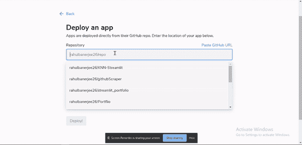
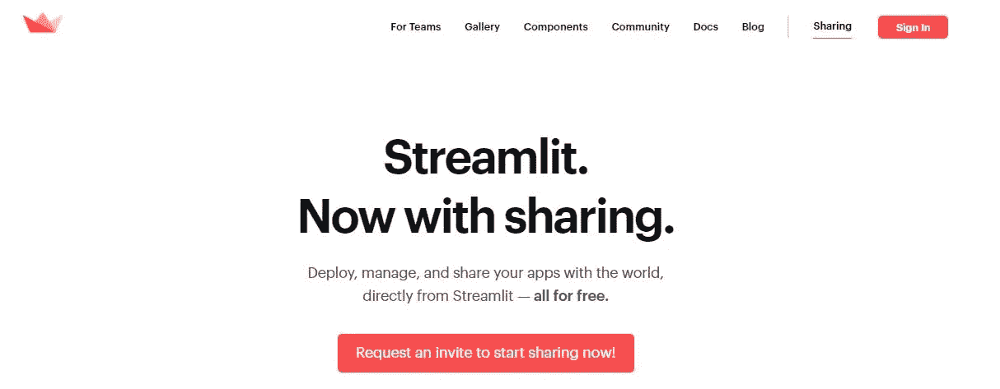
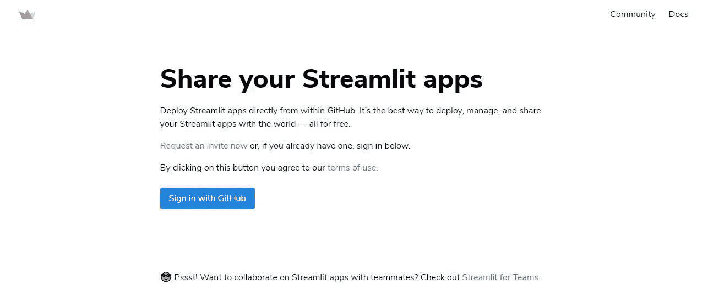
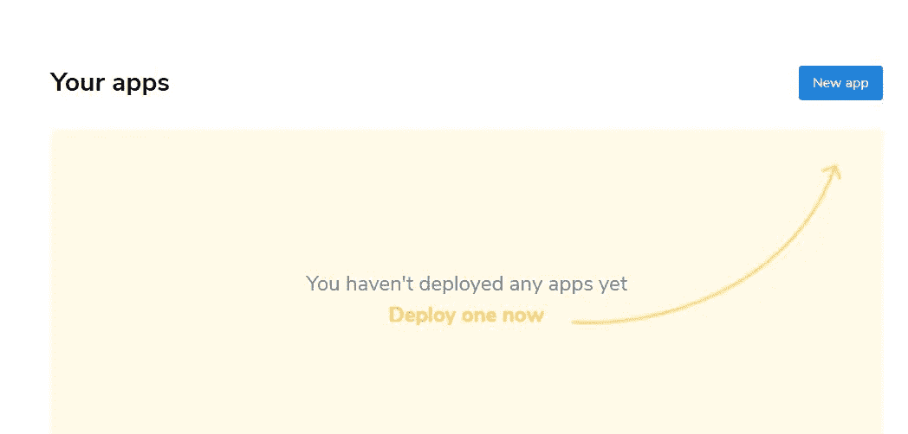
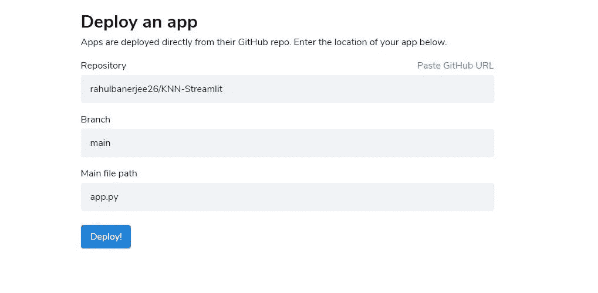
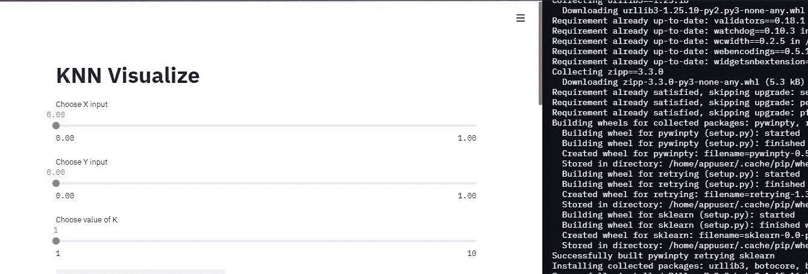

# 使用简化 it 共享来部署您的简化 it 应用

> 原文：<https://towardsdatascience.com/use-streamlit-sharing-to-deploy-your-streamliy-apps-c7ff096e2bc4?source=collection_archive---------36----------------------->

## 使用 Streamlit 共享部署您的机器学习 Web 应用程序



按作者部署 Streamlit 应用程序 GIF

在我以前的文章中，我谈到了从头开始构建 Github Web Scraper 和 KNN 分类模型，并为 UI 使用 Streamlit。

[](https://medium.com/python-in-plain-english/how-to-build-a-streamlit-app-to-scrape-github-profiles-f36d41fb98c) [## 如何构建一个 Streamlit 应用程序来抓取 Github 配置文件

### 在本教程中，我们将使用 Streamlit 构建一个 web 应用程序，它从 GitHub 中抓取用户信息。它显示了基本的…

medium.com](https://medium.com/python-in-plain-english/how-to-build-a-streamlit-app-to-scrape-github-profiles-f36d41fb98c) [](/how-to-build-a-knn-classification-model-from-scratch-and-visualize-it-using-streamlit-9fe8059cc418) [## 如何从头开始构建 KNN 分类模型，并使用 Streamlit 对其进行可视化

### 虽然像 sklearn 这样的库让我们的生活变得更加轻松，但是从头开始制作一个模型总是一个很好的做法…

towardsdatascience.com](/how-to-build-a-knn-classification-model-from-scratch-and-visualize-it-using-streamlit-9fe8059cc418) 

如果不能展示给别人看，那么构建 UI 又有什么意义呢？

> 进入 Streamlit 共享！

Streamlit sharing 是 Streamlit 提供的一项服务，用于轻松部署您的应用。下面我将介绍部署过程中的步骤。

## 获得简化的共享

Streamlit 共享目前处于测试模式，您需要加入等待列表才能访问它。通常需要几天才能进入，我在 72 小时内就进入了。去他们的网站注册



你注册的页面截图

几天之内，你应该会收到一封允许你访问的邮件。

## 用必要的库创建一个文本文件

创建一个包含依赖项的 requirements.txt 文件。下面是创建文件的命令

```
pip freeze > requirements.txt
```

在键入上述命令之前，请确保您的虚拟环境已激活

## 将文件上传到 GitHub

在 GitHub 上创建一个公共存储库并上传。py 文件和 requirements.txt 文件。


我的 Github 回购截图

我将部署以下[回购](https://github.com/rahulbanerjee26/KNN-Streamlit)

## 登录以简化共享

前往[关注网站](https://share.streamlit.io/)，使用您的 GitHub 账户登录。



https://share.streamlit.io/[截图一](https://share.streamlit.io/)

授权 Streamlit 并允许其访问您的 Github Repos。

## 创建新应用程序



[https://share.streamlit.io/](https://share.streamlit.io/)截图二

点击新应用程序



[https://share.streamlit.io/](https://share.streamlit.io/)截图三

选择您的存储库和分支。在我的例子中，它是回购协议的主分支，名为“rahulbanerjee 26/KNN-细流”

主文件路径应包含 app.py 文件的路径或。包含 Streamlit UI 代码的 py 文件。如果您的 app.py 文件位于名为“app”的文件夹中，路径将为“app/app.py”。确保您提供了正确的路径。填写正确信息后，单击部署。

> 现在只要坐好，放松☺️

部署完成后，您将收到一条成功消息，并能够看到应用程序的演示。



成功部署的屏幕截图

对回购进行的任何更新都会自动重新部署应用程序，几分钟后就可以看到您的更改，当然前提是没有错误。

你可以在这里找到我部署的应用

我最近用 WordPress 创建了一个博客，如果你能看看的话，我会很高兴的😃

 [## Python 项目教程-使用这些 Python 项目教程改进您的简历/作品集。

### 使用 Streamlit 共享部署您的机器学习 Web 应用程序在我以前的文章中，我谈到过构建一个…

realpythonproject.com](https://realpythonproject.com/) 

在 LinkedIn 上与我联系

[](https://www.linkedin.com/in/rahulbanerjee2699/) [## Rahul baner JEE——产品工程实习生——EY | LinkedIn

### 查看 Rahul Banerjee 在世界上最大的职业社区 LinkedIn 上的个人资料。拉胡尔有 4 个工作列在他们的…

www.linkedin.com](https://www.linkedin.com/in/rahulbanerjee2699/) 

在 Twitter 上与我联系