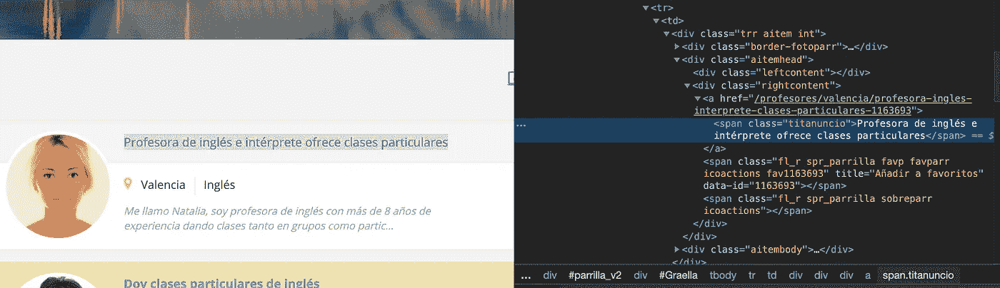
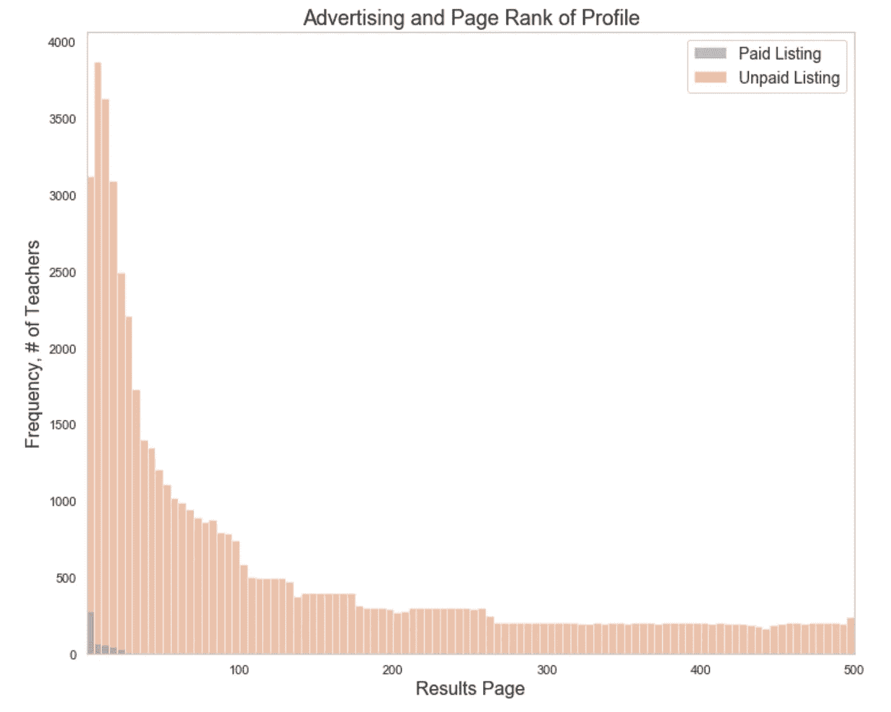

# 使用网络抓取和熊猫进行市场分析:西班牙的 ESL 教学

> 原文：<https://towardsdatascience.com/use-web-scraping-and-pandas-for-a-market-analysis-esl-teaching-in-spain-75029dd0a1e5?source=collection_archive---------16----------------------->

通过分析公开可用的数据，了解任何行业的竞争格局。以下是一个案例研究，利用西班牙最受欢迎的私人教师网站，考察了西班牙的 ESL(英语作为第二语言)市场。

# 介绍

互联网是一个势不可挡的地方。有大量公开可用的结构化数据集可供分析，但大多数信息都以 HTML 的形式存在，这些 HTML 是动态生成的，并经过优化以在视觉上取悦查看者，但对数据科学家的分析没有用处。

Web 抓取是一个强大的工具，它允许我们机械地获取公开可用的数据，并以一种对我们的需求有用的方式对其进行组织。一旦原始数据被提取、清理和处理，我们就可以轻松地使用 Pandas 来分析数据。

```
 Web Scrape + Pandas = Insights / Competitive Advantage / Profit
```

使用这种有效工具组合的真实例子数不胜数:

*   **竞争力分析。**浏览 Craigslist，查看旧金山的租赁市场，并代入等式，确定某栋房子的价格是否过低或过高。
*   **市场概况。**浏览 Yelp，深入了解洛杉矶哪个县的塔克里亚斯代表不足。
*   **可行性研究。**浏览 LinkedIn，评估拥有特定技能的员工的地理位置，以帮助确定在特定地区开设新分支机构是否有意义。

# 案例研究:西班牙的 ESL 私人教师

西班牙的英语水平是欧洲最低的之一，因此对 ESL 教学有很高的需求(最近的一项研究将其在 33 个欧洲国家中排在第 25 位)。随着世界变得越来越相互关联，企业越来越国际化，了解英语这一世界语言的重要性是至关重要的。

课外 ESL 教学可以采取多种形式；自学教材，书院集体课或者私教。本案例研究将考察一个最受欢迎的联系私人教师和学生的网站上的私人英语教师市场:[Tus Clases speciales](https://www.tusclasesparticulares.com/)。

想象一下，一位新教师正在西班牙开始他们的 ESL 教学之旅，并希望对市场有所了解。我们想要回答的一些基本问题:

*   **总体概述。**老师都在哪里？
*   **小时费率。**哪些地区的时薪最高和最低？
*   **教师需求。**根据人口数量，是否存在教师人数不足或过多的地区，这是否会影响报价？
*   **收视率。**收视率影响价格吗，有百分之几的老师有？
*   **付费广告。**有百分之多少的教师会为网站上的广告付费，这是否带来了明显的优势？
*   **搜索结果。**谁在顶端？算法是否偏向有评论的老师，付费客户，新老师，有照片的老师…？

是时候开始刮了。

# 第 1 部分:从特定区域的结果页面获取概要文件 URL

让我们从访问瓦伦西亚地区英语教师的搜索结果开始，瓦伦西亚是地中海沿岸的西班牙海鲜饭的阳光之地。

第一步是直观地检查特定 URL 的结果，检查 HTML，并了解我们希望如何处理抓取。

```
url = '[https://www.tusclasesparticulares.com/profesores-ingles/valencia.aspx'](https://www.tusclasesparticulares.com/profesores-ingles/valencia.aspx')
```


(显示了 5 个广告列表，但是在每个结果页面上有 20 个——除了每个地区的最终结果页面)

让我们使用 chrome 上的“inspect”功能来挖掘一些广告列表背后的 HTML。



我们可以看到，每个广告列表都封装在一个特殊的 div 类中，遵循特定的模式:

```
#profile 1:
<div class="trr aitem int"> 
#profile 2:
<div class="trr aitem destacado plus int">
```

这个线索允许我们识别每个广告列表何时开始和结束。成功抓取网页的关键是识别这些线索和模式，以便机械地提取数据。所有有趣的细节都在这个 div 类中。

我们的攻击计划是使用极其有用的 Python 库 [Beautiful Soup](https://www.crummy.com/software/BeautifulSoup/bs4/doc/) 遍历每个广告列表并提取所需的信息。原始的 HTML 很难处理，但是漂亮的 Soup 使用惯用的搜索、导航和编辑方式引导我们通过解析树。

```
#pull raw html
html = get(region_url)
soup = BeautifulSoup(html.text, 'html.parser')
```

让我们使用 *soup.find_all* 和 regex 包 [re](https://docs.python.org/2/library/re.html) 来查找正确指向单个广告列表的文本模式——这将产生可迭代的 20 个教师简介。

```
for element in soup.find_all('div', {'class' : re.compile(r'^trr aitem')}):
```

在每个广告列表(div 类)中，解析并保存各种数据点，其中最重要的是单个列表的 URL(包含我们想要抓取的大部分数据)。

```
#look for a specific class that indicates the presence of a stock photo, indicating that the teacher does not  use their own photo
if element.find('span', {'class' : 'spr_parrilla fotoparr'}) is     None:
    has_picture=True
else:
    has_picture=False#look for ad listing URL (that directs to seperate page of listing) for link in element.find_all('div', {'class' : 'rightcontent'}):
if link.a is not None:
    #construct full URL which links to specific ad
    base_url = '[https://www.tusclasesparticulares.com'](https://www.tusclasesparticulares.com')
    scrapped_url = link.a.get("href")
    profile_url = base_url + scrapped_url
    break
else:
    #rare cases with no profile_url, log this information
    profile_url = 'EMPTY'
    break
```

我们暂时结束了！增加页面排名(记住，我们是在每个广告出现在页面上时循环播放)，将所有内容保存到字典中，然后添加到列表中。

```
page_rank += 1
profe_dict = {'profile_url' : profile_url,
            'results_page_url' : region_url,
            'page_rank' : page_rank,
            'results_ad_status' : results_ad_status,
            'has_picture' : has_picture,
            'html' : html}
landing_page_dict_list.append(profe_dict)
```

由此产生的词典列表可以很容易地转换成 Pandas 数据框架并打印出来，以显示原始数据。


我们立即拥有 20 条记录，每条记录都有几个有用的数据点。下一步是访问每个配置文件 URL，以获取每个广告列表的更多信息。

# 第 2 部分:Ping 每个配置文件的 URL，获取每个教师的详细数据点

让我们继续使用适用于第 1 部分的公式:

1.  访问 URL 并使用 chrome 可视化检查 HTML。
2.  找到数据存储的模式，并使用 Beautiful Soup 访问这些数据。
3.  遍历 URL，将抓取的数据保存到字典列表中，转换成 Pandas Dataframe 并检查数据。


钻研 HTML。

用美汤解析。以下是代码示例。(GitHub 上有完整的笔记本，嵌入在本文末尾)。

```
#TITLE
if len(soup.find_all('div', {'class' : 'detinfotit'})) == 0:
    ad_title = 'COULD NOT SCRAPE TITLE'
    #add code to try alternative scraping method
else:
    title_element = soup.find_all('div', {'class' : 'detinfotit'})[0]
    ad_title = title_element.text.strip()
try:
   ad_title
except NameError:
    ad_title = 'EMPTY'#GEO LOCATION
for item in soup.find_all('p', {'id' : 'pProvincia'}):
    province = ' '.join(item.text.split()[1:])
try:
   province
except NameError:
    province = 'EMPTY'#PRICE
for item in soup.find_all('div', {'id' : 'dvPrecio'}):
    price = item.text.replace("\n","").replace("\r","")
try:
   price
except NameError:
    price = 'EMPTY'

#DESCRIPTION
for item in soup.find_all('div', {'class' : 'detcntsection c5'}):  
    description = item.text.strip()
try:
   description
except NameError:
    description = 'EMPTY'

#PROFE AD STATUS - BASIC, VERIFIED, PLUS
element = soup.find('p', {'class' : 'mgbottom5 fs16 bold'})
if element is None:
    profe_ad_status = 'EMPTY'
else:
    profe_ad_status = element.text#CREATE DICT WITH ALL ENTRIES AND RETURN DICTIONARY
scraped_profile={
    'url': url,
    'ad_title' : ad_title,
    'teaching_subject' : teaching_subject,
    'province' : province,
    'class_level_para' : class_level_para,
    'class_level_niveles' : class_level_niveles,
    'method' : method,
    'price' : price,
    'teacher_name' : teacher_name,
    'rating_count' : rating_count,
    'profe_ad_status' : profe_ad_status,
    'description' : description,
    'page_rank' : profile_dictionary['page_rank'],
    'results_ad_status' : profile_dictionary['results_ad_status'],
    'has_picture' : profile_dictionary['has_picture'],
    'results_page_url' : profile_dictionary['results_page_url'],
    'alternative_scraping' : alternative_scraping,
    'teacher_has_profile_page' : teacher_has_profile_page,
    'is_academy' : is_academy,
    'html' : html
   }
return scraped_profile
```

酷！现在，我们从西班牙一个地区的单个结果页面中获得了大量有趣的数据。以下是数据示例:


对于每个地区，有几十个结果页面，西班牙有 [54 个地区首府](https://es.wikipedia.org/wiki/Anexo:Capitales_de_provincia_de_Espa%C3%B1a_por_poblaci%C3%B3n)需要我们分析。我们还有一点工作要做。

分页问题很容易解决，因为 URL 可以机械地构造:

```
base_url = [https://www.tusclasesparticulares.com/profesores-ingles/valencia.aspx](https://www.tusclasesparticulares.com/profesores-ingles/valencia.aspx?pagina=7)next_page = [https://www.tusclasesparticulares.com/profesores-ingles/valencia.aspx?pagina=2](https://www.tusclasesparticulares.com/profesores-ingles/valencia.aspx?pagina=2)paginated_url = base_url + '?pagina=[PAGE_NUMBER]'
```

一些快速测试告诉我们，如果我们访问一个不存在的分页网址，即['？pagina=9999'](https://www.tusclasesparticulares.com/profesores-ingles/valencia.aspx?pagina=9999) ，我们将被定向回基本 URL。使用一点逻辑，我们可以编写一个循环，该循环将访问特定区域的每个结果页面(以便找出给定区域有多少页面的搜索结果)。

```
results_page_profile_dicts = []
counter = 1
current_page = base_region_url#infinite loop and break out once pagination link false
while True:
    html = get(current_page)
    if html.url == current_page:
        #If so, continue, pagination exists.  
        #CONTINUE WITH SCRAPING, 
        #dictionary with each profile and additional data from results page
        results_page_profile_dicts.extend(get_profile_urls(current_page, html))
        counter +=1
        current_page = base_region_url + '?pagina=' + str(counter)
    #If not, no more pagination exists
    else:
        break
        #finish results page scraping
```

最后一个障碍是遍历西班牙所有地区的首府，以便提取大部分数据。让我们将所有值和 URL 存储在一个字典中，然后遍历每个值和 URL，合并分页逻辑，抓取广告列表结果页面，抓取各个个人资料页面，最后将所有内容保存到一个数据帧中。

```
region_lookup = {
'soria' : '[https://www.tusclasesparticulares.com/profesores-ingles/soria.aspx'](https://www.tusclasesparticulares.com/profesores-ingles/soria.aspx'),
'teruel': '[https://www.tusclasesparticulares.com/profesores-ingles/Teruel.aspx'](https://www.tusclasesparticulares.com/profesores-ingles/Teruel.aspx'),
......
 'barcelona' : '[https://www.tusclasesparticulares.com/profesores-ingles/barcelona.aspx'](https://www.tusclasesparticulares.com/profesores-ingles/barcelona.aspx'),
 'madrid' : '[https://www.tusclasesparticulares.com/profesores-ingles/madrid.aspx'](https://www.tusclasesparticulares.com/profesores-ingles/madrid.aspx')
 }end_loop = len(region_lookup) 
region_start = 0 
for i in range(region_start, end_loop):
    results_page_profile_dicts = []
    counter = 1
    current_page = base_region_url[PAGINATION LOGIC]
[SCRAPE]
[SAVE DATA TO DATAFRAME]
```

结果数据帧数据点:


我们有 57，123 项记录；大量的数据需要分析！在最初的装载和清理步骤之后，我们可以深入了解一些情况。

# 分析笔记

在我们开始分析之前，有一些事情需要记住。

*   **范围。**我们只关注一个网站；这一分析并不全面涵盖西班牙的整个 ESL 教学市场——我们试图通过使用单个网站作为整体市场的代理来获得洞察力。
*   **要价。**时薪是什么老师的单子；这并不代表他们实际得到的价格。
*   **老师过滤。**这个分析旨在只看真正的老师；那些没有价格、没有个人资料图片或没有个人资料页面的照片被排除在分析之外。

# 每小时收费服务

教师的小时工资是如何分配的？哪些地区的产品价格最高和最低？小时费率的快速浏览:


我们可以看到，50%的教师要价在 10-15 欧元/小时之间，平均值为 12.6 欧元。

深入粒度，哪个自治区(地区)的费率最高？


不足为奇的是，像 Pais Vasco、Cataluñ和 Madrid 这样的经济强国接近榜首。

如果你是一名刚进入上述市场的新教师，这些数据将有助于确定收费标准。

# **教师的地理和收入潜力**

老师在哪里？


最大的社区拥有最多的教师。有道理。

从总体人口来看，是否存在某些教师人数不足或过多的领域，这是否会影响每小时的工资？

使用从西班牙[官方国家统计来源](https://www.ine.es/)提取的人口数据，我们可以使用一些方法来比较 ESL 教学的供需。

下图显示了每个首都教师总数的百分比和居民总数的百分比。例如，马德里的居民占所有首都的 23%,但教师仅占总人口的 17%。有人可能会说，居民比教师更集中的地区，对新入职的教师来说，意味着更大的市场机会。


根据上述数据，马德里和萨拉戈萨似乎最需要教师。巴塞罗那、巴伦西亚、塞维利亚和格拉纳达都因教师过剩而引人注目(与居民相比)。这是有道理的，因为上述所有国家的首都都是外国人非常向往的城市。

让我们采取一种稍微不同的方法，简单地看一下居民与教师的比例。


有意思！使用这种方法，我们可以看到我们在之前的图表中选择的一些顶级球队(马德里和巴塞罗那)实际上位于中间位置。这种方法支持加的斯、巴伦西亚、格拉纳达和巴塞罗那都是市场饱和地区的观点。

只知道供给和需求并不能给我们全貌；我们应该将提供的教师时薪和外部工资数据(基于地区)结合起来，以更好地了解市场机会。使用相同来源的全国工资数据，我们计算了各地区的平均时薪，并将其与各地区 ESL 教师的时薪进行了比较。


按正速率差降序排列。

巴利阿里群岛在这一点上领先；教师的小时工资为 14 英镑，而地区平均工资约为 10.8 英镑。有人可能会说，基于生活成本和收入能力，教师的要求高于平均水平，在这个地区会做得很好。一个相反的论点可能是，与人们的收入相比，教师的要价太高了，他们将无法找到工作，因为他们太贵了。这是分析的局限性；我们只知道老师的问率；我们不知道他们是否真的以这样的速度找到了工作。

这里我们有相同的图表，但只是简单地看一下 ESL 教师和平均值之间的比率差异。


让我们尝试得到一个更全面的图片，并将前面的两个概念结合起来:下图是一个散点图，y 轴表示高于地区平均值的每小时教学工资，x 轴表示每个教师的居民人数。该地区的人口决定了点的大小。最理想的城市会在图表的右上方；工资高，教师需求量大(#居民/教师)。


*圆点代表人口的大小

看起来岛屿在召唤我们！巴利阿里群岛的首府帕尔马-德马略卡岛是当地工资收入最高的地方，教师的潜在客户也相对较多。


这是个教英语的好地方。帕特里克·努南的照片。

# 小时费率的变化

各种因素之间的小时工资率如何变化？基于以下因素计算小时费率的变化:

*   **性别*。*** 大约有 10%的教师被授予“专业地位”(通过支付广告产品的费用被认为是特殊的)，如“Profesora verificada”或“professor plus”**。由于西班牙语是一种性别语言，我们可以解析出老师的性别。**
*   **已评级。有一个评分系统，客户可以给老师留下评论。这个类别只是看老师是否有评分。**
*   **广告助推。**教师可以购买一款广告产品，在结果顶部显示他们的列表，并为他们的广告添加醒目的黄色背景。
*   **是本地人。**老师的母语是英语吗？这些所谓的“nativos”非常受欢迎，通常要价更高。我们试图通过在教师描述中使用正则表达式来解析出声称是“本地人”的配置文件。大约 7%的教师声称自己的母语是英语。


这里有很多东西要打开。

*   **性别*。*** 当中位数相等时，男性倾向于更高的要价。
*   **已评级。**至少有一个评级的教师倾向于列出更高的评级。有道理。
*   **广告助推。为一个广告位置付费大大提高了要价。**
*   **是原生的。自称是本地人的老师比那些不是本地人的老师要求更高的工资。**

# **深入探究收视率**

大约 15%的教师至少有一个评级。其中，让我们深入了解每位教师的评级数量。


*只查看有评语的教师

大多数有评分的老师都不到 5 分；为了与其他老师区分开来，尝试获得 5 个以上的评分！收视率如何影响要价？


从逻辑上讲，随着收视率的增加，教师要求更高的时薪。神奇的范围似乎在 5-7 分左右。

# **付费广告的优势**

大约 1.3%的教师支付广告费用来提高他们的成绩。下图显示了按“结果页”划分的教师人数，其中包括未付费教师和付费教师。搜索教师时，结果的第一页是第 1 页(包含 20 名教师)。结果的第二页是第 2 页。最多 500！



我们立即看到，绝大多数是未付费列表，一小部分付费列表位于图表的左下方。100 页之后的结果量是惊人的！谁会点击这么远去找他们的老师？

让我们深入研究一下前 20 页的结果。


我们可以更清楚地看到，付费列表导致更高的页面排名，此外，第一页结果的很大一部分是由支付广告费用的教师组成的。付费才能玩！

可视化另一种方式显然，付费教师将获得更相关的列表:


再一次，令人震惊的是 75%的老师(不付钱)在第 20 页的结果后被埋没了。这些老师肯定没有收到信息；它们必须是废弃或过时的配置文件。为了吸引眼球，人们必须支付广告费。不错的商业模式！

# 搜索结果

各种因素如何影响搜索结果中的排名？在上一节中，我们证明了广告可以带来更好的排名，但是如果有评级，有图片，个人资料页面或价格列表呢？人们可能会认为，拥有广告列表的这些基本元素会导致更高的搜索结果。


在存在评级的情况下，唯一有意义地影响结果排名的元素。所以，潜在的老师们，如果你想在结果中排名靠前，一定要有一些评级，并支付广告费用！

# 最后的想法

基于对我们的网络抓取数据的分析，我们可以提供以下行动项目:

*   通过支付的广告和评级，在搜索结果中获得更高的排名。
*   有至少 5 个评论，并声称你是一个母语人士，并保证要求更高的时薪。
*   选择一个对教师需求高、时薪高于平均水平的地区居住，比如帕尔马-德马略卡或圣塞瓦斯蒂安(这两个地方都很适合居住)。

# 结论

通过利用网络抓取和 pandas，我们已经获得了相当无序和混乱的数据，并将其转化为有意义的可视化和洞察力，让我们了解这个世界。

# 有用的链接

*   [https://www . data camp . com/community/tutorials/web-scraping-using-python](https://www.datacamp.com/community/tutorials/web-scraping-using-python)
*   [https://www . plural sight . com/guides/web-scraping-with-beautiful-soup](https://www.pluralsight.com/guides/web-scraping-with-beautiful-soup)
*   https://www.dataquest.io/blog/web-scraping-beautifulsoup/

# 笔记本电脑

所有的 Jupyter 笔记本和一个 CSV 格式的数据都可以在我的 [Git 库](https://github.com/datachico/WebScraping_Analysis_ESL_Private_classes_in_Spain)中找到。