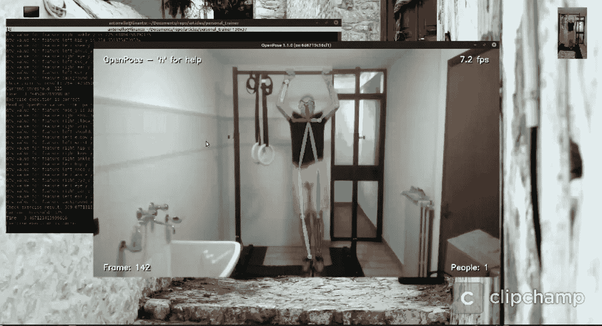
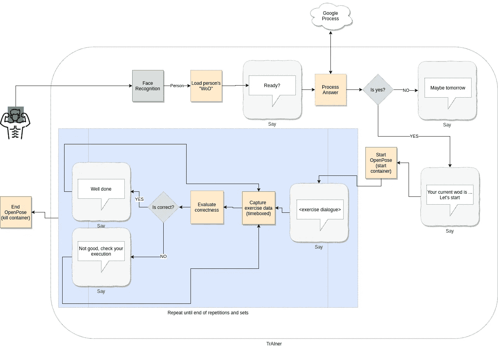

# 在我的锻炼中再次使用机器学习，这次是建立一个私人教练

> 原文：<https://towardsdatascience.com/used-again-machine-learning-in-my-workout-this-time-building-a-personal-trainer-3dfae9730c2b?source=collection_archive---------43----------------------->



以下完整视频

在[之前的](/just-used-machine-learning-in-my-workout-ff079b8e1939)故事中，我试图解决如何发现锻炼是否以正确的形式进行，使用 OpenPose 收集锻炼数据，并使用动态时间扭曲将锻炼执行与作为基线的正确执行进行比较。

这一次，我添加了以下其他组件来大大增强整体体验:

*   令人敬畏的面部识别库(【https://github.com/ageitgey/face_recognition】T2)，用于执行面部识别和加载适当的锻炼
*   令人敬畏的语音识别(【https://github.com/Uberi/speech_recognition】T4)，用于处理用户的回答
*   令人敬畏的谷歌文本到语音转换([https://github.com/pndurette/gTTS](https://github.com/pndurette/gTTS))，用来和用户交谈和指导

这是工作流程的图形表示



基本流程——作者绘制

我仍然使用 OpenPose 的“dockerized”版本([https://github.com/garyfeng/docker-openpose)](https://github.com/garyfeng/docker-openpose)——本地安装相当长——调整一些参数也有可能实现良好的 fps。

体验非常简单:

*   你进入锻炼区域，面部识别组件匹配你的面部，提取一个轮廓(现在只是一个名字)
*   培训师会问你是否准备好开始，并等待你的回答(至少回答“是”——这一部分是按照脚本编写的，当然，可以用更复杂的解决方案来扩展)
*   教练将你的相关“wod”(一天中的锻炼)与要进行的练习(目前只有一项)一起载入
*   在 OpenPose 组件记录身体数据的同时，您可以执行练习重复和设置
*   教练将收集的数据与正确的基线进行比较，评估身体每个部位的动态时间弯曲值，最后给出一个中值。
*   如果该值低于某个阈值，则认为锻炼是正确的，教练给出该反馈，否则它会发出警告(目前是一般的警告，但是应该可以根据哪些身体部位是不正确的给出具体的提示)
*   重复，直到所有的重复完成

但是让我们来看看实际情况——很抱歉视频编辑，肯定是我做得不好:)

我努力工作来获得一个体面的经历，但是，当然，还有很多事情要做。

例如，现在锻炼估计是有时间限制的，但是应该可以训练系统理解锻炼何时开始和结束，丢弃其他帧用于评估。

此外，这只是一种独特的锻炼类型(引体向上),是专门用我的身体测量值进行的基线正确锻炼，但应该可以用通用基线进行不同的锻炼。

关于执行过程中具体错误的更精确的反馈是另一个有趣的研究点。

实现了这一点，它可以用于任何类型的锻炼(健身，瑜伽等)，也可以用于对象(使用自定义跟踪对象算法)，在独立模式下，或作为真正的教练的助手。

这是另一个例子，展示了结合不同的工具和库，在几个小时内可以实现什么，这在几年前是不可想象的，并且一直让我感到惊讶！

我希望你喜欢看这个(但是也看看上面的视频)，谢谢你！

# 附录

让我们来看一些代码，看看执行人脸识别和文本到语音转换是多么简单。

对于 OpenPose 部分和练习评价，只需参考我的[以前的故事](/just-used-machine-learning-in-my-workout-ff079b8e1939)附录

## 人脸识别

只是使用了演示部分的代码

所有的魔法都在编码中。一旦一张已知的脸被编码，你就可以把它和相机捕捉到的画面进行比较

```
antonello_image = face_recognition.load_image_file("faces/anto.jpg")antonello_image_encoding = face_recognition.face_encodings(antonello_image)[0]
```

## 交谈并处理答案

只是将文本保存到 mp3 文件中，然后播放它来说话

```
def say(text, language = 'en'):
    speech = gTTS(text = text, lang = language, slow = False)
    mp3_file = 'text.mp3'
    speech.save(mp3_file)
    p = vlc.MediaPlayer(mp3_file)
    p.play()
    time.sleep(2)
```

为了处理答案，我们使用谷歌引擎。

代码超级简单

```
def process_answer():
    recognizer = sr.Recognizer()
    microphone = sr.Microphone()
    with microphone as source:
        recognizer.adjust_for_ambient_noise(source)
        audio = recognizer.listen(source)try:
        response = recognizer.recognize_google(audio)
        print('Received response {}'.format(response))
    except sr.RequestError:
        print('Error')
    except sr.UnknownValueError:
        response = 'Sorry I cannot understand'return response
```

把所有这些放在一起，你可以进行一个基本的对话

```
person = recognize() # using the face recognitionsay('Hello ' + person + ', are you ready?')response = process_answer()if ('yes' in response):
   say('Ok, let\'s start')
else:
   say('No problem, maybe tomorrow')
```