# 基于机器学习的二手车价格预测

> 原文：<https://towardsdatascience.com/used-car-price-prediction-using-machine-learning-e3be02d977b2?source=collection_archive---------7----------------------->

## 数据清洗、数据预处理、8 种不同的 ML 模型和一些来自数据的见解

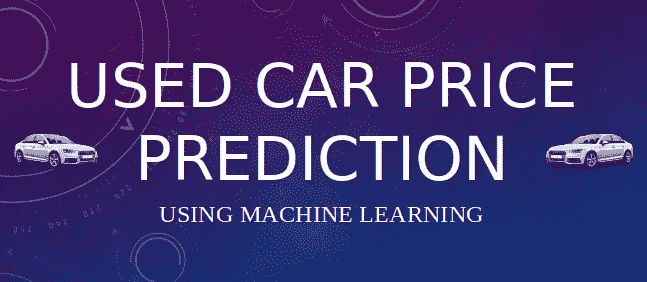

图片由 Panwar Abhash Anil 提供

> *在我的* [GitHub 页面](https://github.com/abhashpanwar/used-car-price-prediction) *可以到达与此相关的所有 Python 脚本。如果您感兴趣，还可以在同一个存储库中找到用于这项研究的数据清理和数据可视化的脚本。*
> 
> *该项目也使用 Django 部署在*[*Heroku*](https://abhash-car-price-prediction.herokuapp.com/)*上，也通过*[*Dockerizing Django App*](http://ec2-54-82-16-204.compute-1.amazonaws.com:8080/)部署在 Amazon EC2 上

# 内容

1.  数据清理(识别空值、填充缺失值和移除异常值)
2.  数据预处理(标准化或规范化)
3.  ML 模型:线性回归、岭回归、拉索、KNN、随机森林回归、Bagging 回归、Adaboost 回归和 XGBoost
4.  模型的性能比较
5.  来自数据的一些见解

## 为什么价格特征通过对数变换进行缩放？

在回归模型中，对于 X 的任何固定值，Y 都分布在这个问题数据中——目标值(价格)不是正态分布，它是右偏的。

为了解决这个问题，当目标变量具有偏斜分布时，对其应用对数变换，并且我们需要对预测值应用反函数来获得实际的预测目标值。

因此，为了评估模型，计算 [*RMSLE*](https://scikit-learn.org/stable/modules/generated/sklearn.metrics.mean_squared_log_error.html) 以检查误差，并且还计算 [*R2 分数*](https://scikit-learn.org/stable/modules/generated/sklearn.metrics.r2_score.html) 以评估模型的准确性。

# 一些关键概念:

*   **学习率:**学习率是一个超参数，它控制我们根据损耗梯度调整网络权重的程度。该值越低，我们沿下坡行驶的速度越慢。虽然在确保我们不会错过任何局部最小值方面，这可能是一个好主意(使用低学习率),但这也可能意味着我们将需要很长时间才能收敛——特别是如果我们被困在一个平坦区域。
*   n_estimators :这是在进行最大投票或平均预测之前，你想要建立的树的数量。树的数量越多，性能越好，但代码速度越慢。
*   **R 评分:**是数据与拟合回归线接近程度的统计度量。它也被称为决定系数，或多元回归的多重决定系数。0%表示该模型不能解释响应数据在其平均值附近的任何可变性。

# 1.数据:

本项目使用的数据集是从 [Kaggle](https://www.kaggle.com/austinreese/craigslist-carstrucks-data) 下载的。

# 2.数据清理:

第一步是从数据集中移除不相关/无用的特征，如“URL”、“region_url”、“vin”、“image_url”、“description”、“county”、“state”。

下一步，检查每个要素的缺失值。

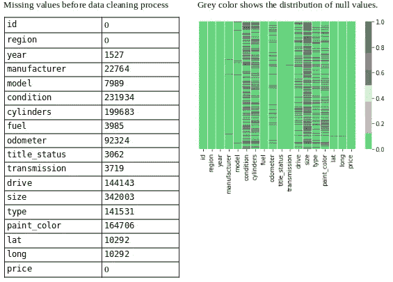

显示缺失值(图片由 Panwar Abhash Anil 提供)

接下来，通过适当的方法用适当的值填充现在缺失的值。

为了填补缺失值，使用 [*迭代估算器*](https://scikit-learn.org/stable/modules/generated/sklearn.impute.IterativeImputer.html) 方法，实现不同的估计器，然后使用[*cross _ val _ score*](https://scikit-learn.org/stable/modules/generated/sklearn.model_selection.cross_val_score.html)计算每个估计器的 [*MSE*](https://en.wikipedia.org/wiki/Mean_squared_error)

1.  平均值和中位数
2.  贝叶斯岭估计量
3.  决策树回归估计量
4.  树外回归估计量
5.  kneighbors 回归估计量

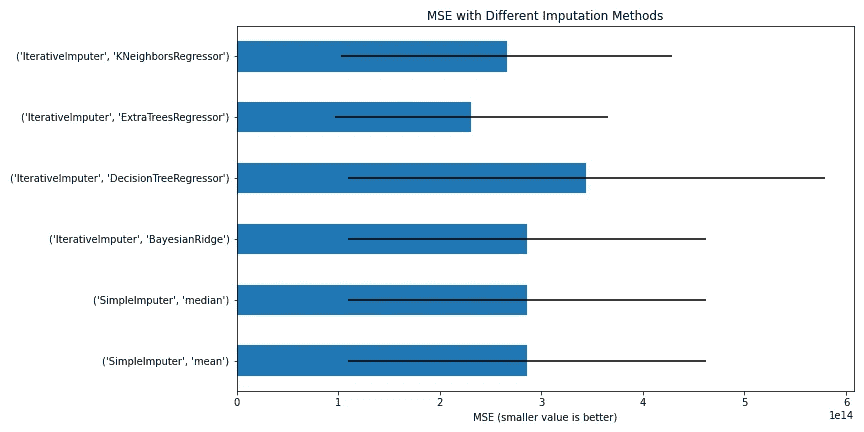

使用不同插补方法的均方误差(图片由 Panwar Abhash Anil 提供)

从上图中，我们可以得出结论，*extractree regressor*估计量将更好地用于填充缺失值的插补方法。

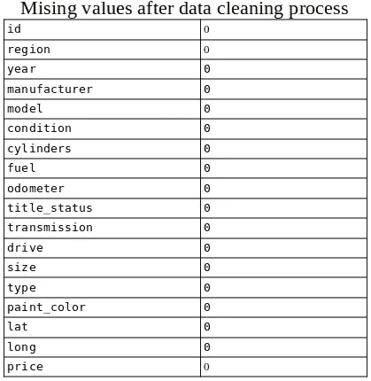

填充后缺少值(图片由 [Panwar Abhash Anil](https://www.linkedin.com/in/abhash-panwar-85126976/) 拍摄)

最后，在处理缺失值后，零个空值。

**异常值:**用四分位差(IQR)法从数据中剔除异常值。

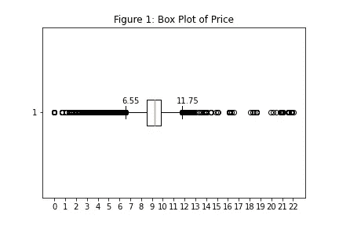

显示异常值的价格箱线图(图片由 [Panwar Abhash Anil](https://www.linkedin.com/in/abhash-panwar-85126976/) 提供)

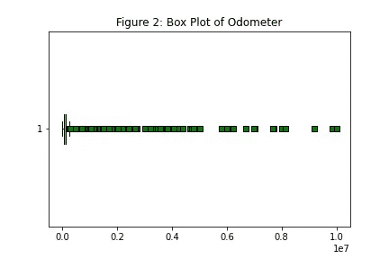

显示异常值的里程表方框图(图片由 [Panwar Abhash Anil](https://www.linkedin.com/in/abhash-panwar-85126976/) 提供)

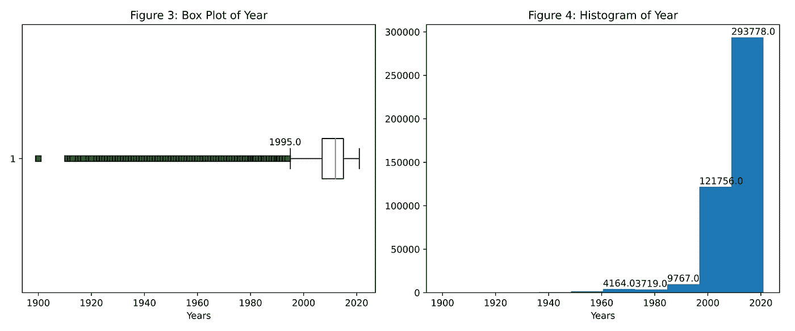

年度柱状图和柱状图(图片由 [Panwar Abhash Anil](https://www.linkedin.com/in/abhash-panwar-85126976/) 提供)

*   从图 1 中可以看出，低于 6.55 和高于 11.55 的价格是异常值
*   从图 2 中，不可能得出什么结论，因此计算 IQR 来发现异常值，即低于 6.55 和高于 11.55 的里程表值是异常值。
*   从图 3 来看，1995 年以下和 2020 年以上的年份是异常值。

最后，处理前的数据集形状= (435849，25)，处理后的数据集形状= (374136，18)。总共删除了 61713 行和 7 列。

# 3.数据预处理:

**标签编码器:**在我们的数据集中，12 个特征是分类变量，4 个是数值变量(价格列除外)。为了应用 ML 模型，我们需要将这些分类变量转换成数值变量。而 sklearn 库 [*LabelEncoder*](https://scikit-learn.org/stable/modules/generated/sklearn.preprocessing.LabelEncoder.html) 就是用来解决这个问题的。

**归一化**:数据集不是正态分布。所有功能都有不同的范围。如果不进行归一化，ML 模型将尝试忽略低值要素的系数，因为与大值相比，它们的影响非常小。因此为了归一化，使用了 [*sklearn 库，即 MinMaxScaler*](https://scikit-learn.org/stable/modules/generated/sklearn.preprocessing.MinMaxScaler.html) 。

**训练数据。**在此过程中，90%的数据被分割为列车数据，10%的数据作为测试数据。

# 4.ML 型号:

在本节中，不同的机器学习算法用于预测价格/目标变量。

数据集是受监督的，因此模型按给定的顺序应用:

1.  [线性回归](https://scikit-learn.org/stable/modules/generated/sklearn.linear_model.LinearRegression.html)
2.  [岭回归](https://scikit-learn.org/stable/modules/generated/sklearn.linear_model.ridge_regression.html)
3.  [拉索回归](https://scikit-learn.org/stable/modules/generated/sklearn.linear_model.Lasso.html)
4.  [K 邻居回归量](https://scikit-learn.org/stable/modules/generated/sklearn.neighbors.KNeighborsRegressor.html)
5.  [随机森林回归器](https://scikit-learn.org/stable/modules/generated/sklearn.ensemble.RandomForestRegressor.html)
6.  [装袋回归器](https://scikit-learn.org/stable/modules/generated/sklearn.ensemble.BaggingRegressor.html)
7.  [Adaboost 回归器](https://scikit-learn.org/stable/modules/generated/sklearn.ensemble.AdaBoostRegressor.html)
8.  [XGBoost](https://xgboost.readthedocs.io/en/latest/)

## 1)线性回归:

在统计学中，线性回归是一种模拟标量响应(或因变量)和一个或多个解释变量(或自变量)之间关系的线性方法。在线性回归中，使用线性预测函数对关系进行建模，其未知模型参数根据数据进行估计。这种模型被称为线性模型。 [*更多详情*](https://en.wikipedia.org/wiki/Linear_regression)

系数:每个系数的符号表示预测变量和响应变量之间关系的方向。

*   正号表示随着预测变量的增加，响应变量也增加。
*   负号表示随着预测变量的增加，响应变量减少。

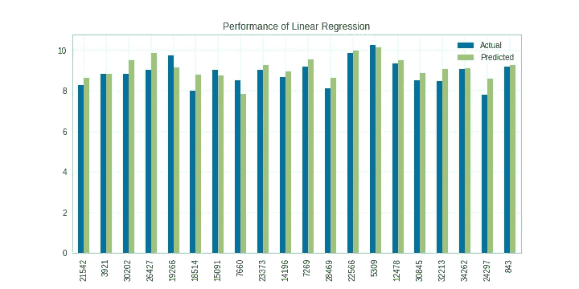

显示线性回归性能的图表(图片由 [Panwar Abhash Anil](https://www.linkedin.com/in/abhash-panwar-85126976/) 提供)

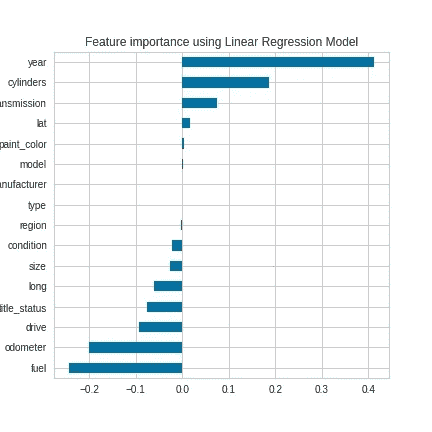

显示数据集重要特征的图表(图片由 [Panwar Abhash Anil](https://www.linkedin.com/in/abhash-panwar-85126976/) 提供)

考虑到这个数字，线性回归表明 ***年份、气缸、变速器、燃油和里程表*** 这五个变量是最重要的。

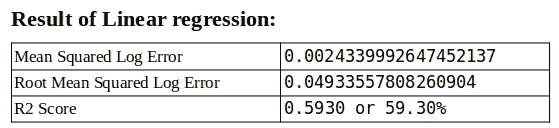

线性回归的结果(图片由 [Panwar Abhash Anil](https://www.linkedin.com/in/abhash-panwar-85126976/) 提供)

## 2)岭回归:

**岭回归**是一种分析多重共线性数据的技术。当多重共线性发生时，最小二乘估计是无偏的，但是它们的方差很大，因此它们可能远离真实值。

为了在岭回归中找到最佳 alpha 值，应用了黄砖库[*alpha selection*](https://www.scikit-yb.org/en/latest/api/regressor/alphas.html)。

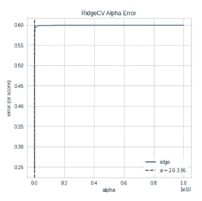

显示 Alpha 最佳值的图表

从图中可以看出，最适合数据集的 alpha 值是 20.336。

注意:α的值不是常数，它随时都在变化。

使用 alpha 的这个值，实现了 Ridgeregressor。

显示重要特征的图表

考虑到这个数字，拉索回归表明 ***年份、气缸、变速器、燃油和里程表*** 这五个变量是最重要的。

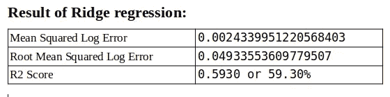

这个模型的最终结果(图片由[潘瓦尔·阿布哈什·阿尼尔](https://www.linkedin.com/in/abhash-panwar-85126976/)提供)

岭回归的表现几乎和线性回归一样。

## 3)套索回归:

套索回归是一种使用收缩的线性回归。收缩是指数据值向中间点收缩。lasso 程序鼓励简单、稀疏的模型(即参数较少的模型)。

**为什么使用套索回归？**

套索回归的目标是获得预测因子的子集，使定量响应变量的预测误差最小化。lasso 通过对模型参数施加约束来实现这一点，这会导致某些变量的回归系数向零收缩。

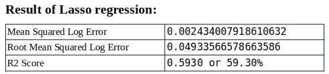

这个模型的最终结果(图片由[潘瓦尔·阿布哈什·阿尼尔](https://www.linkedin.com/in/abhash-panwar-85126976/)提供)

但是对于这个数据集，没有必要进行套索回归，因为误差没有太大的差别。

## 4)k 近邻回归器:回归——基于 k 近邻。

通过与训练集的最近邻居相关联的目标的局部插值来预测目标。

*k* -NN 是一种[基于实例的学习](https://en.wikipedia.org/wiki/Instance-based_learning)，或[懒惰学习](https://en.wikipedia.org/wiki/Lazy_learning)，其中函数仅局部近似，所有计算都推迟到函数求值。 [***阅读更多***](https://www.kite.com/python/docs/sklearn.neighbors.KNeighborsRegressor)

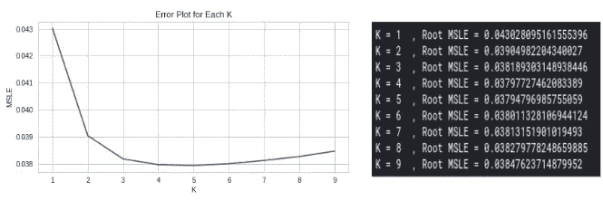

每个 K 范围 1-9 的误差图(图片由 [Panwar Abhash Anil](https://www.linkedin.com/in/abhash-panwar-85126976/) 提供)

从上图可以看出，对于 k=5，KNN 给出的误差最小。因此，使用 n_neighbors=5 和 metric='euclidean '来训练数据集。

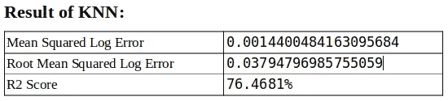

KNN 的最终结果(图片由[潘瓦尔·阿布哈什·阿尼尔](https://www.linkedin.com/in/abhash-panwar-85126976/)提供)

性能 KNN 更好，并且误差随着精度的增加而减小。

## 5)随机森林:

随机森林是由许多决策树组成的分类算法。它在构建每棵树时使用 bagging 和特征随机性，试图创建一个不相关的树木森林，其委员会的预测比任何单棵树都更准确。 [***阅读更多***](https://en.wikipedia.org/wiki/Random_forest)

在我们的模型中，用 max_features 0.5 创建了 180 个决策

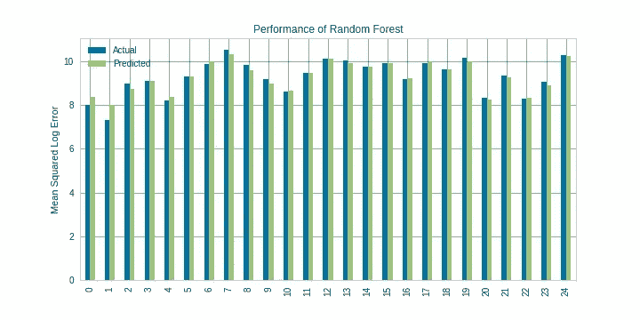

随机森林的性能(真实值与预测值之比)

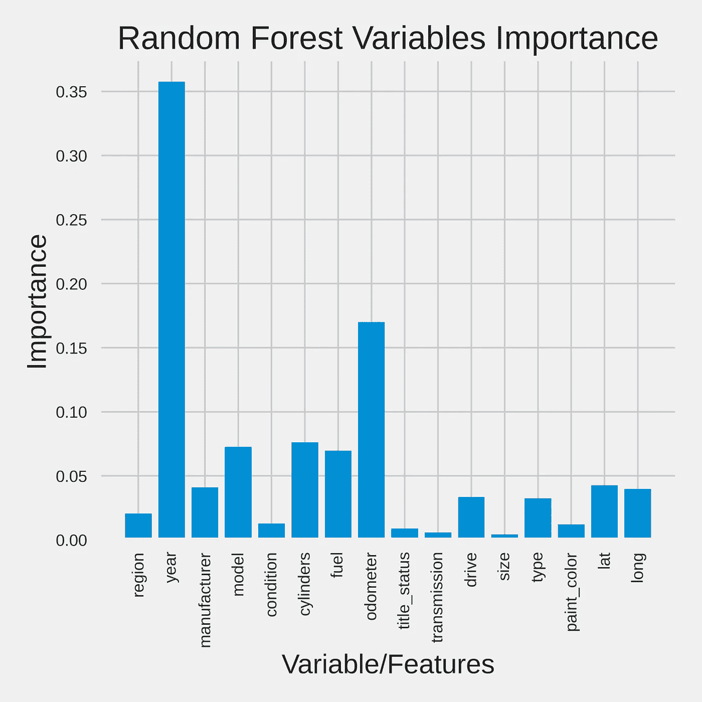

这是一个简单的柱状图，说明了 ***年*** 是汽车最重要的特征，然后是 ***里程表*** 变量，然后是其他。

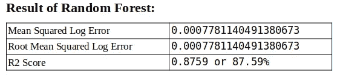

随机森林模型精度表(图片由 [Panwar Abhash Anil](https://www.linkedin.com/in/abhash-panwar-85126976/) 提供)

随机森林的性能更好，精确度提高了大约。10%很好。由于随机森林在建造每棵树时使用装袋，因此将执行下一个装袋回归程序。

## 6)装袋回归器:

Bagging 回归器是一种集合元估计器，它将每个基础回归器拟合到原始数据集的随机子集上，然后聚合它们的预测(通过投票或平均)以形成最终预测。这种元估计器通常可以被用作一种方法，通过将随机化引入到其构造过程中，然后从中进行集成，来减少黑盒估计器(例如，决策树)的方差。 [***阅读更多***](https://scikit-learn.org/stable/modules/generated/sklearn.ensemble.BaggingRegressor.html)

在我们的模型中，DecisionTreeRegressor 用作估计器，max_depth=20，它创建了 50 个决策树，结果如下所示。

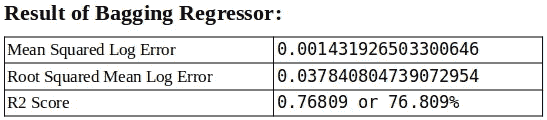

Bagging 回归器精度表(图片由 [Panwar Abhash Anil](https://www.linkedin.com/in/abhash-panwar-85126976/) 提供)

随机森林的性能比 Bagging 回归器好得多。

**随机森林和 Bagging 的关键区别:**根本区别在于，在**随机森林**中，仅从全部**和**特征中随机选择一个子集，该子集中的最佳分裂特征用于分裂树中的每个节点，这与 **bagging** 中考虑所有特征来分裂节点不同。

## 7) Adaboost 回归器:

AdaBoost 可用于提升任何机器学习算法的性能。Adaboost 帮助你将多个“弱分类器”组合成单个“强分类器”。**库使用:**[AdaBoostRegressor](https://scikit-learn.org/stable/modules/generated/sklearn.ensemble.AdaBoostRegressor.html)&[***阅读更多***](https://en.wikipedia.org/wiki/AdaBoost)

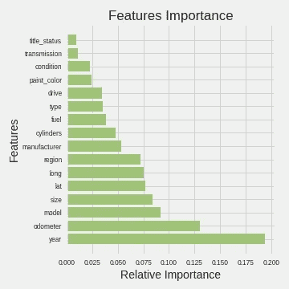

这是一个简单的柱状图，说明了 ***年*** 是汽车最重要的特征，然后是 ***里程表*** 变量，然后是型号等。

在我们的模型中，DecisionTreeRegressor 用作具有 24 max_depth 的估计器，创建 200 棵树&以 0.6 learning_rate 学习模型，结果如下所示。

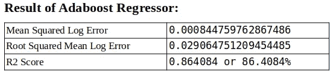

AdaBoost 回归器的精度表(图片由 [Panwar Abhash Anil](https://www.linkedin.com/in/abhash-panwar-85126976/) 提供)

## 8) XGBoost: XGBoost 代表极端梯度增强

XGBoost 是一种[集成学习](https://en.wikipedia.org/wiki/Ensemble_learning)方法。XGBoost 是梯度提升决策树的实现，旨在提高速度和性能。这种强大算法的美妙之处在于其可扩展性，它通过并行和分布式计算驱动快速学习，并提供高效的内存使用。 [***阅读更多***](https://www.analyticsvidhya.com/blog/2018/09/an-end-to-end-guide-to-understand-the-math-behind-xgboost/)

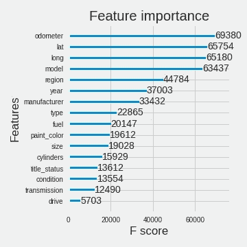

这是一个简单的重要性递减柱状图，它说明了哪一个 **特征/变量**是汽车的重要特征更重要。

根据 XGBoost 的说法，**里程表**是一个重要的特征，而从以前的车型**年**是一个重要的特征。

在该模型中，创建了 200 个最大深度为 24 的决策树，并且该模型以 0.4 的学习速率学习参数。

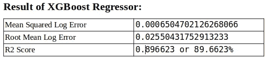

XGBoost 回归器精度表(图片由 [Panwar Abhash Anil](https://www.linkedin.com/in/abhash-panwar-85126976/) 提供)

# 4)模型的性能比较:

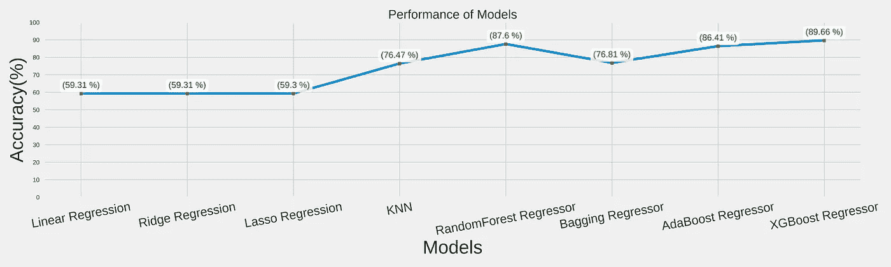

每个模型的精度比较(图片由 [Panwar Abhash Anil](https://www.linkedin.com/in/abhash-panwar-85126976/) 提供)

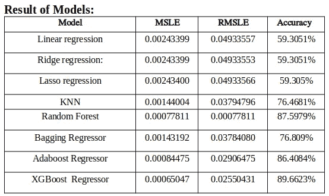

总体精度表(图片由[潘瓦尔·阿布哈什·阿尼尔](https://www.linkedin.com/in/abhash-panwar-85126976/)提供)

从上图可以得出结论，XGBoost 回归器以 89.662%的准确率表现优于其他模型。

# 5)来自数据集的一些见解:

从这一对情节中，我们不能得出任何结论。变量之间没有相关性。

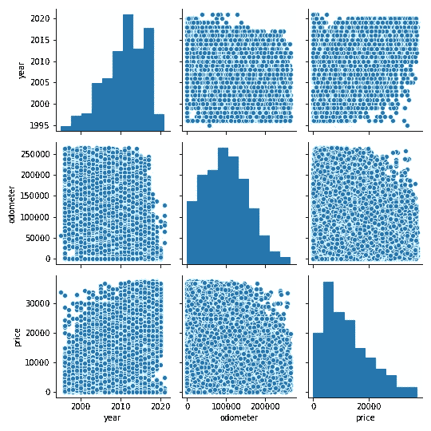

配对图以寻找相关性

从 distplot 中，我们可以得出结论，最初，价格快速上升，但在某个特定点之后，价格开始下降。

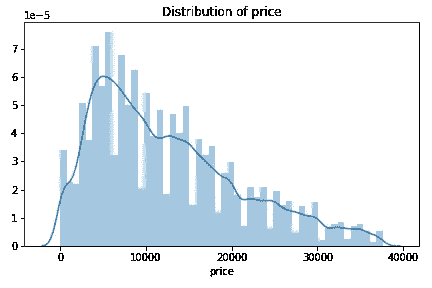

显示价格分布的图表(图片由 [Panwar Abhash Anil](https://www.linkedin.com/in/abhash-panwar-85126976/) 提供)

3 从图 1 中，我们分析出柴油版车型的车价高于电动版车型的车价。混动变形车价格最低。

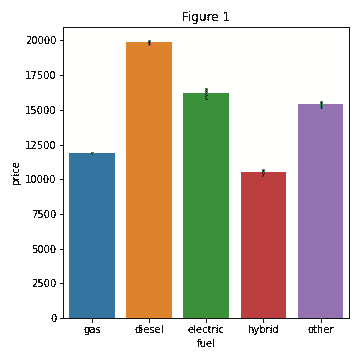

显示每种燃料价格的条形图

4 从图 2 中，我们分析出各种燃料的汽车价格也取决于汽车的状况。

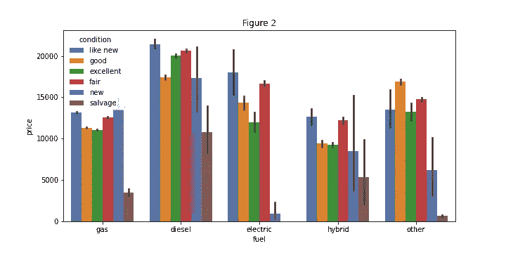

燃料和价格与色调条件之间的条形图

从图 3 中，我们分析出 1995 年后汽车价格每年都在上涨，从图 4 中，汽车的数量也每年都在增加，在某个时间点，即 2012 年，汽车的数量几乎相同。

显示价格每年变化的图表

从图 5 中，我们可以分析出汽车的价格也取决于汽车的状况，从图 6 中，价格也随着汽车大小的状况而变化。

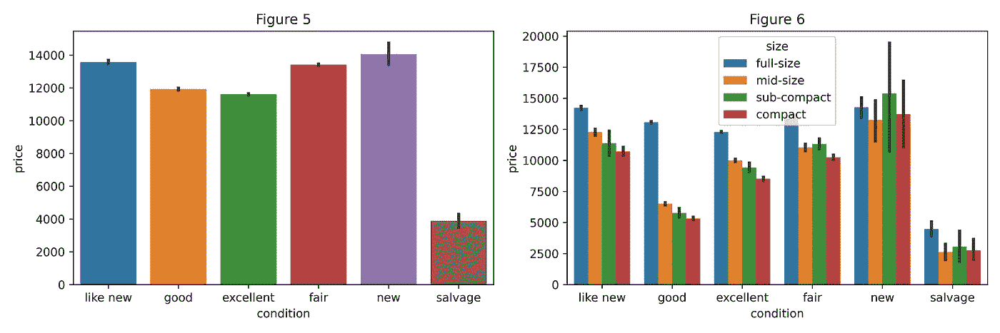

显示车况价格的柱状图

7 从图 7-8 中，我们分析了汽车价格以及汽车的各个**变速器**的价格。人们愿意购买有“其他变速器”的汽车，而有“手动变速器”的汽车价格较低。

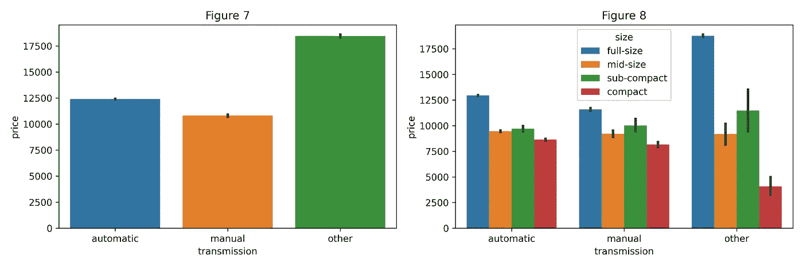

柱状图显示了传输的价格(图片由 [Panwar Abhash Anil](https://www.linkedin.com/in/abhash-panwar-85126976/) 提供)

8 下面有相似的图形，具有相同的洞察力，但功能不同。

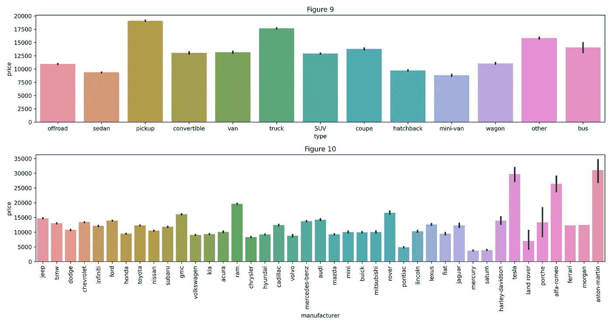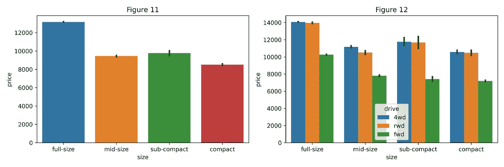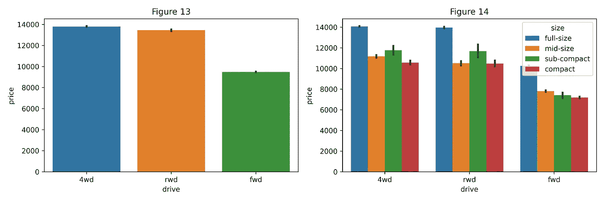

# 结论:

通过执行不同的最大似然模型，我们的目标是获得更好的结果或最大精度的更少误差。我们的目的是预测有 25 个预测值和 509577 个数据条目的二手车的价格。

首先，执行数据清洗以从数据集中移除空值和离群值，然后实施 ML 模型来预测汽车价格。

接下来，借助数据可视化特性进行了深入探讨。检查特征之间的关系。

从下表可以得出结论，XGBoost 是预测二手车价格的最佳模型。XGBoost 作为回归模型给出了最好的 MSLE 和 RMSLE 值。

精度表(图片由 [Panwar Abhash Anil](https://www.linkedin.com/in/abhash-panwar-85126976/) 提供)

仅此而已！如果你读到这里，感谢你的阅读。感谢任何反馈！并且可以在[*Linkedin*上联系到。](https://www.linkedin.com/in/panwar-abhash-anil/)