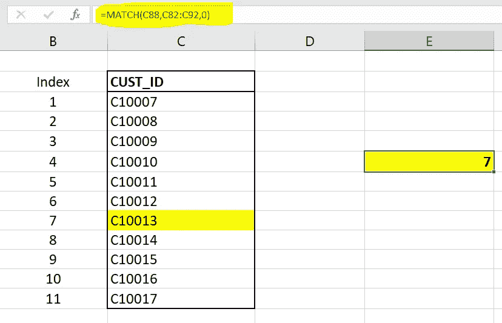
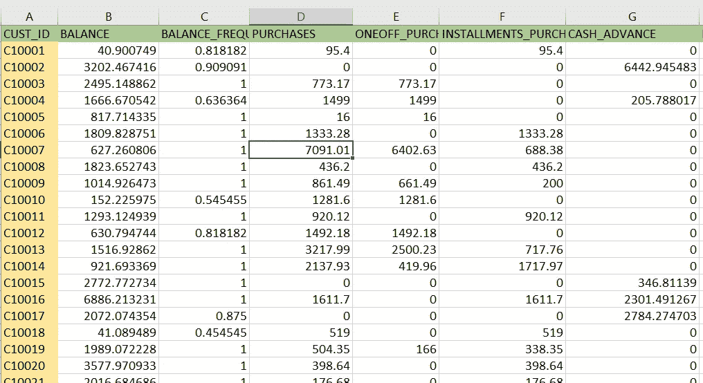
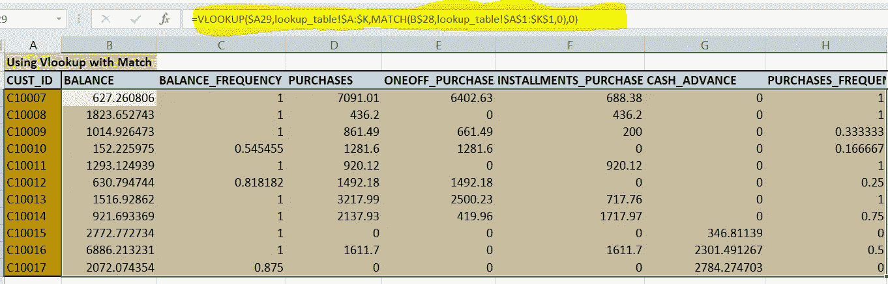
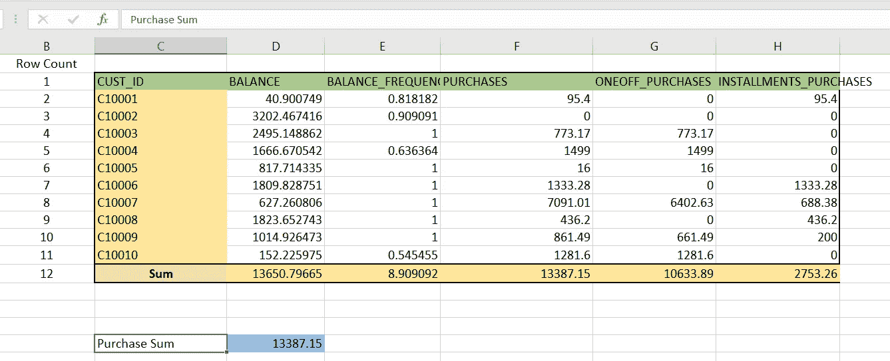
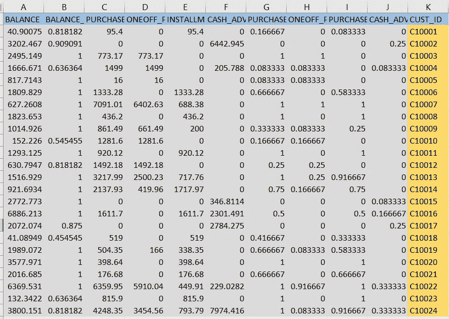
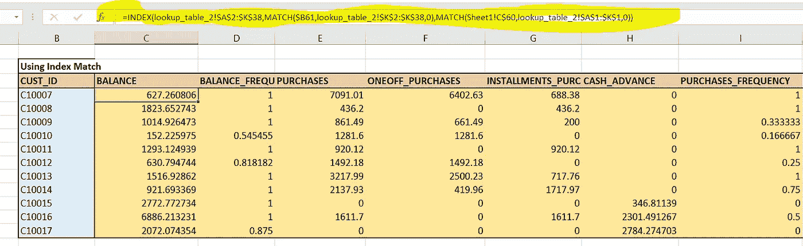

# 对数据科学有用的 Excel 函数

> 原文：<https://towardsdatascience.com/useful-excel-functions-for-data-science-985e888658fa?source=collection_archive---------48----------------------->

## *Excel 数据科学之旅*


由[卢卡斯·布拉塞克](https://unsplash.com/@goumbik?utm_source=medium&utm_medium=referral)在 [Unsplash](https://unsplash.com?utm_source=medium&utm_medium=referral) 上拍摄

数据科学家花大量时间处理数据。而且，当我们谈论数据时，excel 总是派上用场。Excel 有许多有用的功能，如加法、减法、乘法，但这些功能对计算很有用。在数据科学领域，我们需要海量的数据来训练我们的机器学习模型。数据可以来自不同的来源，但最终，我们需要对其进行组织。而且，在大多数情况下，我们将数据转换成表格格式。

一旦我们将数据转换成表格格式，我们就需要绘制不同的图形和图表来可视化数据特征并获得其他数据列中的关系。在绘制数据之前，我们需要对数据进行许多更改和执行许多操作。此外，还需要 excel 函数。

本文将讨论 excel 中一些最新的、有用的函数，这些函数通常用于我们的数据科学任务。

# 匹配功能

Match 函数有助于获取列表中任何项目的索引号。我们通常使用水平查找或垂直查找的匹配函数。我将在本文后面讨论垂直和水平查找。

## 句法

```
**MATCH(lookup_value, lookup_array, [match_type])**
```

这里，匹配类型可以是 0，表示精确匹配，-1 表示小于任何数字，1 表示大于任何数字。



匹配功能

# 查找功能

查找函数有助于从主数据源创建子数据。主数据源可以在同一个 excel 表中，也可以在不同的 excel 表中。子数据中的列应该是主数据源的一部分；否则，我们将得到这些列的空值。查找函数以两种方式搜索数据；第一种是垂直查找，第二种是水平查找。

> 垂直查找

主数据源和子数据中的垂直查找应该有一个公共的列名。主数据中的公共列应该出现在数据的最左侧。

## 句法

```
VLOOKUP(lookup value, range containing the lookup value, the column  number in the range containing the return value, Approximate match  (TRUE) or Exact match (FALSE))
```

这里，查找值是子数据和主数据中公共列值的值。该区域是主查找数据的选定数据部分。列号是应该出现在主数据中的子列名的列表。这些子列名有助于生成子表。



不同工作表中的主数据源

对于下面的例子，我们将使用带有 match 函数的垂直查找来获取主数据中的列索引。

```
=VLOOKUP($A29,lookup_table!$A:$K,MATCH(B$28,lookup_table!$A$1:$K$1,0),0)
```



匹配垂直查找

> 水平查找

水平查找，我们通常用于获取任何列名的计算结果值。结果列名应该是主数据的一部分。这些列的名称应该出现在主数据的第一行。

## 句法

```
**HLOOKUP(lookup_value,table_array,row_index_num,range_lookup)**
```



水平查找

# 索引和匹配功能

“垂直”和“水平”的工作条件是查找范围列表应该在最左侧或顶部第一位。有时，我们需要在任意位置与列表进行匹配。在这种情况下，我们使用索引和匹配。

## 句法

```
INDEX(array, row number,[column number]) 
```



我们的主要数据和右边的匹配列

```
=**INDEX(lookup_table_2!$A$2:$K$38,MATCH($B61,lookup_table_2!$K$2:$K$38,0),MATCH(Sheet1!C$60,lookup_table_2!$A$1:$K$1,0))**
```

这里，我们需要选择主查找表，然后使用 match 函数定义行和列的匹配。



索引和匹配函数示例

# x 查找

垂直查找在从上到下的方向上查找匹配，X 查找为我们提供了从上到下和从下到上的随机方向的功能。

# 凝固法

freeze 方法有助于冻结任何列或行。当我们将函数复制到整个表时，这很有用。我们需要使用美元“$”符号来冻结任何行或列。冻结任何单元格的快捷键是键盘上的“f4”。

# 最后几点

我们已经讨论了一些主要函数，这些函数通常用于我们的数据科学任务。当我们必须处理数据可视化时，这些是许多方便的 excel 函数，我们必须从主数据源中获取子数据。此外，在数据科学访谈中，这些也是 excel 中常见的话题。

[](https://www.linkedin.com/in/pranjalai/) [## Pranjal Saxena -高级软件工程师-凯捷| LinkedIn

### 在凯捷拥有 2 年以上的经验，拥有基于 Python、Django、机器学习、深度…

www.linkedin.com](https://www.linkedin.com/in/pranjalai/) 

好了，暂时就这样了。我希望这篇文章对你有用，继续享受数据科学。