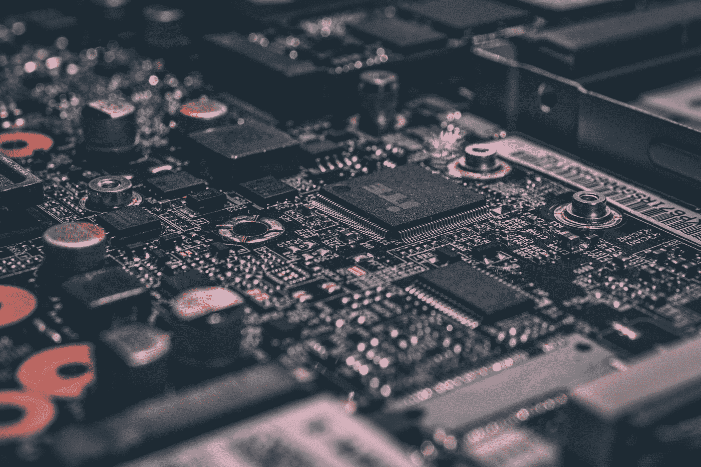
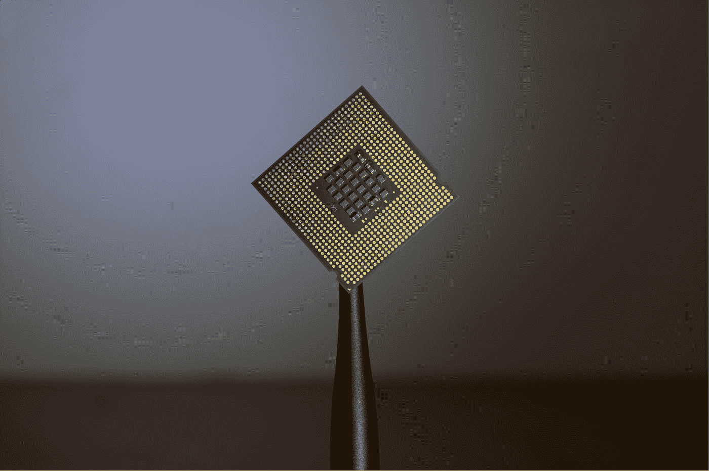

# 对数据科学有用的计算机知识

> 原文：<https://towardsdatascience.com/useful-knowledge-of-computers-for-data-science-c4882e45b6cb?source=collection_archive---------37----------------------->

戴维·冯迪马尔在 [Unsplash](https://unsplash.com?utm_source=medium&utm_medium=referral) 上拍摄的照片

从学术研究人员到行业专业人士，从工程和各种科学等传统技术/数学学科到社会科学、艺术、人力资源、销售和营销等领域，他们中的许多人现在都有了一个新的技术组成部分，即数据科学领域。在过去的几年中，这种新工具在许多行业和学科中带来了许多积极的变化，因此吸引了这些行业的人们以及其他尚未探索其功能的技术和非技术人员的极大兴趣。

有许多有用的在线资源可用于学习许多核心概念，如机器学习，以及许多使用 Python 和 r 等强大工具将它们应用于数据集的示例。虽然这些对于提取数据驱动决策的强大结果非常重要，但我发现对所需硬件平台的关注往往被忽视。与驾驶汽车类似，驾驶员可能不需要知道如何从头开始组装每个部件，但理解一些概念，如前轮/后轮驱动的区别，以及当你想开车去滑雪场时为什么更喜欢四轮/四轮驱动，将有助于一般驾驶。

我希望我对这里分享的一些核心组件所扮演的角色的类比理解可以帮助其他人了解如何充分利用它们，并最大限度地提高数据处理的效率。

# 母板

由[拍摄的亚历山大·德比耶夫](https://unsplash.com/@alexkixa?utm_source=medium&utm_medium=referral)在 [Unsplash](https://unsplash.com?utm_source=medium&utm_medium=referral)

一个 [**主板**](https://en.wikipedia.org/wiki/Motherboard) 就像一个办公室里的经理。它的主要职责是管理作业请求并将其分配给与其连接的不同组件(硬盘、RAM 等)。尽管它没有做太多的主要工作，但它仍然需要不时地升级，正如你所期望的那样，经理需要随时了解他/她的团队的最新情况，因为他们提高了自己的技能并利用了现代技术。

# 哈迪斯克

帕特里克·林登伯格在 [Unsplash](https://unsplash.com?utm_source=medium&utm_medium=referral) 上的照片

一个 [**硬盘**](https://en.wikipedia.org/wiki/Hard_disk_drive) 类似于办公室里老式的学校信息存储。所有的信息都存储在硬拷贝上，组织在文件夹里(一点也不双关)，放在书架上。随着存储信息的复杂性增加(从早期的主要文本到现代的视频和技术文件)，所需容量的增加是补偿这种变化的必然结果。

信息必须从存储它们的地方提取出来才能被访问。它们通常被从硬盘复制到 RAM 进行处理，并且内容中的任何更新被从 RAM 复制回硬盘。

# 随机存取存储器

(图片来自 [Pixarbay](https://pixabay.com/photos/ram-memory-circuits-green-board-921458/) )

[**随机存取存储器**](http://Random-access memory) 类比于办公室里桌子的大小。这些年来，为了跟上存储信息的复杂性，它们所需的大小也像硬盘一样增加了。它们的容量决定了一次可以同时处理多少信息，就像你从书架上拿了多少文件可以放在桌面上阅读一样。

任务通常由多个阶段组成，并且只需要在每个阶段中同时加载一组特定的信息。用于运行该任务的软件通常会管理要加载的所需信息的变化。如果 RAM 容量足够大，可以同时加载所有阶段的所有信息，那么任务的执行速度会比另一种方法快，后者只能在需要时加载不同的信息集。如果任务需要同时加载比 RAM 所能容纳的更多的信息，那么它就不能被执行。列出了最低要求的软件(尤其是电脑游戏)(几乎总是包括 RAM)是这方面的完美例子。

# 中央处理器

Brian Kostiuk - @BriKost 在 [Unsplash](https://unsplash.com?utm_source=medium&utm_medium=referral) 上的照片

[**中央处理器**](https://en.wikipedia.org/wiki/Central_processing_unit) 可以看作是做业务核心工作的团队。它们已经从早期的单核版本发展到了当今时代的多核版本。额外的核心可以理解为团队中有更多的成员，这允许将更大的任务分成更小的任务，并在并行计算中处理。根据每个正在运行的任务所需的资源，有些任务可能全部由单个内核处理，而有些任务可能需要多个内核才能成功执行。

# 图形处理单元

(图片来自 [Pixabay](https://pixabay.com/photos/nvidia-gpu-electronics-pcb-board-1201077/) )

[**图形处理单元**](https://en.wikipedia.org/wiki/Graphics_processing_unit) 是来自显卡的处理单元，通常用于在屏幕上渲染漂亮图形所需的计算。在过去的几十年里，像科学家这样的人越来越喜欢用它来进行复杂的计算。与 CPU 相比，GPU 的运行方式经常被类比为大型公共汽车与跑车，其中一辆速度较慢，但可以同时搭载更多乘客，而另一辆速度较快，座位较少。GPU 包含更多简单的核心，这使得它更适合执行高度并行的任务，而 CPU 在完成更复杂的任务方面相对更高效。在[这个](https://medium.com/@shachishah.ce/do-we-really-need-gpu-for-deep-learning-47042c02efe2)和[这个](/what-is-a-gpu-and-do-you-need-one-in-deep-learning-718b9597aa0d)等文章中有更深入的对比。

# 结论

从小型企业到大型组织，随着全球数据量继续呈指数级增长，越来越多的数据科学家被雇用来利用隐藏在数据中的力量。特别是在有数据科学家而不是数据科学家团队的较小组织中，当任务是在具有 100 多个特征的数据集上运行卷积神经网络模型时，知道您可能需要比笔记本电脑更多的东西也很重要，就像如果您想要移动冰箱或床，您如何自动知道您需要比轿车更多的东西一样。