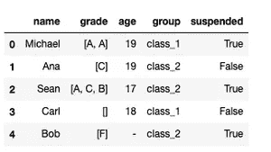
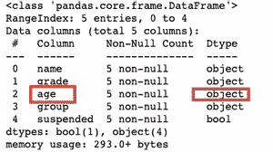
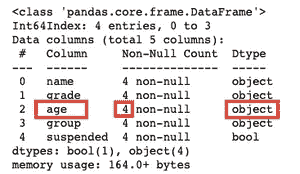
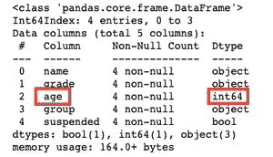
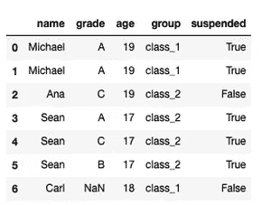
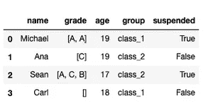
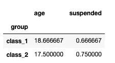
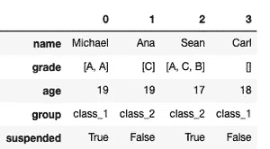

# 有用的熊猫功能你可能不知道

> 原文：<https://towardsdatascience.com/useful-pandas-functions-you-probably-did-not-know-f2b5018c8961?source=collection_archive---------42----------------------->

## 用这四个功能提升你的熊猫知识


图片由 [AD_Images](https://pixabay.com/users/ad_images-6663717/?utm_source=link-attribution&utm_medium=referral&utm_campaign=image&utm_content=2987596) 发自 [Pixabay](https://pixabay.com/?utm_source=link-attribution&utm_medium=referral&utm_campaign=image&utm_content=2987596)

**简介**

Pandas 库可能是用 python 执行数据分析的最流行的包。有很多教程介绍了熊猫的基本功能，但在这篇文章中，我想分享一些熊猫的功能，这些功能不太为人所知，但对于日常数据分析任务来说非常方便。

让我们开始吧。

**加载数据**

在了解为本文选择的函数之前，我们需要加载一些数据。我们将使用以下代码创建一个数据框。

```
import pandas as pd
client_dictionary = {'name': ['Michael', 'Ana', 'Sean', 'Carl', 'Bob'], 
                     'grade': [['A', 'A'], ['C'], ['A', 'C', 'B'], [], ['F']], 
                     'age': [19, 19, 17, 18, '-'],
                     'group': ['class_1', 'class_2', 'class_2', 'class_1', 'class_2'],
                     'suspended': [True, False, True, False, True]
                    }
df = pd.DataFrame(client_dictionary)
```


如您所见，这是一个非常简单的数据框。它表示关于学生的数据(行)并描述他们的详细信息，如姓名、年级、年龄、组以及他们是否被暂停(列)。

这个简单的数据框将帮助我们演示今天将要学习的所有函数。

**infer_objects()**

如果您已经使用 pandas 和数据框有一段时间了，您可能已经注意到 pandas 非常擅长推断为列输入的数据。如果你有一个整数列，它将分配整数类型，如果它们是布尔类型，它将分配布尔类型，等等。

然而，有些时候你需要强迫它去做。这通常是当您有一个数据框，其中的列被推断为对象，但经过仔细观察，您意识到它们应该是不同的数据类型。

为了看到它，让我们再看一下我们的数据框。



您可以看到最后一行中的 age 列有一个破折号，而不是数字(-)。这可能表明该学生的年龄未知，但会导致该列被读取为对象类型。

```
df.info()
```



现在让我们说，我们不想包括不完整的数据，所以我们将过滤掉年龄列中有破折号的条目，在我们的情况下只有整数的条目。

```
df = df[df.age != '-']
```

现在让我们看看 info()函数，看看 filtred 数据帧的类型是否得到了更新。

```
df.info()
```



正如您所看到的，条目较少(只有 4 个)，但是年龄列的类型仍然是一个对象。这就是 infer_objects()函数有所帮助的时候了。您可以在整个数据框上调用它，它应该会再次推断类型。

```
df = df.infer_objects()
df.info()
```



**爆炸()**

为了研究 explode()函数，让我们再看一下数据帧。


请注意,“等级”列由等级列表组成，而不是一个等级本身。有时，您希望为列表中的每个项目创建一个条目，而不是将整个列表作为一个条目。您可以使用 explode()函数来实现这一点。

```
exploded_df = df.explode('grade', ignore_index=True)
exploded_df
```



正如你现在看到的，每个年级都有一个条目，列表“展开”了。请注意，函数 explode()将列名作为用于“explode”的参数。在我们这里是‘等级’。

我还将 *ignore_index* 参数设置为 True。如果我没有这样做，那么每个条目都会有来自原始数据框的索引。

**pivot_table()**

Pivot_table()函数允许我们像 Excel 一样创建数据透视表。如果你没有听说过 Excel 中的数据透视表，那么在熊猫身上尝试之前，最好先用 Excel 学习一下。

然而，数据透视表允许我们通过指定成为数据透视表条目的列、行和值来重新组织数据。让我们再看一下我们的数据框。



我们可以使用 pivot_table()函数来学习每组的平均年龄。

```
pd.pivot_table(df, index='group')
```



您可以看到，我们已经将数据透视表的索引指定为组列。我们没有指定数据透视表中应该有哪些列，所以 pandas 只是将其他数值放在那里，而没有进一步分割它们。

您可以看到，1 班的平均年龄为 18.7 岁，该班有 66.6%的学生停学，而 2 班的平均年龄为 17.5 岁，其中 75%的学生停学。数据透视表条目是子组的平均值。

如果我们现在将数据透视表列指定为原始数据框中的“暂停”列，会发生什么情况？

```
pd.pivot_table(df, index='group', columns='suspended')
```


你可以看到，现在我们有每个班级的年龄划分，以及他们是否停课的事实。表中的数值还是平均值。您实际上可以通过添加 *aggfunc* 参数来使用不同的聚合函数，比如 sum()、max()或 min()。

需要注意的是，pivot_table()函数中的列和索引应该是原始数据框中的分类变量。这样就可以分成更小的小组。

**转置()**

Transpose()函数非常简单，但是了解它是救命稻草。它只是将列变为行(转置您的数据框)。它的功能在示例中再次得到了最好的展示，所以让我们看看我们的原始数据框。


现在让我们转置它。

```
transposed = df.transpose()
transposed
```



如您所见，最初是行，现在是列，反之亦然。

**总结**

在本文中，您学习了如何使用四个新功能:

*   infer_objects()
*   explode()，
*   数据透视表()
*   和转置()

我希望从现在开始，无论何时你需要它们的功能，你都可以调用它们。编码快乐！

*原载于 aboutdatablog.com:* [有用的熊猫功能你可能不知道](https://www.aboutdatablog.com/post/useful-pandas-functions-you-probably-did-not-know)，*2020 年 10 月 27 日。*

*PS:我正在 Medium 和*[***aboutdatablog.com***](https://www.aboutdatablog.com/)*上撰写以简单易懂的方式解释基本数据科学概念的文章。你可以订阅我的* [***邮件列表***](https://medium.com/subscribe/@konkiewicz.m) *在我每次写新文章的时候得到通知。如果你还不是中等会员，你可以在这里加入*[](https://medium.com/@konkiewicz.m/membership)**。**

*下面还有一些你可能喜欢的帖子*

*[](/9-things-you-did-not-know-about-jupyter-notebook-d0d995a8efb3) [## 关于 jupyter 笔记本你不知道的 9 件事

### 用这些建议提高你的工作效率

towardsdatascience.com](/9-things-you-did-not-know-about-jupyter-notebook-d0d995a8efb3) [](/top-9-jupyter-notebook-extensions-7a5d30269bc8) [## 9 大 Jupyter 笔记本扩展

### 改进笔记本电脑功能，提高您的工作效率

towardsdatascience.com](/top-9-jupyter-notebook-extensions-7a5d30269bc8) [](/9-pandas-visualizations-techniques-for-effective-data-analysis-fc17feb651db) [## 9 熊猫有效数据分析的可视化技术

### 学习如何使用折线图、散点图、直方图、箱线图和其他一些可视化技术

towardsdatascience.com](/9-pandas-visualizations-techniques-for-effective-data-analysis-fc17feb651db)*