# 为数据分析任务查找数据集的有用站点

> 原文：<https://towardsdatascience.com/useful-sites-for-finding-datasets-for-data-analysis-tasks-1edb8f26c34d?source=collection_archive---------11----------------------->

## 汇编一些有用的网站，提供免费和公开的数据集

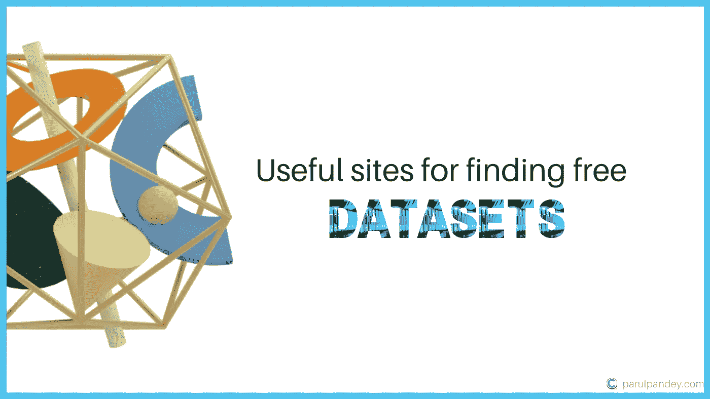

作者图片

> 开放数据推动创新。它使人们能够将更多的精力放在研究上，而不是既费时又费钱的数据收集上。

在系列— **为数据分析任务获取数据集中，**我们将探讨从互联网访问数据集的方法。在 f [的第一部分](https://wordpress.com/view/parulpandey.com)，我们学会了简化谷歌搜索，只在网络上查找特定的文件。

 [## 为数据分析任务获取数据集—高级 Google 搜索

### 在数据科学过程中，数据的重要性怎么强调都不为过。数据分析任务的结果是…

parulpandey.com](https://parulpandey.com/2020/08/09/getting-datasets-for-data-analysis-tasks%e2%80%8a-%e2%80%8aadvanced-google-search/) 

在这一部分中，让我们看看一些站点，这些站点托管着可用于数据分析任务的免费且公开可用的数据集。一些资源在数据科学社区中非常有名，如 Data.gov 的 [UCI 机器学习库](https://archive.ics.uci.edu/ml/index.php)、 [Kaggle 数据集](https://www.kaggle.com/datasets)和[T9。因此，我不会在这篇文章中触及它们。相反，本文的重点将放在一些鲜为人知的数据集聚合站点上。](https://www.data.gov/)

这篇文章是寻找好数据集的完整系列文章的一部分。以下是该系列中包含的所有文章:

**第 1 部分** : [为数据分析任务获取数据集—高级谷歌搜索](/getting-datasets-for-data-analysis-tasks-advanced-google-search-b1c01f9cc324)

**第 2 部分** : [为数据分析任务寻找数据集的有用站点](/useful-sites-for-finding-datasets-for-data-analysis-tasks-1edb8f26c34d)

**第三部分** : [为深度学习项目创建定制图像数据集](/creating-custom-image-datasets-for-deep-learning-projects-6e5db76158d4)

**第 4 部分** : [毫不费力地将 HTML 表格导入 Google Sheets](/import-html-tables-into-google-sheets-effortlessly-f471eae58ac9)

**第 5 部分** : [使用 Camelot，从 pdf 中提取表格数据变得很容易。](/extracting-tabular-data-from-pdfs-made-easy-with-camelot-80c13967cc88)

第六部分 : [从 XML 文件中提取信息到熊猫数据框架](/extracting-information-from-xml-files-into-a-pandas-dataframe-11f32883ce45)

**第 7 部分** : [5 个真实世界的数据集，用于磨练您的探索性数据分析技能](/5-real-world-datasets-for-exploratory-data-analysis-21b7cc5afe7e)

# 数据公平吗？

公开数据对于研究团体和整个社会的利益至关重要。然而，共享的数据应该遵循一些基本的准则，这样它才能得到最大的利用。在[“科学数据管理和监管的公平指导原则”中，](https://www.nature.com/articles/sdata201618) Wilkinson 等人制定了数据管理和数据共享的原则。FAIR 是一个首字母缩写词，代表可查找、可访问、可互操作和可重用的数据。

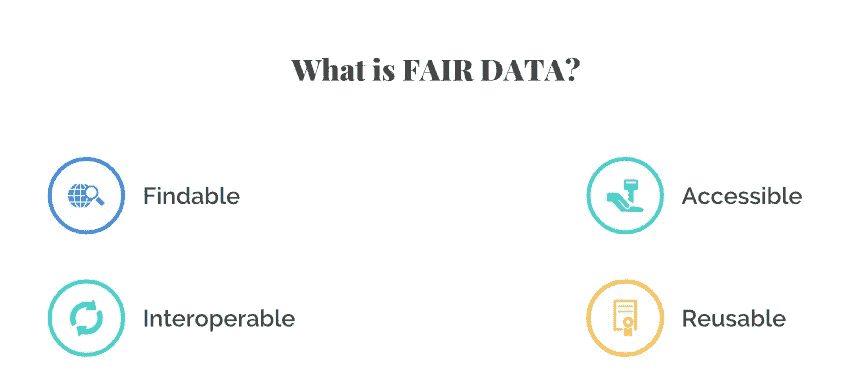

[威尔金森等人制定的公平数据原则](https://www.nature.com/articles/sdata201618)

现在，让我们来看看一些有用的网站，它们可以快速、轻松地找到公开的数据集。

# 1.谷歌数据集搜索

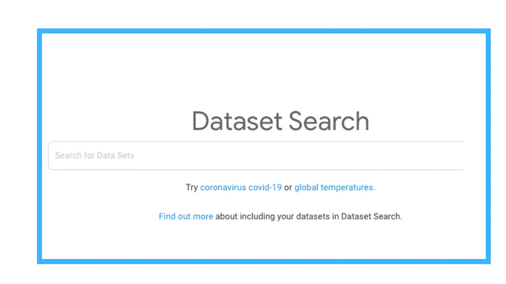

[谷歌数据集搜索页面截图](https://datasetsearch.research.google.com/)(图片由作者提供)

[谷歌数据集搜索](https://datasetsearch.research.google.com/)是一个致力于寻找数据集的搜索引擎。它是一个搜索引擎，搜索来自数据提供商的元数据。这意味着它对数据集的描述而不是其内容进行索引。因此，如果一个数据集是公开的，它很有可能会出现在谷歌数据集搜索中。在发布时，[数据集搜索拥有来自全球的近 2500 万个不同的数据集](https://blog.google/products/search/discovering-millions-datasets-web/)。谷歌数据集搜索依赖于关键字搜索，像常规的谷歌搜索一样，在这个网站上寻找数据集时提供了一个简洁的自动完成选项。

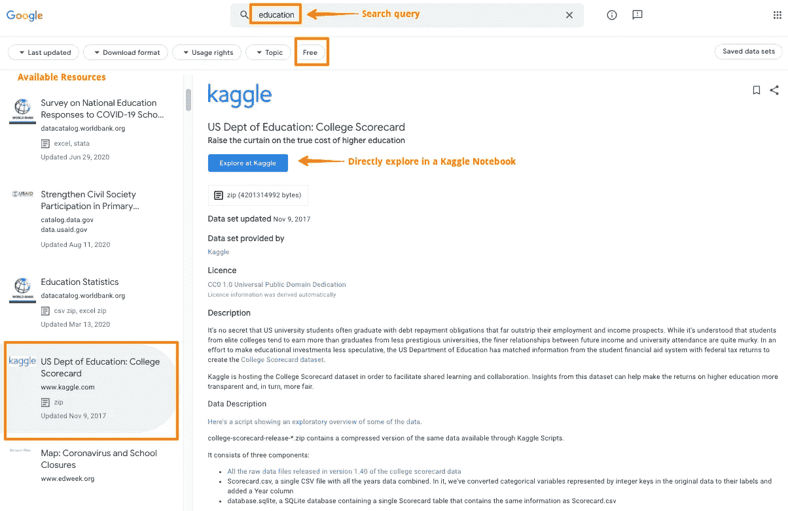

**查询“教育”的一些搜索结果**(图片作者提供)

谷歌数据集搜索演示

如果你想让你自己的数据集在谷歌数据集搜索中被发现，确保你在自己的网页上使用一个开放标准(schema.org)来描述你的数据集的属性。

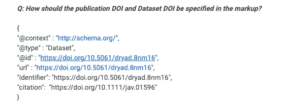

[使数据集在谷歌数据集搜索中可被发现的模式示例](https://support.google.com/webmasters/thread/1960710)

因此，如果您的网站上有一个数据集，并且您使用开放标准 schema.org 来描述它，其他人可以在数据集搜索中找到它。

🔗**链接到网站**:【https://datasetsearch.research.google.com/】T4

# 2.OpenML

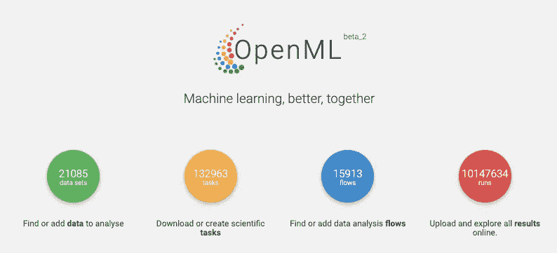

OpenML ((图片由作者提供)

OpenML 是一个开放的数据科学平台，旨在使机器学习研究民主化。它提供了从医疗保健到教育到气候变化等各种领域的大量数据。

该网站上的每个数据集都有一个专门的网页，数据可以以多种格式下载，如 CSV、JSON、XML 等。OpenML 还可以用来建立机器学习模型，然后这些模型可以上传到网上，以便其他人可以使用它们。

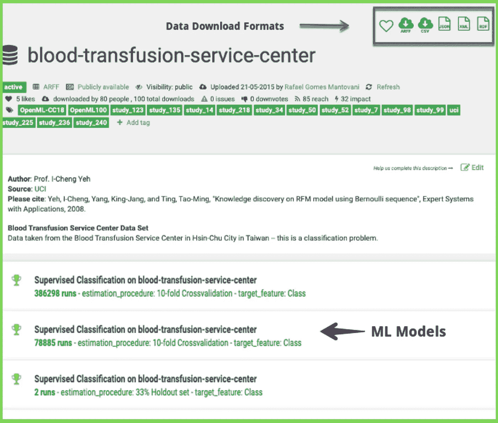

[**openml.org 输血服务中心数据集**](https://www.openml.org/d/1464) **(** (图片由作者提供)

OpenML 数据集搜索演示

OpenML 本质上是为协作数据科学而设计的，人们可以共享他们的代码和结果。

🔗**链接到数据集**:[https://www.openml.org/search?type=data](https://www.openml.org/search?type=data)

# 3.五三八

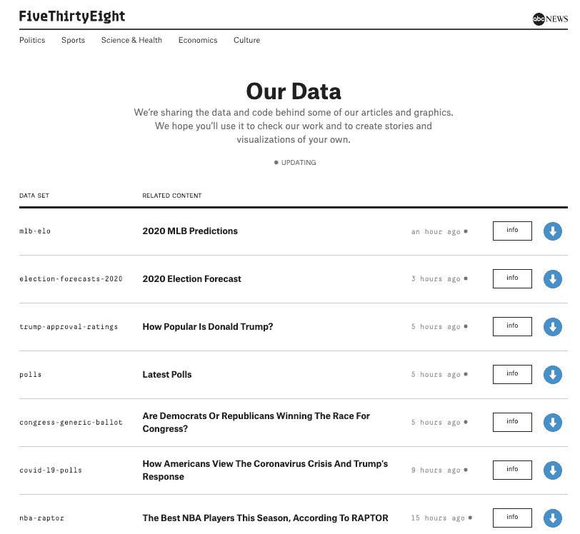

fivethirtyeight.com 上的开放数据集(图片由作者提供)

T21 是一个提供互动文章的网站。它展示了一些由有趣的精选数据集支持的令人信服的分析故事。这些数据集已经通过他们的 Github 库向公众开放。任何人都可以使用这些数据集，对从政治到体育的话题进行分析。

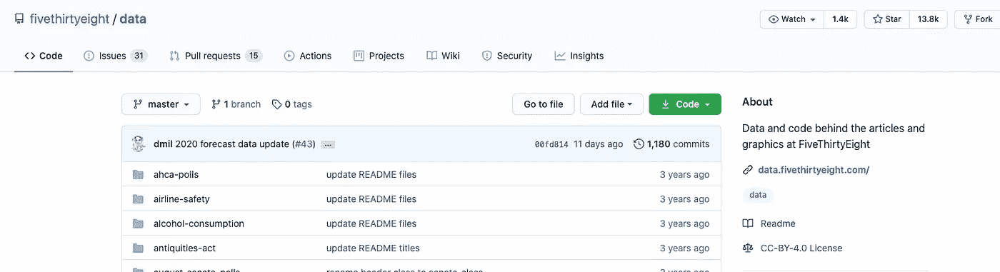

[fivethirtyeight.com 数据仓库](https://github.com/fivethirtyeight/data)((图片由作者提供)

[五个三十八个](https://fivethirtyeight.com/)数据集演示

他们网站上一些有趣的数据集包括:

> 航空安全数据集——故事背后的数据[旅行者应该避免乘坐过去发生过空难的航空公司吗？](http://fivethirtyeight.com/features/should-travelers-avoid-flying-airlines-that-have-had-crashes-in-the-past/)
> 
> 复仇者联盟——故事背后的数据[加入复仇者联盟就像从四层楼上跳下来一样致命](http://fivethirtyeight.com/features/avengers-death-comics-age-of-ultron)。

🔗链接到数据集:[https://github.com/fivethirtyeight/data](https://github.com/fivethirtyeight/data)

# 4.Github 上令人敬畏的公共数据集

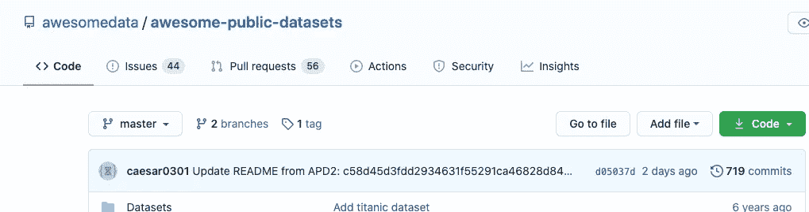

[令人敬畏的公共数据集存储库](https://github.com/awesomedata/awesome-public-datasets)((图片由作者提供)

“ **awesome public datasets** ”是一个 GitHub 存储库，包含一些高质量的公共数据集，这些数据集已经按照行业进行了很好的分离。知识库提到——

[*这是一个高质量的以主题为中心的公共数据源*](https://github.com/awesomedata/awesome-public-datasets) *的列表。它们是从博客、回答和用户回复中收集和整理的。下面列出的大多数数据集都是免费的；然而，有些不是。*

下面是对存储库中可用数据集的一些类别的快速浏览:

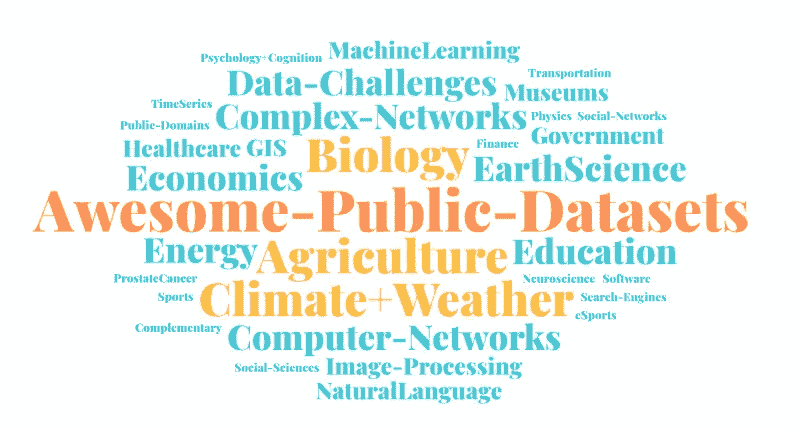

awesome 公共数据集存储库中的可用数据集类别(图片由作者提供)

**精彩的公共数据集演示**

🔗**链接到数据集【https://github.com/awesomedata/awesome-public-datasets :**

# 5.BuzzFeed 新闻

https://www.buzzfeednews.com/((图片由作者提供)

***BuzzFeed 新闻*** 是美国[新闻网站](https://en.wikipedia.org/wiki/News_website)由 **BuzzFeed、**美国[互联网](https://en.wikipedia.org/wiki/Internet) [媒体](https://en.wikipedia.org/wiki/Mass_media)出版，新闻娱乐公司。BuzzFeed News 以故事为特色，它在 Github 上开源了这些故事的数据、分析、库、工具和指南。

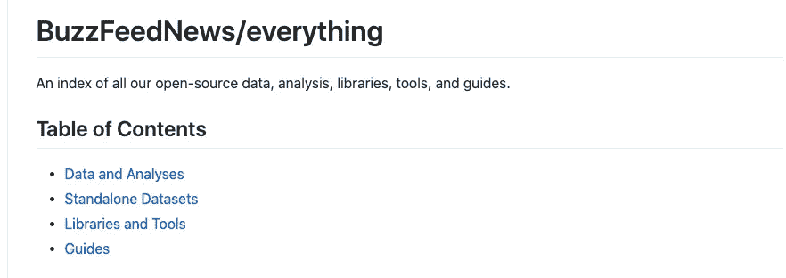

[**BuzzFeedNew**](https://github.com/BuzzFeedNews/everything)**s’资源库**包含 [*开源数据、分析、库、工具和指南*](https://github.com/BuzzFeedNews/everything) *(* (图片由作者提供)

***BuzzFeed 新闻数据集演示***

你可以找到一些有趣的数据集，例如:

*   [总统竞选捐款](https://github.com/BuzzFeedNews/presidential-campaign-contributions)
*   [大学学费和最低工资分析](https://github.com/BuzzFeedNews/2014-09-tuition-and-minimum-wage)
*   [政府侦察机分析](https://github.com/BuzzFeedNews/2016-04-federal-surveillance-planes)

🔗**链接到数据集**:[https://github.com/BuzzFeedNews/everything](https://github.com/BuzzFeedNews/everything)

# 结论

这些是一些托管开放数据集的数据聚合网站。这绝不是一个详尽的列表，但这是我最喜欢的一些。如果你正在寻找一些机器学习项目，我希望这些网站将被证明是非常有益的。

*原载于*[*parulpandey.com*](https://parulpandey.com/2020/08/29/getting-datasets-for-data-analysis-tasks%e2%80%8a-%e2%80%8auseful-sites-for-finding-datasets/)