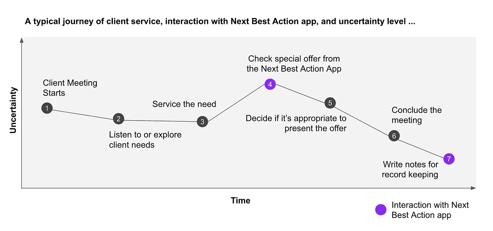
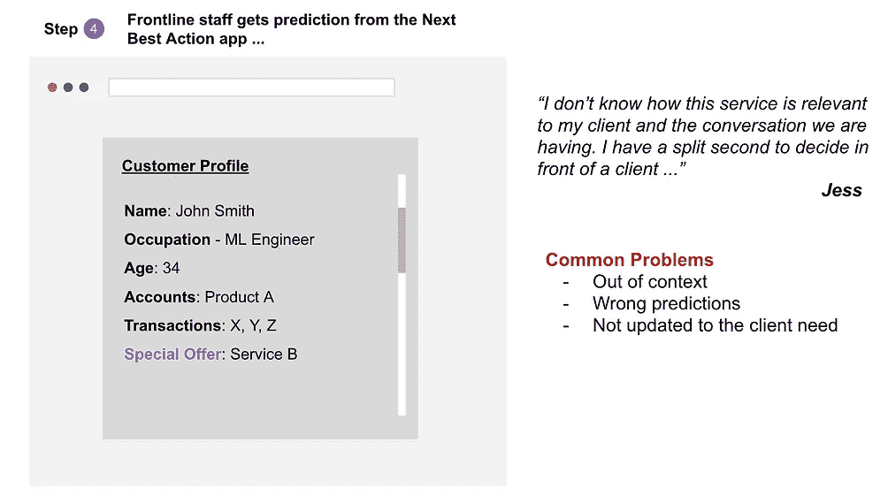
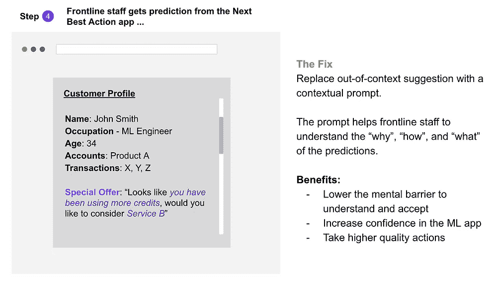
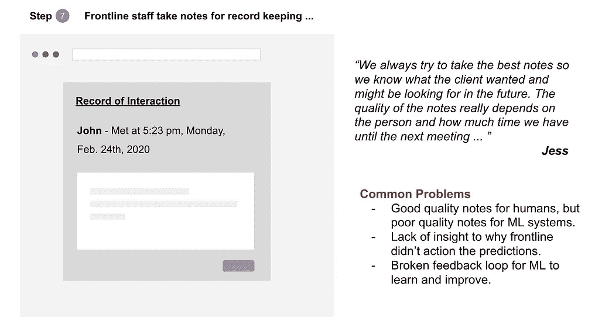
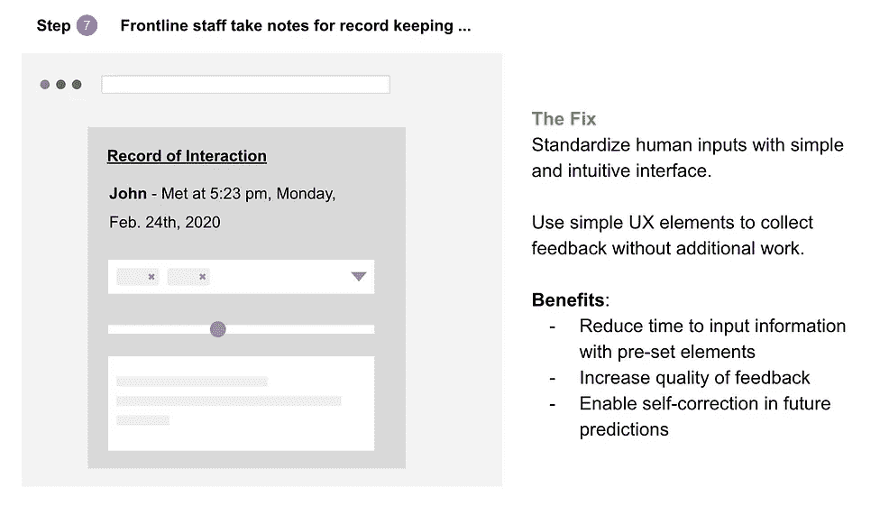
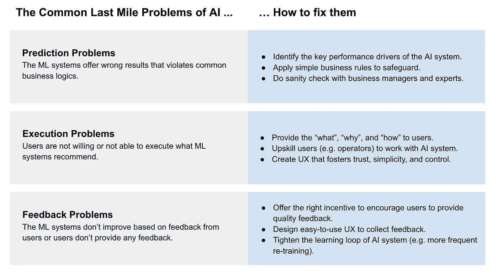

# 无用的机器学习

> 原文：<https://towardsdatascience.com/useless-machine-learning-momemts-of-trust-54c5a6c5f701?source=collection_archive---------36----------------------->

## 通过解决信任时刻来设计有用的 ML

Aserusainhuu 在 [Unsplash](https://unsplash.com/s/photos/neon?utm_source=unsplash&utm_medium=referral&utm_content=creditCopyText) 上拍摄的照片

**TL；许多 ML 应用在理论上是有用的，但在实践中却变得毫无用处。让我们来看一个真实的案例研究，强调两种类型的偏见，以及理解信任时刻如何有助于一个具体的例子。最后，我留给你 3 个小行动来考虑。**

***喜欢读什么？*** *跟我上* [*中*](https://medium.com/@ianxiao) *，* [*领英*](https://www.linkedin.com/in/ianxiao/) *，* [*推特*](https://twitter.com/ian_xxiao) *。你想学习如何沟通，成为一名有影响力的数据科学家吗？查看我的《* [*用机器学习影响*](https://www.bizanalyticsbootcamp.com/influence-with-ml-digital) *》指南。*

# 故事

我的 **内心声音**:“她是不是有外遇了？她一定是。操我！”你不能责怪我有这样的想法，当你美丽的妻子突然花了这么多晚上不在家——她从来没有工作这么多。

**于是，我问**:“怎么回事？你最近怎么看起来这么忙？一切都好吗？”

**杰斯**:“我不知道你们这些家伙为什么一直做这些 ***没用的 AI 东西*** *，再来一次*！他们不断让我们做更多的工作。”我完全没想到会这样。*又哎哟。作为一个有爱心的丈夫，正确的做法是给她一个拥抱，并承担额外的家务(是的，我做了。)*

更重要的是，我需要**倾听**——嗯，为了满足我自私的好奇心，为了追求更好的工作，为了我们 ML 社区的进步。

[吉菲](https://media.giphy.com/media/26ufkPxWIxjG3Ya2c/giphy.gif)

**于是，我试探**:“多告诉我一些。发生了什么事？为什么这么说？”

# 两种类型的偏见&一个不同的问题

J **ess 继续**:“我们得到了这个新的下一个最佳动作应用(一个 ML 应用)。每周，它都会给我们一份客户名单，列出要联系的客户和要提供的产品。真是该死的 ***没用的*** *。* *我看看名单；我和大多数顾客一起工作；我知道他们不会买这个产品…这是浪费时间，但我们仍然必须这样做，让我们的 KPI 看起来很好。*

Jess 刚刚描述了每个 ML 应用程序都面临的两个独特问题。让我们打开包装:

**1。机器偏差**。机器是错误的；我们人类是对的。机器学习模型不是也不可能是完美的——即使我们希望并认为它们是完美的。当我们进行日常工作时，人类会看到大量的数据，并随后将其内化为直觉和知识；但是这种数据可能无法在数据库中正确收集或表示。因此，机器无法进行全面分析，并利用它做出更好的预测。

**2。人为偏见**。机器是对的；我们错了。人类受到[过度自信偏见](https://www.psychologytoday.com/ca/blog/the-art-thinking-clearly/201306/the-overconfidence-effect)的影响。换句话说，我们通常高估了我们预测的准确性，尤其是在我们的专业领域。也许，机器实际上比我们知道更多最新的信息；所以它能产生更好的预测。但是我们更相信自己而不是机器。

ML 社区中的许多人可能会立即问:**我们如何修复机器(例如模型)？**公司正在雇佣更好的数据科学人才，实施更严格的 ML Ops 实践，并升级到[更好的工具](/the-most-useful-ml-tools-2020-e41b54061c58)。但是，这样做只能解决机器偏差问题。链条的强度取决于最薄弱的一环:ML 应用程序的用户。

我们无法消除天生的人类偏见，但我们可以 ***为信任*** *而设计。* 有了信任，用户更愿意与机器协作。那么，**我们如何培养用户和 ML 应用之间的信任？** — 这才是我们应该反过来问的问题。

让我们看一个具体的例子，讨论我们如何利用**信任时刻分析**和简单的 **UX 技术**进行信任设计。

# 信任的时刻

***注意:*** *下面这个例子的灵感来自于杰西的一线工作，她需要亲自为客户服务。虽然它关注的是一个用例，* ***但是这些原则适用于许多流程*** *，在这些流程中，人们需要从 ML 应用中获取信息并决定如何行动。*

为了更清楚、更具体地了解这些问题，首先，我们应该看看**信任时刻**——人类需要根据他们对机器的信任做出判断的瞬间。我们可以通过使用[用户旅程分析](https://uxplanet.org/a-beginners-guide-to-user-journey-mapping-bd914f4c517c)来突出这些时刻。

想象一下，当你去一家银行的分支机构会见一名顾问时，这是一个从顾问的角度来看的典型旅程——ML 应用程序的**用户**:

信任时刻分析，作者的经验

理解信任的时刻有助于我们找到用户可能与来自 ML 系统的预测斗争时的具体压力点。让我们解开每个信任时刻暴露出的问题。

# 更深层次的问题和解决方案

信任时刻#1 :让我们看看第 4 步。这是用户看到预测，理解预测的含义，并决定是否应该和如何行动的时刻。

**问题:** **用户没有按照预测行动。通常，用户会看到提供什么或做什么的简单描述(见左图)。当用户需要决定是否要跟随时，他们要么盲目相信，要么倾向于他们当时的判断。鉴于我们的过度自信偏见，我们倾向于选择后者。**

换句话说，许多预测——那些数据科学家花费心血创造的预测——从未真正“进入市场”；它们只是在用户的屏幕上闪现，然后消失。

这导致了另外两个问题。首先，由于错误的原因，用户-机器交互将在数据库中被捕获为“失败”。机器认为交互失败是因为数学错误；但实际上，它失败了，因为用户没有采取行动或做得不对。第二，当机器学习时，它们学习了错误的现实。这被称为*反馈回路问题*(我们将在下面讨论)。结果，它造成了产生不合理预测的恶性循环，并最终破坏了用户的信任。

这些都不是预测问题。它们是 UX 的问题。

目标:这一步的主要目标应该有两个方面:1)提高采取行动的百分比；2)提高行动的质量。

**解决方案:**考虑到这一点，我建议将断章取义的建议替换为 *a* *上下文提示*。上下文提示应使用人类可读语言*(左图)*突出显示执行 ML 预测的“为什么”、“什么”和“如何”。根据算法的类型，有各种方法将机器决策翻译成人类可读的语言。

步骤 4 —提出建议:问题(左)和解决方法(右)；作者的分析和经验

**信任时刻#2** :让我们看看用户共享笔记的步骤 7。

**问题:** **用户无法提供良好的反馈。**通常，该界面允许用户跟踪他们的进度并与其他成员协调；然而，它通常不是为获取 ML 应用的反馈而设计的(用户也没有这样做的动机)。如前所述，一个中断或不良的反馈回路会给 ML 模型从错误中学习带来问题。就像人类一样，好的反馈让我们学得更好更快。

**目标:**在这一步，主要目标是鼓励用户为自己和机器分享更好的反馈。

**解决方案**:最简单的解决方案是使用大多数人熟悉的 UI 元素；这些 UI 元素可以帮助标准化输入，并缩短输入信息的时间。

第 7 步—收集反馈:问题(左)和解决方法(右)；作者的分析和经验

除了提供捕捉反馈的 UX，ML 应用还可以分享它如何使用反馈来改善未来的预测。这可以为用户创造**参与感和回报**。

*注:所有截图均为保密清理。它们代表来自具有相似应用程序的组织的公共元素。*

# 一步一步来

事实上，“无用的 ML 体验”是一个反复出现的主题。Jess 和我在不同的场合遇到了类似的问题。正如我在[人工智能](/fixing-the-last-mile-problems-of-deploying-ai-systems-in-the-real-world-4f1aab0ea10)的最后一英里问题中所描述的，这归结为**人与人工智能协作**的脱节。解决这一问题需要一种综合方法来解决三个方面的问题。

[作者分析，AI 的最后一公里问题](/fixing-the-last-mile-problems-of-deploying-ai-systems-in-the-real-world-4f1aab0ea10)

如果我们不解决这个问题会发生什么？如果我们不解决信任问题，所有人都会不高兴。**像杰斯这样的用户**会不停地抱怨“人工智能的东西”有多没用，不会因为自我偏见而从令人惊叹的技术中受益；**数据科学家**可能会丢掉工作，因为模型的真实结果永远不会与一厢情愿的估计相符；商业永远不会实现人工智能的承诺价值；最重要的是，我将不得不继续听 Jess，我在数据科学领域的朋友，以及我的客户互相抱怨。

我们需要采取许多步骤来构建有用的 ML 应用程序。为信任而设计是伟大而简单的第一步。现在就采取行动。

**建议的行动**:

1.  在你的公司中确定一个面向用户的 ML 用例
2.  将用户旅程和信任时刻分析融入您的 ML 设计工作流程
3.  与来自数据科学、工程和用户组(例如前线)的代表一起主持基于信任时刻的协作设计会议。

# 结论

许多 ML 应用被用户认为是无用的，不是因为预测的准确性，而是因为人类的偏见。作为 ML 应用程序的设计者和开发者，我们有责任**为信任而设计**。

解决方案通常很简单。通过识别**信任时刻**，我们可以设计有效的 UX 来提供更多**上下文预测**并关闭**反馈**循环，从而实现持续改进。

事实上，我们，人类和机器都是不完美的。为信任而设计提供了超越快速修复的东西——它为人类和机器建立了一座桥梁，以校准我们的信任并共同改进。

***喜欢你读到的东西或者有什么疑问吗？*** *平我上* [*中*](https://medium.com/@ianxiao)*[*领英*](https://www.linkedin.com/in/ianxiao/)*[*推特*](https://twitter.com/ian_xxiao) *。你想学习如何沟通，成为一名有影响力的数据科学家吗？查看我的“* [*影响与机器学习*](https://www.bizanalyticsbootcamp.com/influence-with-ml-digital) *”指南。***

# **如果你喜欢这篇文章，你可能也会喜欢这些:**

** [## 最有用的 ML 工具 2020

### 每个懒惰的全栈数据科学家都应该使用的 5 套工具

towardsdatascience.com](/the-most-useful-ml-tools-2020-e41b54061c58)  [## 被遗忘的算法

### 用 Streamlit 探索蒙特卡罗模拟

towardsdatascience.com](/how-to-design-monte-carlo-simulation-138e9214910a)  [## 数据科学很无聊

### 我如何应对部署机器学习的无聊日子

towardsdatascience.com](/data-science-is-boring-1d43473e353e)  [## 12 小时 ML 挑战

### 如何使用 Streamlit 和 DevOps 工具构建和部署 ML 应用程序

towardsdatascience.com](/build-full-stack-ml-12-hours-50c310fedd51)  [## ML 和敏捷注定的联姻

### 如何不对 ML 项目应用敏捷

towardsdatascience.com](/a-doomed-marriage-of-ml-and-agile-b91b95b37e35)  [## 人工智能的最后一英里问题

### 如何培养人类和人工智能之间的信任

towardsdatascience.com](/fixing-the-last-mile-problems-of-deploying-ai-systems-in-the-real-world-4f1aab0ea10)  [## 又一个 AI 冬天？

### 如何部署更多的 ML 解决方案——五种策略

towardsdatascience.com](/the-last-defense-against-another-ai-winter-c589b48c561) 

# 参考

**控制&人工智能时代的简约**——【https://design.google/library/control-and-simplicity/】T2

**AI &设计:以人为本**—[https://Design . Google/library/AI-Design-round table-discussion/](https://design.google/library/ai-design-roundtable-discussion/)

**以人为中心的机器学习**—[https://medium . com/Google-design/Human-Centered-Machine-Learning-a770d 10562 CD](https://medium.com/google-design/human-centered-machine-learning-a770d10562cd)

**建立人与机器之间的信任**—[https://robotics . MIT . edu/Building-better-Trust-better-human-and-Machines](https://robotics.mit.edu/building-better-trust-between-humans-and-machines)

**人机之间的信任，以及决策辅助工具的设计**——[https://www . science direct . com/science/article/ABS/pii/s 0020737387800135](https://www.sciencedirect.com/science/article/abs/pii/S0020737387800135)**