# 面向笑话推荐的用户-用户协同过滤

> 原文：<https://towardsdatascience.com/user-user-collaborative-filtering-for-jokes-recommendation-b6b1e4ec8642?source=collection_archive---------7----------------------->

## 使用 python 演示基于用户相似性的推荐系统


来源:作者照片

你家里有过蚂蚁吗？如果你有过，你可能知道蚂蚁最初是单独散开寻找食物的。但是一旦其中一只蚂蚁找到食物，它就会返回巢穴，留下气味，其他蚂蚁很快就会跟着走。然后你会看到一群蚂蚁在食物源和巢穴之间来回穿梭。这些蚂蚁展示了社交导航，这是一种推荐系统，每只蚂蚁都出去探索空间的不同部分，确切地说是空间，当它们发现它们认为社区会喜欢的东西时，它们会让每个人都知道。

推荐系统是当今世界的重要组成部分。顾客可能会看到很多可供选择的商品，却不知道该买什么。他们可能不知道一个服务于他们目的的产品，或者一部他们最终会喜欢的电影、一首歌或者一个笑话，但是他们还没有听说过。这就是使用推荐系统的原因。他们向客户提出具体建议，以克服上述问题。它们可以基于项目的内容(基于内容的推荐)、基于用户的会话活动(顺序的或基于会话的推荐)、基于相似用户喜欢的项目(用户-用户协同过滤)、或者基于与客户先前喜欢的项目的相似性(项目-项目协同过滤)，或者可以是两个或更多上述系统的混合模型。

在本文中，我们将关注基于相似用户的推荐系统，也称为用户-用户协同过滤，并将其应用于笑话推荐。

# 资料组

笑话数据集取自加州大学伯克利分校自动化科学与工程实验室 **旗舰项目[Jester 研究项目的数据集 1。它拥有来自 73，421 名读者的 100 个笑话的评分。评级是范围从-10.00 到+10.00 的真实值(值“99”对应于“空值”=“未评级”)。在 73，421 名读者中，14，116 人对所有 100 个笑话进行了评级，其余 59，305 人对至少 15 个或以上的笑话进行了评级。](http://eigentaste.berkeley.edu/dataset/)**

# **算法**

我们将实现用户-用户协同过滤方法，向活跃用户推荐笑话。这种方法依赖于这样的想法:到目前为止具有相似评级行为的用户，分享相同的品味，并且很可能在未来表现出相似的评级行为。

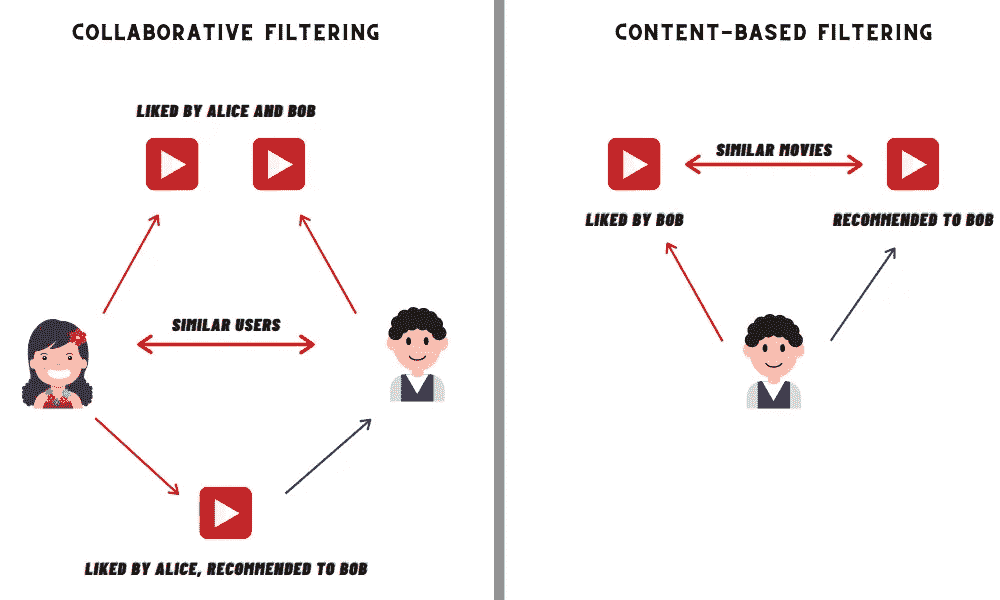

来源:图片由作者提供。左图描述了基于用户的协同过滤方法，而右图描述了基于内容的推荐方法。

换句话说，用户-用户协同过滤是一种算法框架，其中基于与活动用户的相似性来识别相邻用户，然后基于相邻用户的评级来对项目评分，随后由推荐系统推荐基于项目的项目分数。亚马逊、Spotify、脸书、LinkedIn、谷歌新闻、网飞等公司是最受欢迎的使用某种形式的用户-用户协作过滤的公司。亚马逊的“ ***买了这件商品的顾客也买了*** ”就是这种滤镜的一个流行例子，如下图截图所示:

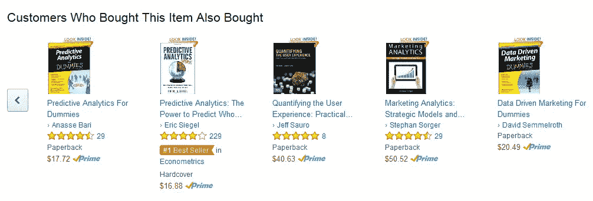

来源:图片由作者提供。亚马逊实现用户-用户协同过滤

推荐算法可以总结为 5 个步骤。

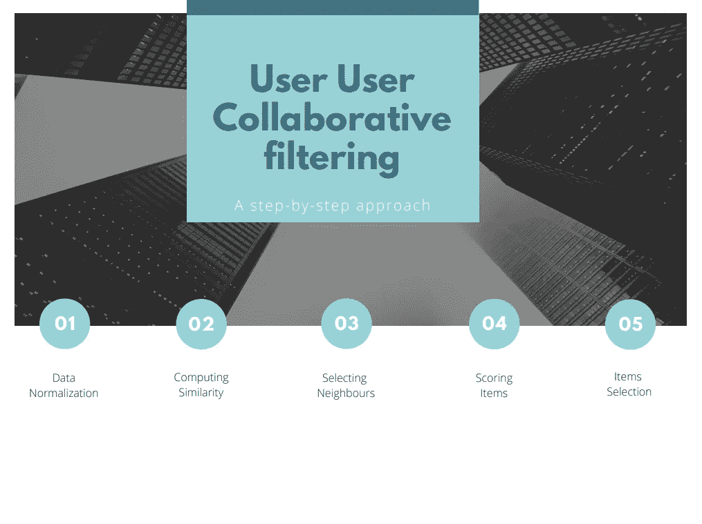

来源:作者图片

然而，这些步骤中的每一步都有各种各样的配置点，有助于选择设置用户-用户协作过滤。

让我们深入细节，看看每个步骤的各种配置点。

***数据归一化***

评级受个人规模的影响很大。一些人在评级时心地善良，倾向于给予高评级，而另一些人只是冷漠，倾向于对好内容给予中等评级。标准化是一种补偿这种用户行为的方法，它通过调整评级尺度使其与其他用户的评级相当或处于同一水平。

标准化评级的一个简单技术是从每个用户的评级中减去他们的平均评级。

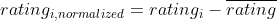

下面是规范化的 python 实现。

```
def normalization(dataframe):
    dataframe_mean = dataframe.mean(axis=1)
    return dataframe.subtract(dataframe_mean, axis = 'rows')
```

让我们为笑话数据集实现这个方法。出于演示目的，我们将选择 10 个用户对前 10 个笑话的评级。

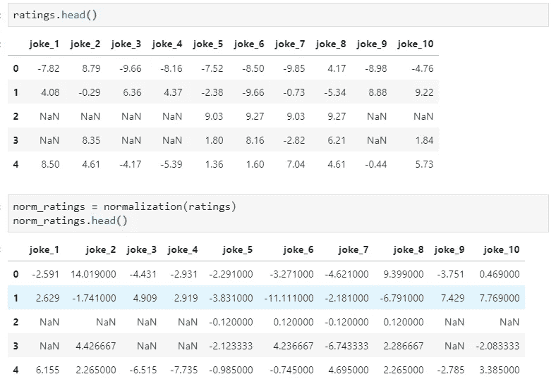

来源:作者图片

我们还可以在标准化步骤实现其他配置。

[Z-score](https://www.statisticshowto.com/probability-and-statistics/z-score/) 是标准化评分数据的另一种可能方式，其中标准化值表示我们的分数与平均值的标准偏差。

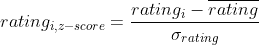

***计算相似度***

用户间的相似度计算是协同过滤算法的主要任务。用户之间的相似度(也称为用户之间的距离)是一种数学方法，用于量化用户之间的差异或相似程度。对于用户-用户 CF 算法，首先计算评价了相同项目的用户 x 和 y 之间的相似性， *sim* ₓᵧ。为了计算这种相似性，使用了不同的度量。我们将使用基于相关性的相似性度量来计算用户 x 和用户 y、 *sim* ₓᵧ之间的相似性，使用[皮尔森相关性](https://en.wikipedia.org/wiki/Pearson_correlation_coefficient)

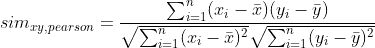

皮尔逊相关的选择是有意义的，因为每个用户的评级数据的相似性度量往往是正态分布的。像其他相关系数一样，这个系数在-1 和+1 之间变化，0 表示没有相关性。-1 或+1 的相关性意味着精确的线性关系。用户 x 和用户 y 之间的正相关意味着，如果用户 x 将一个笑话评价为正面的，那么用户 y 也将很有可能对同一笑话进行正面评价。

下面是使用 [*scipy*](https://www.scipy.org/) 包的 Pearson 关联的 python 实现。

```
def similarity_pearson(x, y):
    import scipy.stats
    return scipy.stats.pearsonr(x, y)[0]
```

现在，我们实现上述方法来为评级数据集寻找皮尔逊相似性。请注意，这里我们使用评分数据集而不是标准化评分数据集来评估相似性，因为皮尔逊相关方法负责标准化步骤！

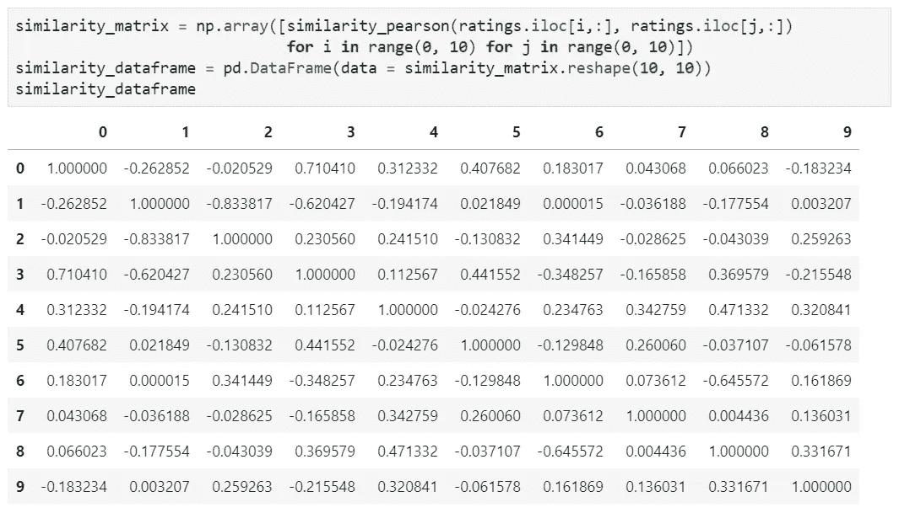

来源:作者图片

我们还可以在相似性计算步骤实现其他配置。

[余弦相似度](https://en.wikipedia.org/wiki/Cosine_similarity)是通过计算两个评价向量之间的角度的余弦并确定两个向量是否指向大致相同的方向来计算两个用户之间的相似度的另一种可能的配置。[余弦相似度是文本分析中常用的一种度量文档相似度的方法。](https://blog.exploratory.io/demystifying-text-analytics-finding-similar-documents-with-cosine-similarity-e7b9e5b8e515)

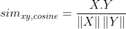

***选择邻居***

用户-用户协同过滤(UUCF)方法严重依赖于活跃的用户邻居信息来进行预测和推荐。邻域选择可以对活跃用户产生或破坏推荐，并且可以对评级预测和项目推荐有直接影响。

目前，任何商业推荐系统都有大量的用户，因此如果推荐系统想要保证可接受的响应时间，邻域必须由用户的子集组成。

下图显示了选择邻域的四种传统方法。

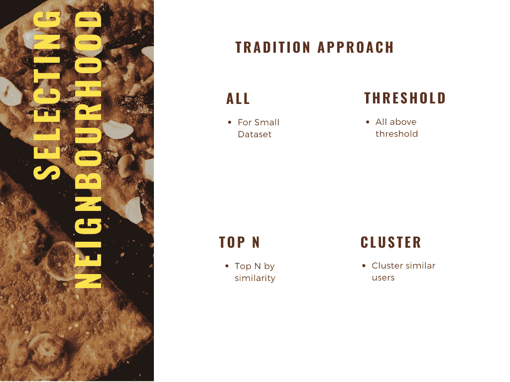

来源:作者图片

1.  当数据集非常小时，使用所有数据集
2.  当相似性分数高于特定阈值时选择数据集
3.  通过相似性得分选择前 N 个数据集
4.  使用 K-Mean 等聚类方法选择一个相似的聚类

我们将使用阈值方法为活跃用户选择邻居。让我们将索引为 2 的用户指定为活动用户。

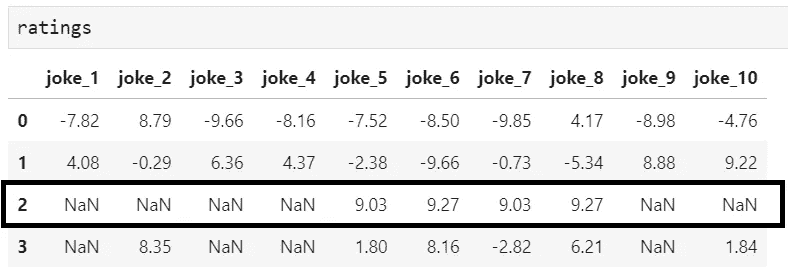

作者图片

活跃用户只阅读了 10 个笑话中的 4 个，所以我们将找出剩余 6 个笑话中的哪个笑话将是对活跃用户的最佳推荐。

让我们选择 0.1 或更高的阈值来过滤掉邻居。

下面是使用阈值方法查找相似邻居的 python 实现。这里“ ***sim*** ”暗示为熊猫系列类型的相似性数组。

```
def neighbours(sim):
    return [sim.index[i] for i, v in enumerate(sim) if v>=0.1]
```

这是我们的活跃用户的相似性数组的截图。请确保在工作前删除活动用户自身的相似性。

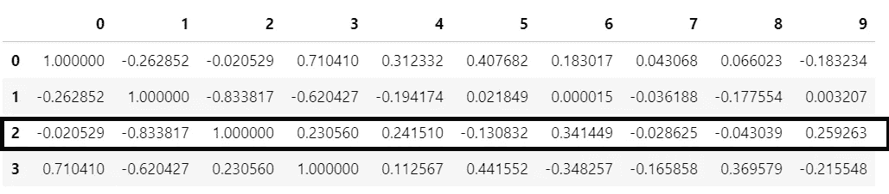

来源:作者图片

我们将为相似性数组实现“ ***邻居*** ”方法。


作者图片

从上面的截图可以明显看出，这里只有索引为 3、4、6、9 的用户才有资格成为邻居。

但是在任何有大量数据的商业推荐系统中，如果我们使用阈值方法，我们可能会有大量的邻居。所以问题来了，有多少邻居？

理论上讲，越多越好，如果我们有一个好的相似度矩阵。但是实际上，来自不同邻居的噪声降低了有用性。如果我们混合了许多低相似度的邻居，那么来自目标用户的差异会开始降低推荐的质量。在 25-100 之间，高相似度邻居经常用于实际和商业推荐系统中。

***评分项目***

使用邻居评级对项目进行评分是制作协作过滤模型的核心。加权平均是构建这种评分系统最常用的方法之一。我们将使用加权平均来计算我们的项目得分。

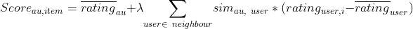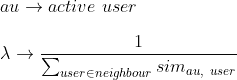

第一步是只选择那些还没有被活动用户评级的项目


作者图片

在我们的例子中，它是笑话 1、笑话 2、笑话 3、笑话 4、笑话 9 和笑话 10。由于其余四个笑话已经分级，我们不会对这些项目进行评分。

下面是邻居评级和邻居相似度熊猫数据框架的屏幕截图。我们将这两个数据帧和评级数据帧创建每个笑话的分数。请注意，这里我们使用标准化评级数据帧来查找 neighbor_rating。

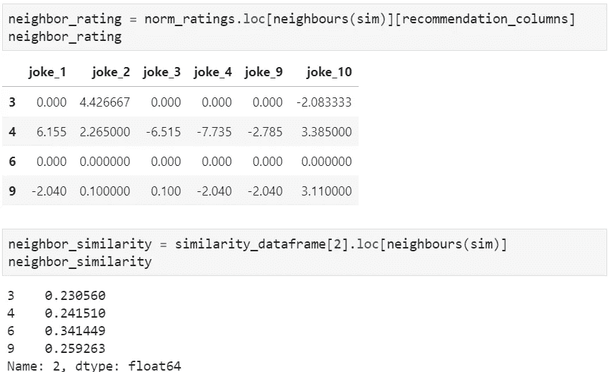

来源:作者图片

下面是计算项目得分的 python 实现。

```
def score_item(neighbor_rating, neighbor_similarity, ratings ):
    # aumr -> active user mean rating
    aumr = np.mean(ratings.iloc[2, :])
    score = np.dot(neighbor_similarity, neighbor_rating) + aumr
    data = score.reshape(1, len(score))
    columns = neighbor_rating.columns
    return pd.DataFrame(data = data , columns = columns)
```

我们将实现“score_item”方法来查找所有笑话的分数。

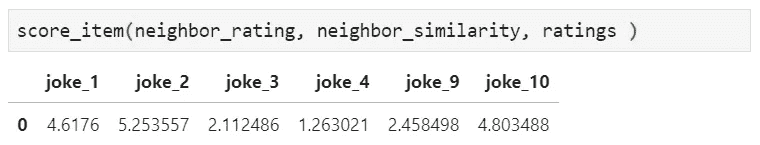

来源:作者图片

在这里，可以清楚地看到，笑话 2 的得分最高，笑话 4 的得分最低。

***物品选择***

一旦决定了项目评分，得分最高的项目将是最佳推荐。因此，在我们的案例中， **joke_2** 将是最适合我们活跃用户的推荐。

> *向我们的活跃用户推荐笑话 2*

然而，通过使用这种方法，推荐很有可能每次只饱和到几个推荐。这可能导致推荐质量下降。

这个问题的一个简单的解决方案是取前 n 个得分高的项目，并随机推荐其中的一个。

# 用户-用户协同过滤的陷阱

用户-用户协同过滤系统在过去已经非常成功，但是它们的广泛使用已经暴露了一些真正的挑战。让我们简单讨论一下使用这样一个系统的四个关键挑战:

***冷启动:***

如果用户是新用户，则不能计算其与其他用户的相似性，因为系统可能没有关于该新用户的任何形式的数据。

***可扩展性:***

随着用户或项目的数量开始增加，用户-用户协同过滤由于相似性计算的增长而遭受性能下降。

***数据稀疏:***

对于大的项目集、少量的评级，经常存在不能为用户做出适当推荐的情况。

***影响:***

一个组织或个人可以通过创建多个公民帐户并设置虚假评级来故意操纵为他人做出的预测。

# 结论

用户-用户协同过滤方法是最常用和研究最多的推荐技术，已经被整个行业广泛采用。这种方法背后的核心概念是“相似的用户往往有相似的品味。”

在这篇博客中，我们介绍了 UUCF 方法及其在笑话推荐中的实际应用，使用了 5 个步骤。我们还展示了在每一步中各种配置点的可能性。

在这些步骤中，我们没有选择最好的结果，而是从可接受的选择中随机选择。这是推荐系统最大的讽刺，因为我们并不寻找最好的结果，一点随机性总是受到用户的欢迎，而且是必要的，否则整个体验会变得单调。

# 参考

1.  [http://eigentaste.berkeley.edu/dataset/](http://eigentaste.berkeley.edu/dataset/)
2.  [https://github.com/abbi163/Jester-Joke-Recommender-System](https://github.com/abbi163/Jester-Joke-Recommender-System)
3.  马尔瓦·侯塞因·穆罕默德、穆罕默德·赫尔米·哈法吉、穆罕默德·哈桑·易卜拉欣。“推荐系统挑战和解决方案调查”。2019 年 2 月 2 日至 4 日，埃及阿斯旺，2019 年 ITCE
4.  张志鹏，工藤康夫和小川哲也·村井。“使用基于覆盖的粗糙集进行基于用户的协同过滤的邻居选择”。运筹学年鉴，2016 年 11 月 8 日
5.  迪特马尔·詹纳赫、马库斯·赞克、亚历山大·费尔费林和格哈德·弗里德里希。“推荐系统，介绍”。剑桥大学出版社，2011 年
6.  Rounak Banik，“使用 Python 的实用推荐系统”。Packt 出版公司，2018 年
7.  Coursera。明尼苏达大学的“最近邻协同过滤”课程。第一周和第二周。