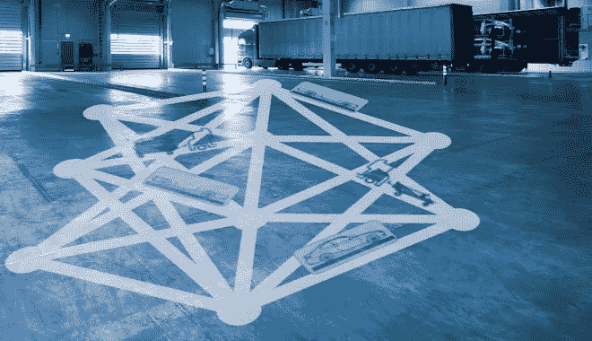
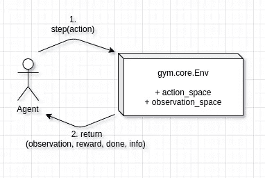
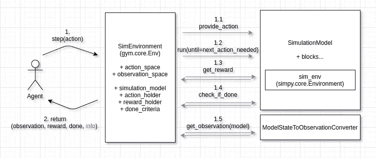
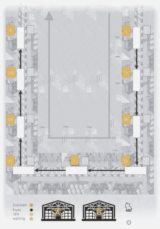
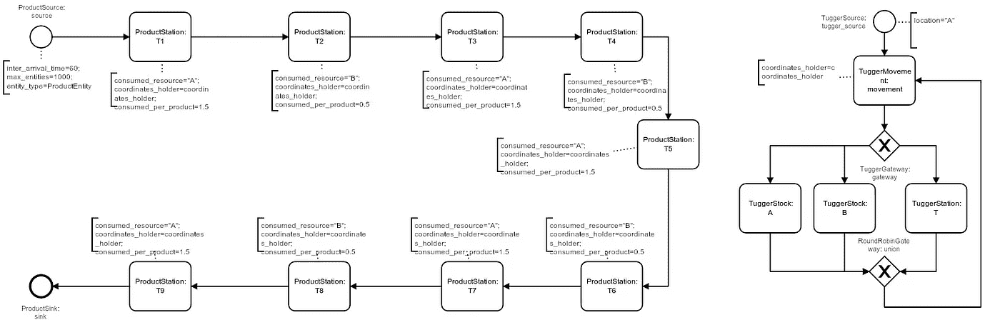
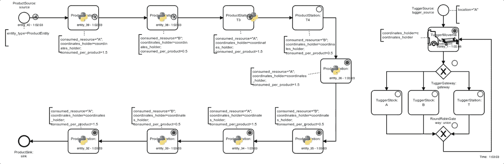
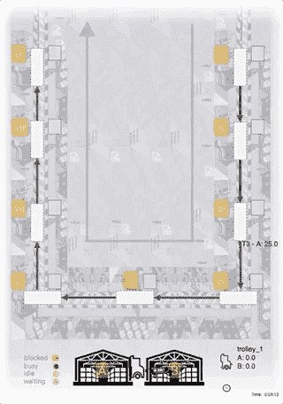
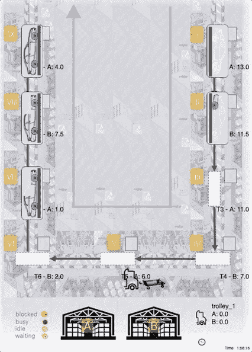
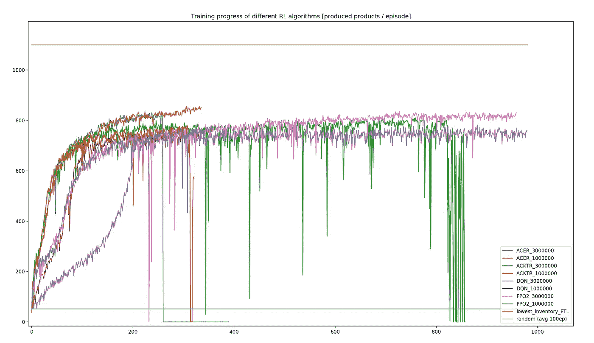

# 使用数字孪生进行装配线供应策略规划

> 原文：<https://towardsdatascience.com/using-a-digital-twin-for-assembly-line-supply-strategy-planning-b1ce328e7263?source=collection_archive---------20----------------------->

## *物流强化学习实践介绍*



照片由来自 [Pexels](https://www.pexels.com/photo/interior-of-empty-parking-lot-257636/?utm_content=attributionCopyText&utm_medium=referral&utm_source=pexels) 的 [Pixabay](https://www.pexels.com/@pixabay?utm_content=attributionCopyText&utm_medium=referral&utm_source=pexels) 拍摄

*人工智能*、*数字双胞胎*、*工业 4.0……*这些流行语你可能听过。但是应用它们来解决实际问题不是很酷吗？
学习实际应用而不是抽象概念？
了解哪些挑战需要应对，哪些陷阱需要避免？

太好了，所以这篇文章是写给*你*的！
它会…

*   描述如何使用强化学习来解决生产物流问题
*   解释强化学习和工业数字双胞胎的基本概念
*   介绍一个关于装配线供应战略规划的深入案例研究

它将包含代码，准备在你的机器上执行。基于 Docker，无需进一步安装。

> *获得回购:【https://github.com/fladdimir/tugger-routing】[](https://github.com/fladdimir/tugger-routing)*

**免责声明:*本文是业余工作的成果。它代表了我们对所讨论主题的个人观点。这是一份记录我们个人经历的报告，而不是一份纯粹的科学研究。内容、概念和它们的实现可能以几乎任何可以想象的方式得到改进。我们仍然希望你喜欢阅读。*

# *概述*

1.  *简短介绍强化学习、数字双胞胎以及如何在健身房环境中包装 DES 模型*
2.  *案例研究描述和模拟模型*
3.  *不同强化学习算法的训练和评估*

# *简介和基础知识*

*强化学习代表了一种来自机器学习的新兴技术。它可以在动态环境中自主衍生复杂的动作序列，并成功应用于各个领域，例如[机器人和游戏](https://openai.com/blog/)。我们可以只提供一个*环境*，而不是为一个问题明确定义一个具体的解决策略。一个自我学习的*代理*将通过互动自主地发现成功的策略。*

*不用说，这并不是什么新鲜事，之前的研究显示了使用 RL 解决生产物流问题的可行性。*

*那么，为什么我们认为有必要再写一篇关于这个话题的文章呢？*

*首先，在 *RL* 以及*数字双胞胎*在生产/物流中的应用方面有很多积极的发展。我们认为，整合这些概念的潜力甚至更大。本文试图展示一个基于工具栈的工作示例，该工具栈无缝集成了两个来自各自领域的最流行的开源软件包:[stable-baselines](https://stable-baselines.readthedocs.io/en/master/)for*RL*和[SimPy](https://simpy.readthedocs.io/en/latest/)for implementation*Digital Twins*。*

# *强化学习*

*如果你还在问自己 RL 能做什么，我们绝对推荐看看[open ai 的家伙们在做什么](https://openai.com/blog/emergent-tool-use/)。*

*诚然，这可能是一个非常复杂和高度工程化的例子，但它可以分解为一个*代理*和一个*环境*之间的简单交互。从技术上讲，这种交互是由一个接口(或者 Python 喜欢称之为抽象基类)定义的，它是 [gym-package](https://gym.openai.com/docs/) 的一部分。*

*下图说明了代理和环境之间的信息交换。首先，代理调用环境的*步骤*方法，提供要执行的动作。然后，环境处理该动作并返回:*

*   *系统的新状态(*观察*)，*
*   *该步骤中发生的*奖励*(可能为零)，*
*   *潜在地指示一集结束的*完成*值(以及后续*复位*的需要)*
*   *和一个*信息*-对象(可能包含附加信息，例如用于记录目的)。*

**

*主体与体育环境的互动*

*界面还规定了更多，如*动作空间*和*观察空间*的格式，以及*渲染*和*重置*行为。
由[稳定基线](https://pypi.org/project/stable-baselines/)包提供的各种 RL 算法已经准备好与实现这个 gym 接口的环境一起工作。剩下要做的就是创建一个合规的环境，在下一节中，我们将展示如何在物流领域实现这一点。*

# *数字双胞胎和离散事件模拟*

*坦率地说， *Digital Twin* 可能是所有“物流 4.0 /工业 4.0”中使用最频繁的术语。尽管我们忍不住把它放入标题中，但从现在开始，我们将证明我们可以做得更好，并使用更具体的术语“离散事件模拟”(DES)。*

*为什么是 DES？离散事件模拟是物流系统分析和设计的广泛工具之一。今天的应用已经超越了系统规划的传统用途。它们包括更多的操作用例，如虚拟调试或短期预测。模拟模型正在与其他 IT 系统紧密结合。这有助于提高过程透明度，改善我们实时分析、控制和优化系统性能的手段。这听起来不是很接近数字双胞胎*的承诺吗？**

*大多数工业模拟应用仍然基于商业软件包。
然而，有几个开源的替代方案，它们通常更接近于通用语言编程。尽管它们往往缺乏一些方便的商业特性，但也有一些优点，比如更好的可伸缩性和简化的接口。*

*与 Python 相关，我们开始意识到两个流行的 DES 包: [Salabim](https://www.salabim.org/) 和 [SimPy](https://simpy.readthedocs.io/en/latest/) 。两者不仅是免费和开源的，甚至是建立在世界上最流行的编程语言之一的标准库之上——让我们看看我们能从中得到什么！*

## *Casymda 套餐*

*基于 *SimPy* ，我们添加了一些补充功能，以获得一些商业“基于块”DES 包的建模便利。
便于使用 BPMN 过程描述生成相应的仿真模型 python 代码。用 [Camunda-Modeler](http://www.bpmn.io) 可以很容易地创建 BPMN 文件(基本上是 xml)。
该图形建模有助于维护高级模型结构的概览。生成的 Casymda 模型还包括一个通用的、令牌式的模拟流程动画，即装即用，可以在 web 浏览器中运行。对于演示和调试，动画可以暂停，其速度可以动态改变。如果在没有可视化的情况下运行模拟，则不会安排仅与动画相关的事件。这最大限度地提高了执行速度——当需要大量运行时，这对于 RL 尤为重要。
Casymda 的其他功能包括在 2D 平铺地图空间中沿最短路径的模拟移动，以及为方便开发而进行的渐进输入(如果您使用的是 [vscode](https://code.visualstudio.com/docs/python/editing) ，请选择 [pyright](https://github.com/microsoft/pyright) )。想了解更多关于 *Casymda* 的信息，请看[这篇文章](https://fladdimir.github.io/post/casymda/)、[回购](https://github.com/fladdimir/casymda)或[(德国)网站](https://casymda.github.io/page/Webpage/Startpage.html)。*

# *在健身房环境中包装 DES 模型*

*为了能够在一个仿真模型中训练一个 RL 代理，我们需要让这个模型实现上面描述的 Gym 接口。*

*下图说明了耦合概念:*

**

*体育环境与仿真模型的互动*

*当健身房环境的`step`功能被调用时(`1`，所提供的动作被传播到仿真模型的相关模块(`1.1`)。这是在`ActionHolder`的帮助下实现的，因此一个消费决策逻辑可以根据接收到的信息进行调度。*

*随后，执行仿真，直到仿真模型触发`next_action_needed`事件(`1.2`)。这表示当前步骤结束，需要代理执行另一个操作。*

> **一个*健身步骤*因此可以包括任意数量的离散的*简单步骤*，每个步骤又可以花费任意数量的模拟时间。**

*奖励在`RewardHolder`对象的帮助下进行管理，该对象在环境初始化期间被连接到仿真模型的相关模块中。在每一步结束时，收集已发生的奖励(`1.3`)。根据要解决的优化问题的类型，可以应用对收集的奖励的后处理(例如，考虑经过的时间量，以便代理可以学习时间有效的行为)。*

*为了检查一集是否结束(返回信息的*完成*部分)，对照配置的`done_criteria` ( `1.4`检查模型的当前状态。这些可以包含例如要达到的一些目标或者要模拟的一定量的时间。*

*为了给代理提供一个观察结果，一个特定于模型的`ModelStateToObservationConverter`被用来从模型中收集相关信息。创建的观察符合定义的`observation_space` ( `1.5`)。该步骤可以包括例如计算不同队列中实体的数量，或者检查库存水平，并根据该信息创建 NumPy 数组。*

*最后，收集的信息返回给代理(`2`)，代理可以根据奖励进行学习，并决定下一步的行动。*

*有了基础知识，让我们看看如何让它工作。*

# *案例研究*

*早在去年 8 月，在柏林举行的 MIM2019 上，我们有机会参加了一场有趣的谈话，两位巴伐利亚人展示了他们关于[改善工厂内牛奶运行系统](https://www.sciencedirect.com/science/article/pii/S2405896319315010)的研究。这些内部交付通常用于装配线供应，并且参观通常遵循非常严格的计划。鉴于生产线上的实际需求往往会发生变化，他们的研究揭示了减少交付周期和提高系统利用率的巨大潜力——只需使旅游规划更加动态。*

*基于这一设置，我们构建了一个抽象和简化版本的装配线以及相应的材料供应系统，为强化学习算法提供了一个平台。*

# *方案*

*下图显示了系统的布局示意图:*

**

*装配线的布局*

*未完成的产品从右上(`I`)进入系统，并在 9 个不同的工位依次组装，排列成 U 形(`I-IX`)。成品在最后一个组装步骤后离开系统(`IX`)。
在装配步骤开始之前，工作站要求在工作站的库存中存在一定数量的`A`或`B`类型的资源。
每个工位一次只能容纳一件产品，只有在下一个工位为空时，才能转发成品(因此，容纳已完成产品的多个上游工位可能会被仍在加工产品或在开始加工前等待材料的下游工位阻塞)。
材料由卷扬机提供，能够运送有限的离散量(“箱子”)。卷扬机可以在一个料架上装载材料(`A`和/或`B`，位于底部)。一次可装载/卸载 1 个离散单位的材料(“箱子”)。装配线的目标是实现最大的生产量，这也与产品的交付周期小相关。*

*假设:*

*   *材料只能在储料器(`A`和`B`)处装载，每个储料器可容纳无限量的材料，因此卷扬机不会在装载现场等待材料*
*   *材料只能在实际需要这种类型材料的工位卸载(因此卷扬机不能在需要`B`装配的工位卸载一箱`A`*
*   *车站(`I-IX`)的库存容量是无限的，因此卷扬机从不在卸载现场等待(否则，当卷扬机无论移动到哪里都无法卸载材料时，可能会发生活锁)*

*60 秒的生产节拍意味着最大生产量为 1440 件产品/24 小时。每个工位每件产品的材料需求为 1.5 (A)和 0.5 (B)，因此平均需求为 9.5/60 秒=大约。0.16/秒(单位每秒)。*

*从库存到系统中平均消费站的平均距离约为。811m(需求加权，因为更高的需求导致对相应车站的更频繁的巡视)。*

*10 米/秒的卷扬机速度、25 个单元的卷扬机容量和每批 5 个单元 5 秒的(卸载)时间导致卷扬机的周期时间约为。212 秒，平均交付速度约为。0.12 单位/秒。这是假设卷扬机“满载”，总是满载地从一个单一的库存移动到一个单一的站。*

*因此，卷扬机最多能达到理论上可能的产品吞吐量的 75%(0.12/s 的输送量对 0.16/s 的需求量)。因此，预期的最佳吞吐量应该约为 1080/24 小时。*

*正如我们所见，卷扬机的输送性能代表了系统的限制因素(瓶颈),这意味着这里的每一项改进都将直接反映在整体吞吐量的相应增加上。
为了简单起见，没有假设随机模型行为(例如随机分布的负载或移动时间)，因此模拟模型将是确定性的。
如上所述:系统作为一个整体是相当抽象和简化的——但是仍然至少捕获了一些真实世界问题固有的基本复杂性。我们的 RL 代理能够…*

*   *掌握底层力学？*
*   *区分不同的产品类型？*
*   *发现需求和供给点？*
*   *如何应对卷扬机能力的极限？*
*   *达到最大可能的吞吐量？*

*我们会找到答案的，但让我们先看看学习环境会是什么样子。*

# *仿真模型*

*系统的[仿真模型](https://github.com/fladdimir/tugger-routing/tree/github/tugger_src/gym_env/des_model)基本上由两个过程组成，如下图所示。*

**

*模拟模型中的流程:产品装配(左)和材料供应(右)*

*在左侧，产品在离开系统之前通过 9 个组装步骤(`ProductStation`，旋转 U 形)，偶尔会被下游工位阻挡或在某个工位等待材料。*

*在右侧，卷扬机通过无限循环的移动和装载/卸载过程步骤(在位置`A`由`TuggerSource`初始创建之后):*

1.  *选择下一个移动目标并完成移动(如果下一个目标等于当前位置，则没有实际移动)(`TuggerMovement`)。*
2.  *根据当前位置(或者是库存`A` / `B`)或者是`ProductStation`)，选择下一个卷扬机工艺步骤:*
3.  *`TuggerStock A`装载一个单位的`A`(如果卷扬机容量未达到)*
4.  *`TuggerStock B`装载一个单位的`B`(如果卷扬机容量未达到)*
5.  *`TuggerStation`如果可能，卸载一个单位的`A`或`B`(装载工位所需的物料)*

*请注意，即使不成功的加载或卸载尝试也会占用很少的固定时间，因此每个可能的健身步骤都保证会占用至少一些模拟时间(并且一个有时间限制的情节也保证最终会到达其终点)。*

*下面你可以看到一个过程动画，以及一个贴图动画。这里的代理遵循一个明确定义的简单规则，即总是向库存水平最低的站点交付 25 个单位的完整负载。要运行动画，只需克隆 [repo](https://github.com/fladdimir/tugger-routing) ，运行命令，然后访问 [http://localhost:5000](http://localhost:5000) 。*

*流程动画:*

```
*docker-compose up web-animation-lia-process*
```

**

*模拟过程的动画*

*平铺地图动画:*

```
*docker-compose up web-animation-lia*
```

**

*2D 空间中的运动动画*

# *准备健身房环境*

*`TuggerEnv`实现了 Gym-Env 接口，并包装了用于 RL-agent 训练的模拟模型。它转发关于下一步移动卷扬机的决定(动作)，它跟踪到达水槽的成品的收集奖励，并检查一集是否完成(即 24 小时/86400 秒的指定时间已过)。*

*Gym-Env 的`render`方法没有实现，因为任意时刻的动画——每当 Gym-step 完成时——对于离散事件模拟环境没有多大意义。动画是单独控制的。`step`的`info`返回值被配置为返回`finished_products`的号码，该号码可以被记录。*

## *观察和行动空间*

*通过`TuggerEnvModelStateConverter`对象从当前模型状态中提取特定于模型的观察值。*

*具体来说，观察值由以下描述系统当前状态的信息组成(总共 48 个值)。*

*`ProductStation`-相关观测值(5 个值 x 9 个站= 45 个值):*

1.  *当前库存水平(标准化，最多 10 件)*
2.  **忙*-状态(二进制)*
3.  **等待材料*-状态(二进制)*
4.  **空*-状态(二进制，产品是否存在)*
5.  **被继任者封锁*-状态(二进制)*

*`TuggerEntity`观察值(3 个值 x 1 个卷扬机= 3 个值):*

1.  *`A`的装载数量(相对于容量)*
2.  *`B`的装载数量(相对于容量)*
3.  *当前位置(索引)*

*请注意，站点观察的某些部分实际上是多余的(例如，既不是*忙碌*也不是*等待*也不是*空闲*的站点只能是*阻塞* ) —背后的基本原理是智能算法将(有希望)了解观察的不同组成部分的重要性，这样我们就不必担心提供所有潜在有用的信息。*

*`action_space`(类型`gym.spaces.Discrete`)由 11 个可能的移动目标(9 个站+ 2 个股票，由索引编码)组成。*

## *奖励*

*如上所述，装配线的既定目标是实现最佳的产品吞吐量，这相当于在一集(24 小时)内生产尽可能多的产品。*

*我们如何实现这一目标？哪种激励适合刺激这种行为？众所周知，设计合适的奖励函数并不是一件小事。事实上，即使是对(可以说更聪明的)人类来说，奖励和激励的设计也是管理和教育中的一个主要问题(还记得上次你为了通过考试而学习，而不是实际学习有用的内容)。*

*对于手头的环境，我们可以考虑在每集结束时，根据在固定时间内(24 小时)完成的产品数量，按比例给予单一奖励，这可能会正确反映我们最大化生产量的目标。然而，最终的奖励将会非常少*并因此大大降低学习速度(以随机行动的平均持续时间为例，在代理人看到任何奖励之前，每集将需要完成 1000 多个行动)。**

*另一个想法是奖励每一个成功交付材料到任何站，这将有可能在 2 个步骤内完成(移动到库存和移动到一个合适的站消耗装载的材料)。通过这种方式，我们将获得更少的回报，但也有一个明显的可利用性问题，这是由这样一个事实引起的:仅将材料交付到一个工作站实际上根本不会导致任何产品的完成。*

*作为一种妥协，我们简单地决定，产品每完成最后一个组装步骤，奖励 1 英镑，这可能在 12 个步骤内完成(最少，不一定是最佳策略)。即使表现出随机行为，这将允许代理人在一集期间产生大约 50 英镑的奖励，因此有足够的“随机成功”样本可供学习。*

*这种奖励的一个问题来自于这样一个事实，即获得奖励所需的模拟时间并没有被奖励本身所反映。由于每个健身步骤实际上会消耗大量不同的模拟时间(从 5 秒到> 100 秒)，因此对吞吐量有巨大的隐含影响，而代理并没有意识到这一点。为了解决这个问题，我们引入了“时间成本”，这意味着我们简单地给每一步一个小的负奖励，与经过的模拟时间成比例。这最终留给我们一个后续问题，即这些“成本”应该有多大。如果定得太高，他们会否决培训开始时为数不多的实际奖励。如果太低，将没有足够的刺激来展示时间效率的行为。同样，作为一个简单的妥协，我们实现了成本的成比例增长，并在一集结束时获得了迄今为止最高的奖励，这保证了一定的平衡，并奖励增加的时间效率。*

*我们设计的上述奖励肯定不是“完美的”,而且感觉有点像在“奖励工程”上投入了太多的精力——尽管如此，这是我们的代理有望使用的第一个解决方案。*

# *RL-代理培训和评估*

*上述环境的特征在于一个*离散*动作空间和一个连续(*框*)观察空间。[稳定基线文档](https://stable-baselines.readthedocs.io/en/master/guide/algos.html)列出了可用的 RL 算法及其兼容性。
由于动作空间的类型，一些算法不可行(如 DDPG、SAC 和 TD3)。*

*为了训练稳定基线 RL 算法，使用`DummyVecEnv`和标准`MlpPolicy`将`TuggerEnv`矢量化。为了利用多个 CPU 进行训练，可能需要使用一个`SubprocVecEnv`(但是对于更简单的日志记录&分析，我们在这里没有使用那个，相反，我们并行进行了多个独立的训练运行)。*

*培训一名 ACER 代理(默认情况下仅 10，000 步，需要<1min):*

```
*docker-compose up acer-training*
```

*Plot performance (might require additional setup for mounting the display):*

```
*docker-compose up acer-plot-training*
```

*Tile-map animation of the trained agent ( [http://localhost:5000](http://localhost:5000) ):*

```
*docker-compose up acer-web-animation-tilemap*
```

*下面我们可以看到一位宏碁代理接受了 100 万步的训练:*

**

*ACER-agent 训练有素的 100 万步动画(<1.5h of training)*

> **如我们所见，该 agent 大部分时间都设法将 25 个单元完全装载到卷扬机上，似乎将正确的(A/B)工位作为材料卸载的目标，并且选择当前库存水平较低的工位似乎也是合理的！**

*但是整体表现如何呢？*

# *性能比较*

*为了进行比较，我们用 1 和 3 mio 的标准设置训练了四种算法(ACER、ACKTR、DQN 和 PPO2)。(健身房)台阶。培训时间长达 2.5 小时(DQN，3 分钟。步骤)，使用如上所述的单进程 *DummyVecEnv* 。
下图显示了每个算法在训练运行过程中每集(24 小时)生产的产品数量，以及确定性最低库存试探法的性能(黄线；总是向具有当前最低库存的站输送 25 个单位的完整负载)，以及完全随机动作的平均性能(蓝绿色线，在 100 集上测量)。*

**

*不同 RL 算法的训练进度(成品/集，越高越好)*

*   *正如我们所看到的，所有的算法都成功地将每集生产的产品数量显著增加到随机行动所达到的水平之上(底部的青绿色线条)，这表明成功的学习进度。*
*   *此外，没有一个经过训练的算法达到最低库存试探法的性能(顶部的黄线)。*
*   *最低库存启发式性能达到系统的估计最大可能吞吐量(估计大约为。1080/集)。因此，可以认为这种策略接近全局最优。*
*   *在训练期间，表现可能会完全崩溃。最突出的:宏碁 _3mio。(蓝线，第 260 集，完全没有恢复)。其他算法也显示性能下降，但似乎恢复得更好(例如 ack tr-green，PPO 2-pink)。*
*   *性能最好的 RL 算法(ACER 为 1mio 训练。步骤，橙色线)达到了 856 个产品/集的最大吞吐量(接近最佳试探法性能的 78%)。*

*每集的次数因每集健身步数(24 小时模拟时间)的不同而不同，取决于每个健身步所需的模拟时间。ACER_3mio 的小插曲。从第 260 集开始，每集高达 17277 步的体操步解释了训练。这一集的每一步只需要 5 秒钟(这是所有健身步骤中最短的可能时间，通过重复访问同一地点来实现)。这种行为可能是由每步定义的负奖励引起的，与该步所需的模拟时间成比例。显然，代理人不记得如何产生积极的回报，只是试图通过最小化步骤时间来最大化短期回报。显然，这种行为不会导致任何成功的交付，更不用说完成任何产品了。*

*值得一提的是，所有的训练运行都是使用默认算法设置完成的，并且强烈建议[对不同的超参数进行评估](https://stable-baselines.readthedocs.io/en/master/guide/rl_tips.html)以实现性能优化。因此，对于 RL 代理来说，朝着理论上可达到的最佳值缩小性能差距并不是不可能的。*

# *总结*

*简而言之:我们最好的 RL 代理在我们的生产物流环境中达到了大约 78%的最佳性能。*

*好吧，这是好是坏？*

*嗯，我们的代理无法达到手工编码的启发式方法的性能，这可能会令人失望。
但是，当我们开始的时候，我们相信我们可以得到一段通用的代码来处理我们特定的、相当复杂的环境中的重要关系吗？肯定不是！
这只是第一次尝试——我们还没有开始超参数调整或替代奖励的评估。*

*你对强化学习的体验是什么样的？
你用 RL 解决了哪些物流问题？
您是否发现了代码中的错误，或者您是否想提出改进建议？
或者，您对当前的实施和工具堆栈有什么疑问吗？*

*欢迎给我们留言，感谢您的阅读！*

*[弗拉基米尔·霍夫曼](https://www.linkedin.com/in/wladimir-hofmann-9065a714b/) — [克莱门斯·l·施瓦茨](https://www.linkedin.com/in/clemens-lennart-schwarz-609815186/) — [弗雷德里克·布兰德](https://www.linkedin.com/in/fredrik-branding-064014163/)*