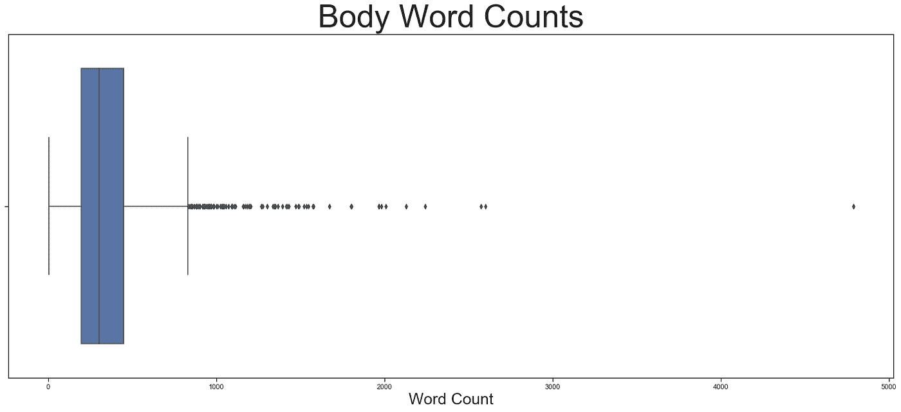
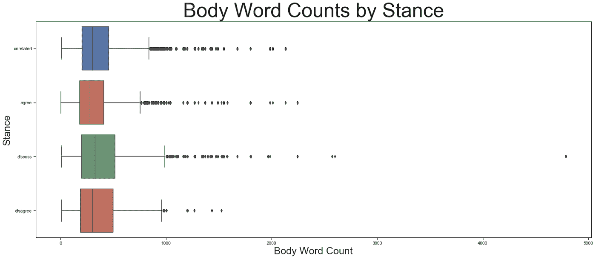
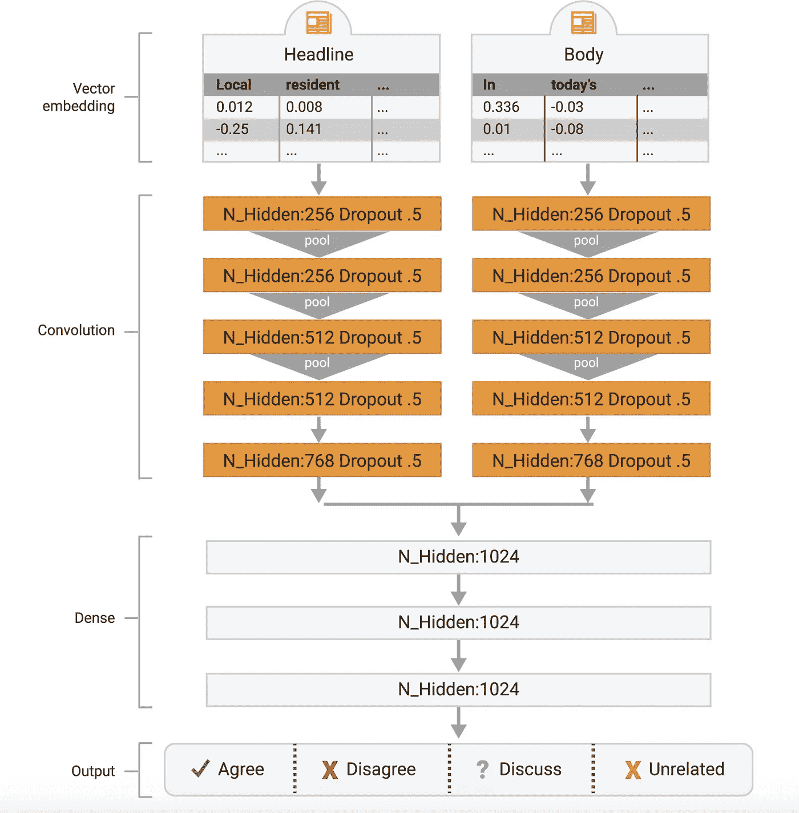
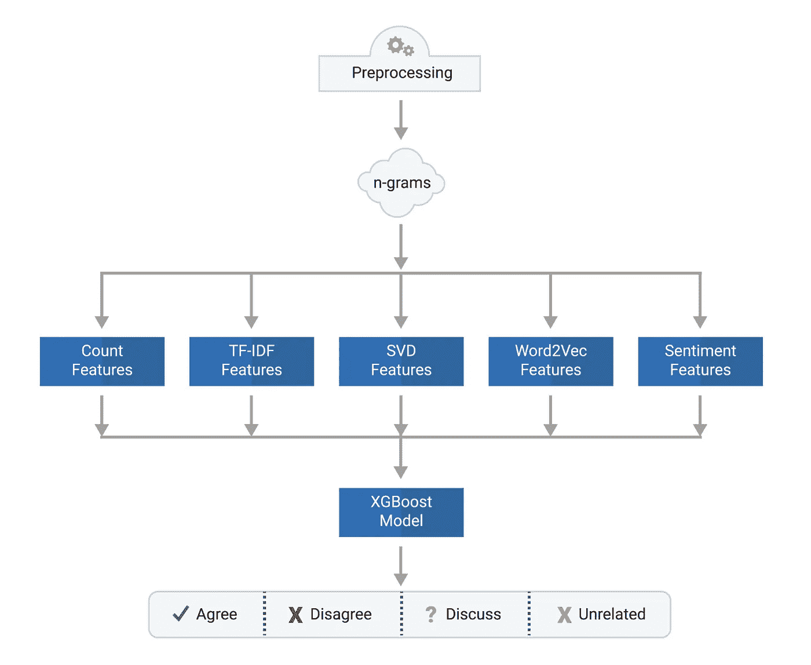
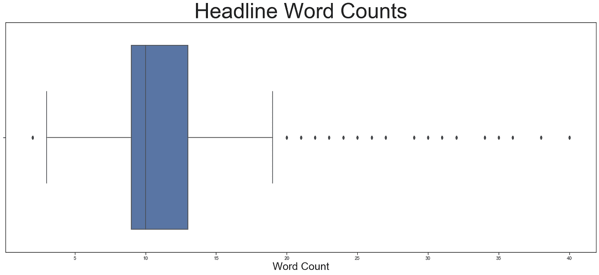
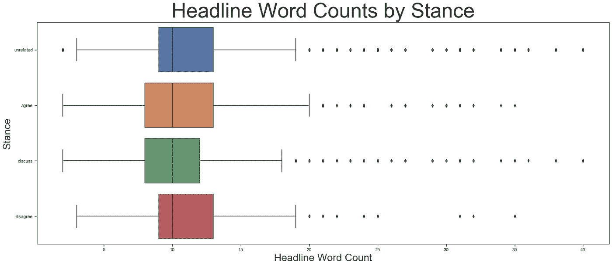

# 利用人工智能打击假新闻

> 原文：<https://towardsdatascience.com/using-a-i-to-combat-fake-news-34f5a51907d6?source=collection_archive---------37----------------------->

## *探索机器学习和自然语言处理的用途，使识别假新闻的过程自动化*

*所进行的工作:* [*大卫·柯布迪*](https://medium.com/u/abe8cf70429?source=post_page-----725daee16102----------------------)*[*杰森·卡茨*](https://medium.com/u/da8692cb0f64?source=post_page-----725daee16102----------------------)*[*迈克尔·哈德*](https://medium.com/u/8c20c2ac3641?source=post_page-----725daee16102----------------------)*[*奈娜·沃顿*](https://medium.com/u/29b5f12bdec0?source=post_page-----725daee16102----------------------)***

*[第二部:利用人工智能打击假新闻建模更新](/part-ii-using-a-i-to-combat-fake-news-modeling-update-d6931ff0f519)*

*[第三部:利用人工智能打击假新闻最终模式](/part-iii-using-a-i-to-combat-fake-news-final-model-933f75657ae0)*

*乔纳森·斯威夫特在 1710 年写道:“谎言飞来飞去，真理一瘸一拐地跟在后面，当人们意识到真相时，已经太晚了。”今天，这句话似乎有先见之明，因为在我们生活的这个时代，只需点击一下鼠标，新闻就能在全球范围内迅速传播。在过去的几年里，假新闻呈指数增长，严重饱和了我们的信息来源，比以往任何时候都更让美国人困惑。2016 年皮尤民意调查显示，近三分之二的美国成年人认为假新闻对时事造成了“很大的混乱”。2018 年，一篇新颖的论文发表在《科学》杂志上，分析了 2006 年至 2017 年间约 300 万人发的 126，000 条谣言。这项研究的结果相当可怕，可以用下面这段话来概括:*

**“大约 12.6 万条谣言被 300 万人传播。虚假的消息比真实的消息接触到更多的人；前 1%的虚假新闻扩散到 1000 到 100000 人之间，而真相很少扩散到 1000 人以上。”*(科学)*

*假新闻不仅接触到更多的人，而且传播速度比真相快得多。换句话说，在 Twitter 上，假新闻主导着真相，其他社交媒体平台也可能如此。此外，从真实新闻中主动分拣假新闻的任务复杂而繁琐。有一些机器学习(ML)分类技术可以用来处理这个过程，但连续训练完整的模型是非常耗时的。区分假新闻和真新闻的过程可以分解成更小的步骤，通过自动化这些步骤，任务变得更容易消化。*

*2016 年，发布了一个带有标签数据的假新闻挑战，比赛的目标是建立一个立场检测的分类模型，这是一个确定新闻标题和正文之间关系或立场的任务。更准确的说，是标题讨论，无关，赞同，还是不赞同文章正文。建立姿态检测 ML 分类模型是创建人工智能管道以区分假新闻和真实新闻的第一步。因此，我们的目标是应对这一挑战，并使用自然语言处理建立一个深度神经网络，看看我们能否击败获胜模型的准确性。虽然这个比赛是在几年前进行的，但我们认为神经网络的最新发展和自然语言处理的进步使得建立姿势检测模型值得重新审视。*

*竞赛网站(链接如下)为参赛者提供了训练集和测试集，以及加权准确率为 79.53%的基线 GradientBoosting 分类器。前三名的准确率分别为 82.02%、81.97%和 81.72%。为了这次竞赛的目的，使用下面图 1 所示的模式对准确性进行了加权。准确性分为两级评分系统，因为将标题和正文分类为相关或不相关(占总分数的 25%)对检测假新闻的整体任务来说用处不大，而且更容易做到。将标题正文对分类为同意、不同意或讨论的第二个级别占准确度分数的 75%。我们将使用相同的指标来确定我们模型的整体准确性。在最初的比赛中，不允许竞争者通过添加更多的标记数据来扩充他们的数据。然而，如果可行的话，我们希望向我们的训练集添加更多的标记数据，以开发更鲁棒的模型。*

**

*图 1 —竞赛的评分结构*

## *EDA:*

*构建更好的分类器的第一步是更好地理解数据(我们将两个不同的数据集合并在一起)。该数据集有三个特征:文章正文、标题和立场，有 49，972 个观察值。在四种不同的姿态中，不相关的标签占了大约 75%的数据或 36，545 个观察值(见图 2)。讨论标签妥协了 17.8% (8，8,909 obs。)的数据，其次是同意标签(7.3%)和不同意标签(1.68%)。*

**

*图 2 —站姿计数的条形图。这是一个不平衡的数据集。*

*鉴于我们的特性数量有限，我们决定使用一些常见的自然语言处理(nlp)技术来生成几个。就标题的特点而言，平均标题由 11.12 个单词组成。然而，正如我们在图 3 中看到的，有许多离群值，标题由多达 40 个单词组成，表明分布是右偏的。不出所料，正文中的单词数要多得多，平均为 368.83 个单词，同样是右偏的。*

**

*图 3 —标题字数的箱线图。标题字数的分布是右偏的。*

*当标题和字数特征按立场分面时，类别之间似乎没有显著差异(图 4 和图 5)，但是，这并不意味着有一个模式。如前所述，数据并不代表同意和不同意标签(其盒图值略有不同),因此数据的缺乏可能会掩盖真实的差异。图 5 是正文字数与标题字数的标记散点图。令人惊讶的是，这两个特征之间似乎没有很强的相关性。*

**

*图 4-每种站姿的身体字数箱线图。不同站姿类别的分布没有显著差异。*

**

*图 5-每种站姿的正文字数与标题字数的散点图。同样，每种姿势都有相似的分布。*

*值得注意的是，训练数据是唯一的，因为有许多不同的标题链接到同一文本。这代表了我们在现实生活中看到的情况，不同的作者会发布一个新闻故事，而这个故事实际上是由不同的媒体或报纸以新的标题报道的。虽然标题不同，但正文通常是相同的，只有一些小的变化。该数据集包含 1，683 篇独特文章的 49，972 个标题。虽然这表明每篇文章平均有 29.69 个标题，但事实证明，一些文章比其他文章更频繁地被“改变用途”。图 6 显示了每个唯一正文的标题数量，我们可以看到一篇文章被“改变用途”了 78 次，但在大多数情况下，数据集包含唯一的标题和正文对。*

**

*图 6 —每个正文标题数量的直方图*

## *获奖模型:*

*赢得假新闻挑战的[模型](https://github.com/Cisco-Talos/fnc-1)使用了两个模型之间的加权平均值:梯度提升决策树和卷积神经网络(CNN)。深度 CNN 使用嵌入应用于标题和正文。嵌入应用谷歌新闻预训练向量。卷积层的输出被发送到具有四级输出的 MLP。这四类是我们的四个量词:同意、不同意、讨论和无关。他们的模型在所有卷积层中使用概率为 50%的丢失进行正则化。他们的超参数被设置为逻辑默认值，但没有被评估来优化他们的网络。它们的 CNN 结构在下面的图 7 中有进一步的描述。*

**

*图 7 —竞争获胜的 CNN 模型结构([https://github . com/Cisco-Talos/fnc-1/tree/master/deep _ learning _ Model](https://github.com/Cisco-Talos/fnc-1/tree/master/deep_learning_model))*

*获胜提交的第二部分加权平均是一个决策树模型。该模型接受基于文本的特征的输入，这些特征来自文章的标题和正文。这些输入被输入到梯度推进决策树中，以预测标题和正文之间的关系(同意、不同意、讨论或不相关)。下面的图 8 概述了这种模型结构。这个决策树模型的输入非常依赖于特征工程。获奖模型的创作者通过预处理(`generateFeatures.py`)、基本计数特征(`CountFeatureGenerator.py`)、TF-IDF 特征(`TfidfFeatureGenerator.py`)、SVD 特征(`SvdFeatureGenerator.py`)、Word2Vec 特征(`Word2VecFeatureGenerator.py`)和情感特征(`SentimentFeatureGenerator.py`)进行特征工程。*

**

*图 8 —赢得竞赛的 XGBoost 模型结构([https://github.com/Cisco-Talos/fnc-1/tree/master/tree_model](https://github.com/Cisco-Talos/fnc-1/tree/master/tree_model))*

*在检查了初始 EDA 之后，我们的下一步将是根据竞争中的顶级放置模型来创建我们的基线模型。在创建基线模型之后，我们可以采取额外的步骤来增强它的性能。考虑到获胜模型在他们的 CNN 中缺乏超参数调谐；可能有机会进一步改进他们的模型。此外，因为有如此多的方法来进行特征工程，所以在决策树模型方面，可能有机会试验各种特征工程方法来提高模型性能。*

## *其他 EDA 数据:*

**

*图 9 —标题字数的箱线图。右偏分布如图所示。*

**

*图 10——按站姿统计标题字数的箱线图。不同站姿类别的分布相似。*

## *参考资料:*

*描述假新闻 twitter 研究及其他假新闻相关研究的文章:[https://www . thealantic . com/technology/archive/2018/03/largest-study-ever-fake-news-MIT-Twitter/555104/](https://www.theatlantic.com/technology/archive/2018/03/largest-study-ever-fake-news-mit-twitter/555104/)*

*原创假新闻挑战赛网址:【http://www.fakenewschallenge.org/ *

*帖子中引用的假新闻推特研究:[https://science . science mag . org/content/359/6380/1146 . abstract](https://science.sciencemag.org/content/359/6380/1146.abstract)*

*乔纳森·斯威夫特(1667–1745)引用:[https://www.bartleby.com/209/633.html](https://www.bartleby.com/209/633.html)*

*获奖模型 github 页面和代码，我们将使用它来启发我们的第一个模型:[https://github.com/Cisco-Talos/fnc-1](https://github.com/Cisco-Talos/fnc-1)*