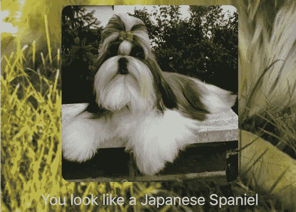
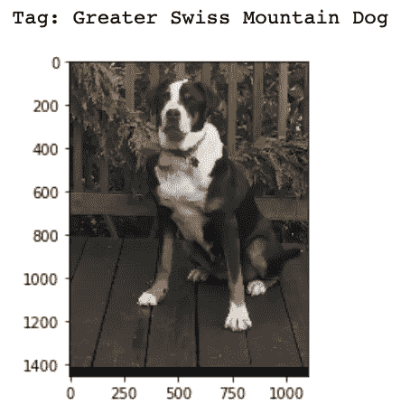
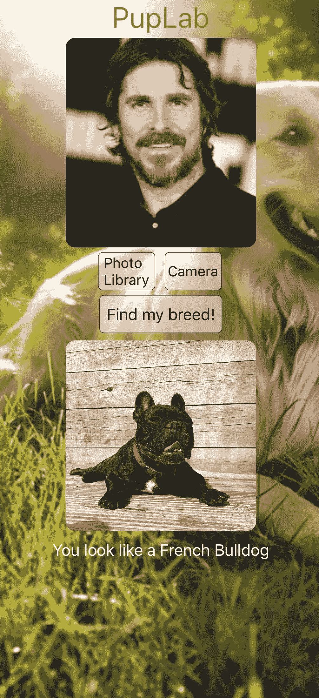

# 在 iOS 应用中实现 Keras CNN

> 原文：<https://towardsdatascience.com/using-a-keras-cnn-in-ios-9e82836b0ee3?source=collection_archive---------56----------------------->

## 如何利用 Keras 和 Swift 实现一个移动 CNN 可以识别你的狗品种看起来很像



作者拥有许可证

我第一次想到在一个应用程序中进行图像分类是在看电视节目《T2》的时候。对于任何非*硅谷*爱好者来说，这部剧是一部喜剧，剧中人物在一个科技孵化器里。孵化器的一名成员推出了一个应用程序，其中唯一的功能是告诉你你看到的图片是“热狗”还是“不是热狗”卷积神经网络(CNN)很可能最适合完成这项任务，虽然我过去上过这方面的课程，但我对如何在移动设备上实现和部署机器学习算法很感兴趣。

我的第一个行动是为一个图像分类应用程序选择一个主题，我选择了狗。谁不喜欢给自己的狗拍照呢？但是为了做到这一点，我需要一个相对大而广的数据集来训练 CNN。幸运的是，斯坦福大学有一个开源数据库，里面有 120 个不同的狗品种，每个品种至少有 150 张图片。



示例输入—作者提供的图片

我的下一个想法是，虽然给狗分类的应用程序会很有趣，但它可能相对来说很平凡。那么，如果模型取一张人的照片作为输入和输出，那么与人最相似的狗的品种是什么呢？该分类器将只在狗身上训练，但给定任何图像，包括一个人的图像，它将提供各种品种的概率结果，因此它将输出最可能的品种作为预测。

苹果 iOS 使用一种名为 Core ML 的工具来执行所有的机器学习任务，如图像识别。起初，我认为我可能需要用 Swift 来构建和训练一个模型，这是一种我相对不熟悉的语言。然而，在谷歌搜索了几次后，我发现苹果提供了一个核心 ML 转换器，它可以将 Keras 模型转换为可以部署在 iOS 应用程序中的核心 ML 模型。

接下来，我必须建立 CNN，并对大约 20，000 张图片进行训练。为了在不进行大量训练迭代的情况下获得足够的模型深度，迁移学习可能是最佳途径。我决定使用流行的 VGG16 网络，它在过去赢得了 ImageNet 竞赛。下面是该网络的概况。


VGG16 网络的架构—公共域

```
from keras.models import Sequential
from keras.layers import Dense, Conv2D, Flatten, Dropout, MaxPooling2D, Activation, Reshape
from keras.preprocessing.image import ImageDataGenerator
from keras.applications.vgg16 import VGG16
```

我将层设置为不可训练，以保持原始的 VGG 权重，并在末端添加了 2 个完全连接的层，同时利用下降来控制过度拟合。我还“弹出”了 VGG 的最后一层，并添加了两个完全连接的层，以使其符合正确的输出数量。

```
model = Sequential()
model.add(VGG16(include_top = False, input_shape = (270,201,3)))
model.layers.pop()
model.layers.pop()for layer in model.layers:
    layer.trainable = False
model.add(Flatten())
model.add(Dense(3000, activation = 'relu'))
model.add(Dropout(0.2))
model.add(Dense(118, activation = 'softmax'))
model.compile(optimizer = 'adam', loss = 'categorical_crossentropy', metrics = ['accuracy'])
```

然而，在开始训练之前，我需要对图像进行预处理。使用 Keras 的 ImageDataGenerator 非常有用，因为它可以根据给定的输入大小调整图像，并允许训练和验证分割。

```
data = ImageDataGenerator(rescale=1./255, horizontal_flip=True, validation_split=.2)train_gen = data.flow_from_directory('/Users/Derek/Desktop/ImageTrain', subset = 'training', class_mode = 'categorical', target_size = (270,201))#201 for ease in coremltest_gen = data.flow_from_directory('/Users/Derek/Desktop/ImageTrain', subset = 'validation', class_mode = 'categorical', target_size = (270,201))
```

我对模型进行了训练，直到验证错误开始增加，并将其保存为 Keras checkpoint .h5 格式。然后我把我的模型转换成。可用于 iOS 设备的 mlmodel 格式。

```
import coremltools
model.save('your_model.h5')
coreml_model = coremltools.converters.keras.convert('your_model.h5', image_scale = 1./255., class_labels=class_list, input_names='Image', image_input_names = "Image")
spec = coreml_model.get_spec()
coremltools.utils.convert_double_to_float_multiarray_type(spec)
coreml_model = coremltools.models.MLModel(spec)coreml_model.save('my_model.mlmodel')
```

在我开始应用程序开发之前，我必须学习一些 Swift 的基础知识，老实说，我还必须学习应用程序开发！我在 YouTube 上找到了一个很棒的教程，叫做《Chris 的编码》,它讲述了 Swift 和 Xcode 应用程序开发的所有基础知识。⁴:有了这个教程，我能够把一个单一视图应用程序放在一起，它接受来自用户相机胶卷的图像或通过应用程序拍摄的图像作为输入，并输出最可能的狗品种分类，以及狗的图片。虽然这个过程的大多数方面都很简单，因为 Apple 在 Xcode 中使用了许多拖放功能，但我必须手动预处理用户图像大小，以确保它适合 CNN 中的输入尺寸。

```
**func** full_preprocess(uiim: UIImageView, cgim: CGImage) -> CVPixelBuffer {**var** im = **self**.imageWithImage(image: uiim.image!, scaledToSize:CGSize(width: 67, height: 90))//This has to be half of the model input size because of the buffer**let** ratio:Double = 270.0/Double(im.cgImage!.height)**if** ratio != 1 {im = **self**.imageWithImage(image: uiim.image!, scaledToSize:CGSize(width: 67.0 * ratio, height: 90 * ratio))}**let** new_im:CVPixelBuffer = **self**.pixelBufferFromCGImage(image: im.cgImage!, image2: im)**return** new_im}
```

现在你有了它，一个利用数据科学和应用程序开发的项目，一个有希望让你一路开怀大笑的项目！



作者拥有许可证

# **参考文献**

1.  越南安乐，*杨坚:热狗识别 app* ，2017，[https://www.youtube.com/watch?v=vIci3C4JkL0](https://www.youtube.com/watch?v=vIci3C4JkL0)
2.  斯坦福大学，*斯坦福狗数据集*，[http://vision.stanford.edu/aditya86/ImageNetDogs/](http://vision.stanford.edu/aditya86/ImageNetDogs/)
3.  苹果，*芯 ML，*https://developer.apple.com/documentation/coreml
4.  CodeWithChris， *Code With Chris，*[https://www.youtube.com/channel/UC2D6eRvCeMtcF5OGHf1-trw](https://www.youtube.com/channel/UC2D6eRvCeMtcF5OGHf1-trw)