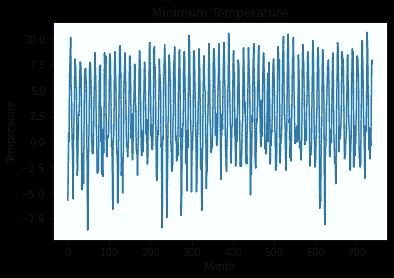
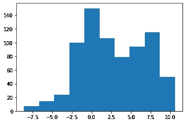
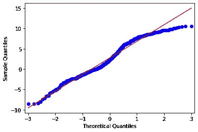
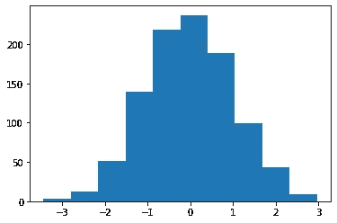
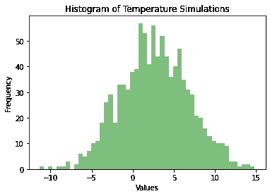
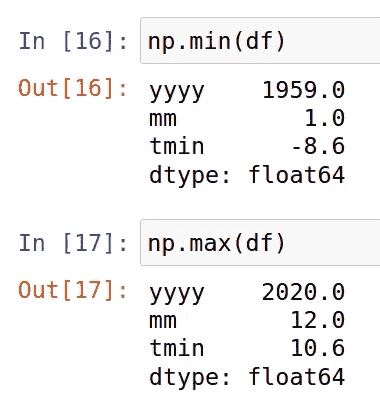

# 用蒙特卡罗模拟预测极端天气事件

> 原文：<https://towardsdatascience.com/using-a-monte-carlo-simulation-to-forecast-extreme-weather-events-d17671149d3e?source=collection_archive---------12----------------------->

## 用蒙特卡罗模拟检验温度情况


来源:图片来自 [Pixabay](https://pixabay.com/photos/drop-wet-h2o-icicle-clean-cold-3065629/)

在之前的[文章](/limitations-of-arima-dealing-with-outliers-30cc0c6ddf33)中，我概述了 ARIMA 等传统时间序列模型在预测极端温度值时的局限性，这些值本身就是时间序列中的异常值。

在处理极值时，蒙特卡罗模拟在量化极端事件发生的概率方面可能是更好的解决方案。

# 背景

在最后一个示例中，苏格兰 Braemar 的月平均最低温度值用于训练和验证 ARIMA 模型预测。这是使用从 1959 年 1 月到 2020 年 7 月的每月[英国气象局数据](https://www.metoffice.gov.uk/pub/data/weather/uk/climate/stationdata/braemardata.txt)完成的(包含公共部门信息[在开放政府许可 v1.0 下许可](https://www.metoffice.gov.uk/about-us/legal/tandc#Agreement-to-terms-of-use))。

在这种情况下，蒙特卡洛模拟建立在相同的数据上，试图生成一系列温度值的情景分析。

首先，让我们仔细看看数据本身。

这是布拉马的月平均最低温度:



资料来源:英国气象局

让我们更详细地分析时间序列。首先，让我们绘制一个分布直方图:



来源:Jupyter 笔记本输出

通过查看直方图，我们可以看到分布显示负偏斜。我们来算一下这个来确认一下。

```
>>> series = value;
>>> skewness = series.skew();
>>> print("Skewness:");
>>> print(round(skewness,2));Skewness:
-0.05
```

从这个分析中，我们观察到分布是负偏态的，因此不一定遵循正态分布(至少不完全是)。

以下是残差的 QQ 图:



来源:Jupyter 笔记本输出

特别是，我们可以看到上分位数的值偏离了正态分布线。中位温度为 2.2°C，平均温度为 2.72°C(布雷马尔是英国最冷的地区之一)，显著高于这一温度的值超出了正态分布的界限——我们预计，随着上分位数记录的温度降低，分布将呈现更为正常的形状。

此外，模拟天气模式可能相当棘手，因为地理分布会有所不同。例如，赤道的温度分布将与两极的温度分布大不相同。在这方面，为了准确地模拟天气，理解所讨论的时间序列的分布是必要的。

# 蒙特 卡罗模拟

对于此模拟，将生成 1000 个随机值。由于该分布已被确定为负偏态，这意味着生成的随机值也必须遵循类似的负偏态分布。

## 预测每月最低温度

为此，可以使用 **scipy** 库中的[](https://docs.scipy.org/doc/scipy/reference/generated/scipy.stats.skewnorm.html)****。如前所述，a(或偏斜参数)设置为 **-0.05** 。****

```
**from scipy.stats import skewnorm
a=-0.05
distribution = skewnorm.rvs(a, size=1000)**
```

****以下是生成的数组的示例:****

```
**array([ 1.10993586e-01,  1.92293755e+00, -1.29797928e+00, -1.36817895e+00,
       -4.08836917e-01, -2.20566871e-01, -1.80936352e+00,
...
-1.59656083e-01,  2.10239315e+00,  1.98068918e-01, -2.23784665e-01])**
```

****下面是生成数据的图表，显示了非常轻微的负偏差:****

********

****来源:Jupyter 笔记本输出****

****原始系列的平均值和标准差计算如下:****

```
**>>> mu=np.mean(value)
>>> mu
2.7231393775372124>>> sigma=np.std(value)
>>> sigma
4.082818933287181**
```

****现在，形成假设分布的生成的随机数乘以 sigma(标准偏差)，然后将乘积加到 mu(平均值)。****

```
**y = mu + sigma*distribution
num_bins = 50**
```

****这里是本程序的另一个例子[(假设正态分布)。让我们生成一个温度模拟直方图:](https://gawron.sdsu.edu/python_for_ss/course_core/book_draft/visualization/Normal_Distribution.html)****

```
**# Histogram
plt.hist(y, num_bins, facecolor='green', alpha=0.5)
plt.xlabel('Values')
plt.ylabel('Frequency')
plt.title(r'Histogram of Temperature Simulations')**
```

********

****来源:Jupyter 笔记本输出****

****你会注意到最低模拟温度-11.32°C 刚好低于原始数据中记录的最低月平均温度值-8.6°C。从这个角度来看，该模型在估计每月可能出现的极端最小值方面做得相当好。****

********

****来源:Jupyter 笔记本输出****

## ****预测每日最低温度****

****也就是说，这个例子中的一个限制是我们处理的是月度数据，而不是每日数据。****

****假设我们希望预测最低的每日最低温度。这个模型在这个场景中有用吗？****

****事实上，1982 年 1 月 10 日 [Braemar](https://www.metoffice.gov.uk/research/climate/maps-and-data/uk-climate-extremes) 记录的最低**日最低温度**为-27.2 摄氏度，这大大超过了蒙特卡洛模型模拟的最低温度-11.32 摄氏度。****

****这表明，分布可能比月度数据显示的更加负偏。使用每日数据可能会显示更大的负偏差，对于蒙特卡洛模拟可能会提供更多信息。****

****让我们将 **a** (我们的偏斜参数)降低到-2，看看会发生什么。****

********

****来源:Jupyter 笔记本输出****

****记录的最低月平均温度为-12.34 摄氏度。这仍然比记录的最低日温度高得多。****

****在这方面，虽然蒙特卡罗模拟对月度数据建模有用，但这种模拟仍然无法补偿我们没有所需数据的情况。****

****很有可能，Braemar 的每日温度数据将意味着一个更加负偏态的分布。也就是说，该系列的平均值和标准偏差也可能会有很大变化-如果不知道这些参数，那么蒙特卡罗模拟在估计每日值方面会受到限制。****

****当我们有正确的数据时，蒙特卡罗模拟可能是强大的——但它不一定能弥补数据的缺乏。****

# ****结论****

****这是如何使用蒙特卡罗模拟来模拟极端天气事件的介绍。****

****特别是，我们看到:****

*   ****确定相关时间序列的正确分布的重要性****
*   ****在 scipy 中使用 **skewnorm** 生成具有定义偏斜的随机数****
*   ****用于识别极端电势值的蒙特卡罗模拟的实现****

****非常感谢您的宝贵时间，非常感谢您的任何问题或反馈。你可以在这里找到这个例子的 GitHub 库。****

*****免责声明:本文是在“原样”的基础上编写的，没有任何担保。本文旨在提供数据科学概念的概述，不应以任何方式解释为专业建议。本文中的发现和解释是作者的，不以任何方式得到英国气象局的认可或隶属于该局。*****