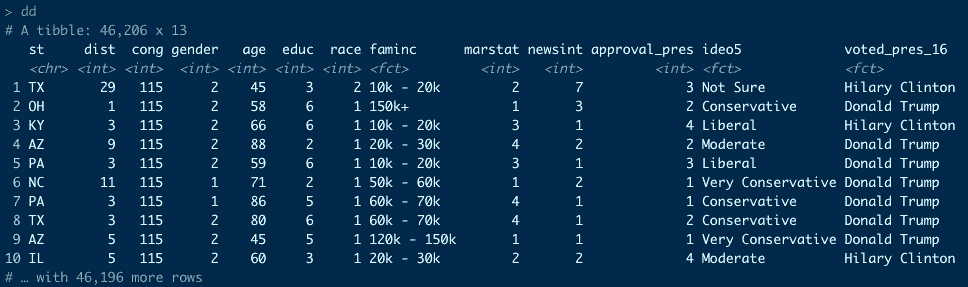
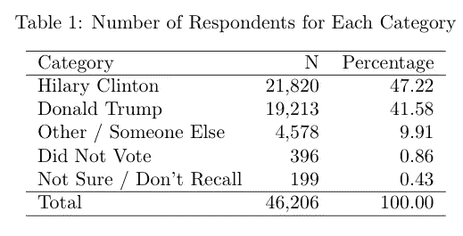
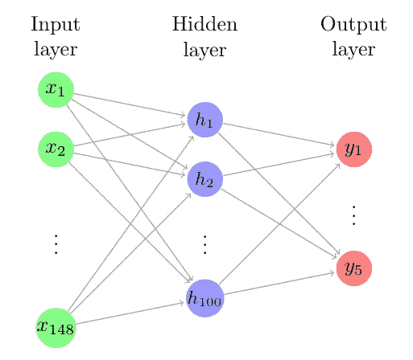
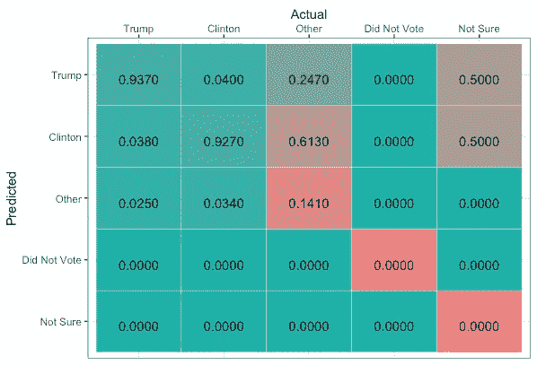

# 使用神经网络来预测选民的偏好

> 原文：<https://towardsdatascience.com/using-a-neural-network-to-predict-voter-preferences-ccb9122a6df1?source=collection_archive---------44----------------------->


由[元素 5 数码](https://unsplash.com/@element5digital?utm_source=unsplash&utm_medium=referral&utm_content=creditCopyText)在 [Unsplash](https://unsplash.com/s/photos/election?utm_source=unsplash&utm_medium=referral&utm_content=creditCopyText) 上拍摄

随着总统选举的临近，政治分析师、预测者和其他利益相关方正在努力对选举结果做出最佳估计。传统上，民意调查被用来衡量政治候选人的受欢迎程度，但计算能力的提高和强大统计方法的发展为他们提供了一个有趣的替代选择。开始预测选举的一个好地方是首先预测选民的政治偏好。这就是我们将要做的。

在本文中，我们将在 R 中构建一个简单的神经网络来预测美国选民的偏好。

我们将使用 Keras 来实现这一点，这是一个令人惊叹的开源 API，它允许您以简单而强大的方式运行神经网络模型。虽然它是在 Python 中本地运行的，但是 RStudio 已经开发了一个允许与 r 无缝集成的包。

在我们开始之前，请确保您已经安装了以下 R 包，因为我们将使用它们来执行我们的预测:

```
install.packages("keras")
install.packages("tidyr")
install.packages("ggplot2")
install.packages("dplyr")
install.packages("fastDummies")
```

**数据**

用于训练神经网络的数据来自 2018 年合作国会选举研究，由 YouGov 管理。它由 Kuriwaki (2018)编制，并从哈佛数据节中提取。您可以在中下载这些数据。Rds 文件格式为 2006–2018 年[此处](https://dataverse.harvard.edu/dataset.xhtml?persistentId=doi%3A10.7910/DVN/II2DB6)。

假设您下载了文件并将其放在工作目录中，我们可以继续导入数据并查看其结构:

```
d <- readRDS("cumulative_2006_2018.Rds")
dim(d)[1] 452755     73
```

`d`是具有 452，755 行(观察值)和 73 列(特征)的数据帧。这些特征包括地理、人口和经济变量，以及其他有趣的变量，如政治认可和新闻兴趣水平。当然，它们也包括每个个人的总统投票选择。这最后一个变量将是我们的因变量，例如，我们将使用我们的模型预测什么。最后，在前面提到的数据集源链接中提供了每个变量的详细解释。

由于我们有 2006 年至 2008 年的数据，让我们过滤`d`以仅选择 2018 年(最近一次调查的年份)的回答:

```
dd <- d %>%
  filter(year == 2018)
```

此外，让我们只选择我们的模型感兴趣的变量，并排除丢失的值:

```
dd <- dd %>%
  select(st, dist, cong, # geography
         gender, birthyr, age, educ, 
         race, faminc, marstat, # demographics
         newsint, # news interest
         approval_pres, # approval
         ideo5, # ideology
         voted_pres_16 # presidential vote
  )
dd <- dd[complete.cases(dd),]
```

该数据框如下所示:



下表列出了各类选民偏好的受访者人数(变量`voted_pres_16`)。可以看出，大约 88%的受访者投票给唐纳德·特朗普或希拉里·克林顿，9.91%的人投票给另一位候选人，大约 1.3%的人没有透露他们的偏好或没有投票。



回到我们的数据集`dd`，排除变量`age`，我们所有的特征都是分类的。因此，我们需要一次性将这些变量编码成虚拟变量。有很多包和函数可以做到这一点，但是这里我们将使用`fastDummies`包中的函数`dummy_cols`。

```
cat_vars <- colnames(dd)
cat_vars <- cat_vars[!cat_vars %in% c("age","voted_pres_16")]
all_data <- dummy_cols(dd,
                 select_columns = cat_vars,
                 remove_first_dummy = TRUE,
                 remove_selected_columns = TRUE)
```

我们还将我们的因变量`voted_pres_16`转换为每个候选项的整数(从零开始)的数字向量，并从我们的数据帧中移除变量`voted_pres_16`:

```
all_labels <- dd$voted_pres_16 %>%
  as.factor() %>%
  unclass() - 1all_data <- all_data %>%
  select(-voted_pres_16) %>%
  as.matrix()
```

最后，我们将我们的数据分成一个训练集(90%)和一个测试集(10%)，这样在我们训练完我们的模型后，我们可以在“新”数据上测试它的性能。

```
party_levels <- levels(all_labels)
elems <- sample(1:nrow(all_data),
                round(0.1*nrow(all_data)),
                replace = F)# training data
train_data <- all_data[-elems,]
train_labels <- all_labels[-elems]levels(train_labels) <- levels(all_labels)# test data
test_data <- all_data[elems,]
test_labels <- all_labels[elems]levels(test_labels) <- party_levels
```

**建立模型**

我们手头的问题被建模为分类问题，其中表 1 中的每个候选代表一个分类类别(总共 5 个类别)。输入层被格式化，使得 148 个解释变量中的每一个都馈入输入层的一个神经元。这些神经元然后连接到隐藏层中的其他神经元。在这个例子中，我们为隐藏层使用了 100 个神经元。最后，输出层有 5 个单元，每个类别一个。图 1 包含了这个神经网络的图形描述。



图一。我们神经网络的代表

因此，我们定义我们的模型:

```
# Define model
model <- keras_model_sequential()
model %>%
  layer_dense(units = 100, activation = "relu",
              input_shape = dim(train_data)[2]) %>%
  layer_dense(units = length(party_levels), activation = 'softmax') 
```

第一阶段(输入到隐藏层)的激活函数是整流线性单位，或 ReLu，而第二阶段(隐藏到输出层)的激活函数是 softmax。

我们现在开始编译和训练模型。我们将在这里使用的优化算法是 *adam* ，这是一种自适应优化算法，通常用于训练深度神经网络。使用的损失函数是*稀疏分类交叉熵。*最后，我们将为模型获取大约 20%的训练数据，以迭代计算验证误差。

```
###### Compile the model ######
model %>% compile(
  optimizer = 'adam', 
  loss = 'sparse_categorical_crossentropy',
  metrics = c('accuracy')
)###### Train the Model #####
early_stop <- callback_early_stopping(monitor = "val_loss", 
                                      patience = 20)model %>% fit(train_data, 
              train_labels,
              validation_split = 1/5,
              callbacks = list(early_stop),
              epochs = 500)
```

上述算法将适合我们的神经网络 500 个时期，如果测试模型性能在 20 个连续时期内没有增加，它将在此之前停止。

**车型性能**

训练完我们的模型后，我们希望通过预测和查看模型性能，使用我们的测试数据对其进行评估:

```
###### Evaluate Model ######
score <- model %>% evaluate(test_data, test_labels, verbose = 0)cat('Test loss:', score$loss, "\n")
cat('Test accuracy:', score$acc, "\n")
```


模型性能

测试损耗和准确度分别为 0.4882 和 0.8461！还不错！

尽管如此，我们现在想看看我们的模型失败了。图 2 详细展示了该模型的性能。



图二。混淆矩阵

上面的图像包含了我们模型性能的混淆矩阵。正确的分类率(对角线上的高精度和非对角线上的低值)显示为绿色，而不正确的分类率(对角线上的低值和非对角线上的高值)显示为红色。

对混淆矩阵的仔细观察表明，该模型没有对“没有投票”和“不确定/不记得”的类别做出正确的预测。这是因为相对于其他类别而言，属于这些类别的意见数量较少:回答“没有投票”或“不确定/不记得”的受访者数量分别仅占总样本的 0.86%和 0.43%(表 1)。因此，为了准确地预测这些类别，需要更多的信息:为了知道回答者*是否没有投票给*或者他们*是否不记得他们投票给了*，仅仅知道投票者的政治和意识形态偏好是不够的。

此外，似乎令人惊讶的是，该模型在将投票者分配到“其他”类别时表现非常差(非常差的 14.1%的准确率)。由于所有观测值中约有 9.91%属于这一类(见表 1)，情况尤其如此。尽管如此，重要的是要注意到这一类别包括非常多样化的总统候选人，如加里·约翰逊(自由党)和吉尔·斯坦(绿党)。这些候选人有着不同的政治意识形态，代表着选民偏好和人口统计数据的混杂。因此，我们可能会认为，实际上可以预期，该模型无法准确预测任何属于这一类别的总统候选人的选票。

所以，我们建立了一个预测选民偏好的模型。我们如何预测选举的结果？

这是一个非常困难的任务，超出了本文的范围，但一个好的开始是用民意调查数据训练我们在这里开发的模型，并使用来自选民名册的数据来预测给定州或整个美国人口的政治偏好。

我希望你喜欢这篇文章，如果你喜欢，请告诉我！

Kuriwaki，Shiro，2018，“累积 CCES 共同内容(2006–2018)”，【https://doi.org/10.7910/DVN/II2DB6】T4，哈佛数据节，V4