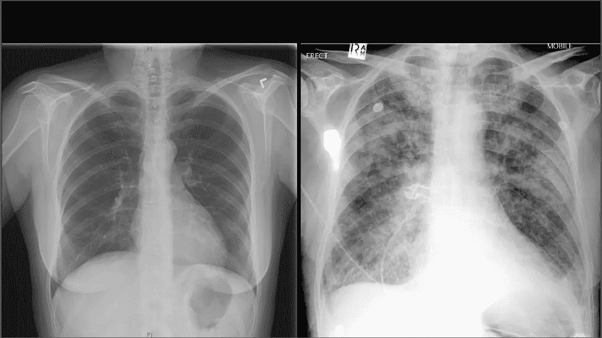
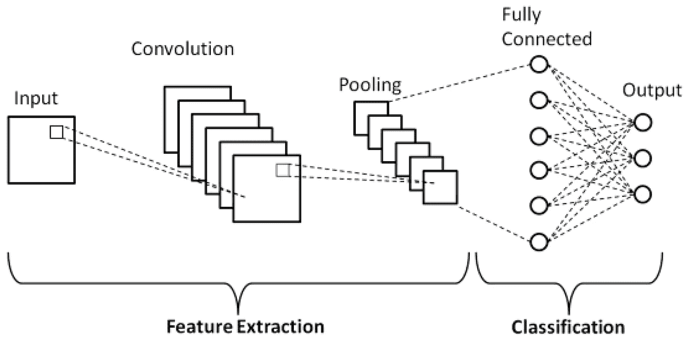
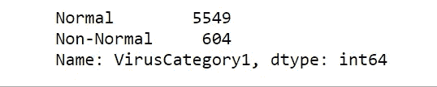
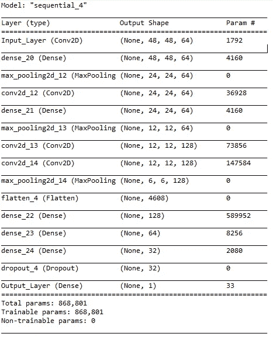
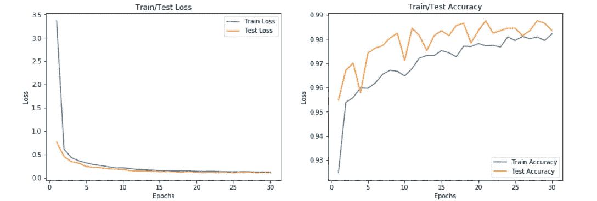
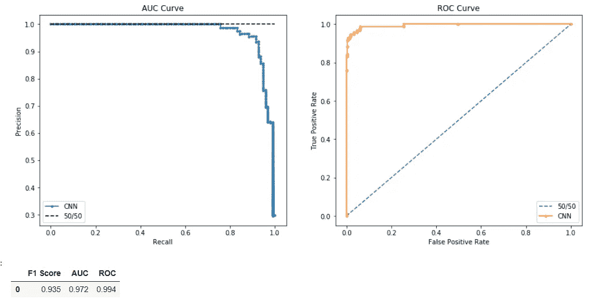
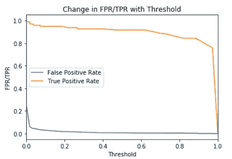
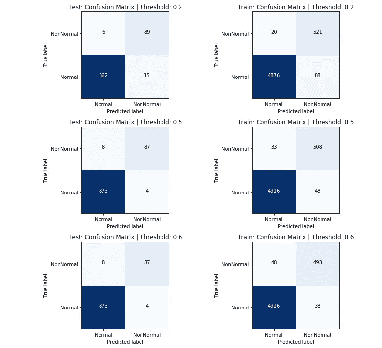
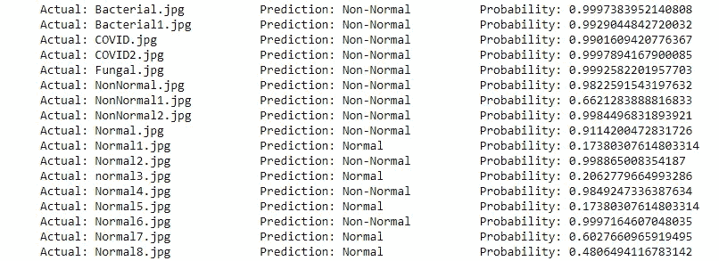

# 图像分类:利用人工智能检测肺炎

> 原文：<https://towardsdatascience.com/using-ai-to-detect-pneumonia-3ec4601acd07?source=collection_archive---------60----------------------->

## 用 Python (Keras)实现神经网络对 X 射线图像进行分类

正常肺(左)与肺炎(右)([来源](https://www.drbeen.com/blog/the-basics-of-chest-x-ray-interpretation/))

在[我的上一篇博客](https://medium.com/the-sports-scientist/using-ai-to-hack-your-fantasy-lineup-2fe022886769)中，我向你们展示了如何创建一个神经网络来预测一名 NBA 球员在任何特定夜晚的表现。虽然这是一个非常有趣的项目，但由于新冠肺炎的原因，我无法在常规赛中测试它。考虑到全球疫情，我真的很犹豫是否要开始一个新项目，因为今年不仅在体育方面，而且在金融和情绪分析方面都被认为是异常值。带着这个问题，我开始搜索 Kaggle，发现了一个充满正常和非正常肺部(肺炎)X 射线图像的数据集。这引起了我的兴趣，所以我继续搜索更多的数据库，找到了更多带标签的照片。我能够将两个数据集合并到一个文件夹中(没有重复)，总共有 6000 张图像。使用这些图像，我将向您展示如何创建一个卷积神经网络，它可以预测一个人是否患有肺炎，准确率约为 98%(测试集)。

**数据集**

*   科罗纳哈克
*   [GitHub](https://github.com/HeeebsInc/covid-chestxray-dataset) COVID 数据集
*   [GoogleDrive](https://drive.google.com/drive/folders/1XsUTrl65JuLQvQeoSGvxqPHvZCWb6tM7?usp=sharing) (包含组合数据集、pickles 和带有图像路径/标签的 csv)

# 卷积神经网络

虽然我们看到的图像有颜色和形状，但在最基本的层面上，它们是数字列表，每个数字对应一个 RGB 值，然后由计算机处理，向您显示图像。卷积神经网络在图像处理中获得了牵引力，因为它们能够将 RGB 阵列分成(1×1)、(2×2)或(3×3)个像素，以便学习图像中的模式

图片来自等人的 [Van Hiep Phung。铝](https://www.mdpi.com/2076-3417/9/21/4500/htm)

** *下面显示的所有代码都可以在我的*[*GitHub*](https://github.com/HeeebsInc/NN_Pneumonia_Detection)** * **上找到

# 密码

带有的数据集。csv 太大了，无法上传到我的 GitHub 上，所以我在我的 GoogleDrive 上公开了它。

包导入

**套餐**

*   Sklearn
*   克拉斯
*   张量流
*   熊猫
*   Numpy
*   泡菜
*   马特普罗德利卜和西伯恩

## 列车测试分离

因为这是我的第一个图像分类项目，我花了几个小时去理解一个将数据恰当地分成测试和训练的架构——特别是因为我从*多个*来源收集了数据。我最终采用的方法是这样的:(1)我首先创建一个 CSV 文件，其中包含每个图像的路径和标签，(2)像往常一样分割训练和测试，根据标签对每个组进行分层，(3)然后我遍历每个图像路径并提取其 RGB 值

[列车试分裂](https://github.com/HeeebsInc/NN_Pneumonia_Detection/blob/master/Train_Test.ipynb)

x 列车等级频率

根据计算机的速度，获取每个图像及其 RGB 数组可能需要几分钟的时间，所以我腌制了每个样本，以避免每次我想训练新模型时都这样做( [GoogleDrive](https://drive.google.com/drive/folders/1XsUTrl65JuLQvQeoSGvxqPHvZCWb6tM7?usp=sharing) )。

在挽救了泡菜之后，现在是时候开始构建神经网络了。下面是模型架构的截图。ReLU 激活函数用于除输出层以外的每一层。Sigmoid 用于激活层，因为分类集是二进制的。

CNN 模型架构

我发现 sigmoid 激活对这个模型更好，因为它对二元分类更准确。如果你调整这个模型来预测肺炎的类型(病毒性，真菌性，等等。)，则 softmax 激活对输出图层更好，使用 categorical _ crossentropy 比 binary_crossentropy 更好。

[CNN 型号](https://github.com/HeeebsInc/NN_Pneumonia_Detection/blob/master/CNN.ipynb)

在同一个笔记本中运行下面的单元，开始培训过程。early_stopping 将防止模型过度拟合，而模型检查点在每次 val_loss 减少时保存权重。

[运行模型](https://github.com/HeeebsInc/NN_Pneumonia_Detection/blob/master/CNN.ipynb)

## 模型评估

模型检查点参数能够在 30 个时期停止模型，以防止进一步过度拟合。从下面的图表中，我们可以看到训练和测试的准确率保持在 96%以上。然而，我学到的一件事是永远不要相信表面的准确性。为了更好地研究模型的性能，我绘制了 AUC、ROC 和决策边界曲线，以确定使用不同阈值时模型如何变化。同样，这些图形的所有代码都可以在我的 [GitHub](https://github.com/HeeebsInc/NN_Pneumonia_Detection) 上找到。

验证/培训损失和准确性

F1，AUC，ROC 分数

该模型的 F1、AUC 和 ROC 评分分别为 0 . 935、0 . 972 和 0 . 994。

TPR 和 FPR 与阈值

在选择阈值之前，首先重要的是要了解您试图解决的问题的背景，以及这将如何影响您想要的结果。在我们的病例中，我们希望对肺炎进行分类。另一方面，如果我们将一个正常的肺归类为患有肺炎，只要我们经常检测到肺炎，这并不是那么糟糕。决定这个问题的决策阈值是在产生最低*成本的最佳值-* 之间进行选择，这在每个机器学习问题中都是不同的。下面，您可以看到不同阈值. 2、. 5 和. 6 的混淆矩阵

不同阈值的混淆矩阵

为了在外部数据上测试这个模型，我从谷歌上收集了 17 张图片，并使用了 0.65 的概率阈值。正如你在下面看到的，这个模型有 100%的正确率和 56%的正确率。如果你下载了我的回购中的代码，有一个文件夹，你可以自己尝试一个预测。你所要做的就是下载图像，将文件命名为正常或非正常以记住它的标签，然后运行[代码](https://github.com/HeeebsInc/NN_Pneumonia_Detection/blob/master/CNN.ipynb)。

[使用谷歌图片的预测](https://github.com/HeeebsInc/NN_Pneumonia_Detection/blob/master/CNN.ipynb)

## 未来方向

*   对肺炎的类型进行分类(病毒性、真菌性等。)
*   使用灰度(1D 阵列)
*   应用[重击](https://machinelearningmastery.com/smote-oversampling-for-imbalanced-classification/)来改变职业不平衡
*   使用尺寸为(96，96，3)或(204，204，4)的较大图像。我最初尝试使用更大的尺寸，但我的电脑太低了。拥有更大的图像可以使检测更准确，因为比后者有更多的细节。