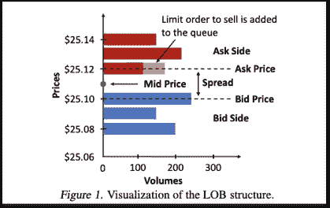

# 用 AI 来交易？以下是 JP 摩根的方法

> 原文：<https://towardsdatascience.com/using-ai-to-trade-682f89d2035e?source=collection_archive---------35----------------------->

## 研究文摘

## 利用强化学习获得最优执行策略

[视觉信用](https://www.mirrorreview.com/jpmorgan-chase-invests-ai-startup-volley/)

在本文中，我们主要关注论文“在模拟市场反应存在的情况下用于自主执行的[风险敏感紧凑决策树”，以讨论机器学习如何帮助我们获得更好的执行策略。在这个过程中，我们从其他论文中添加了更多的信息，这些信息是本文的基本理论，也是帮助我们理解问题的额外来源。](https://www.jpmorgan.com/jpmpdf/1320748255876.pdf)

# **问题:如何执行命令？**

想象一个交易者有一堆钱，这个交易者想买一堆股票。现在，交易者可以使用两个订单来购买股票:

*   **市价指令簿**:以当前市价买卖。交易者提交他/她想要购买的股票数量，然后交易所根据当前市场自动设定价格。
*   **限价委托单**:交易员预先设定的特定价格的买入和卖出。当别人想以这个价格卖出或买入时，交易所会撮合这两个，完成交易。

正如我们可以看到下图。如果交易者想执行限价单，他会将订单放在队列中；如果交易者想要执行市价单，他将立即以当前市价获得执行。

限价订单示例(归功于 Vyetrenko 和徐，2019)

## 限价订单与市价订单

当你要执行**市价单时，**你要确保执行优先于价格。

*   **优势**:您可以立即流动资产，因为交易所会自动匹配价格并执行订单。
*   **缺点**:当你购买资产时，你可能会有很多成本。你可能立即以 101 美元买入一只股票，但如果你只等 5 分钟，你也可以以 100 美元买入。

当你想执行**限价单**时，你把价格放在优先于执行的位置。

*   **优势**:你按照自己设定的价格执行订单，无论买入还是卖出。如果你想以 105 美元买 100 只股票，你先设定一个价格。如果系统匹配到想以 105 美元卖出 100 只股票的卖家，那么系统匹配你们两个并执行这个过程。所以你可以确定你想买的东西的价格。
*   **劣势**:你有长时间不执行限价单的风险。例如，当当前市场价格为 80 美元时，您可以将买入价设置为 50 美元。直到价格降到 50 美元(不太可能)，你才能得到执行。

## **市场影响**

另一个问题是市场影响。股票交易总是有供给方和需求方，这就要保持平衡。问题是大机构往往会在短时间内(比如一天内)买入很多股票。如果市价是 100 美元，他们想用 1，000，000 美元买 10，000 股。如果他们只是一次性地出示订单。市场中的所有人都会知道有人想购买大量股票，然后卖方会根据人性提高价格，这就是所谓的市场影响。为了解决这个问题，他们可以将大订单拆分成更小的子订单来降低成本。

## **执行策略:如何达到最优？**

目标是在今天结束前执行并获得一定数量的股份。但是交易者想要实施一个最优策略来处理它。三个问题仍然存在:

1.每个子订单的比例是多少？

2.他们想什么时候执行订单？

3.对于每个子订单。他们是要执行市价单还是限价单？

对于每个子订单，我们称限价订单为被动订单，因为买家会设定价格，并被动地等待价格匹配。我们称市价订单为积极订单，因为买家希望积极地获得订单，而不考虑价格。

## **最优执行问题 vs .最优布局问题？**

每个人都会问这个问题:我做交易的时候，怎么才能降低成本？从上一段可以看出，当一个交易者想买入一个时间窗口[0，T]给定的 S 股股票时。交易者希望如何最小化获取成本？我们称这个**最优执行**问题。

Bertsimas 和 Lo (1998)提出了一种基于动态规划原理(DPP)的最优执行策略，他们假设了线性价格影响:

线性市场影响

这意味着当前价格(Pt)是先前价格(Pt-1)、你购买股票的比例(St)和随机噪声的函数。他们得出的结论是，最优执行策略只是根据相等的时间间隔将全部股票平均分成若干份。

最佳执行策略

郭等(2013)给出了**最优布局**问题的理论。与最优执行相比，针对交易的最优布局问题发生在更小的时间窗口(10-100 秒)，尤其是在 HFT(高频交易)领域。

## **强化学习方法**

考虑这个问题的方法太多了。本文试图使用马尔可夫决策过程(MDP)和强化学习(RL)来解决这个问题。作者考虑了最优执行策略的价格影响，以及多主体的相互作用(对市场的模拟)。在本文中，3 个组件协同工作:

1.  限价订单簿数据模拟器
2.  强化学习算法:风险敏感 Q 学习
3.  功能选择

# **市场模拟**

## **模拟器互动**

运行该策略有两个组成部分:

1.  **市场模拟器**:让 RL 算法有足够的数据和交互来训练自己，这是一个游乐场。如果我们执行订单，模拟器将模拟市场影响。
2.  **强化学习代理**:强化学习代理将与市场模拟器交互。它下订单以产生市场影响，然后从这个模拟器获得回应作为奖励。

培训流程(归功于 Vyetrenko 和徐，2019)

正如你在这张图片中看到的，他们在模拟市场环境中训练强化学习代理，这与实时执行代理有类似的方案。

## **如何定义市场影响？**

回想一下，一些论文(Bertsimas 和 Lo，1998)使用线性函数来模拟市场影响。

线性市场影响

但在本文中，他们将市场反应作为 LOB(限价订单簿)数据和激进订单规模的函数。这意味着他们可以从 LOB 数据中获得洞察力，而不是使用公式中的假设。

# **强化学习**

对于每个强化学习，有 3 个组成部分:

1.**状态**:有两种状态。对于代理人来说，状态表示头寸，这意味着还剩多少钱，交易者想买多少股票。对于市场来说，一个市场有市场价格，限制目前的订单规模。然后，他们将状态变量分离到箱中。意味着如果有 5 个变量，每个变量分别有 2、3、4、5、6 个箱。它将得到 2*3*4*5*6 = 720 个状态。

2.**动作(a)** :在每一个时刻，都有一个动作选项:在限价指令簿或市价指令簿上押 o 大小，分别代表被动和主动。如果 o = 0，此时他们不执行任何订单。

3.**奖励(R)** :奖励是每次节约的成本。奖励定义为:

每次执行的奖励

在这个公式中，报酬是时间 t 时的执行价格(Pt)、交易者仅执行整个母订单时的价格(Pσ)和订单大小(ft)的函数。

在 Lo 的论文中，他们还使用 MDP 对最优执行策略进行过程建模。但是他们做了一些固定的假设，没有用动态数据来支撑。

因此，在本文中，他们使用 Q-learning 和 MDP 来模拟真实模拟动态环境中的反应。Q-学习中的 Q 值公式定义如下:

在这个公式中，Q 值是**奖励** (R)总和、**状态** (s)和**动作** (a)的函数。定义 Q 值后。目标是获得最大化总贴现回报期望的最优策略:

由于有如此多的状态变量作为特征，他们还使用最小二乘策略迭代方法从总特征池中选择特征的子集。

# **决策树表示的结果**

在强化学习算法中，他们提供了一个可变的参数β来表示不同的风险偏好。

在 Q-Learning 训练过程之后，他们得到一个学习的表格执行策略，然后他们使用决策树来表示这个结果。决策树的优点是决策树可以明确地解释特征。基于此，交易者可以根据状态变量的情况使用不同的策略，积极地(市价单)或消极地(限价单)。

基于决策树的策略(归功于 Vyetrenko 和徐，2019)

**与基准测试**相比，他们的结果更好。基于这种基于强化学习树的智能体取得了很好的效果。该代理可以节省 32%的总执行成本。但是对于标准差来说，这种策略增加了 27%的成本标准差，这是成本节约和风险之间的权衡，这是限价单的本质。

强化学习模型的结果(归功于 Vyetrenko 和徐，2019)

# **结论**

在本文中，作者展示了强化学习算法可用于最优执行问题。它会考虑一个动态的环境，而不是做一个固定的假设。它在限价订单簿数据集上表现良好。和作者表明，他们可以用决策树来表示政策，以指导交易者做出决策。

***来自《走向数据科学》编辑的提示:*** *虽然我们允许独立作者根据我们的* [*规则和指导方针*](/questions-96667b06af5) *发表文章，但我们并不认可每个作者的贡献。你不应该在没有寻求专业建议的情况下依赖一个作者的作品。详见我们的* [*读者术语*](/readers-terms-b5d780a700a4) *。*

# **参考**

[1] Bertsimas、Dimitris 和 Andrew W. Lo。"执行成本的最佳控制."金融市场杂志 1，第 1 号(1998):1–50。[https://doi . org/10.1016/s 1386-4181(97)00012-8](https://doi.org/10.1016/s1386-4181(97)00012-8)。

[2]gatherel，吉姆，亚历山大·席德。"市场影响的动态模型和订单执行的算法."SSRN 电子杂志，2012 年。https://doi.org/10.2139/ssrn.2034178[。](https://doi.org/10.2139/ssrn.2034178)

[3]郭、辛、阿德里安·德拉拉尔和赵阮。"限价订单簿中的最佳位置."SSRN 电子杂志，2013 年。【https://doi.org/10.2139/ssrn.2318220】T4。

[4]郭、辛、阿德里安·德拉拉尔和赵阮。"限价订单簿中的最佳位置:一种分析方法."数学与金融经济学 11 第 2 期(2016):189–213。[https://doi.org/10.1007/s11579-016-0177-5](https://doi.org/10.1007/s11579-016-0177-5)。

[5] Vyetrenko，Svitlana 和 Xu。"在模拟市场反应中自主执行的风险敏感紧凑决策树." *arXiv 预印本 arXiv:1906.02312* (2019)。