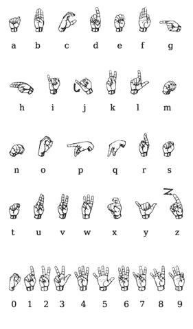
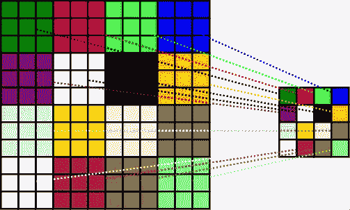
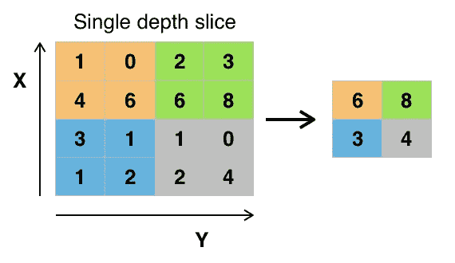
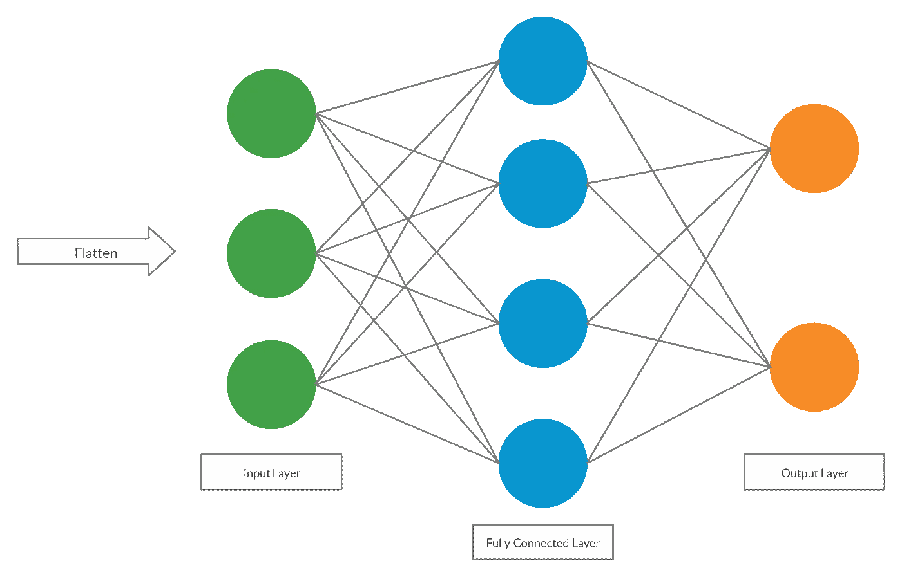
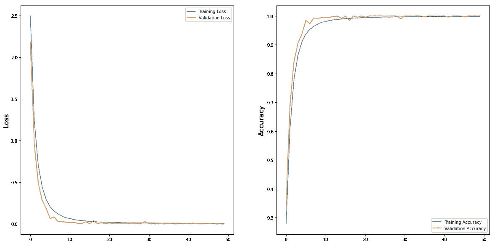

# 用人工智能实时翻译手语

> 原文：<https://towardsdatascience.com/using-ai-to-translate-sign-language-in-real-time-96fe8c8223ed?source=collection_archive---------14----------------------->

## 一个集成 AI 和 ASL 的项目

致谢:[佩克斯](https://www.pexels.com/photo/photo-of-person-s-open-hands-2258248/?utm_content=attributionCopyText&utm_medium=referral&utm_source=pexels)的路易斯·金特罗

世界上有成千上万种语言。几乎所有最流行的语言都可以使用谷歌翻译等软件进行实时翻译。所使用的软件主要基于 NLP 算法，该算法通过文本接收一种语言并通过文本产生其翻译。对于真正的实时翻译，一些软件通过麦克风利用语音来翻译信息，而无需用户键入。这对口语很有用。但是，有 7000 万人不能说话或不能听，他们使用手语作为交流的方式。手语是一种不同的语言，因为它不能说。如果说不出来，那么现在的任何翻译软件都翻译不出来。那么如何翻译手语呢？当然是用相机和一点人工智能魔法！当前的手语翻译者利用摄像机进行翻译，例如[signal 1](https://www.signall.us/)，他使用彩色手套，并利用多个摄像机来理解手势。相机是给计算机视觉的一种方法，让它们能够看到世界。我决定尝试建立自己的手语翻译器。因为我住在美国，所以美国手语翻译是最有意义的。

信用: [Ds13](https://en.wikipedia.org/wiki/User:Ds13) ，通过[维基](https://commons.wikimedia.org/wiki/File:Asl_alphabet_gallaudet.png)

卷积神经网络(CNN)是计算机可以对图像进行分类的方式之一。他们可以对数千张照片进行训练，并学习将每张照片分类到正确的类别中，或者在这种情况下是翻译。我选择做一个简单的 ASL 翻译，在这里我翻译了 ASL ***字母表*** 。它由 26 个手形符号和一个删除和空格符号组成。我把这些标志翻译成英文字母。在我进入代码之前，我先简单介绍一下 CNN。

# 卷积神经网络

CNN 真的很酷，因为他们可以对图像进行分类。对于一个人来说，识别两个物品之间的区别是很容易的，比如一只狗和一只猫，但是对于一台计算机来说，要做到这一点就困难得多。计算机并没有真正“看到”图像。他们把它们看做一系列排列成阵列的数字。CNN 由多层组成。这些层通常是卷积层、池层和全连接层。

信用: [Aphex34](https://commons.wikimedia.org/w/index.php?title=User:Aphex34&action=edit&redlink=1) ，通过[维基](https://commons.wikimedia.org/wiki/File:Typical_cnn.png) (CC BY-SA 4.0)

# **1)**

信用: [Trougnouf](https://commons.wikimedia.org/wiki/User:Trougnouf) ，via [wiki](https://commons.wikimedia.org/wiki/File:Convolution_with_stride%3D3.svg) (CC BY-SA 4.0)

卷积层由一个指定大小的内核/滤波器组成，它在像素上滑动或卷积，将值相乘并求和，最终将其输出到一个新的更小的简化矩阵中。过滤器遍历照片中的每个像素，创建一个新的矩阵，称为**特征矩阵。**这个新的更小的矩阵很重要，因为它突出了图片中最重要的特征(因此得名)。它也更容易训练，因为更小=更少的重量=识别这些重量所需的训练更少。

# **2)**

信用: [Aphex34](https://commons.wikimedia.org/w/index.php?title=User:Aphex34&action=edit&redlink=1) ，via [wiki](https://commons.wikimedia.org/wiki/File:Max_pooling.png) (CC BY-SA 4.0)

下一层是**池层**。汇集层进一步减小了矩阵的大小。它在特征矩阵上传递一个池内核，并取最高像素值(最大池)或平均值(平均池)。在我的例子中，我使用了 max-pooling，因为它采用了图像中更极端的特征，比如边缘，这对识别手势很重要。现在我们有了一个更小的矩阵，重量更轻，需要的训练更少。该矩阵包含图中所有更高级别的细节。

# **3)**

署名:维克拉姆·梅农

现在我们继续到**全连接层**。这里是分类发生的地方。矩阵首先被展平成向量，然后通过神经网络。它通过的神经网络类似于人工神经网络，因为它通过向量，应用权重和偏差，最终以分类结束。CNN 通过使用 ***softmax 激活*** 函数对图像进行分类，该函数给出了输入来自某个类别的概率。

# **工作原理**

请点击此处查看 GitHub 资源库中的完整代码:

 [## 维克拉姆语-梅农语/美国手语-字母表-翻译

### 使用 CNN 翻译美国手语字母。为维克拉姆语-梅农语/美国手语-字母表-翻译的发展做出贡献

github.com](https://github.com/vikram-menon/ASL-Alphabet-Translation) 

**数据准备**

这些层的输入是 ASL 数据集，可以在[这里](https://www.kaggle.com/grassknoted/asl-alphabet)找到。数据被组织到 29 个文件夹中，每个文件夹中有 3000 张图片，代表字母表中的每个字母。3 个额外的文件夹是空间，删除和什么都没有。我组织了数据，这样 80%的照片是在训练中，20%是在验证中。此外，为了加快训练速度，我将数据集中的所有图片从 200x200 缩小到 48x48。

**可选层和池层**

该模型中使用了 4 个卷积层和池层。对于每一层，执行 5 个动作:

1.  在第一行中，定义了**过滤器的数量和过滤器尺寸**。对于第一层，使用 64 个 3×3 滤波器。图像的输入尺寸在这里也被定义为 48x48。
2.  矩阵经过卷积形成特征矩阵后，经过**批量归一化**。这减少了隐藏层值的移动。这使得训练更容易，因为它稳定了重量，提高了准确性。
3.  我们接下来通过一个**再逻辑单元函数**运行它。这给该层带来了一些非线性，允许 CNN 理解输入的复杂图片。
4.  下一行是**汇集**发生的地方。我们已经将池过滤器大小定义为 2x2，并使用最大池。这进一步减小了矩阵的大小。
5.  最后，矩阵通过一个**漏失**层。丢弃层的作用是随机丢弃神经网络中的节点。删除节点的好处是网络对每个节点的权重变得不那么敏感。这使得网络的预测更加一般化，提高了准确性。在所使用的模型中，我们丢弃了 25%的现有节点，这些节点将在下一层中被新节点替换。

第一卷积层的输出现在成为下一层的输入。矩阵已经变得越来越小，但通过更多的层，它变得更小，只显示照片的关键部分进行分类。这些步骤发生 4 次，唯一改变的是卷积过程中使用的滤波器大小和滤波器数量。

**全连接层**

卷积后，是时候完全连接的层。但是在这之前，数据被展平到一个列向量中。

1.  现在数据可以通过神经网络，使用了一个**密集层**。致密层相当于神经网络。它传递来自前面步骤的输入，并将其全部输出到它的神经元。神经元相互连接，将数据从一层传递到下一层。在这种情况下，有 256 个神经元。
2.  然后经过**批量归一化**。
3.  然后使用 **ReLU 功能**进行激活。
4.  最后，使用 **dropout** 再次丢弃 25%的节点。
5.  有两个完全连接的层，所以代码重复 512 个节点。
6.  一旦通过第二个完全连接的层，输出通过一个 **softmax 函数**，该函数用于给出图像属于 29 个类别之一的概率。
7.  最后几行设置**学习率**并评估模型的**精度**。

# **培训**

既然我们已经定义了模型，我们必须训练它。训练模型是 CNN 活起来的地方。训练是“过滤器和全连接层的权重是多少？”已回答。CNN 使用反向传播来定义所有层的权重。反向传播包括四个步骤:向前传递、损失函数、向后传递和最后的权重更新。

**1)**

正向传递由穿过模型的图像组成。首先，所有的权重和偏差都是随机的，因此分类也是随机的。这是因为模型，特别是滤波器不知道如何识别图像的边缘和特征。

**2)**

分类精度用损失函数来表示。损失函数告诉你你的模型对每张图片的分类有多好。它将图像的预测标签与训练图像的实际标签进行比较。在我们的案例中，分类交叉熵被用作损失函数。

**3)**

接下来，是反向传递，其识别哪个权重导致损失函数高。

**4)**

当这些权重被识别时，权重被更新，使得损失减少。学习率指定了权重可以改变的程度。最终，目标是让预测的标签始终与图片的实际标签相匹配。

# **结果**

经过 50 个时期的训练，该模型在数据集内达到了 100%的验证准确性。这相当令人印象深刻，但该模型能够达到 100%的准确性有一个明确的原因:数据集。当查看数据集中一个类别的图片时，它们实际上都是相同背景上的相同照片。因此，该模型很容易达到 100%的准确性，因为每张照片之间没有太多的变化，从而非常快地达到高准确性。

各时期模型的损失和准确性图表

# **现场预测**

我仍然想让模型执行实时预测，以实现制作实时翻译器的目标。使用 cv2，我能够利用笔记本电脑上的网络摄像头捕捉帧，并通过模型发送它们，以预测每个帧的类别。

字母表的前几个字母

成功了！它能够预测大多数字母，但由于数据集范围有限以及我缺乏手语知识，有时会遇到困难。它也只翻译了美国手语字母，而不是单词，但这是一个开始！

这个项目制作起来非常有趣，因为最终的结果非常值得。请继续关注我的下一个版本！

*联系我:*

*领英:*[*https://www.linkedin.com/in/vikram-menon-986a67193*](https://www.linkedin.com/in/vikram-menon-986a67193)

*电子邮件:vikrammenon03@gmail.com*