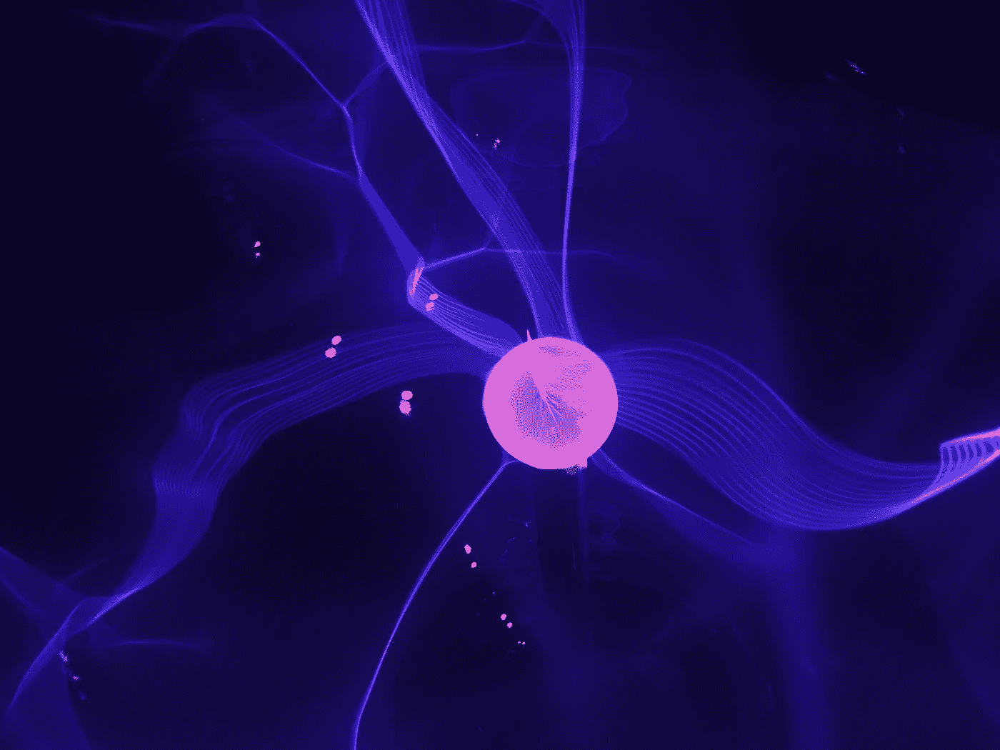
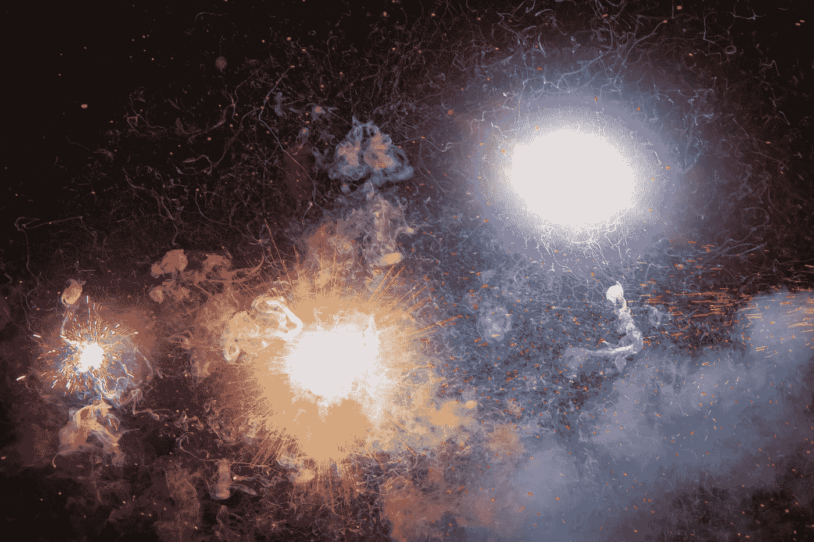
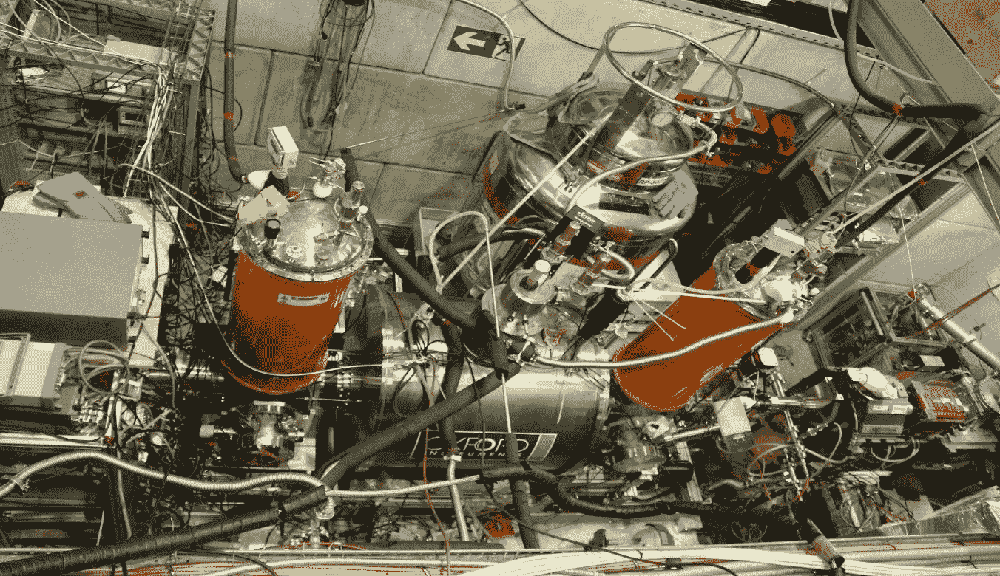
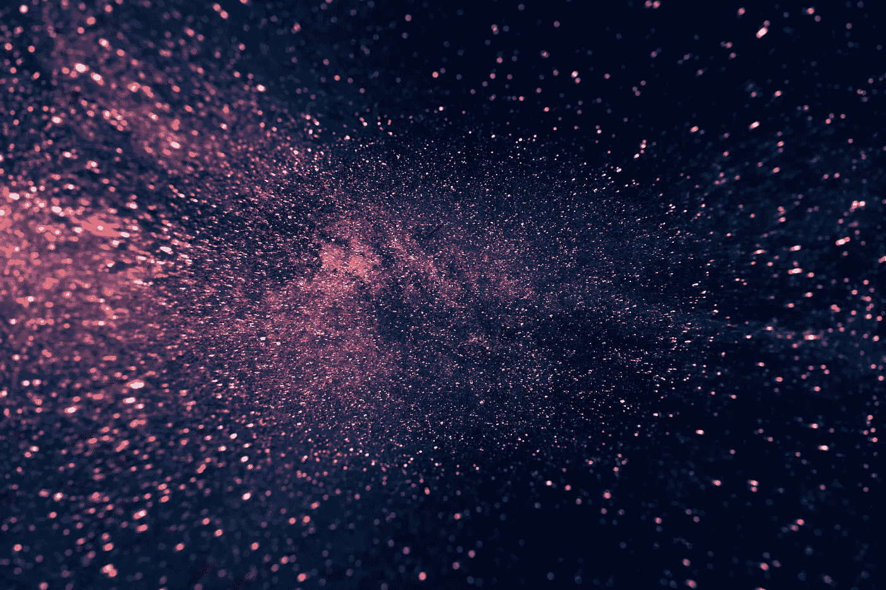

# 用人工智能解开反物质的秘密

> 原文：<https://towardsdatascience.com/using-ai-to-unlock-the-secrets-of-antimatter-d81426c21b3e?source=collection_archive---------32----------------------->

反物质仍然是令人困惑的科学之谜之一。但人工智能可能会给它带来一些启示。照片由[分形哈桑](https://unsplash.com/@tetromino?utm_source=unsplash&utm_medium=referral&utm_content=creditCopyText)在 [Unsplash](https://unsplash.com/s/photos/physics?utm_source=unsplash&utm_medium=referral&utm_content=creditCopyText)

## 这是物质的邪恶双胞胎

  M   *之后——那是我们和我们周围的一切构成的所有东西。然后是反物质。它与物质具有完全相同的性质，但电荷相反。它应该在很久以前就毁灭了所有的物质——但神秘的是，它没有。物理学家正在使用人工智能来找出原因。*

我们在游泳池里。当我竭尽全力的时候，你在快乐地潜水。突然你抬起头，向我喷出一股水。“啊，”我惊叫道，“你这个讨厌的小畜生！”

“你可以用反物质洗掉我的细菌，”你大喊一声，飞快地穿过水。我追着你。“你这是什么意思，”

我物理老师说的！当物质和反物质相遇时，会有一声巨响，然后两者都消失了。

> 当反物质遇到物质时，它会爆炸

他是对的。但是用反物质来让你的细菌消失是相当昂贵的。

“是啊，我从来没在商店里见过它……”

这是因为地球上只有两个地方产生足够大量的反物质。这些是美国的费米实验室和瑞士的欧洲粒子物理研究所。

哇，那它比黄金还稀有！”

没错。此外，把它用作清洁剂可能会有致命的后果。

“为什么，”

因为当物质和反物质相遇时，它会爆炸。物理学家解释说，根据爱因斯坦的公式， *E=mc* 。 *E* 代表能量， *m* 是质量， *c* 是光速的平方。它基本上意味着能量和质量是一回事。

反物质是一种相当容易爆炸的物质。[action advance](https://unsplash.com/@actionvance?utm_source=unsplash&utm_medium=referral&utm_content=creditCopyText)对 [Unsplash](https://unsplash.com/s/photos/explosion?utm_source=unsplash&utm_medium=referral&utm_content=creditCopyText) 的拍照

物质和反物质都有质量。当物质和反物质相遇时，它们的质量转化为巨大的能量。这可能会非常具有爆炸性。

“好吧，那你可以这样洗掉我的细菌，”你哭着把一股水泼在我脸上。我惊讶地摇摇头。“好的，谢谢，”然后我继续我的长度。

你赶上我了。我们怎么知道反物质真的存在？

大爆炸理论预言了这一点。一开始，有很多能量。那种能量变成了物质和反物质粒子，就像反向爆炸一样。

然后物质和反物质再次湮灭为能量。但是不知何故留下了一点物质。我们是由物质组成的，我们之所以存在，只是因为其中一小部分神秘地存活了下来。

 [## 物质-反物质不对称问题

### 大爆炸应该在早期宇宙中创造了等量的物质和反物质。但事实并非如此

home.cern](https://home.cern/science/physics/matter-antimatter-asymmetry-problem) 

“你的意思是，我们只是许多疯狂爆炸的残留物，”

原则上，是的。我们不知道为什么一些物质被遗留下来并形成了我们今天所知道的宇宙。以及为什么太空中几乎没有反物质了。

但是，如果费米实验室和欧洲粒子物理研究所的人正在制造反物质，难道他们不能把我们都毁灭吗？

不，他们制造的反物质太少了。此外，他们总是确保一切都非常安全。

“他们为什么要制造反物质？”

因为我们想知道它是如何工作的！以及它的性质是否与普通物质有所不同。这就解释了为什么大爆炸后会有物质残留。

欧洲粒子物理研究所基础实验的实验装置。由[基地合作](http://base.web.cern.ch)提供

但是尽管所有的实验努力，物质和反物质似乎是完全一样的。唯一的区别是它们的电荷相反。例如，质子带正电荷。反质子带负电荷，但数量完全相同。

人们测量电荷和反物质的其他属性吗？

是的。欧洲核子研究中心的[基地合作](https://arxiv.org/pdf/1604.08820.pdf)是致力于这个问题的小组之一。他们将测量技术改进到令人印象深刻的程度。但是，即使在这种精确的水平上，物质和反物质似乎具有相同的属性。事实上，当我开始我的物理学家生涯时，我在那里实习了几个月。

物理学家正试图揭开我们这个时代最大的谜团之一。Billy Huynh 在 [Unsplash](https://unsplash.com/s/photos/universe?utm_source=unsplash&utm_medium=referral&utm_content=creditCopyText) 上拍摄的照片

哦酷！但你没有解决问题。

没有。而且不知何故，太空中也没有足够的反物质来解决这个问题。

太空中有反物质吗？

是的。来自外太空的宇宙射线由反物质组成。但它们不含那么多。总的来说，我们只在太空中发现了极小一部分反物质，相比之下，如果今天宇宙中有相同数量的物质和反物质，我们会有所期待。

那么物理学家对此做了些什么呢？

甚至更多的研究！和开发新的研究工具。

比如什么？

 [## 粒子物理学家与人工智能合作解决最棘手的科学问题

### 大型强子对撞机(LHC)的实验，世界上最大的粒子加速器在欧洲粒子…

www6.slac.stanford.edu](https://www6.slac.stanford.edu/news/2018-08-01-particle-physicists-team-ai-solve-toughest-science-problems.aspx) 

比如人工智能。它可以帮助 T4 探测反物质。建造足够灵敏的探测器来探测反物质粒子是非常困难的。

“为什么，”

因为探测器是由许多电子元件组成的。电子产品总是会产生噪音。探测器需要将这种噪音与反物质留下的信号区分开来。人工智能的建立极大地改善了这一点。

到目前为止，我们还没有发现物质和反物质之间的任何不对称。也许人工智能会改变这一点。

“但现在这是一个谜！”

的确如此。但我的复仇不是！”当我把一大股水泼到你脸上时，我哭了。