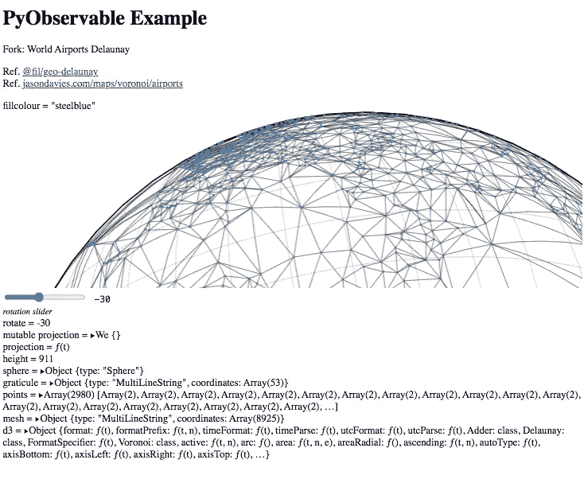

# 在 JavaScript 中使用 ObservableHQ 处理您自己的数据。

> 原文：<https://towardsdatascience.com/using-an-observablehq-plot-in-javascript-with-your-own-data-5eabeb6224f5?source=collection_archive---------13----------------------->

## 使用自定义数据和极少的编码知识定制数据可视化。


World Delaunay —代码输出示例:D. Ellis

# 介绍

大多数人都在努力学习一门新的编程语言并立即使用它。那么，当你看到一个很酷的网络可视化，并想为它改编代码时会发生什么呢——提示:这就是 [ObservableHQ](https://observablehq.com/explore) 的用武之地。

Observable notebooks 允许用户使用现有代码，只调整他们感兴趣的参数，并根据他们的特定需求定制可视化。这篇文章旨在描述一个过程，在这个过程中，你可以从众多可观察到的可视化中选择一个，应用你自己的数据，并把它们放在你自己的网站上。

# 可视化代码

在本教程中，我们将使用一个改编版本的迈克 Bostocks 世界机场德劳内图；

[](https://observablehq.com/@wolfiex/pyobservable-example) [## p 可观察的示例

### 可观察的示例 Fork:世界机场 Delaunay Ref。@fil/geo-delaunay Ref。jasondavies.com/maps/voronoi/airports

observablehq.com](https://observablehq.com/@wolfiex/pyobservable-example) 

并将其加载到网页中。

## 可观察的 API

方便的是，ObservableHQ 的优秀人员提供了一个用户友好的 API，我们可以利用它——让我们不必手动复制任何代码。首先，我们可以使用以下脚本替换相关的可观察用户和笔记本名称。

```
<!DOCTYPE html>
<body>
<script type="module">var user = '**wolfiex**' // our username
var nbk = '**pyobservable-example**' // our notebook nameasync function run(){const apistr = `[https://api.observablehq.com/@${user}/${nbk}.js?v=3`](https://api.observablehq.com/@${user}/${nbk}.js?v=3`)
    const notebook = await import(apistr);
    const define = notebook.default}run()</script>
```

*注意:可以用* `*import define from 'https://api.observablehq.com/@wolfiex/pyobservable-example.js?v=3'*` *一步完成，或者下载笔记本和* `*'./mynotebook.js'*` *代替网址。*

## 可观察运行时模块

我们需要做的最后一件事是导入运行时模块，它将用于运行我们的可观察脚本。这里我们补充一下

```
import {Runtime, Inspector} from "[https://cdn.jsdelivr.net/npm/@observablehq/runtime@4/dist/runtime.js](https://cdn.jsdelivr.net/npm/@observablehq/runtime@4/dist/runtime.js)";
```

到脚本的顶部

```
new Runtime().module(define, Inspector.into(document.body))
```

在我们定义了`define`之后，在 run 函数内。

## 显示输出

要查看输出，我们可以将代码上传到在线平台(例如 [github.io](https://pages.github.com) )或运行本地服务器。后者可以通过使用 node、electron 或 python(如果你安装了的话)来完成。

如果使用 python，您可以启动一个简单的服务器并导航到本地主机 URL 地址`127.0.0.1:8000`。

```
python -m SimpleHTTPServer 8000
```

# 选择我们希望显示的内容

到目前为止，我们已经嵌入了可观察笔记本的所有单元，产生了下面这个笨拙的例子:



整本笔记本的杂乱进口

[*https://wolfiex . github . io/observable tutorial/base _ import . html*](https://wolfiex.github.io/ObservableTutorial/base_import.html)

这里为了便于展示，我们只希望显示图像`"chart"`和滑块`"rotate"`。为此，我们在运行函数中修改了`new Runtime`命令。

## 仅嵌入图表

我们首先只显示“图表”本身。这是通过用下面的代码片段替换运行时代码来实现的。

```
new Runtime().module(define, name => {
    if (name === "chart"){return Inspector.into(document.body)()}
  });
```

## 将元素添加到特定位置

工业中可视化的许多应用依赖于仪表板的创建。在这里，一个页面被分成许多部分，每个部分代表不同的信息。在本例中，我们首先创建一个新的 div 元素，并将其放在`<body>`标签下面(脚本中是**而不是**)。

```
<div id='**topmost**' style='position:absolute;display:block'></div>
```

这里的样式告诉它，它可以占据整个屏幕，并坐在其他 DOM 元素的前面。默认情况下，这将在左侧。

我们现在更新运行时代码，以包括旋转滑块`(viewof rotate)`。为了可读性，我们用一个`switch`语句代替多个`if`语句。

```
new Runtime().module(define, name => {
    switch(name){
      case "chart": return Inspector.into(document.body)();
      case "viewof rotate": return Inspector.into(**document.getElementById('topmost')**)();
    }
  });
```

这里`viewof rotate`被放置在带有`id = 'topmost'`的元素内，而不是主体内。这会产生下面的输出，其中我们的滑块不再显示在图表下方。


对象选择输出

[*https://wolfiex . github . io/observable tutorial/selected _ display . html*](https://wolfiex.github.io/ObservableTutorial/selected_display.html)

# 更改单元格值和数据

我们已经获得了一组可视化效果，并将它们放在我们的网页上——但是我们如何改变它们的输入来匹配我们自己的数据呢？

在分叉笔记本时，我们最初在准备本教程时做了一些更改。其中之一是引入一个`fillcolour`单元来确定每个圆圈的颜色。我们从探索如何改变这一点开始，然后继续提供额外的数据。

## 改变变量值(如颜色)

我们首先将新的运行时命令分配给一个变量名—我们将把它命名为`main`:

```
**const main =** new Runtime().module(define, name => {
        switch(name){
          case "chart": return Inspector.into(document.body)();
          case "viewof rotate": return Inspector.into(document.getElementById('topmost'))();
        }
      });
```

我们现在可以使用以下代码更改`fillcolour`变量的值:

```
main.redefine("**fillcolour**", 'red');
```

## 为绘图提供新数据

目前，用于绘图的数据已经上传到 ObservableHQ 服务器。相反，我们可能希望在观想中使用我们自己的数据。在下面的示例中，我们已经在本地下载了`airports.csv`文件(参见 points 单元格中的 URL ),并将在更新图表输出之前读入并编辑它。

为了简单起见，我们使用[数据驱动文档(d3)](https://d3js.org) 库来读取 CSV 文件。

*这已经在笔记本中使用，因此可以在代码的运行时段中提取。或者，可以用下面的脚本导入:*

```
<script src="https://d3js.org/d3.v6.min.js"></script>
```

我们现在能够加载文件并更新笔记本的点单元。为此，我们定义了一个“解析”函数来处理从 CSV 读取的数据。

为了区分数据集，我们还向经度添加了一个随机分量，并在使用`main.redefine`函数将处理后的数据推入`points`之前取 70%的纬度值。

```
function **parsedata**(data){ //convert to numerical and add randomness
        data = data.map(({ longitude, latitude })=>
        [+longitude**+Math.random()**, +**latitude*.7**])

        // update points cell
        **main.redefine("points", data );**
    }
```

和任何好的代码一样，我们实际上需要运行它。这可以通过以下方式实现:

```
d3.csv("./airports.csv").then(**parsedata**)
```


编辑/自定义单元格值和数据

[*https://wolf iex . github . io/observable tutorial/local _ data . html*](https://wolfiex.github.io/ObservableTutorial/local_data.html)

# 读取变量

有时，我们感兴趣的只是在计算/模拟过程中，每次可变变量发生变化时提取它的值。在这里，我们可以返回一些函数，而不是返回一个元素进行显示:

```
case 'my_mutable_varname':
return {
    **fulfilled**(value) { console.log(name, value); },
    **rejected**(error) { console.error(error); }
  };
```

其中，上述每个功能的定义如下:

*   *观察者*。**完成** ( *值*)，其中值是每次执行后的结果
*   *观察者*。**如果评估失败，则拒绝** ( *错误*)返回*错误*。

# 添加新的样式或变化

在本节中，我们希望应用尚未在可观察笔记本中定义的样式。例如，如果想要将旋转滑块移动到右侧，我可以从在 HTML 页面中定义一个 CSS 部分开始:

```
<style>
    .right{
        float:right
    }
</style>
```

接下来，我们需要告诉导入的元素它属于这个类。为此，我们将开关中的 Inspector 语句更改如下。

```
*const main = new Runtime().module(define, name => {
        switch(name){
          case "chart": return Inspector.into(document.body)();* *case "viewof rotate":*              var **item** = Inspector.into( document.getElementById('topmost'))();**item._node.className += ' right';
**              return **item**; *}
      });*
```

在这里，我们分解了 inspector 返回的元素，并且可以完全访问它的所有属性。虽然我们可以通过`item._node.style`直接访问样式组件，如果我们有多个变更，或者希望将相同的变更应用于许多项目，但是定义一个类通常更容易。

# 结论

这是一个完全实时的可观察笔记本，我们把它改编成了我们自己的网页。

在本教程中，我们制作了一个我们感兴趣的可视化副本，然后将其嵌入到个人网站中，并更改了其中的变量/数据。

有关 observable notebooks 或 javascript 的更多信息，请查看文档中的信息部分:

[](https://observablehq.com/collection/@observablehq/observable-documentation) [## 证明文件

### 浏览和可视化数据。分享和发表你的见解。发现并获得灵感。

observablehq.com](https://observablehq.com/collection/@observablehq/observable-documentation) 

# 代码库

每个示例使用的代码可以在下面的链接中找到。这可以使用 node(如果安装的话)使用`npm i;npm start`运行，或者使用本文中的 GitHub 链接查看。

[](https://github.com/wolfiex/ObservableTutorial/blob/main/base_import.html) [## wolf iex/observable 教程

### 描述如何将一个可观察的笔记本嵌入到网页中的 medium 文章的材料/ …

github.com](https://github.com/wolfiex/ObservableTutorial/blob/main/base_import.html) 

## 资源:

[](https://observablehq.com/@observablehq/downloading-and-embedding-notebooks) [## 高级嵌入和下载

### 笔记本是一个可移植的模块，可以集成应用程序的数据和用户界面。插图:剪贴画等…

observablehq.com](https://observablehq.com/@observablehq/downloading-and-embedding-notebooks) [](https://github.com/observablehq/runtime) [## 可观察总部/运行时间

### Observable runtime 让您可以在任何 JavaScript 环境中运行 Observable notebooks 作为真正的反应式程序

github.com](https://github.com/observablehq/runtime)