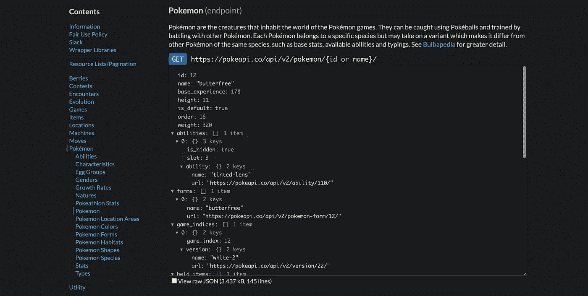

# 通过 TigerGraph 使用 API 数据

> 原文：<https://towardsdatascience.com/using-api-data-with-tigergraph-ef98cc9293d3?source=collection_archive---------40----------------------->


照片来自 [Pixabay](https://pixabay.com/illustrations/pokeball-pokemon-game-mobile-game-5584675/) 作者[托尔·戴奇曼](https://pixabay.com/users/thor_deichmann-2306827/)

## 从 PokéAPI 中提取数据并构建图表

# 为什么这很重要？

不幸的是，并不是互联网上的所有数据都是打包好的 CSV 文件。事实上，人们可能经常希望使用流行 API 中的数据，但是如何将这些数据加载到图形中呢？

# 议程

*   看看 PokéAPI 数据集
*   创建图表
*   将数据从 API 加载到您的图表中

# 步骤 0:设置

在这篇博客中，我们将使用 Python 3(更确切地说是 Python 3.6.9)、requests、json 和 pyTigerGraph。你既可以在 [Colab](https://colab.research.google.com/) 上创建一个笔记本，也可以在你的本地计算机上运行它，但是，为了这节课的目的，我建议你使用 Colab。

如果你还没有，你需要安装 pyTigerGraph。如果您使用的是 Colab，以下是安装方法:

```
!pip install pyTigerGraph
```

在这篇博客中，我们使用的是 pyTigerGraph 的 0.0.9.6.2 版本。

接下来，你要确保你已经准备好了一个盒子。如果您还没有准备好盒子，请执行以下操作:

1.  转到[http://tgcloud.io/](http://tgcloud.io/)。
2.  单击我的解决方案。
3.  单击创建新解决方案。
4.  点击“空白图表”
5.  通过步骤 1-4 获得一个免费盒子；记下你的域名。
6.  单击“开始解决方案”

# 步骤 1:探索 PokéAPI

首先，我决定使用 PokéAPI。对于那些不知道的人来说，神奇宝贝是一种流行的视频游戏和卡牌游戏，玩家收集类似动物的生物(被称为神奇宝贝)并与之战斗。

出于此图的目的，我们将添加:

*   神奇宝贝名称
*   神奇宝贝类型(水、火等。)

接下来，我们将探索数据。文档位于此处:[https://pokeapi.co/docs/v2](https://pokeapi.co/docs/v2)。更具体地说，我们将关注神奇宝贝端点。



神奇宝贝 API

我们将使用 Python 来创建我们的图表。我们将使用的三个库是 requests(发出请求)、json(很好地打印我们的数据)和 pyTigerGraph(处理与图形相关的一切)。

```
import requests
import json
import pyTigerGraph as tg
```

接下来，看看 API 的神奇宝贝部分。在本例中，向链接 https://pokeapi.co/api/v2/pokemon/12/.发出了一个 GET 请求，让我们在 Python 代码中模仿一下:

```
URL = "https://pokeapi.co/api/v2/pokemon/12/" # URLres = requests.get(url = URL).json() # Makes the GET Requestprint(json.dumps(res, indent = 2)) # Printing the Results
```

这应该会打印出一个大的 JSON 对象。我们可以通过以下方式查看物种和类型:

```
print(res["species"])print(res["types"])
```

# 步骤 2:在 TigerGraph 中创建图形

首先，在 TigerGraph Cloud 中启动一个空白解决方案。记下你的域名！然后，在您的代码中，创建连接:

```
conn = tg.TigerGraphConnection(host="https://DOMAIN.i.tgcloud.io", password="tigergraph", gsqlVersion="3.0.5", useCert=True)
```

我们将使用 GSQL 来创建图表。在这个例子中，我们需要两个顶点:口袋妖怪和类型。这些应该用一条边连接(POKEMON 类型)。让我们将它添加到代码中:

```
# Sets up connection with GSQLprint(conn.gsql('ls', options=[]))# Create Edges (POKEMON_TYPE) and Vertices (Pokemon and Type)print(conn.gsql('''CREATE VERTEX Pokemon (PRIMARY_ID name STRING) WITH primary_id_as_attribute="true"CREATE VERTEX Type (PRIMARY_ID type STRING) WITH primary_id_as_attribute="true"CREATE UNDIRECTED EDGE POKEMON_TYPE (FROM Pokemon, TO Type)''', options=[])) print(conn.gsql('''CREATE GRAPH pokemon(Pokemon, Type, POKEMON_TYPE)''', options=[])) # Create the Graph
```


TigerGraph 云上的模式

您现在已经创建了图表！该加载数据了！

# 步骤 3:从 API 加载数据

首先，您需要通过更新 graphname 和添加令牌来更新您的连接凭据。

```
conn.graphname = "pokemon"conn.apiToken = conn.getToken(conn.createSecret())
```

现在，我们将尝试向我们的图表中添加一个神奇宝贝 butterfree。这将使用我们上面提出的请求。

```
URL = "https://pokeapi.co/api/v2/pokemon/12/" # URLres = requests.get(url = URL).json() # Makes the GET Requestprint(json.dumps(res, indent = 2)) # Printing the Results
```

为此，我们将把数据“上传”(我想你可以认为是“上传”)到 TigerGraph 中。首先，我们将增加物种到口袋妖怪顶点。

```
conn.upsertVertex("Pokemon", res["species"]["name"], attributes={"name": res["species"]["name"] })
```

厉害！接下来，我们将遍历这些类型，并将神奇宝贝连接到它的所有类型。

```
for ty in res["types"]: conn.upsertVertex("Type", ty["type"]["name"], attributes={"type": ty["type"]["name"] }) conn.upsertEdge("Pokemon", res["species"]["name"], "POKEMON_TYPE", "Type", ty["type"]["name"])
```

如果一切正常，恭喜你！你完了！现在你可以添加更多的神奇宝贝到你的图表中:

```
for i in range(1,100): # You can change the number based on how many Pokémon you want to add URL = f"https://pokeapi.co/api/v2/pokemon/{i}/" # URL res = requests.get(url = URL).json() # We don't have any parameters. conn.upsertVertex("Pokemon", res["species"]["name"], attributes={"name": res["species"]["name"] }) for ty in res["types"]: conn.upsertVertex("Type", ty["type"]["name"], attributes={"type": ty["type"]["name"] }) conn.upsertEdge("Pokemon", res["species"]["name"], "POKEMON_TYPE", "Type", ty["type"]["name"]) print("Added " + res["species"]["name"])
```

前往 GraphStudio，您可以在那里查看您的图形外观！如果所有东西都装好了，那么你做到了！恭喜你。


探索一番后会是什么样子！

# 第四步:轮到你了！

既然我们已经完成了这个示例，那么就轮到您来探索了！挑选出任何 API，然后使用 pyTigerGraph 创建一个图形。您甚至可以尝试调用额外的端点，继续增强图形！你已经得到了这个，我很高兴看到你会开发什么！

# 资源

可以在 Google Colab 上查看该项目:[https://Colab . research . Google . com/drive/1 eibetcgq 18 tvp 9 _ dflgjiv3 edcum 5 hs？usp =共享](https://colab.research.google.com/drive/1eIBETCGq18tvp9_DflGjIWV3EdcUM5hs?usp=sharing)