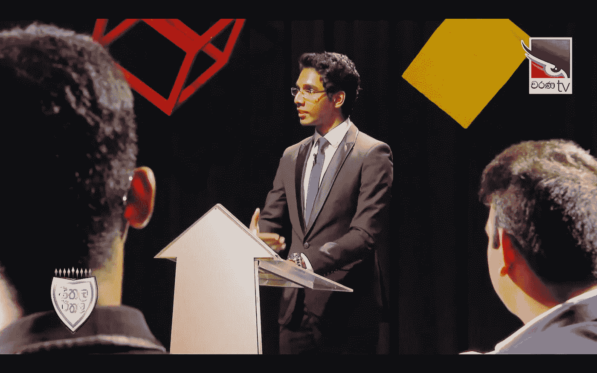
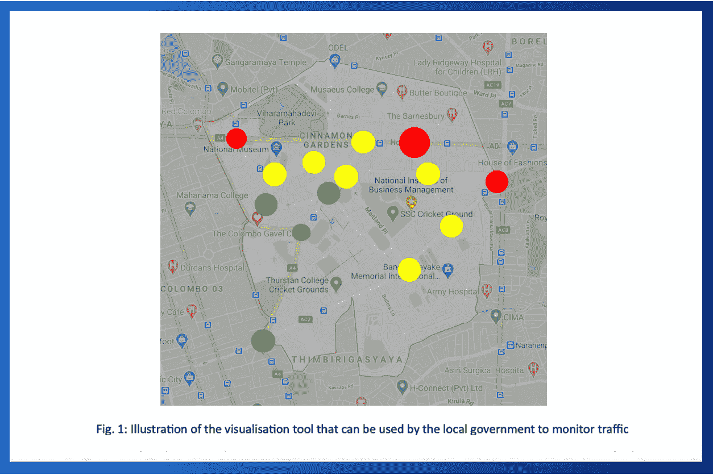

# 利用人工智能管理城市交通:用 k-NN 算法分类

> 原文：<https://towardsdatascience.com/using-artificial-intelligence-ai-to-manage-metropolitan-traffic-classifying-with-k-nn-f12beb11ffca?source=collection_archive---------69----------------------->

利用人工智能管理城市交通:基于 K-近邻算法+可视化工具的分类

[](https://l.facebook.com/l.php?u=https%3A%2F%2Fbit.ly%2F34I2xWp%3Ffbclid%3DIwAR0UxRelz-VxucAeAGlZgQgcegDR4BJgoXmU7AGk-74fWlVasIQOASn9Ah0&h=AT2ZfoNniGpyQkLujxkYzOo4loavxyOxT41X6uN9ib7JWAyguztVYXWB7HehCRopiO9QbHBd301gOid24VLqXEs73Gp_iD4aaCMpLzMykngQah0nlTv7vkWYhpkTetJKIXGt0KlpO2B2XYjQoz7-mIrVZnRxO-wE80N0GrSEzIFSGz8h3XJTxcz8Tw6ANnW5ndTbx6hPSz-cUUKL7CLAOniWbwEWTOVws_BcEj_-rCMoqVpjsMzPfXg5iXLz_qWeCy1bTt0gMYhxrirhyRhUYqpVOk6F_vkmlzmFFNB6ua2HItf0nyWgzK9VfCLlD9PaeqJqr4l4uyvTRIHrLRKMPjZw7UO1oDc9BDKjrLBXLd8jrmdVsnWwWcF_HLwYhSDt4VoFoiUBKsXdQAUZuY_38_r4ri_r6rpcceUk42qe3grMKvCsAVLlhA-WjNsnIy4K200ClhY5uwKL0quY9RTXliLBf84SApcNC1sarmvv8y6YsJx_gUR_SdFuiWfr7gbJI5rBxYaUEcPDp2NYRef8g6059UOEzcWNTP0Qx5B5fo4AcWdXEF61QooUJEVNfw9cPzYuuAproezcoBgwfUnNaHWRKAjZI2HFacjsf_CMVVPYvUTLT6gv42_Az6s0) [## 视频片段:see tala eet hala-Tuhan Sapumanage:交通系统插曲

### 观看 Tuhan Sapumanage 展示他的人工智能解决方案

考文垂大学学术合作单位](https://l.facebook.com/l.php?u=https%3A%2F%2Fbit.ly%2F34I2xWp%3Ffbclid%3DIwAR0UxRelz-VxucAeAGlZgQgcegDR4BJgoXmU7AGk-74fWlVasIQOASn9Ah0&h=AT2ZfoNniGpyQkLujxkYzOo4loavxyOxT41X6uN9ib7JWAyguztVYXWB7HehCRopiO9QbHBd301gOid24VLqXEs73Gp_iD4aaCMpLzMykngQah0nlTv7vkWYhpkTetJKIXGt0KlpO2B2XYjQoz7-mIrVZnRxO-wE80N0GrSEzIFSGz8h3XJTxcz8Tw6ANnW5ndTbx6hPSz-cUUKL7CLAOniWbwEWTOVws_BcEj_-rCMoqVpjsMzPfXg5iXLz_qWeCy1bTt0gMYhxrirhyRhUYqpVOk6F_vkmlzmFFNB6ua2HItf0nyWgzK9VfCLlD9PaeqJqr4l4uyvTRIHrLRKMPjZw7UO1oDc9BDKjrLBXLd8jrmdVsnWwWcF_HLwYhSDt4VoFoiUBKsXdQAUZuY_38_r4ri_r6rpcceUk42qe3grMKvCsAVLlhA-WjNsnIy4K200ClhY5uwKL0quY9RTXliLBf84SApcNC1sarmvv8y6YsJx_gUR_SdFuiWfr7gbJI5rBxYaUEcPDp2NYRef8g6059UOEzcWNTP0Qx5B5fo4AcWdXEF61QooUJEVNfw9cPzYuuAproezcoBgwfUnNaHWRKAjZI2HFacjsf_CMVVPYvUTLT6gv42_Az6s0) 

# 介绍

作为我学术研究的一部分，我参加了名为“人工智能(AI)和人机界面(HCI)”的模块，在该模块中，我有机会提出一个人工智能系统，该系统可用于指导大都市地区的交通，以及一个仪表板，该仪表板可用于向控制中心可视化交通流状况。

后来，在 2019 年 12 月，我应邀成为斯里兰卡国家电视频道黄金时段电视节目的演讲嘉宾，该节目旨在让年轻人有机会就我们面临的一些当代问题发表意见，在当天的主题为“交通系统”的演讲中，我提出了解决方案，作为我的 5 部分解决方案的一部分。所以让我们开始吧。

# **关于系统— I** n 非技术简化语言

不管你住在哪里，都市区的交通显然是一个在许多方面影响我们的主要问题。在微观层面上，它使我们的日常安排被高度打乱，而在宏观层面上，它造成了巨大的经济损失。更不用说，还有拥堵带来的固有的环境污染，这在《电讯报》[ [1](https://www.telegraph.co.uk/news/2018/02/06/traffic-jams-cost-average-motorist-1000-year/) ]的文章中有很好的解释。

虽然有许多想法和解决方案来改善交通流量，但没有多少显示出有希望的结果。因此，作为评估的一部分，我们被要求提出一个全面的基于人工智能的解决方案来解决上述问题。

我想到的是一个集成的解决方案，它有两个主要组件。人工智能系统和一个易于理解(和直观)的可视化工具。

AI 组件用于对拥塞的严重性进行分类(标记)。一旦人工智能系统决定某个特定的路口拥堵，它就会通过使用现有的交通灯网络向司机发出信号，决定将流入该路口的交通重新路由到下一个最佳替代方案。

更不用说，最好的部分是，该解决方案的设计方式不需要额外的专用基础设施，因为所需的输入可以由大都市的 CCTVs 获取，如上所述，交通指挥可以由现有的交通灯网络完成，前提是它们可以兼容连接。从而使其在经济上更加可行。

下一个主要组件是可视化工具。受苹果设计原则和史蒂夫·乔布斯设计哲学的启发，我确保减少混乱，使可视化工具易于理解和直观。这实际上充当了一个仪表板，可以放置在控制中心来监控交通流量和状态。

控制中心可以使用优化的界面来了解与交通流量和每个交叉点的当前状态相关的重要信息。来源:[谷歌地图](http://www.maps.google.com)

该界面只使用了覆盖在地图上的圆圈(像谷歌这样的供应商会为地图这样做)，并且只要求用户注意两个变量；圆的颜色和圆的大小。

圆圈的大小决定了特定连接的利用率百分比(从 0–100%)。也就是说，那里的车辆数量与可能的最大数量相比。而圆圈的颜色决定了拥堵的严重程度，拥堵程度是根据过往车辆的平均速度计算出来的。

# 关于系统——极客的技术信息

为了开发这个系统，我们首先创建一个样本。我们使用现有的闭路电视基础设施，并向人工智能系统输入车辆移动的平均速度和在给定路口的车辆数量。接下来，我们找到相关专家，请他们尽最大努力对初始样本进行分类。他们将速度分为不同的范围，他们认为交通流是自由流动的，缓慢的和拥挤的。接下来是利用率百分比，他们可以给出使特定路口畅通、缓慢和拥堵的车辆数量。两者都是数字数据。速度是每小时英里数/公里数，利用率百分比也是一个数字百分比。

接下来，基于 k-最近邻(k-NN)的人工智能模型可以针对每个交叉点的这种数据进行训练。在此之后，当应用于现实世界时，它应该能够分类一个路口是否拥堵(理想情况下是实时的)。每当人工智能系统决定一个特定的路口是拥挤的，它就会查看可选选项表。

备选路径表是一个包含交汇点 ID 和一组优先备选路径的表。一旦最初的路口出现拥堵，软件会在考虑新定向的交通后，计算下一个最佳替代方案的预计拥堵情况。它这样做，直到找到具有最小潜在拥塞的替代方案，从而引导输入流量有效地避免拥塞。

不用说，该系统可以定期升级、检查和更新，以提高其准确性。

特别感谢我的考文垂大学人工智能讲师 Richard Hyde 博士指导我们完成该模块，并在整个模块中提供帮助，这使我能够以一等荣誉的分数完成该模块，并在三个批次中获得该模块的最高分。

# 这是该系统的另外两个特点…

考文垂大学学术合作单位脸书专题页面:Tuhan Sapumanage 人工智能 TVShow

[1] [考文垂大学学术合作单位—脸书官方页面](https://www.facebook.com/CovUniAPU/posts/904011146673468?__tn__=-R)

[2] [CharanaTV —脸书官方页面](https://www.facebook.com/charanatvofficial/videos/255727565866839/?__xts__%5B0%5D=68.ARDG-inOGMujpzvy6SQwYiDp__CoI5v7Ox8sB_6Nqe14FhdBW_BkhQ_YaTsQ05cMG3aoam1pLmMX00rlN_5_QSyhz4a9YMbJYvQTxUdYPs_OFQBCvDwicQOZoXF5gL1ZtScAgedzsYIHRHGP4i7fC0kgzz5tZaxzfzaIa0XoPmrdkd6z_SOMKHDkDHPOqldjljpPW03HryvTHOnFhWXTTyI_Y8SyqwY8KjFoRrmXjiwrrQt1TdepHL6GkcEJLw0CPg1JkcBET_bdKIWTCs--JMuSjoaeLyzd0e_9v2Fe0-RKGrEZv68HTNxaLLImmMSAMQ0YmM-Slel6R093yTjfV_VRv-rTpPtuctZ2t5vYDYZwyDJiQpFTIoFVNvOUxJ1IXDsnhii_mztBRjdMlQLhH9Qn_nl6JkviKoNyxWpFU2FhQDCRTNliSA&__tn__=-R)

Charana 电视台脸书版专题报道(描述):Tuhan Sapumanage —人工智能— TVShow

Charana 电视台脸书版专题报道(视频):Tuhan Sapumanage 人工智能 TVShow

# **参考文献**

[1] [来自电报的文章](https://www.telegraph.co.uk/news/2018/02/06/traffic-jams-cost-average-motorist-1000-year/)

*落款，Tuhan Sapumanage —计算机(英国)理学士，CIMA Adv Dip MA，研究员—机器学习，特邀演讲人—电视&主题演讲，Blogger—AI&商业/经济学，Toastmaster，Gavelier，MUNer & Compère*

[LinkedIn](https://www.linkedin.com/in/tuhan)|[Twitter](https://www.twitter.com/TuhanSapumanage)|[Medium](https://medium.com/@TuhanSapumanage)|[脸书](https://www.facebook.com/TuhanSapumanage)|[insta gram](https://www.instagram.com/TuhanSapumanage)|[research gate](https://www.researchgate.net/profile/Tuhan_Sapumanage)