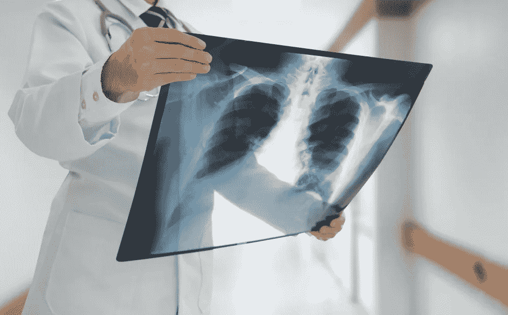
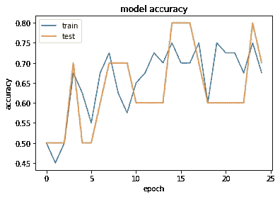
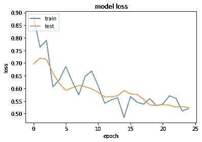

# 利用人工智能探测新冠肺炎

> 原文：<https://towardsdatascience.com/using-artificial-intelligence-to-detect-covid-19-349f232b04d2?source=collection_archive---------23----------------------->

## 人工智能工具可以帮助各州制定更具体的新冠肺炎病预防策略，改善公共卫生。

https://www.groupe-imagerie-medicale.fr/[上的原始照片](https://www.groupe-imagerie-medicale.fr/)

***编者按:*** [*走向数据科学*](http://towardsdatascience.com/) *是一份以数据科学和机器学习研究为主的中型刊物。我们不是健康专家或流行病学家，本文的观点不应被解释为专业建议。想了解更多关于疫情冠状病毒的信息，可以点击* [*这里*](https://www.who.int/emergencies/diseases/novel-coronavirus-2019/situation-reports) *。*

2019 年底在中国出现，这种疾病是由新型冠状病毒引起的，这种病毒属于冠状病毒。

在检测到的数万例病例中，有几例新冠肺炎是无症状的。这种病毒最常见的症状是发烧和干咳。有些人可能还会感到疼痛、头痛、呼吸困难或急促。这些症状表明急性呼吸道感染或放射学可检测到的肺部异常。我们可以使用人工智能算法来检测疾病，使用自动 X 射线分析来支持放射科医生。

为了测试人工智能在检测新冠肺炎上的表现，我使用了约瑟夫·科恩博士的团队提供的数据库。该数据可在 [GitHub](https://github.com/ieee8023/covid-chestxray-dataset) 上获得。

该数据库包含 152 个观察结果，是根据新冠肺炎病例的胸部 x 光或 CT 图像构建的。

## 导入我们将要使用的包

我们将导入必要的包。使用的主要模块将是 keras 建模。

我们导入包含图像标签的数据库和元数据。

该数据库包含 127 个关于新冠肺炎病的观察结果、4 个 ARDS、2 个肺囊虫、6 个链球菌和 2 个无发现。

## 导入数据

我们将数据库分为两组:感染新冠肺炎病毒的患者和其他患者。

我们的观察 90%会用于学习，10%用于验证。由于我们拥有的数据有限，我们将使用数据扩充。

## 预处理

预处理是使成功的
识别概率最大化的步骤。

我们将导入图像，并将其调整为 224x224 格式。

对于建模，我们将使用 25 个时期和 8 个批次大小。预训练的 ResNet 模型将用于填充我们拥有的小图像。

对于迁移学习，其思想是使用对数百万幅图像进行训练的网络的最后一层，以填充我们可用的少数图像。

对于建模，我们将使用 ResNet 的迁移学习。

对于第一次建模，我们在验证中获得了近 80%的准确性，在学习中获得了近 75%的准确性。

在损失中，我们的价值很低。这一结果是在 50 帧的基础上获得的，可以通过更多的图像得到极大的改善。

与我们拥有的图像数量相比，建模的结果是好的。如果有足够的数据库可以达到良好的性能，这种方法可以推广，并使大规模进行新冠肺炎筛选成为可能。

**来源:**

 [## 冠状病毒:症状、诊断、治疗| Familydoctor.org

### 冠状病毒是一种在动物身上发现的病毒，可以传染给人类。冠状病毒症状包括咳嗽…

familydoctor.org](https://familydoctor.org/condition/coronavirus/)  [## 冠状病毒疾病 2019(新冠肺炎)-症状

### 如果你出现新冠肺炎的紧急警告信号，请立即就医。紧急警告标志…

www.cdc.gov](https://www.cdc.gov/coronavirus/2019-ncov/symptoms-testing/symptoms.html)  [## 临床对话

### 播客:在新窗口播放|下载我们邀请到了 NIAID 的安东尼·福奇博士和我们一起谈论新冠肺炎，这种疾病…

podcasts.jwatch.org](https://podcasts.jwatch.org/index.php/podcast-256-anthony-fauci-talking-with-patients-about-covid-19/2020/03/10/)  [## 构建 X 射线和 CT 扫描的公共新冠肺炎数据集

### 在新冠肺炎疫情的情况下，简化诊断是否至关重要。去年，我们的团队开发了切斯特，一个…

josephpcohen.com](https://josephpcohen.com/w/public-covid19-dataset/)  [## IEEE 8023/covid-chest Xray-dataset

### 我们正在用胸部 x 光或 CT 图像建立一个新冠肺炎病例数据库。我们也在寻找新冠肺炎病例…

github.com](https://github.com/ieee8023/covid-chestxray-dataset)