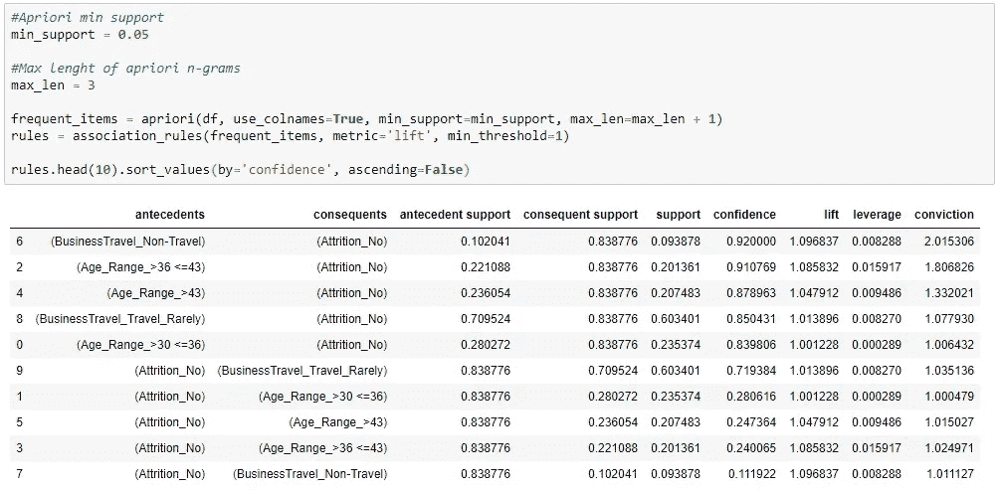
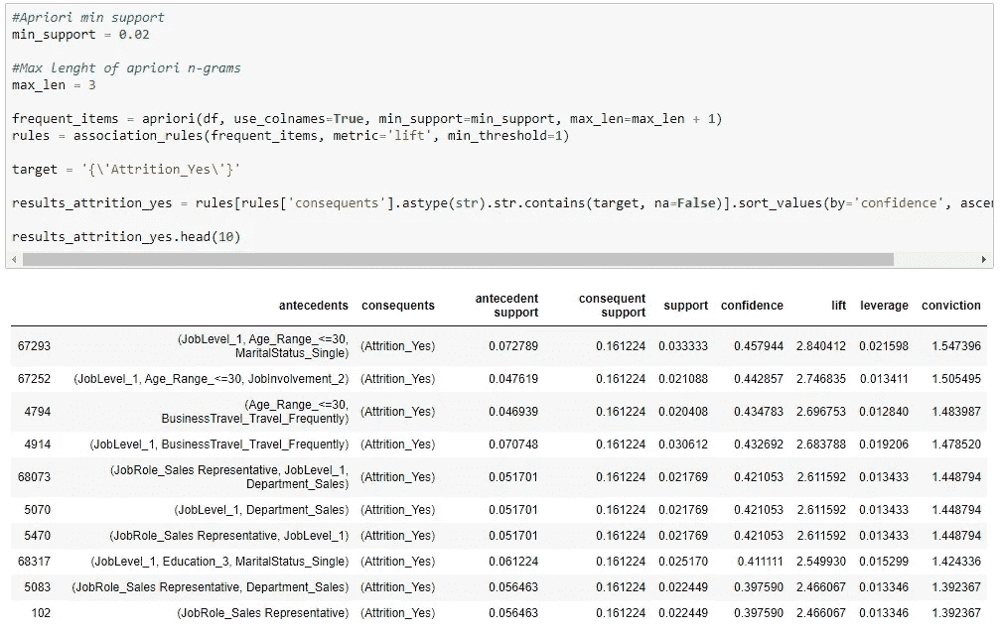

# 使用关联规则进行人力资源分析

> 原文：<https://towardsdatascience.com/using-association-rules-with-categorical-data-e984f8bb8ee4?source=collection_archive---------32----------------------->

## 或者:如何将 Apriori 用于购物篮商店分析之外的数据


米卡·鲍梅斯特在 [Unsplash](https://unsplash.com?utm_source=medium&utm_medium=referral) 上的照片

A 关联规则算法，如 **Apriori** 是一种很好的方法，可以找到数据集中经常出现的项目，并查看它们之间的关系。
这是一种无监督的机器学习模型，通常用于发现交易中的关系，例如客户购买。

如果一个项目的出现次数*大于我们设置的阈值*，则该项目被认为是频繁的。如果您有 100 行数据，并将阈值设置为 0.1，那么发生 10 次以上的所有数据都会显示在我们的结果中。

在这个例子中，我们将对不同类型的问题使用先验知识。我们将使用包含年龄、性别、教育水平等信息的人力资源数据集，我们将尝试找出员工*没有流失*时出现的常见特征。

首先快速回顾一下主要的先验要素:

> ***支持*** *是一个项目出现多少次*
> freq(A，B)/Total
> 
> ***置信度*** *是给定 A 发生的概率*
> freq(A，B)/freq(A)
> 
> ***Lift*** *类似于 confidence 但这也说明了 B 有多受欢迎*
> freq(A，B)/support(A)*Support(B)

在本例中，我们将使用 Kaggle 的 IBM HR Analytics 员工流失和绩效，您可以从以下链接下载:

[](https://www.kaggle.com/pavansubhasht/ibm-hr-analytics-attrition-dataset) [## IBM HR Analytics 员工流失和绩效

### 预测你有价值的员工的流失

www.kaggle.com](https://www.kaggle.com/pavansubhasht/ibm-hr-analytics-attrition-dataset) 

这段代码将使用 MLxtend 库([http://rasbt.github.io/mlxtend/](http://rasbt.github.io/mlxtend/))用 Python 编写

首先，我们导入我们的库。这个项目只需要**熊猫**和 **MLxtend** 。

```
import pandas as pd
from mlxtend.frequent_patterns import apriori
from mlxtend.frequent_patterns import association_rules
```

在阅读完数据后，我们可以看到有 35 列需要处理，但是我们将只使用我们认为更有趣的几列。

有几个使用起来不错的列，但是它们**不是分类的**，所以我们能做的是为它们创建*库*。Pandas **qcut** 函数可以为我们将年龄、离家距离和小时列分成 4 个箱。

```
pd.qcut(df['Age'], q=4)
```

这段代码向我们展示了年龄列可以分为以下四类:

*类别(4，区间[float64]): [(17.999，30.0] < (30.0，36.0] < (36.0，43.0】<【43.0，60.0】]*

因此，我们可以像这样创建一个 Age_Range 列:

```
df['Age_Range'] = pd.qcut(df['Age'], q=4, labels=['<=30', '>30 <=36', '>36 <=43', '>43'])
```

对 DistanceFromHome 和 HourlyRate 做了同样的操作后，现在我们必须为算法准备数据。Apriori 只接受**布尔值**，所以我们不会发送包含“单身”、“已婚”和“离婚”值的 MaritalStatus 列，而是将它转换为 3 个不同的列，分别称为“MaritalStatus _ 单身”、“MaritalStatus _ 已婚”和“MaritalStatus _ 离婚”，其中包含 0 或 1 值。

为此，熊猫 **get_dummies** 函数可以用于每个需要转换的列。首先，我们将创建一个包含所有将要使用的列的列表，以及另一个包含剩余列的列表。在使用 get_dummies 之后，原始列将被删除，只有布尔列会在那里，但是，未使用的列仍然在那里，所以我们删除它们。

```
columns = ['Attrition',
          'Age_Range',
          'BusinessTravel',
          'Department',
          'DistanceFromHome_Range',
          'Education',
          'EducationField',
          'EnvironmentSatisfaction',
          'Gender',
          'HourlyRate_Range',
          'JobInvolvement',
          'JobLevel',
          'JobRole',
          'JobSatisfaction',
          'MaritalStatus']not_used_columns = list(set(df.columns.to_list()) - set(columns))df = pd.get_dummies(df, columns=columns)df.drop(labels=not_used_columns, axis=1, inplace=True)
```

现在我们有了一个数据框架，可以使用并生成频繁项。

我们的数据集总共有 1470 行，所以让我们开始选择 0.05 的*最小支持。这意味着只有在我们的数据中发生**超过**73 次的结果才会被考虑。而 *max_len* 是 antecedents 列中生成的列组合的数量。*

```
#Apriori min support
min_support = 0.05#Max lenght of apriori n-grams
max_len = 3frequent_items = apriori(df, use_colnames=True, min_support=min_support, max_len=max_len + 1)rules = association_rules(frequent_items, metric='lift', min_threshold=1)rules.head(10).sort_values(by='confidence', ascending=False)
```



关联规则结果

就是这样！现在，您可以看到数据集中的频繁关系。

但是，如果我们只想知道在结果列中是什么给出了**‘attraction _ Yes’**还是**‘attraction _ No’**呢？

首先，让我们看看在我们的数据帧中每种情况出现了多少次。

```
df['Attrition_No'].value_counts()#1     1233
#0     237
#Name: Attrition_No, dtype: int64
```

*否*的情况比*是*的情况多得多，所以我们在选择阈值时也需要考虑到这一点，因为一个比另一个更常见。

对于*否*，让我们将阈值增加到 0.1，并过滤**损耗 _ 否**的后续列:

```
#Apriori min support
min_support = 0.1#Max lenght of apriori n-grams
max_len = 3frequent_items = apriori(df, use_colnames=True, min_support=min_support, max_len=max_len + 1)
rules = association_rules(frequent_items, metric='lift', min_threshold=1)target = '{\'Attrition_No\'}'results_attrition_no = rules[rules['consequents'].astype(str).str.contains(target, na=False)].sort_values(by='confidence', ascending=False)results_attrition_no.head(10)
```


关联规则结果在结果列中只有 attachment _ No

现在我们可以看到，在我们的数据集中，来自研发部门、工作级别为 2 的人出现的几率为 11%,然而**几乎 95%的** **都没有自然减员**。

附注:前提和结果列是如下所示的冷冻集:

*array([frozenset({ ' job satisfaction _ 4 '，' JobLevel_2'})，
frozenset({ ' Department _ Research _&_ Development '，' JobLevel_2'})，
frozenset({ ' Department _ Research _&_ Development '，' job inclusion _ 3 '，' job level _ 2 ' })……*

如果您想美化它并导出这个结果，您可以使用这段代码:

```
df['antecedents'] = df['antecedents'].apply(lambda x: ','.join(list(x))).astype('unicode')df['antecedents'] = df['antecedents'].str.title().str.replace('_', ' ')
```

现在，让我们将阈值更改为 0.02，看看**损耗有多少 _ 是**:



关联规则结果在结果列中只有 Attrition _ Yes

信心最大的是 30 岁以下，单身，工作一级的人。但与前一个案例不同的是，*这些案例中只有 45%的人出现流失*。

这是对 HR 数据使用 Apriori 的基础！希望您在下一个项目中尝试一下，并在您的数据集中找到新的关系，这可以让您对您的问题有更多的见解。

你可以在这里下载所有用来创建这个帖子的笔记本:[https://gist . github . com/eduardoftdo/e 3d 2 b 7 ca 4a 06 D8 d 86 b 144482d 0 aed 5 a 1](https://gist.github.com/eduardoftdo/e3d2b7ca4a06d8d86b144482d0aed5a1)

如果您有任何问题，并希望与我联系，请随时发送消息到 https://www.linkedin.com/in/eduardo-furtado/