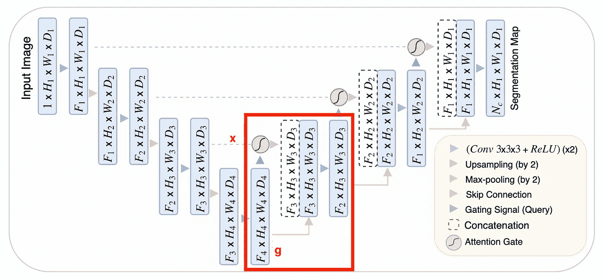
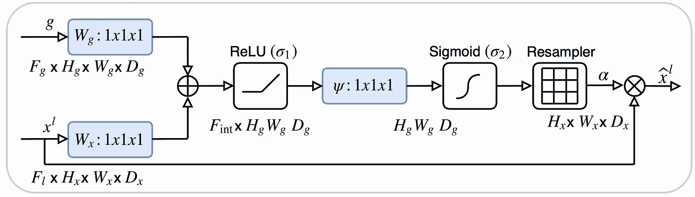
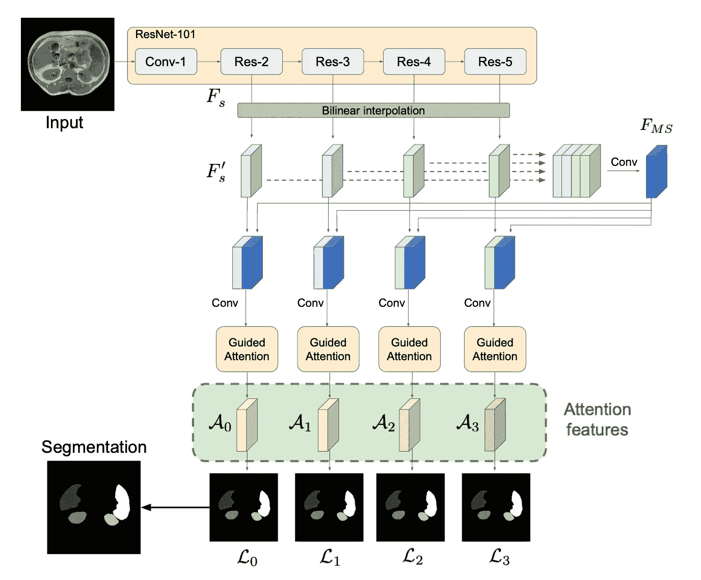
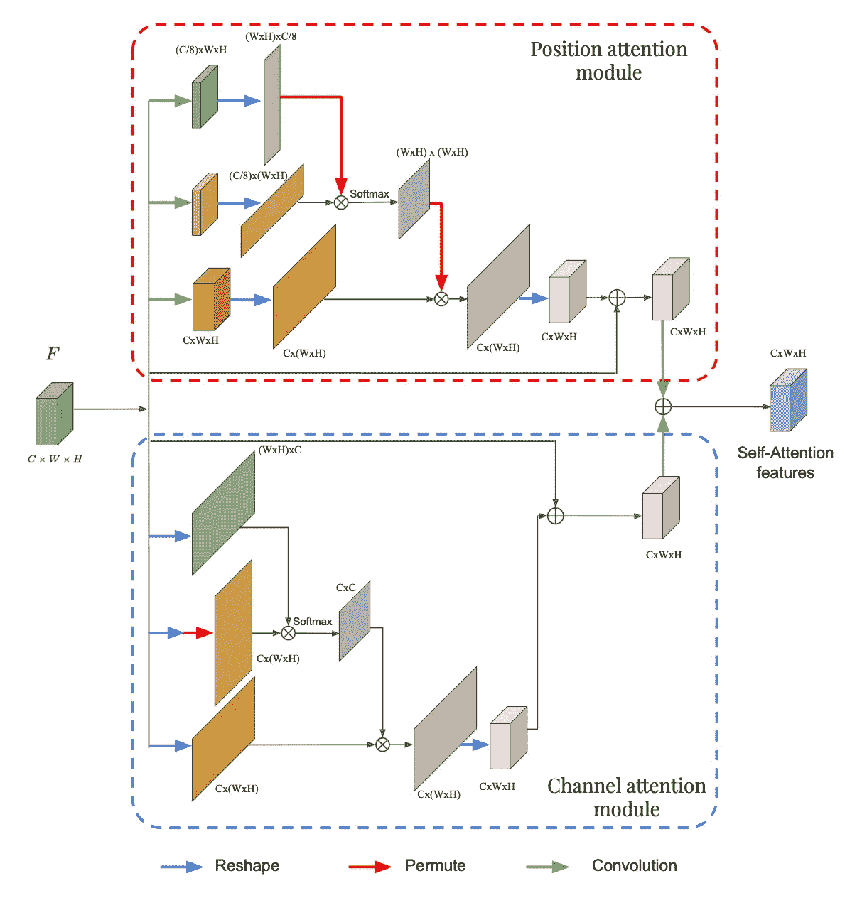
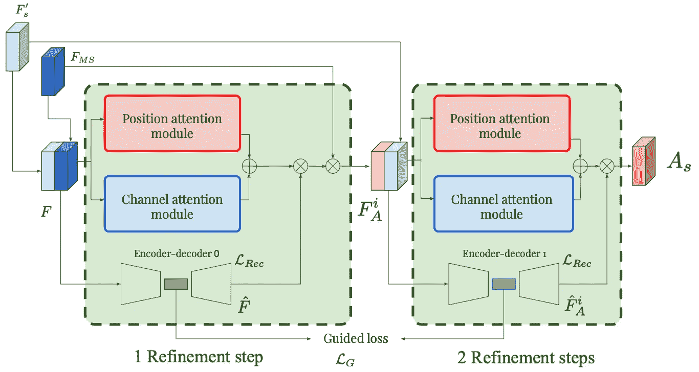

# 利用注意力进行医学图像分割

> 原文：<https://towardsdatascience.com/using-attention-for-medical-image-segmentation-dd78825eaac6?source=collection_archive---------12----------------------->

## 探索最近两篇关于使用注意力进行分割的论文，获得一些直觉和一个简短的 PyTorch 实现。

注意力机制是过去几年深度学习研究的最热门领域之一，始于自然语言处理，最近出现在计算机视觉任务中。在本文中，我们将重点关注注意力如何影响最新的医学图像分割架构。为此，我们将**描述最近两篇论文中提出的架构**，并尝试给出一些关于发生了什么的**直觉**，希望它能给你一些如何将注意力应用到你自己的问题上的想法。我们还将看到**简单的 PyTorch 实现**。

彼得·卡斯普日克在 [Unsplash](https://unsplash.com) 上的照片

医学图像的分割在两个要点上不同于自然图像:

*   大多数医学图像非常相似，因为它们是在标准化的环境中拍摄的，这意味着在方向、图像中的位置、像素范围等方面几乎没有变化
*   例如当试图分割肿瘤时，在阳性类像素(或体素)和阴性类之间经常存在很大的不平衡

注意:当然，代码和解释都是对论文中描述的复杂体系结构的简化，目的主要是给出一个直觉和一个好主意，而不是解释每一个细节。

# 1.请注意 UNet

UNet 是细分领域的首选架构，目前大多数细分领域的进展都以此架构为基础。在本文中，作者提出了一种将注意力机制应用于标准 UNet 的方法。如果你想重温一下标准的 UNet 是如何工作的，[这篇文章](/u-net-b229b32b4a71)非常适合。

## 1.1.提议的是什么

该架构使用标准的 UNet 作为主干，并且不改变收缩路径。改变的是扩展路径，更准确的说，是注意机制被整合到了跳过连接中。

注意事项 UNet 的框图，红色为扩展路径块。来源:[注意 UNet:学习在哪里寻找胰腺](https://arxiv.org/pdf/1804.03999.pdf)

为了解释扩展路径的一个块如何工作，让我们把来自前一个块的对这个块的输入称为 *g* ，把来自扩展路径的跳过连接称为 *x* 。下面的等式总结了这个模块的工作原理。

上采样模块非常简单，而 conv 模块只是两个(卷积+批处理范数+ ReLU)模块的序列。剩下唯一需要解释的是注意力障碍。

注意模块的框图。这里的尺寸假定一个三维输入图像。来源:[关注 UNet:学习去哪里寻找胰腺](https://arxiv.org/pdf/1804.03999.pdf)

*   *x* 和 *g* 都被送入 1x1 卷积，使它们达到相同数量的通道，而不改变大小
*   在一个上采样操作之后(为了具有相同的大小)，它们被相加并通过一个 ReLU
*   另一个 1x1 卷积和一个 sigmoid，展平为一个通道，对地图的每个部分给予 0 到 1 的重要性分数
*   然后，该注意图乘以跳过输入，以产生该注意块的最终输出

## 1.2.为什么有效

在 UNet 中，收缩路径可以被视为编码器，扩展路径可以被视为解码器。UNet 的有趣之处在于，跳过连接允许在解码器中直接使用编码器提取的特征。这样，当“重建”图像的掩模时，网络学会使用这些特征，因为收缩路径的特征与扩展路径的特征连接在一起。

在这种连接之前应用注意块允许网络将更多的权重放在相关的跳过连接的特征上。它允许直接连接集中于输入的特定部分，而不是馈入每个特征。

注意力分布乘以跳过连接特征图，只保留重要部分。这种注意力分布是从所谓的查询(输入)和值(跳过连接)中提取的。注意操作允许有选择地挑选包含在值中的信息。该选择基于查询。

总结一下:输入和跳过连接用于决定关注跳过连接的哪些部分。然后，我们使用跳过连接的这个子集，以及标准扩展路径中的输入。

## 1.3.简短实现

以下代码定义了(简化版本的)注意块和用于 UNet 扩展路径的“上行块”。“下行模块”与原始的 UNet 没有变化。

使用注意时，注意块和 UNet 的扩展路径块的简短实现。

注意:ConvBatchNorm 是 Conv2d、BatchNorm2d 和 ReLU 激活函数的序列。

# 2.多尺度引导注意

我们将要讨论的第二种架构比第一种更有创意。它不依赖于 UNet 架构，而是依赖于引导注意块之后的特征提取。

建议解决方案的框图。来源:[医学图像分割的多尺度自引导注意](https://arxiv.org/pdf/1906.02849.pdf)

第一部分是从图像中提取特征。为此，输入图像被馈送到预训练的 ResNet，并且我们在 4 个不同的级别提取特征图。这很有意思，因为低级特征往往出现在网络的起点，高级特征出现在网络的终点，所以我们可以访问多个尺度的特征。使用[双线性插值](https://en.wikipedia.org/wiki/Bilinear_interpolation)，所有的特征地图都被上采样到最大的地图的尺寸。这给了我们 4 个相同大小的特征图，它们被连接并馈入一个卷积块。这个卷积块(多尺度特征图)的输出与 4 个特征图中的每一个连接在一起，为我们提供关注块的输入，这比前面的要复杂一些。

## 2.1.提议的是什么

引导注意力模块依赖于位置和通道注意力模块，我们将从描述它们开始。

位置和通道注意模块框图。来源:[医学图像分割的多尺度自引导注意](https://arxiv.org/pdf/1906.02849.pdf)

我们将尝试理解这些模块中发生了什么，但我们不会对这两个块中的每个操作进行太多的详细描述(这可以通过下面的代码部分来理解)。

这两个块实际上非常相似，它们之间的唯一区别在于试图从信道或位置提取信息的操作。在展平之前应用卷积会使位置更加重要，因为在卷积过程中通道的数量会减少。在通道注意模块中，由于在整形操作期间保持了通道的原始数量，因此通道的权重更大。

在每个区块中，重要的是要注意到顶部的两个分支负责提取特定的注意力分布。例如，在位置注意力模块中，我们有一个(W*H)x(W*H)注意力分布，其中 *(i，j)* 元素告诉我们位置 *i* 对位置 *j* 的影响有多大。在通道模块中，我们有一个 CxC 注意力分布，它告诉我们一个通道对另一个通道的影响程度。在每个模块的第三分支中，该特定注意力分布乘以输入的变换，以获得通道或位置注意力分布。与上一篇文章一样，在给定多尺度特征上下文的情况下，注意力分布然后乘以输入，以提取输入的相关信息。然后将这两个模块的输出逐元素求和，以给出最终的自我关注特征。现在让我们看看这两个模块的输出是如何在全局框架中使用的。

具有 2 个改进步骤的引导注意力模块的框图。来源:[医学图像分割的多尺度自引导注意](https://arxiv.org/pdf/1906.02849.pdf)

引导注意力是通过对每个尺度(在建议的架构中为 4 个尺度)的一系列多个细化步骤来构建的。输入特征图被馈送到位置和通道输出模块，该模块输出单个特征图。它还通过自动编码器，自动编码器产生输入的重构版本。在每个模块中，注意力图由这两个输出相乘产生。该注意力图然后乘以先前产生的多尺度特征图。因此，考虑到我们工作的具体尺度，输出代表了我们应该关注多尺度的哪些部分。然后，通过将一个模块的输出与多尺度注意力地图连接起来，并将其作为下一个模块的输入，就可以得到一系列这样的引导注意力模块。

这里有两个额外的损耗是必要的，以确保优化步骤正确工作:

*   确保自动编码器正确重建输入特征图的标准重建损失
*   一种引导损失，它试图最小化输入的两个后续潜在表示之间的距离

然后，每个注意力特征通过卷积块来预测掩模。为了产生最终的预测，取四个掩模的平均值，这可以看作是各种尺度特征的模型的一种集合。

## 2.2.为什么有效

由于这个架构比前一个要复杂得多，所以很难理解注意力模块背后发生了什么。以下是我对各种模块的贡献的理解。

位置注意模块试图基于输入图像的多尺度表示来指定关注特定尺度特征的哪个位置。频道关注模块通过指定对哪个频道关注多少来做同样的事情。在任一个块中使用的特定操作在注意力分布中给予通道或位置信息更大的重要性。组合这两个模块给出了注意力图，该注意力图给出了每个位置-通道对的分数，即特征图的每个元素。

自动编码器用于确保特征图的潜在表示不会从一个步骤到另一个步骤完全改变。由于潜在空间是低维的，所以只提取关键信息。我们不希望这些信息从一个细化步骤改变到下一个，我们只希望进行小的调整。这些不会在潜在表象中被看到。

引导注意力模块序列的使用允许最终注意力图被细化，并且逐渐使噪声消失，并且给予真正重要的区域更多的权重。

将几个这样的网络以多种尺度组合起来，可以使网络具有全局和局部特征的视野。然后将这些要素组合成多比例要素地图。关注多比例要素地图和每个特定比例有助于更好地了解哪些要素会给最终输出带来更多价值。

## 2.3.简短实现

位置注意模块、通道注意模块和一个引导注意块的简短实现。

# 外卖食品

那么，从这些文章中可以学到什么呢？注意力可以被视为一种机制，它有助于根据上下文向网络指出哪些提取的特征需要关注。

在 UNet 中，这意味着，给定在扩展路径期间提取的特征，我们应该更加关注在收缩路径期间提取的哪些特征。这有助于使跳过连接更有意义，即传递相关信息而不是每个提取的特征。在第二篇文章中，给定我们正在工作的当前尺度，我们应该关注哪些多尺度特征。

一般的想法可以应用于广泛的问题，我认为看到多个例子可以帮助更好地理解注意力是如何适应的。

# 参考

[1] O. Oktay 等人《关注 UNet:学习去哪里寻找胰腺》(2018)
[2] A. Sinha 和 J. Dolz。“用于医学图像分割的多尺度自引导注意”(2020)