# 使用自动机器学习预测下一个将由食品药品监督管理局(FDA)批准的单克隆抗体(MAB)

> 原文：<https://towardsdatascience.com/using-automated-machine-learning-to-predict-the-next-monoclonal-antibodies-mab-to-be-approved-by-e2e0281f50f?source=collection_archive---------44----------------------->

# 目标

本实验的主要目的是通过学习从 Pubmed 获得的科学摘要，使用机器学习来预测哪种 MAB 将是下一个 FDA 批准的癌症治疗蛋白。这是一个基于 NLP 的二分类问题。

次要目标是评估自动化机器学习平台在实现主要目标方面能提供什么。来自加利福尼亚州 Mountainview 的人工智能初创公司 H2O.ai (www.h2o.ai)的商用 H2O 无人驾驶人工智能 AutoML 平台被选中。

# 癌症单克隆抗体市场

多年来，已经开发了许多治疗策略来研究、诊断和治疗癌症。[方法](https://www.mayoclinic.org/tests-procedures/cancer-treatment/about/pac-20393344)像手术、化疗、放疗、骨髓移植、射频消融、激素治疗、靶向药物治疗、冷冻消融和免疫治疗是癌症患者的一些可用选择。

根据[联合市场研究](https://www.alliedmarketresearch.com/oncology-cancer-drugs-market)的数据，2017 年全球癌症药物市场价值约为 970 亿美元，预计到 2025 年将达到惊人的 1770 亿美元。如下图所示，一种称为单克隆抗体(MAB)的蛋白质类治疗药物价值约 410 亿美元:

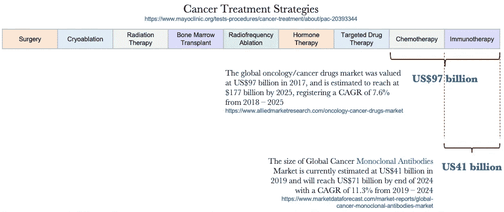

生产单克隆抗体是一项极其费力、苛求、耗时且昂贵的工作。下图说明了 MAB 生产的简化工作流程，从发现癌症靶点到大规模生产，最后到医院治疗。

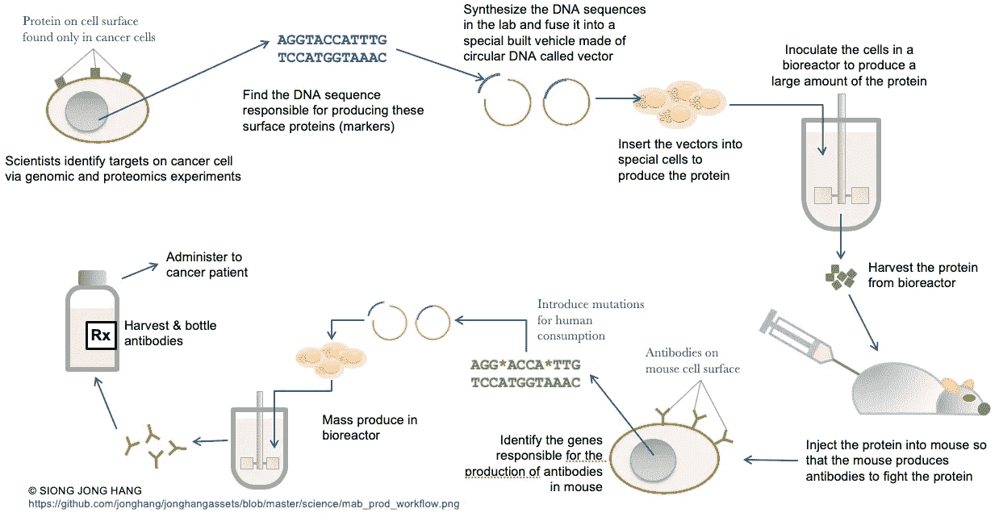

[https://raw . githubusercontent . com/jonghang/jonghangassets/master/science/mab _ prod _ flow . png](https://raw.githubusercontent.com/jonghang/jonghangassets/master/science/mab_prod_flow.png)

# 数据

## 数据采集和处理

维基百科上发表的单克隆抗体列表被用作从 Pubmed 检索科学摘要的基础。该列表经过筛选，仅包含针对癌症的单克隆抗体。

Pubmed 搜索字符串的推荐格式用于检索摘要，如下所示:

*<单克隆抗体名称>【TIAB】*其中【TIAB】是检索包含搜索词的摘要和标题的搜索标签。例如，要检索 MAB **贝伐单抗**的摘要，搜索字符串将是*贝伐单抗【TIAB】*

Pubmed 已经为 MATLAB、R 和 Python 提供了 API，使我们能够检索摘要。R API 是通过 easyPubMed 包使用的。

用于构造搜索字符串的 r 函数:

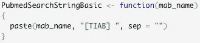

检索摘要有两个步骤:

步骤 1:检索 XML 文档:

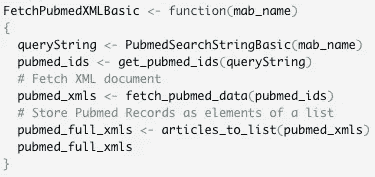

步骤 2:使用相应的 XML 文档作为输入，通过组合每个 MAB 的多个摘要来创建数据框，添加可选的日期列，并通过唯一标识符 PMID 聚合数据:

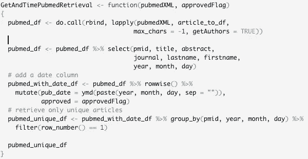

每个 MAB 的数据框存储为单独的 CSV 文件。有 40 个 FDA 批准的单抗和 190 个未批准的单抗。检查所有 CSV 文件的质量和正确性。

然后将 CSV 文件合并成一个数据集。抽取其中的 1%作为样本外测试集。剩下的 99%按照 70:30 的拆分比例拆分为训练集和测试集，用于机器学习建模。

下图显示了数据采集和处理工作流程:

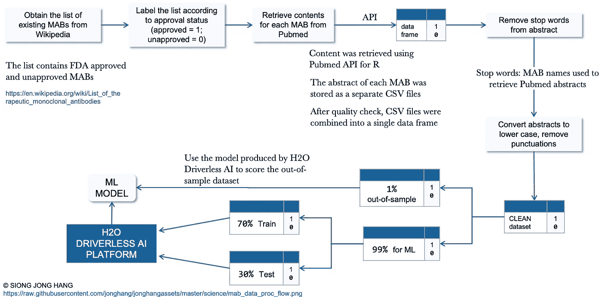

[https://raw . githubusercontent . com/jonghang/jonghangassets/master/science/mab _ data _ proc _ flow . png](https://raw.githubusercontent.com/jonghang/jonghangassets/master/science/mab_data_proc_flow.png)

单克隆抗体的名字被用作停用词。在建立机器学习模型之前，将它们从摘要中删除以防止目标泄露。

# 数据定义

用于训练、测试和样本外评估的数据集具有以下模式:

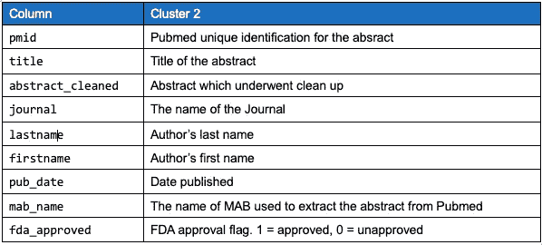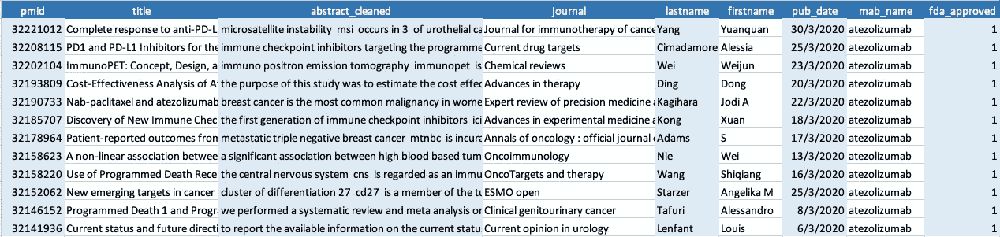

训练集示例

# 自动机器学习(AUTOML)平台

本次实验使用的 AutoML 平台是前面介绍的无人驾驶 AI(DAI)H2O . AI(【】www . H2O . AI)。这是一个非常易于使用的平台，内置了最先进的机器学习算法和可解释性功能。进行这个实验是为了测试戴在处理基于自然语言处理的二元分类问题(如 Pubmed 文摘)时的表现。

# H2O 无人驾驶人工智能(DAI)的实验设置

DAI 提供了一个友好、直观的界面来管理数据集和配置机器学习实验。

之前准备的相关数据集上传至 DAI，并出现在 DAI 中，如下所示:

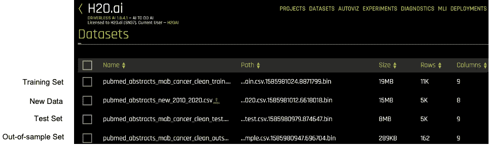

通过指定要使用的训练集和测试集、要删除的训练集中的列以及要用作目标的列来开始实验:

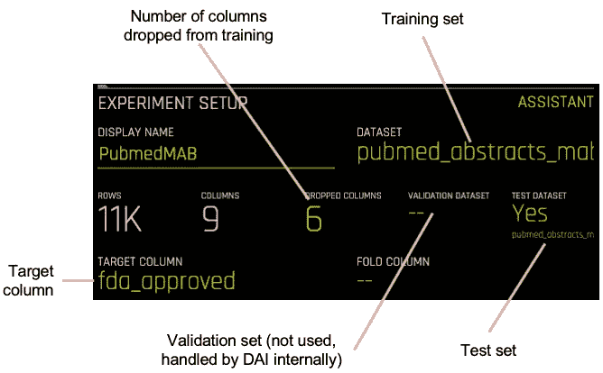

戴为数据科学家配置机器学习实验提供基础和专家设置。基础设置中有 4 个配置选项— **精度**、**时间**、**解释性**和**计分器**:

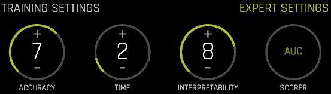

在引擎盖下，戴执行了一些分析，以便对每个默认选项的值给出建议。

准确性决定了在训练阶段执行渐进演化和集成时使用哪种 ML 方法。在低精度时，戴利用更多的特征和模型，允许它们相互竞争以获得最好的模型。无人驾驶人工智能以最高的精度执行模型和特征跟踪，并从所有这些变化中进行整合( [H2O 无人驾驶人工智能文档](http://docs.h2o.ai/driverless-ai/1-8-lts/docs/userguide/experiment-settings.html))。

时间选项根据允许的迭代次数指定了相对时间，但是如果存在收敛，DAI 可能会执行提前停止。较高的数字可能会增加完成培训的时间。

可解释性选项指定了该实验的相对可解释性。更高的值有利于更易解释的模型。改变可解释性水平会影响[特征预修剪策略、单调性约束和特征工程搜索空间](http://docs.h2o.ai/driverless-ai/1-8-lts/docs/userguide/experiment-settings.html)。在较低的可解释性，戴可能会使用更多的和更复杂的数据转换器，否则在更高的价值。

记分员指出了该实验要优化的指标。AUC 是默认的，并且一直如此。可以很容易的被其他如精度，F1，F2 等代替。

戴提供了**专家设置**，允许数据科学家通过访问大量其他参数来更好地控制实验。在设置的模型选项卡中，我允许戴在整个培训过程中自行使用 **XGBoost GBM** 、 **XGBoost Dart** 、 **LightGBM** 和 **Constant** 模型，同时将 **TenforFlow** 模型设为强制。我认为 GLM、决策树、FTRL 和 RuleFit 模型不会提供任何优势，因此将它们关闭:

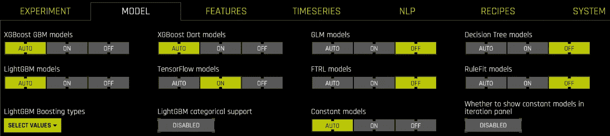

abstract_cleaned 列是唯一用于训练的列，这已成为 NLP 问题。因此，在 NLP 选项卡中进行了调整。用于 NLP 的内置**基于单词的卷积神经网络(CNN)** 和**双向门控递归单元(BiGRU)** 在基于字符的深度学习关闭时一直在执行。科学摘要的语言本质以及本实验的目的并不保证使用基于字符的 CNN 模型。

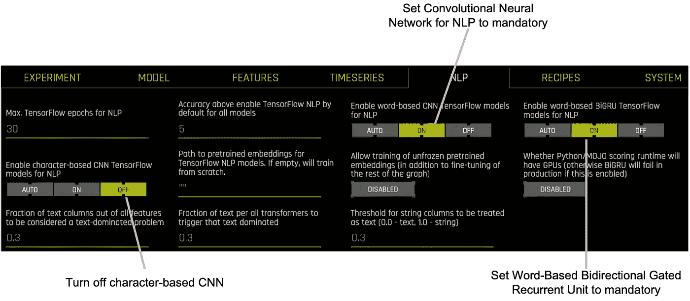

模型训练是通过点击启动实验开始的。从上传数据集到开始实验，持续时间约为 5 分钟。

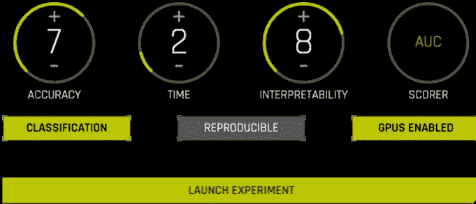

开始一项实验

# 模型性能

模型构建完成后，会自动生成一份报告。它是作为 Microsoft Word 文档下载的。该报告描述了在该实验中构建的机器学习模型的性能。结果总结在下图中:

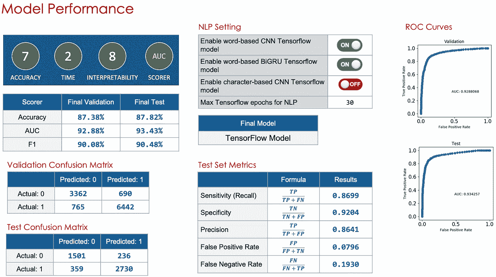

# 样本外评估

前面在数据处理工作流中描述过，1%的摘要被留出用于使用训练的 ML 模型进行样本外评估，以便数据可以尽可能接近地模拟看不见的数据。

使用阈值 0.5 将结果总结如下，其中**P(FDA _ predicted . 1>= 0.5)**为 **1** 否则为 **0** :

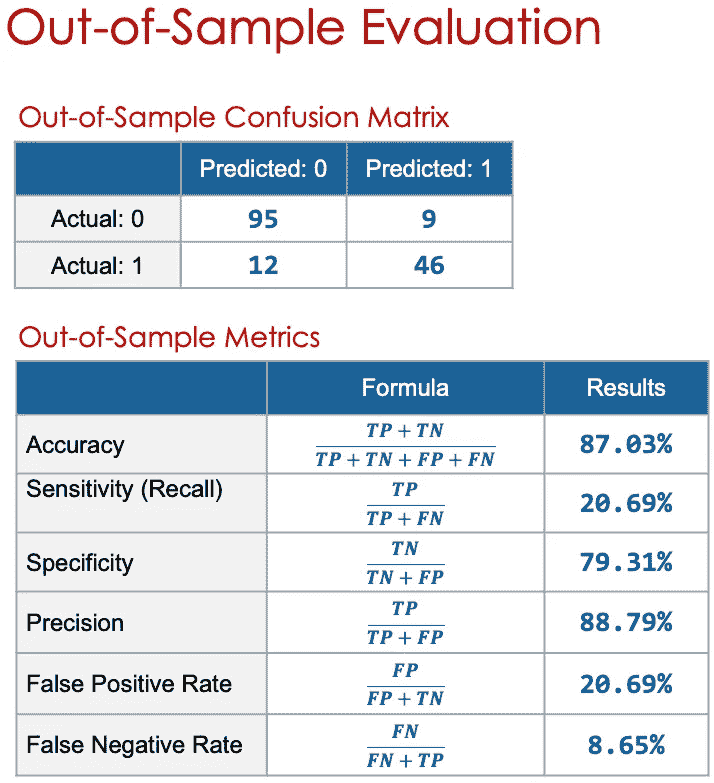

# 新数据的预测

## 数据准备

使用**单克隆抗体**作为搜索关键词从 Pubmed 检索 2010 年至 2020 年发表的新摘要，如下所示:

单克隆抗体[TIAB]和“2010”[PDAT]:“2020”[PDAT]

共获得 5180 篇摘要，其中 4610 篇预测为 fda 批准的**P(FDA _ approval . 1>= 0.5)**，570 篇预测为 FDA 未批准的**P(FDA _ approval . 1<0.5)**。摘要经过两个阶段的过滤:

包含用于摘要检索的 MAB 名称的摘要被排除以避免冗余

保留包含单词“单克隆”的摘要，以便仅使用与单克隆抗体研究相关的摘要

在上述过滤之后，摘要的数量减少到 1248 个，其中 980 个预测为 1，268 个预测为 0。

## 结果

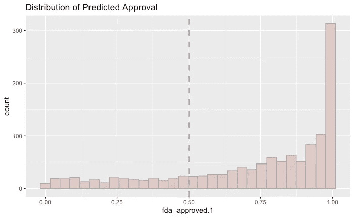

预计将获得批准的前 10 位摘要发表于 2012 年 6 月 27 日至 2020 年 3 月 28 日之间。

通过目测预测为 1 的前 20 个摘要，用于乳腺癌和结肠直肠癌的抗表皮生长因子受体(**抗 EGFR** )似乎是有希望的候选者。另一个潜在的候选者是程序性细胞死亡-1 ( **PD1** )是一种抑制性受体，表达在活化的 T 和 B 细胞上，靶向非小细胞肺癌。

总之，最有希望获得 FDA 批准的两种候选单克隆抗体是:

**反表皮生长因子受体(反 EGFR)**

**程序性细胞死亡-1 蛋白(PD1)**

# 预测摘要的层次聚类

FDA 批准的潜在 MAB 候选人现已确定。我不得不更深入地研究他们的科学研究，这些研究导致了这种候选单克隆抗体的发现。现在有可能使用数据科学技术从摘要中获取知识，而不必阅读摘要。我对预测为 1 的摘要进行了层次聚类，然后从每个聚类中提取出顶级术语，以确定是否可以从中获得新知识。r 被用来完成这项任务。

预测的 FDA 批准 1 被读入 R 数据框:

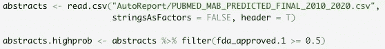

创建并清理了摘要语料库:

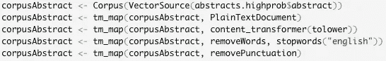

从语料库中移除稀疏术语并将其转换成文档术语矩阵(DTM):

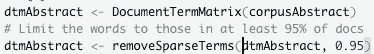

DTM 被转换成便于聚类的数据框架:

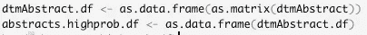

由此产生的 DTM:

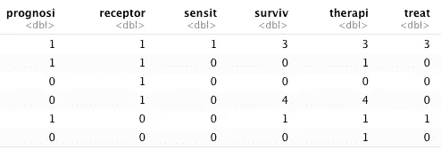

从 DTM 创建的数据框与源数据集相结合:

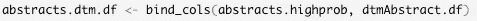

通过为后续聚类选择相关列，创建了一个新的数据子集:

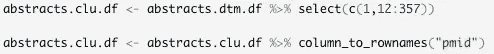

使用所得到的分级模型作为输入来绘制树突图。对图进行视觉检查以确定 k 的合适值，k 是聚类的数量。当确定了合适的 k 时，在图中添加一条水平线，以指示它在何处分隔这些聚类:

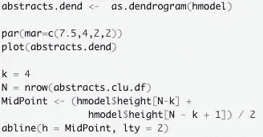

提取聚类并将源数据集注入到每个聚类中，以便源数据集中的行接收相应的聚类编号:

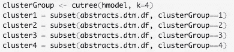

我们创建了一个函数，通过对每个术语的频率求和来提取前 20 个术语:

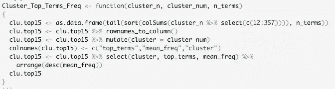

产生的热门词汇如下所示。排除常见术语，如癌症、单克隆、使用等:

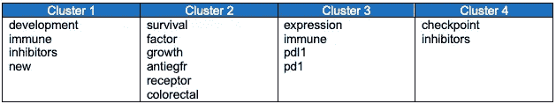

每个集群的顶级术语

从聚类中挖掘出的顶级术语似乎为研究 MAB 的背景提供了一些有用的见解，我们可以将这些见解转化为知识。我们能得到的大概知识如下:

**集群 1** :新的单克隆抗体靶向抑制剂正在开发中。

**集群 2** :针对结肠直肠癌和患者生存的抗 EGFR 单克隆抗体正在研发中。

**簇 3** : PD 1 和 PDL1 是正在/已经通过在基因水平上研究其表达而开发的 MAB 靶标。这项研究涉及对免疫细胞/系统的研究。

**集群 4** :可能涉及细胞周期检查点的抑制剂研究

以下目标有望获得 FDA 对癌症治疗药物的批准:

1.  表皮生长因子受体(EGFR)
2.  程序性细胞死亡-1
3.  程序性细胞死亡配体-1(L1)
4.  免疫检查点抑制剂

# 利益

我们可以从这项工作中获益。以下是其中的一些:

学术:学术研究人员能够计划和修改研究领域，目标和避免冗余。这有助于他们充分利用研究基金。有抱负的研究生可以在选择研究课题和导师方面做出更好的决定。

投资者:投资者能够确定投资哪个 MAB 和哪个机构，以加快新 mab 的开发。这可能会减少开发时间，增加临床试验和上市的时间。

政府:作为一个向研究人员提供财政支持的机构，它能够相应地规划预算，将资金分配到哪里。政府也可以利用这些知识来改革教育、研究、人才发展政策。医院能够更有效地为临床试验和治疗规划床位。