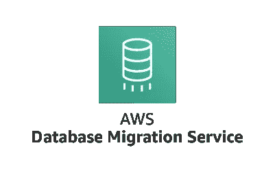
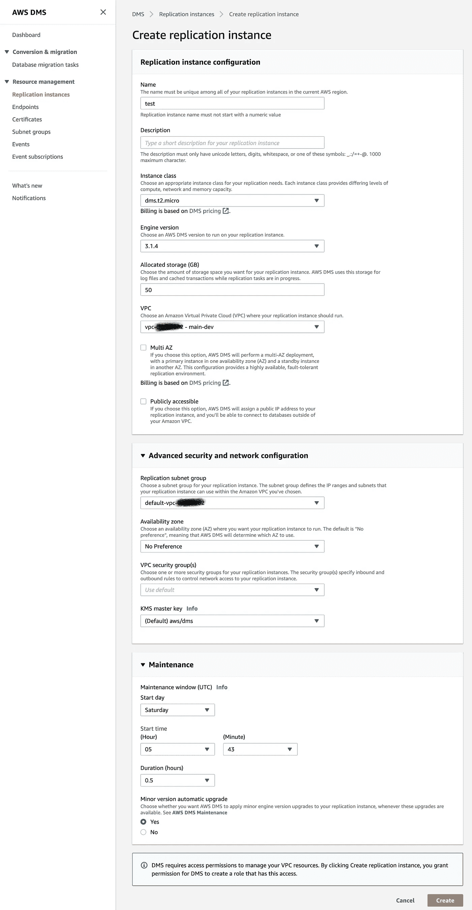
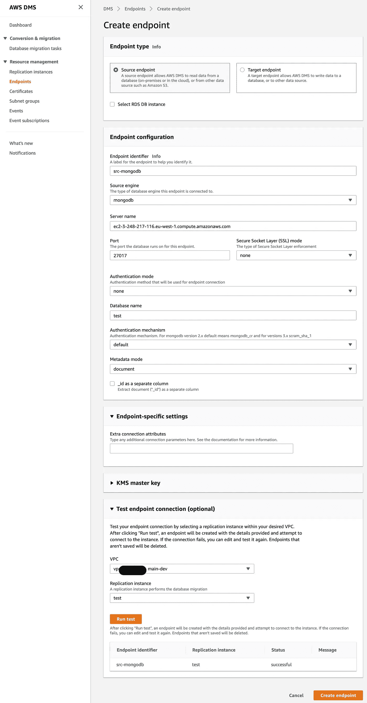
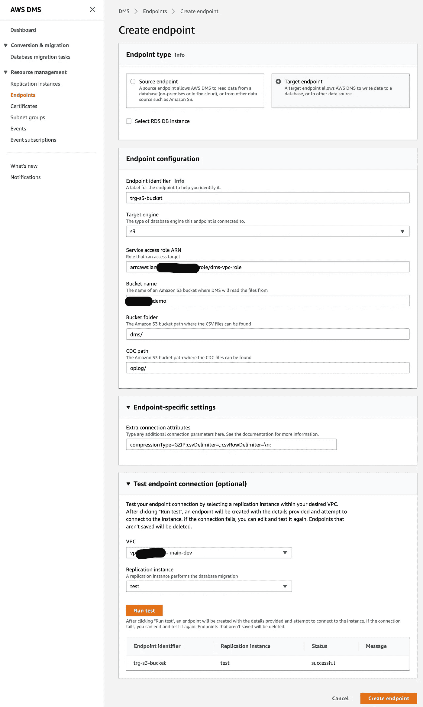
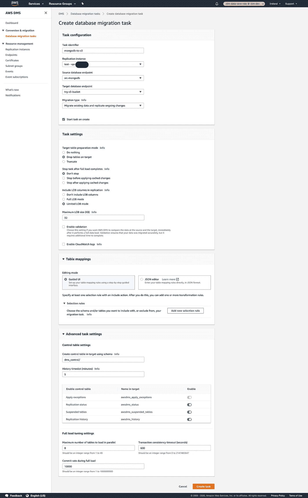
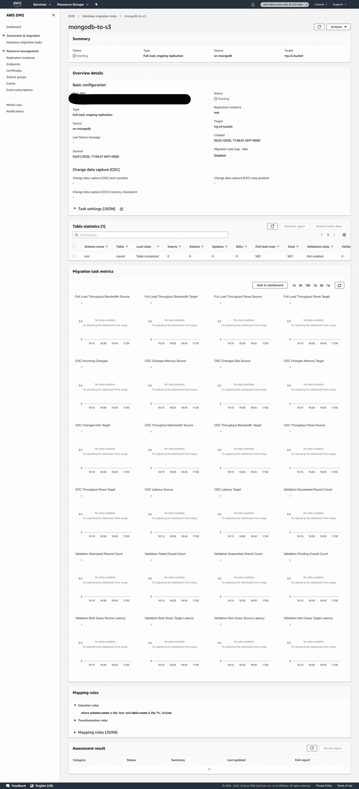

# 使用 AWS DMS 跟踪 MongoDB

> 原文：<https://towardsdatascience.com/using-aws-dms-to-tail-mongodb-978967aed8dd?source=collection_archive---------29----------------------->

## 数据摄取

## AWS DMS 作为一个持续的数据摄取工具。

[AWS DMS](https://aws.amazon.com/dms/) 是一项旨在将一个数据库迁移到另一个数据库的服务。无论是本地数据库到 AWS RDS 还是 AWS EC2(自管理数据库)到 RDS。目的很简单，并且假设迁移通常是短期的。DMS 不仅允许迁移整个数据库，还允许在满载时连续复制更改的数据。

从技术上讲，对迁移任务的持续时间没有限制。拥有一个本质上无限运行的迁移任务意味着它可以用于将数据库更改流式传输到 S3。因此，让我们来看看 DMS，以及我们如何使用它来填充我们的湖泊。

# AWS 数据库迁移服务

DMS 服务概念相当简单，使用起来也很简单。如果默认值保持不变，则简单。有三个主要组件:端点、复制实例和任务。

## 端点

端点定义了到源和目标的连接。端点可以被配置为源或目标，以便限制误用。支持各种数据库，包括 AWS DocumentDB 和 S3。

## 任务

任务定义将哪个源端点迁移到目标。每个任务可以将一个源迁移到一个目标。端点可以在多个任务中引用。任务还定义了是执行完整迁移还是持续复制，或者两者都执行。完整迁移会在目标系统中创建时间点快照，而持续迁移会将每个更改复制到目标系统。

还可以将任务配置为从目标中删除现有的表或将其截断。其他优化设置包括在迁移中包括和排除哪些模式和表。

任务可以在多个状态之间转换，这些状态可以恢复、暂停或重置任务。如果作为任务的一部分迁移多个表，那么如果需要，可以单独重新加载每个表。对于正在进行的复制，该任务还在内部维护一个检查点状态，用于恢复复制。

可以在每个任务中应用一些基本的转换规则。它们作用于模式、表或列，并允许重命名、删除或在名称中添加前缀和后缀。数据不能被操纵。

## 复制实例

这些任务需要在一些 EC2 实例上执行。DMS 不是无服务器的，但是配置只涉及创建一个实例。不需要也没有能力通过 SSH 访问实例，甚至管理它。除非需要进行大量转换，否则大多数任务都是内存受限的。DMS 实例家族是一个很好的起点。Cloudwatch 指标允许对此进行监控，并且应该用于测试和容量规划。

# 跟踪 MongoDB 到 S3

我假设您有一个运行副本集的 MongoDB 服务器。如果没有，您可以很容易地在 AWS EC2 或 ECS 中设置一个。我将在 EC2 上使用一个，这是我专门为这个演示设置的。

首先，我们需要创建端点。有两个:源和目标。源端点应该指向 MongoDB 主机，目标指向 S3 桶。

## 复制实例

首先创建复制实例使我们能够测试到源和端点的连接。实例的大小应该由内存和磁盘需求决定。限制每个实例复制的表的数量是一个很好的做法。

下面的屏幕截图显示了如何配置该实例。[https://docs . AWS . Amazon . com/DMS/latest/user guide/CHAP _ replication instance . html # CHAP _ replication instance。正在创建](https://docs.aws.amazon.com/dms/latest/userguide/CHAP_ReplicationInstance.html#CHAP_ReplicationInstance.Creating)

创建复制实例非常重要，因为复制任务无法在实例之间轻松迁移。建议使用多个复制实例，尤其是当您有多个源和 50 多个表/集合要复制时。

## 源端点

AWS DMS 支持大量数据源，包括所有 RDS 数据库类型、MongoDB 和 S3。

是时候创建到我们的源 MongoDB 集群的连接了。如果您有一个集群和路由器，不幸的是，您不能连接到路由器，因为无法访问`oplog`集合。您需要选择一个实例进行复制。您可以选择一个辅助节点，以便写入群集的数据不受影响，但数据仍能正确复制。

对于这个演示，我有一个 MongoDB 实例运行在 EC2 实例的副本集中。下面的配置是一个例子。

有几个关键的配置选项值得讨论。首先是元数据模式。DMS 支持 MongoDB 的`document`或`table`模式。`document`模式将操作日志和文档保存为 JSON，而`table`模式将其保存为 CSV。使用`table`模式，可以使用`nestingLevel`作为`NONE`或`ONE`来指定要展平的级数。

接下来是`_id as a separate column`或者`extractDocId`。这允许提取文档`_id`作为一个新列。如果这是 false(未选中)并且元数据模式被设置为`document`，那么输出文件有一个包含 JSON 字符串的单列。使用`extractDocId=true`，输出文件有两列 CSV 格式，第一列是`_id`，第二列是字符串形式的 JSON 文档。稍后当我们查看复制任务输出时，这一点会变得更加明显。你可以在这里找到更多信息[。](https://docs.aws.amazon.com/dms/latest/userguide/CHAP_Source.MongoDB.html)

## 目标端点

AWS DMS 支持多种目标数据库类型和 S3。配置 S3 目标相当简单，如下所示。`bucket folder`定义了每个表的前缀。

最重要的设置是`Extra Connection Attributes`。这是针对任何目标的。您可以指定压缩、分隔符、格式等。AWS 文档对此非常详细，并提供了很好的示例。我发现`CDC Path`不起作用，也许这是因为 DMS API 实际上不允许指定这个。

## 迁移任务

一旦定义了端点，我们需要定义一个迁移任务。迁移任务定义了哪些数据以及如何将数据从源端点复制到目标端点。迁移类型设置允许作为一次性加载或连续复制进行迁移。

这个`Task Settings`很值得讨论。第一个选项是`Target Table Preparation Mode`；这定义了写入目标表的行为。对于 S3，这是指前缀。`Do Nothing`将添加数据，`Drop Tables on Target`将删除所选表格的表格前缀，`truncate`将删除表格前缀下的所有数据对象。这是任务中所有选定表的全局设置。

`Include LOB Columns in Replication`控制迁移多大的二进制对象。BLOB/CLOB 字段类型可能包含难以迁移的兆字节数据。DMS 允许读取这种类型的截断形式，或者可以完全排除它们。通常情况下，`Limited LOB mode`是最佳实践，但是，当目标数据库/系统能够处理这种数据类型时，也可以使用`Full LOB mode`。不幸的是，S3 目标端点不支持完整的 LOB 模式。

`Enable Validation`这是一个很棒的功能，但同样不被 S3 支持。对于其他数据库类型，DMS 允许验证所有数据都已被完整准确地复制。对于 S3，我们可以在查看指标时看到这一点。

简单地说，`Control Tables`允许审计和记录 DMS 动作和状态。除了日志之外，这对于快速检查状态也很有用。

## 运行和监控任务

创建并启动任务后，数据将开始通过复制实例流动。请注意，任务创建后，复制实例不能更改。如果您需要在新的复制实例上运行任务，则需要创建新的任务。

下面是 DMS 提供的一个监控的框架，碰巧相当详细。我的 MongoDB 源代码是一个带有模拟数据的小实例。所以只有几百份文件。然而，很明显，表/集合级别的监控是可能的，并且几乎可以通过 CloudWatch 即时更新，包括所有的插入、更新和删除。满载和 CDC 指标也在任务级别单独提供。EC2 指标以及这些指标可以决定在每个复制实例上运行多少任务，以及实例类型是否需要更新。

## 摘要

希望本指南为您提供了一个关于 DMS 的良好起点，以及它不仅可以用于数据库迁移，还可以用于数据湖的数据接收。我已经向您展示了一个连接到 MongoDB 的示例，但是，您也可以连接与 MongoDB 兼容的 DynamoDB！随着 DMS 和 DynamoDB 新版本的发布，这将增加更多功能，包括 CDC 复制。由于 DMS 是一项托管服务，因此它更易于操作，并提供了与 Cloudwatch 的完全集成，用于监控和警报。