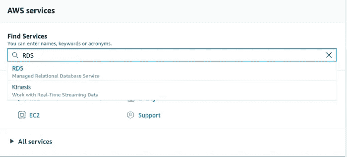
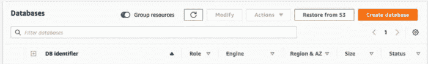
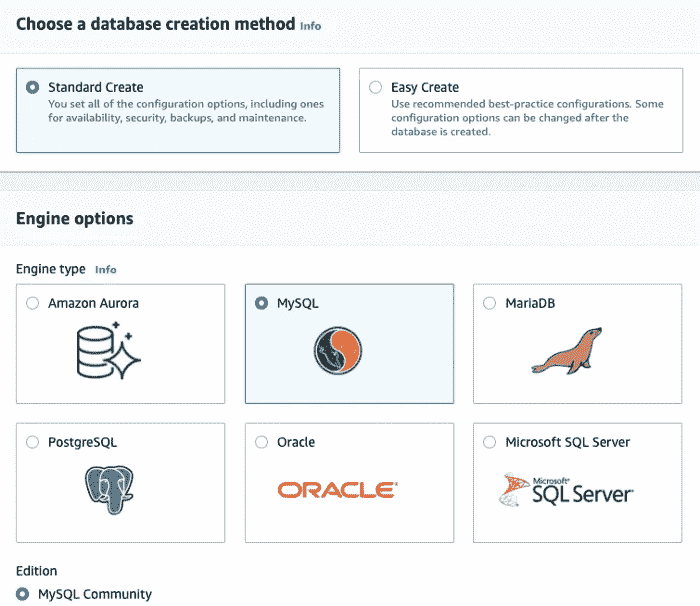
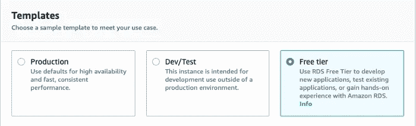
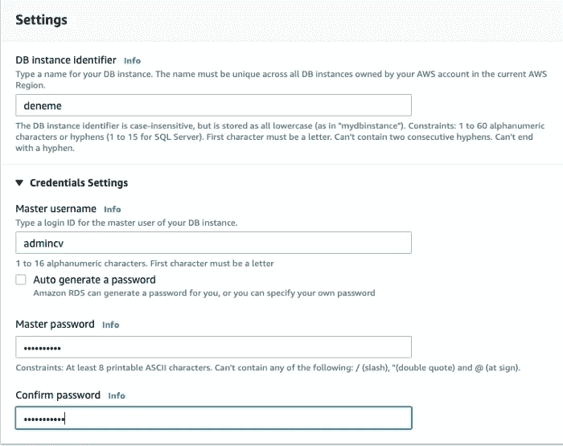
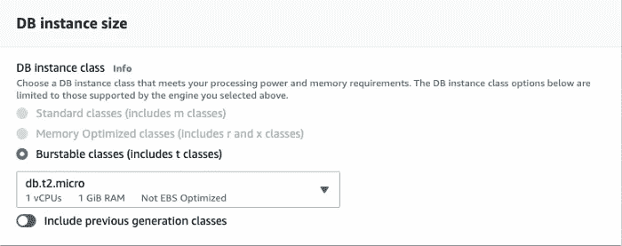
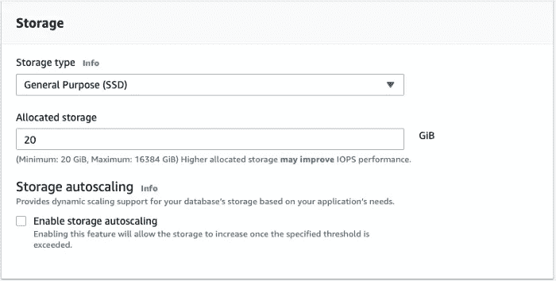
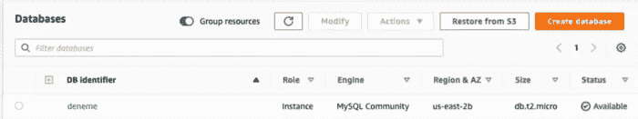
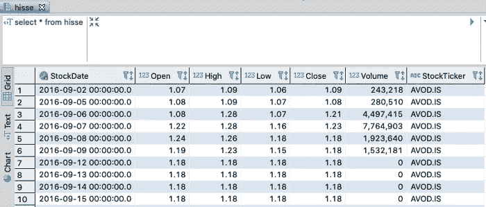

# 将数据从 Python 同步到 AWS RDS

> 原文：<https://towardsdatascience.com/using-aws-rds-and-python-together-5718a6878e4c?source=collection_archive---------16----------------------->

## 通过一个简单的 Python 脚本，我们可以将数据帧传输到 AWS RDS 数据库中的一个表中。


麦克默里朱莉在 pixabay.com

# **什么是亚马逊网络服务？**

**亚马逊网络服务**是**亚马逊公司提供的云平台**。它是数据科学家和数据工程师等职位发布中最常强调/最受欢迎的平台之一。当今世界，随着大数据的日益增长，云平台变得越来越重要。除了灵活性、速度和实用性之外，像 AWS 这样的云平台是建立在你用多少就花多少的哲学基础上的，它们的**可扩展**成本。很多创业公司，世界巨头，政府机构都用 AWS。

# **什么是 AWS RDS(关系数据库服务)？**

**AWS RDS** 是在 AWS 平台上创建传统数据库服务的服务。它可以安装得非常快，并立即站起来。在需要的范围内，你用多少就付多少。您可以根据增加的**数据大小**和**调整您需要的速度**。

如果在 AWS 上安装 RDS 系统，就不用和硬件打交道了。您不需要在数据库设置上花费太多时间，备份等操作是自动完成的。通常你只需要使用一些参数和能力。

AWS RDS 支持 **AWS Aurora、PostgreSQL、MySQL、MariaDB、ORACLE、Microsoft SQL** 数据库基础设施。


卡斯帕·卡米尔·鲁宾在 [Unsplash](https://unsplash.com?utm_source=medium&utm_medium=referral) 拍摄的照片

**让我们开始在 AWS RDS 上创建数据库吧！**

首先我们要开一个 AWS 账户。

我们需要进入 AWS 主页注册 AWS。进入该页面后，我们继续说创建一个 AWS 帐户。在所有步骤中，我们必须正确输入我们的信息，尤其是电子邮件地址。然后我们需要输入我们的付款信息。如果你没有超出限制，AWS 的一些服务是免费的。如果您输入了付款信息，请确保您没有超出这些限制。AWS 收取 1 美元的费用来验证您的支付帐户，然后将其退回。

有关详细信息，您可以按照步骤创建一个 AWS 帐户。

让我们进入 RDS 并创建数据库。

创建 AWS 帐户后，我们输入 RDS。



我们单击控制台左侧的数据库选项。我们通过在打开的页面上说**创建数据库**来迈出创建数据库的第一步。



我们需要在打开的页面上选择数据库基础设施。在本例中，我们将继续浏览 **MySQL** 。



对于我们的操作类型，我们现在选择免费层。



我们需要从 Settings 部分确定要创建的数据库名称、用户名和密码。我为这个例子创建了一个名为 experiment 的 db，并创建了一个名为 admincv 的用户。



Amazon 为要创建的数据库提供了一些标准特性。如果您是出于试用目的进行这项研究，为了不收费，最好不要打开**存储自动缩放**功能。如果你在亚马逊设定的限额内使用，就不会收费。



稍作等待后，系统将使数据库可用。然后在状态字段中显示为“**可用**”。


现在数据库出现了。



让我们进入我们创建的数据库。

这里,“连接和安全”区域中的端点和端口信息很重要，记下来很有用。然后将需要这些信息，以便我们可以从 Python 访问 DB。


**现在我们切换到 Python，连接数据库！**

1-我们下载我们的库。

```
import pandas as pd
import pymysql
from sqlalchemy import create_engine
```

**2-我们输入我们的连接信息。**

我们在主机区域输入上面的端点链接。我们需要选择 3306 作为端口。用户名是我们之前创建的“cvadmin”。密码是您为该用户创建的连接密码。我们的数据库名是“deneme”。在将它赋给数据库变量之后，我们完成了所有的操作。

```
host=’deneme.cykgvlpxbgsw.us-east-2.rds.amazonaws.com’
port=int(3306)
user=”cvadmin”
passw=”yourpassw”
database=”deneme”
```

**3-我们通过收集连接信息来创建引擎。**

以下代码中的 user、passw 等字段依赖于我们在上一步中创建的变量。

```
mydb = create_engine(‘mysql+pymysql://’ + user + ‘:’ + passw + ‘@’ + host + ‘:’ + str(port) + ‘/’ + database , echo=False)
```

我们将数据库中的数据打印出来。

我们用 name = "hisse "命令创建了一个表，现在我们**可以打印我们拥有的数据**。我有一个数据框架。它给出 Bist100 股票的每日价格。也可以用另一个 DF。

```
stockshistoricdata.to_sql(name=”hisse”, con=mydb, if_exists = ‘replace’, index=False)
```

**让我们通过 DBeaver 检查数据是否打印在表上！**

我们的数据现在在“hisse”表中。



**结论**

在数据科学项目中，为什么要将 Python 中的数据压入 AWS 上的数据库？你问这个问题是对的。如果你正在用大数据工作**，如果数据在一个**每日或每周新数据**上，并且你的 python 代码工作几分钟或**小时**，这些情况可能是浪费时间。**

为了避免这种情况，您用 Python 创建了一个脚本，这个新数据每天都打印这个表。它不会触及旧数据。您可以连接到“hisse”表，随时处理累积的数据。您可以通过打印一天的股票数据来**节省时间和 CPU** ,而不是从头开始创建所有数据。此外，多个人可以在同一个工作台上工作。

希望我写的东西有用。祝阅读愉快！

*资源；*

[*https://docs . AWS . Amazon . com/Amazon rds/latest/user guide/CHAP _ Tutorials。WebServerDB.CreateDBIns*](https://docs.aws.amazon.com/AmazonRDS/latest/UserGuide/CHAP_Tutorials.WebServerDB.CreateDBIns)

[https://AWS . Amazon . com/tr/premium support/knowledge-center/create-and-activate-AWS-account/？nc1=h_ls](https://aws.amazon.com/tr/premiumsupport/knowledge-center/create-and-activate-aws-account/?nc1=h_ls)

我的 Linkedin 个人资料；

[https://www.linkedin.com/in/onur-okyol-ba253b72/](https://www.linkedin.com/in/onur-okyol-ba253b72/)