# 使用 AWS Sagemaker 和 Lambda 构建无服务器 ML 平台

> 原文：<https://towardsdatascience.com/using-aws-sagemaker-and-lambda-function-to-build-a-serverless-ml-platform-f14b3ec5854a?source=collection_archive---------5----------------------->

## 构建一个无服务器的 ML 应用程序来预测 AWS 上的航班延误

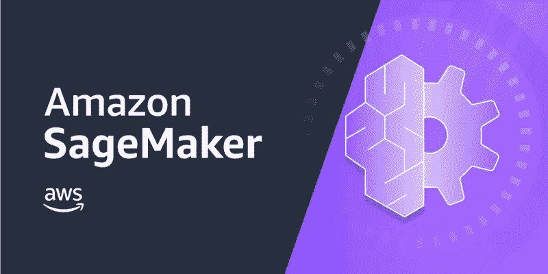

AWS Sagemaker 徽标

大多数数据爱好者都知道如何构建和训练模型，但如何部署模型并使其在现实生活中有用，有时对于初学数据的科学家来说是一个具有挑战性的问题。幸运的是，有许多不同的平台和工具可以帮助模型部署。Amazon Sagemaker 是我的最爱之一，因为它大大减少了构建、训练和部署模型的努力和犹豫。在众多 AWS 功能和工具的帮助下，如 Lambda function、S3、Dynamo DB，构建一个工作的 ML 应用程序的整个过程只需点击一下鼠标。

在这篇文章中，我想演示我们如何利用 AWS 的能力来构建一个预测航班延误的无服务器 ML 应用程序。

# 目录

*   资料组
*   演示架构
*   创建笔记本实例
*   创建 Sagemaker 端点
*   创建 Lambda 函数
*   创建 API 端点
*   端到端测试
*   结论

## 资料组

该数据集来自美国交通部，包含 2018 年 721 万条飞行记录，共有 28 列。

[*https://www . ka ggle . com/yuanyuwendymu/airline-delay-and-cancel-data-2009-2018*](https://www.kaggle.com/yuanyuwendymu/airline-delay-and-cancellation-data-2009-2018)

由于数据量很大(721 万)，我们使用 Google Bigquerry 进行数据清洗、预处理和简单的特征工程。由于这个项目的目的是演示 AWS 如何帮助模型训练和部署，我们不会花太多时间讨论如何用 Bigquerry 预处理数据(可能是未来的主题)。准备用于训练的已处理数据随后以 CSV 格式存储到 S3 存储桶中。现在我们可以开始在 AWS 上构建我们的演示了

## 演示架构

为了使这个应用程序有用，我们将利用 AWS API Gateway 和 Lambda 函数来构建一个 API，它接受包含航空公司信息的 HTTP POST 请求(一个真实的例子可能是一个将航空公司编号作为输入的应用程序或网站)，POST 请求将触发 Lambda 函数来解析值，并将测试数据发送到部署了模型的 Sagemaker 端点。返回值将再次被 Lambda 函数解析，并将预测结果发回给用户。架构图展示了从用户输入到预测输出的端到端管道。

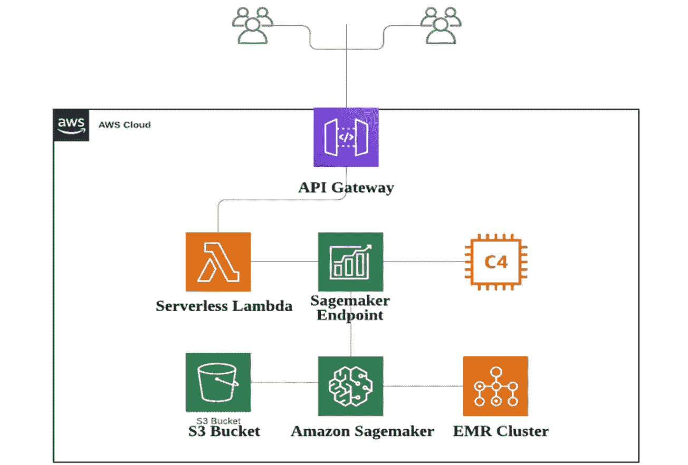

作者创建的架构图

## 创建笔记本实例

正如我们前面提到的，预处理的结果存储在一个 S3 桶中，以方便使用。但是，Sagemaker 可以使用不同渠道的数据。比如来自 AWS IoT 的 Dynamo DB、Aurora 甚至 IoT 设备数据。Sagemaker 还提供了各种工具来自动调整和选择模型。让我们首先在 Sagemaker 中创建一个 Jupyter notebook 实例。从 AWS 主页中，选择 service 并进入 Sagemaker。并且你会看到下面的选项，选择**笔记本实例**。

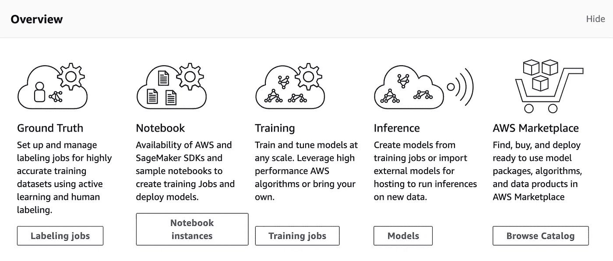

Sagemaker 控制台

如果你以前从未使用过亚马逊 SageMaker，在最初的两个月里，你可以在**获得** **每月 250 小时的 T2 免费等级。中号或者 t3。中型笔记本电脑用于构建您的模型，外加 50 小时 m4** 。输入笔记本的名称和实例类型。如果您之前从未创建过 IAM 角色，请创建一个新角色或使用默认的 Sagemaker IAM 角色。IAM 角色控制实例的资源权限。

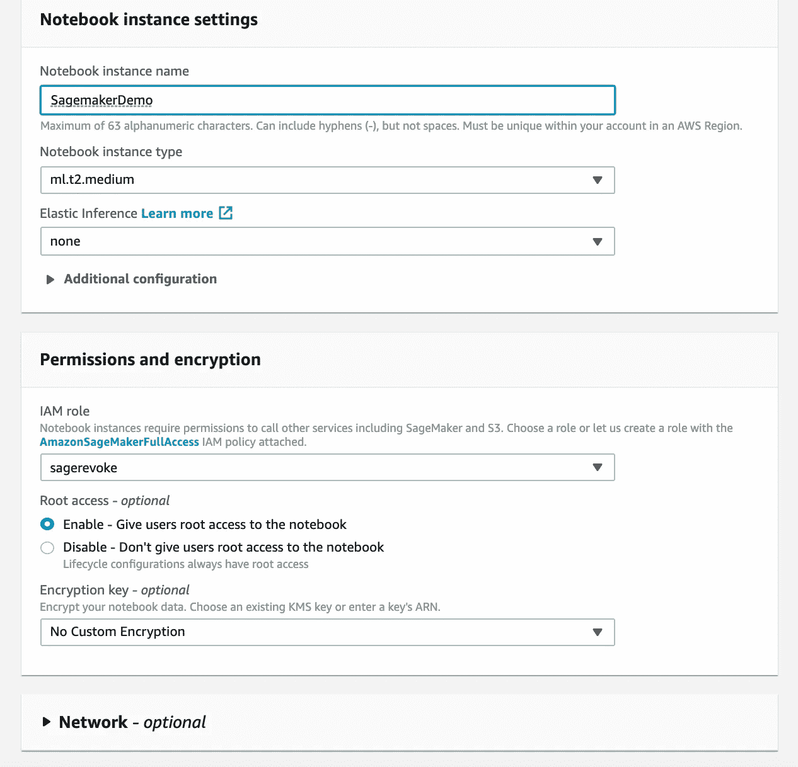

笔记本实例配置

亚马逊 SageMaker 内置了 Jupyter 笔记本，允许你用 Python、Julia、R 或者 Scala 写代码。我们将在这个项目中使用 Python 3。它还提供了笔记本实例启动时加载的示例笔记本列表。每个示例笔记本都有不同的用例，并包含每个步骤的详细注释。我强烈建议初学者仔细阅读这些笔记本，你会对如何使用 Sagemakers 有一个更好的想法。

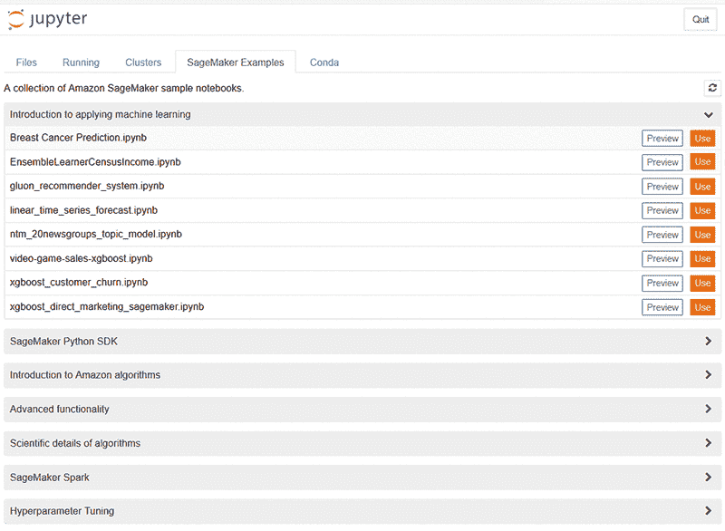

Sagemaker 示例笔记本

现在让我们创建我们的笔记本，笔记本是基于*乳腺癌预测. ipynb.* 修改的，你可以通读原始样本。记得更改 S3 存储桶名称和 CSV 文件以匹配您的名称。

## 创建 Sagemaker 端点

最后一行代码将删除从笔记本中创建的端点，让我们先注释掉最后一行。然后，您可以通过点击 Run All 或使用 Shift 和 Enter 键逐步运行单元格来执行笔记本。通过运行笔记本，模型被训练和部署，并创建了一个 Sagemaker 端点。您可以从 Amazon SageMaker 控制台查看这个端点。您可以将默认端点名称更改为更有意义的名称。

## 创建 Lambda 函数

现在我们有了一个 SageMaker 端点。让我们创建一个 Lambda 函数来调用端点。它将解析 HTTP POST 请求，撤销 Sagemaker 端点，返回预测，解析结果并将其发送回用户。Lambda 可以使用 boto 3 sage maker-runtime . invoke _ endpoint()来调用端点

AWS Lambda 是一个有用的工具，允许开发人员基于每次使用的成本来构建无服务器功能。您还将受益于 FaaS 更快的开发速度、更简单的操作管理和可伸缩性。从 Lambda 函数中，从头选择**作者**。输入您的函数名，为此项目选择 Python 3.6。记住，选择 IAM 执行角色时，要使用一个策略，该策略允许您的函数调用 sagemaker 端点。

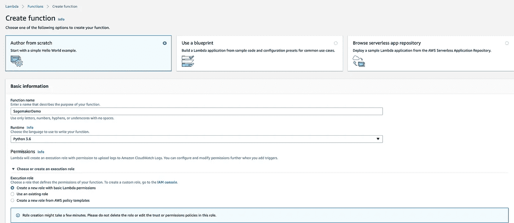

Lambda 功能配置

下面是 Lambda 函数的代码，它使用 ENDPOINT_NAME 作为环境变量，保存 SageMaker 端点的名称。记得在环境变量部分将变量分配给端点名称。

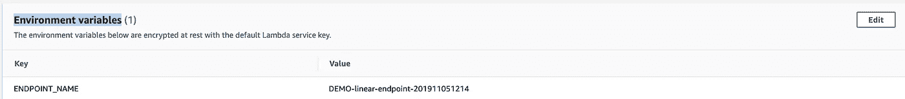

设置环境变量

```
import os
import io
import boto3
import json
import csv# grab environment variables
ENDPOINT_NAME = os.environ['ENDPOINT_NAME']
runtime= boto3.client('runtime.sagemaker')def lambda_handler(event, context):
    print("Received event: " + json.dumps(event, indent=2))

    data = json.loads(json.dumps(event))
    payload = data['data']
    print(payload)

    response = runtime.invoke_endpoint(EndpointName=ENDPOINT_NAME,
                                       ContentType='text/csv',
                                       Body=payload)
    print('res is !!!!')
    print(response)
    result = json.loads(response['Body'].read().decode())
    print('result is!!!!')
    print(result)
    pred = int(result['predictions'][0]['score'])
    #pred = int(result['predictions'][0])
    predicted_label = 'delay' if pred == 1 else 'no delay'

    return predicted_label
```

## 创建 API 端点

现在我们已经准备好了 Lambda 函数，让我们创建 API 来接收 HTTP 请求并集成一切。您可以按照 AWS [文档](https://docs.aws.amazon.com/apigateway/latest/developerguide/how-to-create-api.html)从 API Gateway 创建 API。或者只是按照这些简单的步骤。

1.  打开 AWS API 网关控制台。选择**创建 API** 选择一个 API 名称，您可以将端点类型设为区域。选择创建 API。

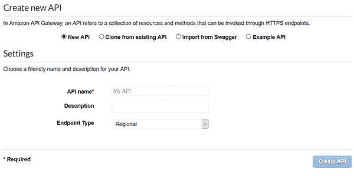

创建新的 API

2.接下来，创建一个**资源**从**动作**下拉列表中选择，当资源被创建时，从同一个列表中选择**创建方法**来创建一个 POST 方法。

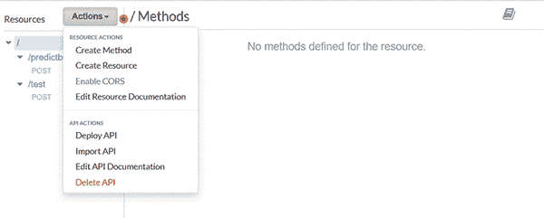

创建方法

3.在出现的屏幕上，输入以下内容:对于集成类型，选择 Lambda Function。对于 Lambda 函数，输入您创建的函数

4.设置完成后，将 API 部署到一个阶段。从动作下拉列表中，选择**部署 API** 。

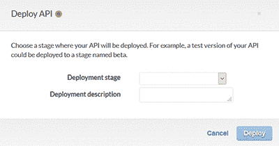

部署 API

5.在出现的页面上，创建一个新阶段。并选择部署，这一步将为您提供调用 URL。

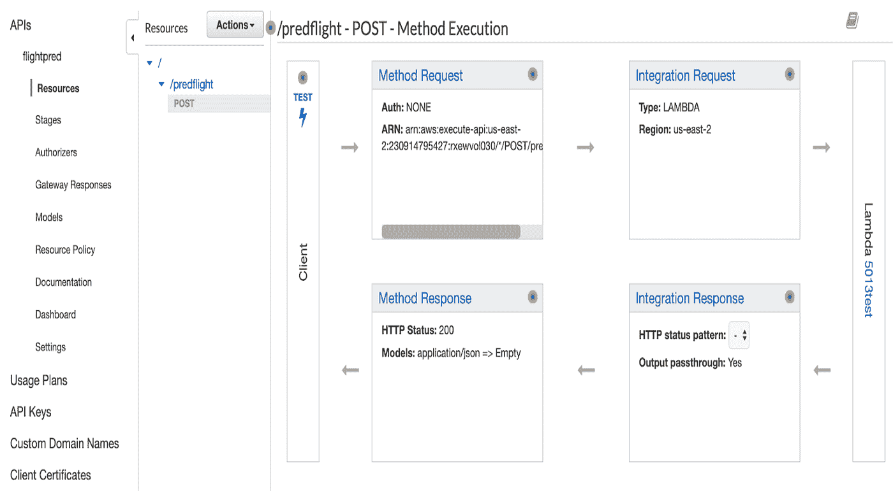

API 流程

## 端到端测试

现在我们已经构建了一个无服务器的 ML 管道，它可以从 HTTP POST 获取用户数据，并从我们部署的模型返回 ML 预测结果。我们可以在邮递员身上测试。Postman 是一个接口测试工具。做接口测试的时候，Postman 就像一个客户端。它可以模拟用户发起的各种 HTTP 请求，将请求数据发送到服务器，获得相应的响应结果，并验证响应中的结果数据是否与期望值匹配。现在，我们发送一个 POST 请求到上一步创建的调用 Url，它触发 Lambda 函数并调用我们的 Sagemaker 端点来进行预测。我们可以看到，我们得到的结果是“不成交”

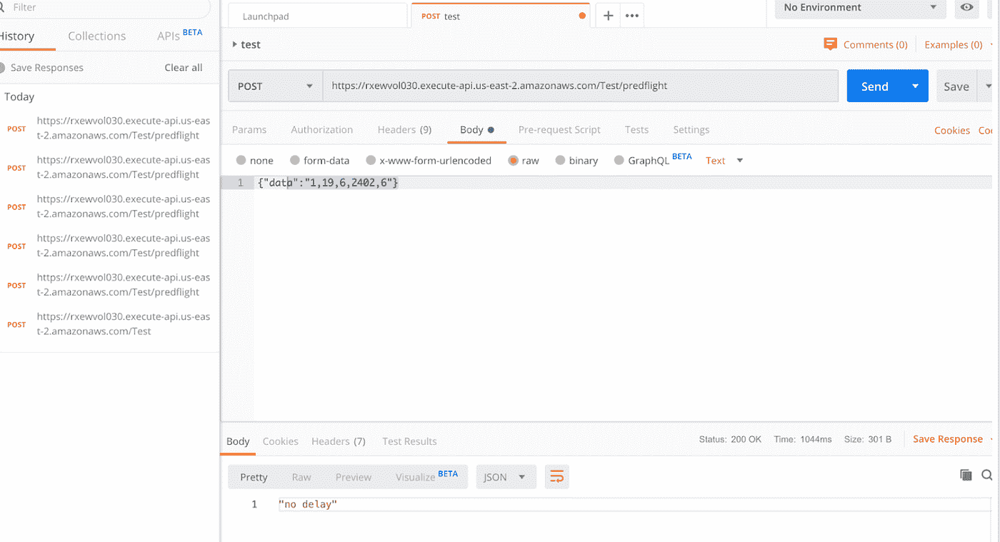

邮递员测试

**总结思路**

AWS Sagemaker 是所有级别的数据科学家和 ML 应用程序开发人员实现健壮和完整的端到端 ML 解决方案的一个很好的工具。它可以自动化许多繁琐的工作，如超参数调整，模型选择，甚至数据标记。在 Lambda 函数的帮助下，ML 应用程序可以具有高度的灵活性和成本效益。

感谢您的阅读，我期待听到您的问题和想法。如果你想了解更多关于数据科学和云计算的知识，可以在 [**Linkedin**](https://www.linkedin.com/in/andrewngai9255/) **上找我。**


[乔·塞拉斯](https://unsplash.com/@joaosilas?utm_source=medium&utm_medium=referral)在 [Unsplash](https://unsplash.com?utm_source=medium&utm_medium=referral) 上的照片

*参考*

[*https://docs.aws.amazon.com/sagemaker/*](https://docs.aws.amazon.com/sagemaker/)

[*https://AWS . Amazon . com/blogs/machine-learning/call-an-Amazon-sagemaker-model-endpoint-using-Amazon-API-gateway-and-AWS-lambda/*](https://aws.amazon.com/blogs/machine-learning/call-an-amazon-sagemaker-model-endpoint-using-amazon-api-gateway-and-aws-lambda/)