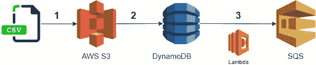
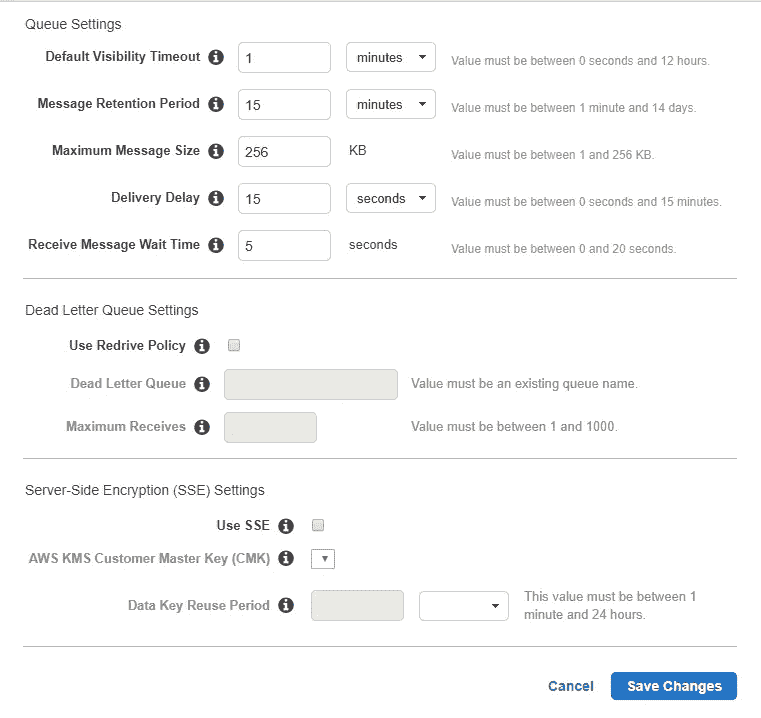
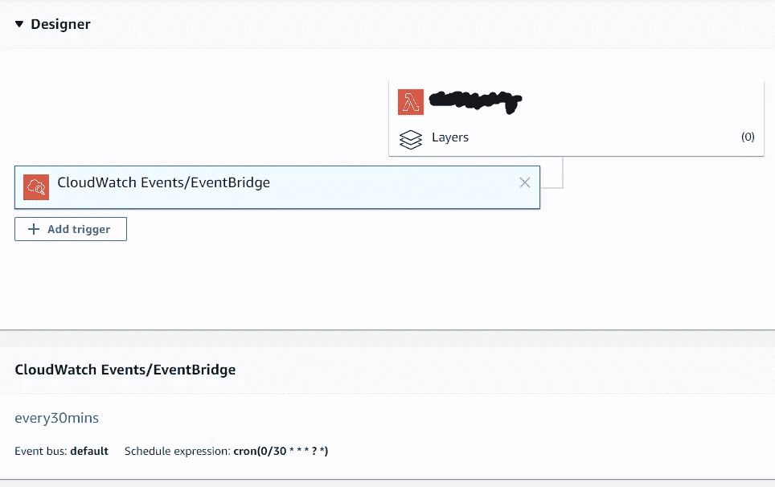

# 在 Python 中为预定消息使用 AWS SQS

> 原文：<https://towardsdatascience.com/using-aws-sqs-for-scheduled-message-in-python-3c9910621a4e?source=collection_archive---------31----------------------->

## 新闻捕手

## 如何开始使用 Lambda、S3 和 SQS 等 AWS 服务来创建新产品

Melanie Pongratz 在 [Unsplash](https://unsplash.com?utm_source=medium&utm_medium=referral) 上的照片

对于[数据即服务](https://www.safegraph.com/blog/data-as-a-service-bible-everything-you-wanted-to-know-about-running-daas-companies?source=search_post---------0)产品来说，有时候，架构比想法本身更重要。这正是我们和朋友一起开发的产品的情况。Newscatcher 是一个 API，用于搜索在线发布的新闻文章。换句话说，我们从全球最受欢迎的新闻来源收集所有文章，将它们放在一个地方，并提供基于日期、来源和全文进行搜索的可能性。

到目前为止，我们已经发布了一个封闭的测试版。本质上，我们是开发者至上的团队，这就是为什么我们决定分享我们所经历的一切。Newcatcher API 的另一位创始人发表了一篇关于整个数据架构的文章。

 [## 我们如何利用 AWS 在 60 天内推出数据产品

### 两个人的团队在不到两个月的时间里为 200 名用户计划并发布了一个测试版，并且没有放弃他们的全职工作。

towardsdatascience.com](/launching-beta-data-product-within-two-month-with-aws-6ac6b55a9b5d) 

我的目标是深入挖掘细节，谈谈产品的功能部分。解释数据管道，给出一些提示并揭示要避免的陷阱。我会努力让这篇文章既有趣又有用。如果您想知道如何构建相同的架构，也许您可以将它作为指南。

我们可以开始了吗？

# 挑战

让我们回到这个想法。我们希望构建一个包含最新新闻文章的 API。基点是每个在线新闻来源的 [RSS 提要](/collecting-news-articles-through-rss-atom-feeds-using-python-7d9a65b06f70)。 **RSS 提要**是简单的文本文件，包含文章的基本更新信息。几乎每个新闻来源都有一个储存标题、摘要、出版日期等信息的地方。我们的目标是创建一个数据管道，每小时从多个 RSS 提要获取信息。为了实现这个想法，我们面临一些简单的问题:

*   我们从哪里获得全世界成千上万新闻源的 RSS 提要？
*   如何每小时获取新文章？
*   我们把它存放在哪里，SQL 还是 NoSQL 数据库？
*   最快的查询方式是什么？
*   如何做一个 API？(是的，我们以前从未构建过 API)

为了回答第一个问题，我们使用了维基百科、 [Alexa](https://www.alexa.com/about) 和其他来源来搜集新闻来源网站和他们的 RSS 订阅。经过几个小时的手工清理，我们或多或少地获得了一些参考数据。csv 文件。一切都以. csv 开头。

下一步是每天多次使用 RSS 提要检索新文章。在这一点上，我们想出了使用 **SQS** 队列来逐步发送参考数据和获取文章更新的想法。它有两个主要优势:

*   容错。数据不是一个长时间的连续循环，而是通过成束的消息发送。一群人的错误不会影响其他人。日志中的错误很容易识别。
*   管理负载。易于管理其他服务的负载，如 DynamoDB 和 Elasticsearch。

SQS 队列和 **AWS Lambda** 串联完全符合我们的需求。多个 Lambda 函数可以同时启动。这意味着 lambda 可以接收每一串消息。公平地说，SQS 和 Lambda 函数的优势在数据管道中更加明显，我们接收 SQS 队列并将它们放入 DynamoDB 表中。在本文后面我们讨论 Lambda 函数的地方，只有一个用于发送 SQS 队列的函数。

现在让我们转到更技术性的部分。文章的下半部分包含了一个实际实现的生动例子。

数据管道

## 开始前的准备工作

在开始处理数据管道之前，需要完成一些步骤:

*   拥有[一个 AWS 自由层账户](https://aws.amazon.com/free/?all-free-tier.sort-by=item.additionalFields.SortRank&all-free-tier.sort-order=asc)
*   选择一个地区，对于您使用的其他服务，请选择该地区
*   使用 Linux 机器或创建一个 [EC2 实例](https://docs.aws.amazon.com/AWSEC2/latest/UserGuide/EC2_GetStarted.html),该实例有权访问其他 AWS 服务
*   在您的 AWS 帐户上创建一个访问密钥
*   为此项目专门创建一个虚拟 Python 环境
*   安装 AWS CLI 并[将](https://docs.aws.amazon.com/cli/latest/userguide/cli-chap-configure.html)配置为您之前创建的访问密钥
*   为 Python 安装`boto3`包

# 1.在亚马逊 S3 上提供数据

让我们从简单的事情开始。在 AWS 上打开 S3 服务，创建一个存储桶并上传您的。csv 文件在那里。恭喜你，三分之一完成了。

# 2.从传输数据。csv 文件到 NoSQL 表

如果您已经完成了前面提到的所有预安装要求，那么在访问不同的服务方面就不会有任何问题。

## 来自`boto3`的资源和客户端

从现在开始，请记住，每次您想要使用 AWS 服务时，您都必须导入`boto3`并建立适当的连接，无论是*资源*还是*客户端*。

我不知道何时使用它们中的每一个，试着阅读官方的[文档](https://boto3.amazonaws.com/v1/documentation/api/latest/guide/index.html#general-feature-guide)或来自 [Stackoverflow](https://stackoverflow.com/questions/42809096/difference-in-boto3-between-resource-client-and-session) 的简短解释。对于您的项目，我们总是连接到 **DynamoDB** 作为*资源*，连接到 **S3** 作为*客户端*，连接到 **SQS** 作为*客户端*发送消息，并作为*资源*接收消息。

## DynamoDB 中的表

还有一件事，你需要在 DynamoDB 中创建一个表。这并不困难:你进入 DynamoDB 服务，点击“创建表”。配置它的惟一方法是默认选择一个主分区键——这个变量对于每个观察都有一个惟一的值。如果您没有该变量，您可以创建两个变量 MD5 散列，这将为您提供一个唯一的 ID。例如:

将数据从 S3 发送到 DynamoDB 是一次性操作，如果您的数据没有被更改，则无需重复。该操作的代码片段从建立到所需服务的连接开始。

向 DynamoDB 发送数据的一种可能方式是通过**一个字典列表**，其中每个字典都代表来自您的。csv 文件。所以你需要一个函数来完成这项工作。每个变量将作为一个**字符串**发送。郑重声明你的。csv 文件的名称必须与您选择作为 DynamoDB 表主键的名称相同。

最后一部分是使用您之前打开的连接发送自身的过程。

你在`if __name__ == '__main__':`下插入主代码，就可以把功能放在外面导入了。然后发射。虚拟环境中的 py。检查 DynamoDB 服务中表格上的“项目”选项卡。

# 3.向 SQS 发送参考数据

使用 AWS Lambda，我们将获取不可变的引用数据，并通过 SQS 将其发送给另一个 Lambda 使用。为了执行这个操作，我们需要创建一个 SQS 队列，以及具有所有权限的 Lambda 函数。

## SQS 队列

这里没什么难的。您使用 SQS 服务并创建一个新队列。在**标准**和**先进先出**队列之间有一个选择。主要区别在于顺序:使用 **FIFO** 保存发送消息的顺序，而对于**标准**，不考虑发送消息的顺序。我们选择了**标准的**一个，我们真的不在乎顺序。

您还可以配置您的队列。该配置对您的主题和信息类型保持唯一性。在您的例子中，每条消息包含 6 个字符串变量。这里附上我们 SQS 队列的配置。

## 策略和角色

对于 Lambda 函数，最棘手的部分之一是 [IAM 角色和策略](https://docs.aws.amazon.com/IAM/latest/UserGuide/id_roles.html)。简而言之，一个**角色**就是一组策略。**策略**是授权一个服务对另一个服务执行的动作。一个角色可以附加多个策略。反过来，角色与服务相关联。您可以通过在现有策略中搜索来添加策略，也可以创建自己的策略。在下面的例子中，我们授权 Lambda 函数从 DynamoDB 表中检索信息，发送队列并离开日志。

## λ函数

Lambda 的功能代码结构重复了**步骤 2** 中的代码，除了它不再是一次性的。对于我们的项目，这个函数是整个数据管道的起点。我们希望通过添加一个带有简单 cron schedule 表达式的触发器，让它每 30 分钟执行一次。

Lambda 函数的内部是这样的。

消息按照 SQS 队列的配置发送。我可以给你另一个建议。如果 SQS 的“交货延迟”选项不适合您，`sqs.send_message`还有一个参数叫做`DelaySeconds`。当您想要在 Lambda 函数中分离发送操作时，请使用此参数。例如，您有 10k 个观测值要发送，这些观测值将一个接一个地进行。取而代之的是，你将它们分成 5 个 2k 的片段，每个片段都有`DelaySeconds=180`，你的下一个服务将会逐渐接收到它，而不会使你的平台过载。`DalaySeconds`参数的最大限制是 900 秒，这就是为什么您总是必须根据零件数量删除 900，以获得队列组之间的最大延迟。

# 结论

希望你能在这篇文章/指南中找到有用的东西。你可以在我们的 [Github 库](https://github.com/NewscatcherAPI/beta/tree/master/Newscatchet%20Architecture%2C%20Part%20I)上找到所有提到的代码。此外，我们已经发布了封闭测试版。如果您对新闻 API 感兴趣，[注册](https://newscatcherapi.com/docs)，亲自测试我们的产品。

我计划写另外两个部分，分别是关于接收 SQS 消息、在 DynamoDB 上保存数据、使用 DynamoDB 流填充 es 索引、在 Flask 上创建 RESTful API 以及用 Zappa 安装 Gateway API 的测试版。注意安全，呆在家里。